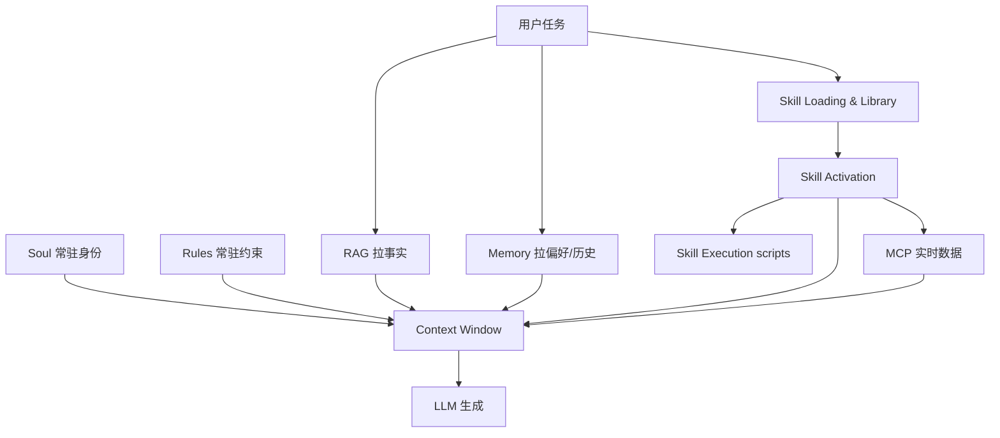

# Agent Context Stack（上下文资产分工）

> [!tip] 核心本质
> Agent 每次推理只能看见 [[context-window]] 里的内容；**Context Stack** 描述各类外部资产如何分工注入——Soul（身份）、底线约束、陈述性事实、程序性流程、Episodic 记忆、实时工具。若没有清晰分工，团队会把一切都写进 prompt 或 AGENTS.md，导致窗口被重复、过期、不可路由的信息塞满，Agent 的行为也会随机漂移。

## 生命周期与演进

**当前定位**：判断框架层。RAG、Memory、Skill、Rules、MCP 等产品能力已齐，但文档与实践中仍常混用；CE（[[context-engineering]]）管「怎么塞」，本篇管「什么该进哪一层」。

**预期寿命**：长期。资产类型划分稳定；载体名（SKILL.md、MCP、vector store）会变。

**近期演进**：Skill 渐进式披露与 RAG 检索、Memory 摘要并列；MCP 作实时层；Rules 收缩为 policy；Soul 从隐式系统 prompt 走向可版本管理的独立资产。

**终极威胁**：超长上下文 + 统一 Agent OS 可能合并检索与常驻；分工逻辑仍适用，只是实现内聚到宿主。

## 六类资产

| 类型            | 知识形态      | 加载方式                                   | 典型载体                        | 回答的问题            |
| ------------- | --------- | -------------------------------------- | --------------------------- | ---------------- |
| **Soul**      | 身份、角色、价值观 | 系统 prompt 常驻                           | persona 文档、system prompt    | 「我是谁、我的行事原则是什么」  |
| **底线（Rules）** | 全局约束、项目约定 | Rules / AGENTS.md 常驻                   | `.cursor/rules`、`AGENTS.md` | 「永远必须 / 禁止什么」    |
| **陈述性**       | 事实、文档     | [[rag]] 检索                             | 向量库 chunk                   | 「是什么 / 文档怎么写」    |
| **程序性**       | SOP、流程    | Skill Loading → Activation → Execution | `SKILL.md`                  | 「这类任务怎么做」        |
| **Episodic**  | 偏好、历史、进度  | [[memory]]                             | 外部 store / 摘要               | 「用户是谁 / 上次做到哪」   |
| **实时**        | 外部系统状态    | [[tool-mcp]] / Tool Use                | MCP、API                     | 「此刻 DB / 工单里是什么」 |

## Soul：Agent 身份定义

Soul 是 Agent「是谁」的答案——在所有任务开始前就存在，定义角色、价值观、行事风格。没有 Soul，Agent 在多轮对话里会随任务漂移（今天像顾问、明天像命令执行器），行为不一致。

**Soul 的典型内容**：
- 角色定位（「你是一名 Senior 后端工程师」）
- 核心价值观（「诚实告知不确定性；宁可说不会也不编造」）
- 沟通风格（「简洁、不用感叹号、不主动道歉」）
- 能力边界（「你只处理代码相关问题，其他直接说超出范围」）

**Soul vs Rules 的边界**：

| | Soul | Rules |
| --- | --- | --- |
| 回答的问题 | 我是谁、我怎么思考 | 我必须/禁止做什么 |
| 变化频率 | 低，定义 Agent 基本性格 | 中，随项目策略调整 |
| 体量 | 紧凑（100–500 字） | 可以更长（项目约定清单） |
| 典型载体 | system prompt 顶部 | `.cursor/rules`、`AGENTS.md` |

Soul 应保持紧凑——超过 500 字通常是把 Rules 或 Skill 写进去了。身份陈述只需足够让模型在歧义时「做自己该做的决定」。

## 底线（Rules）与项目约定

Rules 与 AGENTS.md 是「永远生效」的底线与项目约定；Skill 是「任务触发才生效」的 SOP。若没有这层分工，要么把长流程塞进每轮 prompt 撑爆窗口，要么用 Skill 承载全局风格导致无法路由。

### 三种常驻机制对比

| 机制 | 加载方式 | 体量 | 适合放什么 | 不适合放什么 |
| --- | --- | --- | --- | --- |
| **User / Project Rules** | 每会话常驻 | 小 | 语言、风格、安全底线、提交前跑测试 | 万行 SOP、完整发布流程 |
| **AGENTS.md** | 项目级常驻（或 init 注入） | 中 | 目录结构、构建命令、分支策略、术语 | 可版本化、应 Discovery 的长 Skill |
| **Commands** | 用户 `/command` 显式触发 | 中～大 | 固定工作流、模板化任务 | 应自动路由的泛化能力 |

**Skill**（对照）：Discovery 摘要常驻或按需 list；**正文仅激活后**进入上下文。见 [[skill-loading-library]]。

### 优先级与冲突

同一上下文块内，模型对 competing 指令做概率加权，无 guaranteed 解释器。工程直觉（各宿主细节以官方为准）：

1. **当前用户消息**（含显式 `@skill`、`/command`）
2. **Project Rules / AGENTS.md**（项目底线）
3. **User Rules**（个人习惯）
4. **已激活 Skill 正文**（任务 SOP）
5. **Discovery 摘要**（路由元数据，权重低于正文）

冲突对策：全局约束放 Rules；任务流程放 Skill；若 Skill 与 Rules 重复，**合并到 Rules 或从 Skill 删除**，避免激活后摇摆（见 [[skill-engineering]] 坑点表）。

### Commands vs Skills

| | Commands | Skills |
| --- | --- | --- |
| 触发 | 用户 slash 为主 | description 语义 + `@skill` + 宿主工具 |
| 发现 | 命令列表 | Discovery 层 listing / search |
| 适用 | 固定、低频、高危 | 可复用、可自动路由的流程 |

高危流程（部署、删库）应用 `disable-model-invocation` 或仅文档化 slash，不赌自动 Discovery。

### 反模式

- **长 SOP 写进 AGENTS.md**：占每轮 token，无法按需卸载；应拆成 Skill。
- **把 Rules 当 Skill 写**：全局「始终中文」不应靠 Skill 激活。
- **AGENTS.md 替代 Discovery**：压缩索引 + Read 文件是另一种模式，与 Skill 标准并行，不等价。
- **Soul 膨胀**：把发布流程塞进 soul 文档；应拆出放 Rules 或 Skill。

## 组合模式示例

**发布审核**：Soul 定「你是发布工程师」→ Rules 定「禁止 force push」→ RAG 拉发布规范 PDF → Skill 定审核 checklist 与输出模板 → MCP 拉当前发布单状态 → Memory 记「本项目用 GitHub Actions」。

**写 ADR**：Soul 定角色 → Skill 激活 ADR 流程 → RAG 可选拉历史 ADR 作参考 → 不调 MCP（除非 Skill 要求查架构图服务）。

## 与 Memory / Skill Library 的类比

规模化之后，**Memory 膨胀**与 **Skill 库膨胀**问题结构相似：

| | Memory | Skill Library |
| --- | --- | --- |
| 膨胀风险 | 过期事实、偏好堆积 | 克隆 SOP、description 抢路由 |
| 发现 | 检索 + 重要性 | listing → embedding / 能力树 |
| 治理 | 遗忘、摘要、TTL | merge、retire、cap（见 [[skill-loading-library]]） |

程序性知识用 Skill，陈述性用 RAG/Memory——勿用 RAG chunk 存完整 SOP，勿用 Skill 存会频繁变更的 API schema（应走 MCP）。

## 与 Context Engineering 的关系

- **Context Stack（本篇）**：MECE 分工——什么信息属于哪类资产。
- **Context Engineering**：给定有限窗口，如何裁剪、排序、摘要、渐进披露——Skill 三阶段是 CE 在程序性知识上的落地。

## 进一步阅读

- [[context-engineering]] — 窗口经济学与信噪比。
- [[skill]] — 程序性知识 hub。
- [[rag]] — 陈述性知识检索。
- [[memory]] — 跨会话记忆。
- [[tool-mcp]] — 实时外部系统。
- [[skill-loading-library]] — Skill 库演化机制（含 Library Drift）。
- [Cursor Docs — Rules](https://cursor.com/docs/context/rules) — Project/User Rules 行为。
