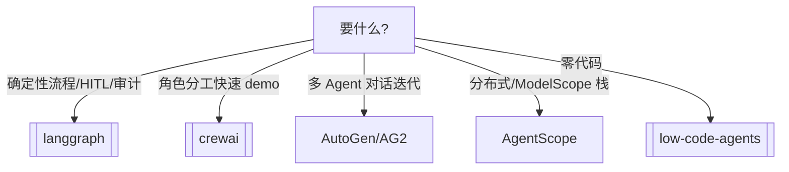

---
tags:
  - framework
  - multi-agent
aliases:
  - Agent 框架选型
  - AutoGen
  - AgentScope
  - CrewAI
prerequisites:
  - "[[agent]]"
  - "[[multi-agent]]"
  - "[[langgraph]]"
related:
  - "[[workflow]]"
  - "[[low-code-agents]]"
  - "[[langchain]]"
  - "[[langsmith]]"
  - "[[crewai]]"
stability: mid
layer: application
updated: 2026-06-15
---

# Agent 框架选型（LangGraph / AutoGen / CrewAI / AgentScope）

> [!tip] 核心本质
> **Agent 框架**把 [[multi-agent]] 与 [[tool-use]] 落成可运行代码——差异在**编排范式**：**LangGraph** 用显式**状态图**（条件边、检查点）；**CrewAI** 用**角色 + Task** 的 crew 协作；**AutoGen/AG2** 用**异步对话**与 GroupChat 选人发言；**AgentScope**（阿里）强调**消息传递**与分布式。与 [[low-code-agents]]（Dify/n8n）不同，这些是 **Python/TS 代码框架**；与 [[langgraph]] 专文关系：本篇作**横向选型**，LangGraph 节点作深度 Runtime 参考。

*检索说明：范式对照 [Langfuse agent framework comparison (2025-03)](https://langfuse.com/blog/2025-03-19-ai-agent-comparison)、[CrewAI docs](https://docs.crewai.com/)、[Microsoft AutoGen](https://microsoft.github.io/autogen/)、[AgentScope](https://github.com/modelscope/agentscope)（观测 2026-06-15）。*

## 生命周期与演进

**当前定位**：Hello Agents / 业界对比 ch 级索引；生产常 **LangGraph + LangSmith** 或 **CrewAI 原型 → LangGraph 生产**。

**预期寿命**：mid。OpenAI Agents SDK、Google ADK、Claude Agent SDK 加入混战；范式名变、分工稳定。

**近期演进**：AutoGen → **AG2** 事件驱动重写；CrewAI 企业版；LangGraph 为 LangChain 默认 Agent 底层。

**终极威胁**：云托管 Agent Runtime 吞掉编排层；模式仍回 [[workflow-patterns]]。

## 1 范式对照

| 框架 | 核心隐喻 | 强项 | 弱项 |
| --- | --- | --- | --- |
| **[[langgraph]]** | 有向图 + State | 检查点、HITL、可观测、生产 | 需定义 state schema |
| **[[crewai]]** | 角色剧组 | 快速多 Agent 原型 | 复杂流/debug |
| **AutoGen/AG2** | 群聊 | 辩论、动态对话 | 大规模时代码散 |
| **AgentScope** | 消息 + 服务化 | 分布式、中文生态 | 全球社区小于前三 |

## 2 选型决策树

- **企业长事务、要恢复/人审** → LangGraph（见专文）
- **「研究员+写手+编辑」式分工** → [[crewai]]
- **两个 specialist 互相 critique** → AutoGen GroupChat
- **已有阿里/通义栈** → AgentScope

## 3 与库内节点

| 需求 | 读哪 |
| --- | --- |
| 图 Runtime API | [[langgraph]] |
| 五模式编排 | [[workflow-patterns]] |
| 组合层 RAG/Tool | [[langchain]] |
| 追踪评测 | [[langsmith]]、[[agent-evaluation]] |
| 低代码 | [[low-code-agents]] |

**不要**为简单链上 LangGraph；[[workflow]] 或 prompt 够用则勿过度（Anthropic 口诀）。

## 4 生产 checklist

1. **State 与 checkpoint** — 长任务可恢复（LangGraph 原生）
2. **可观测** — [[langsmith]] / OTEL
3. **评测** — [[agent-evaluation]] dataset
4. **安全** — [[prompt-injection]]、[[skill-supply-chain]]
5. **迁移** — CrewAI 验证角色 → 图化 LangGraph 常是升级路径

## 5 CrewAI vs LangGraph（常见纠结）

| | CrewAI | LangGraph |
| --- | --- | --- |
| 上手 | 快 | 中 |
| 控制流 | Process 类型（sequential/hierarchical） | 任意图 |
| 检查点 | 有限 | 一等公民 |
| 适合 | POC、内容流水线 | 生产 Agent |

## 要点收束

- 框架差在编排隐喻，不是「谁更 Agent」。
- 生产确定性 → **LangGraph**；角色原型 → **CrewAI**；对话式 → **AutoGen**。
- 深度 Runtime 见 [[langgraph]]；模式见 [[workflow-patterns]]。
- 低代码见 [[low-code-agents]]。

## 进一步阅读

### 库内

- [[langgraph]] — 图 Runtime 深潜
- [[multi-agent]] — 拓扑与契约
- [[workflow]] — 何时不要框架

### 外部

- [Langfuse — Framework comparison](https://langfuse.com/blog/2025-03-19-ai-agent-comparison)
- [CrewAI Docs](https://docs.crewai.com/)
- [AutoGen](https://microsoft.github.io/autogen/)
