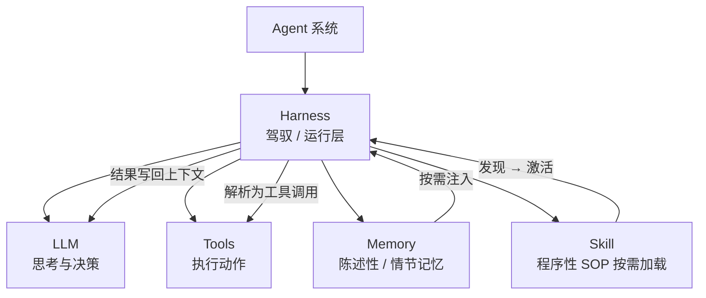
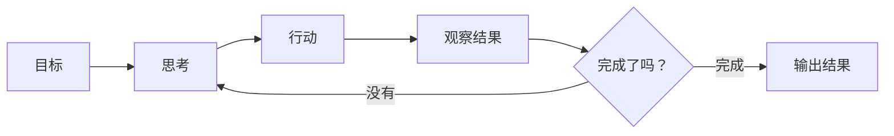

---
tags:
  - concept
aliases:
  - agent
  - AI Agent
  - 智能体
prerequisites:
  - "[[llm]]"
  - "[[context-window]]"
related:
  - "[[workflow]]"
  - "[[llm]]"
  - "[[tool-use]]"
  - "[[planning]]"
  - "[[plan-and-solve]]"
  - "[[agent-paradigms]]"
  - "[[reflection]]"
  - "[[multi-agent]]"
  - "[[react]]"
  - "[[skill]]"
  - "[[agent-context-stack]]"
  - "[[agent-concept-map]]"
  - "[[harness-engineering]]"
  - "[[loop-engineering]]"
  - "[[hallucination]]"
stability: long
layer: application
updated: 2026-06-16
---

# Agent（智能体）

> [!tip] 核心本质
> 大语言模型（LLM）是无状态的一问一答系统，无法主动执行多步任务。智能体（Agent）在模型外套感知-思考-行动循环，由 **Harness**（[[harness-engineering|驾驭工程]]：循环、工具编排、跨步状态、错误恢复与安全边界）把单次生成串成可终止的多步任务。若没有这层外壳，模型只能描述「如何订机票」，却无法真正订票——也没有在工具失败后统一收敛的路径。

适合已理解 [[llm]] 与 [[context-window]]、要在产品与架构里区分「对话 / 工作流 / 智能体」的读者。读完 [[#1 系统谱系：智能体在哪里|§1]] 能判断该不该上 Agent；[[#2 执行架构|§2]] 介绍 Harness 与循环；[[#5 Harness 与上线分层|§5]] 说明上线时的可观测性与 Loop 层。

## 生命周期与演进

**当前定位**：从研究概念到工程产品。OpenAI、Anthropic、Google 均有原生 Agent 框架（Agents SDK、Claude Code、[[claude-managed-agents|Claude Managed Agents]]、Gemini Agent）；LangChain、LlamaIndex、AutoGen 提供可组合的运行时层；代码生成加工具调用是当前最成熟的落地场景。

**预期寿命**：长期。输入输出边界、权限控制、可观测性需求使 Harness 层不会消失；Agent 模式已确立为 LLM 落地的核心范式之一。

**近期演进**：推理模型（Reasoning model，如 o3 / Claude 3.7+）提升任务规划质量，减少无效循环；计算机使用（Computer Use）类工具将 Agent 边界扩展到图形界面操作；更长的上下文窗口（context window）使单次调用能完成更多推理，降低循环轮次。

**终极威胁**：足够强的模型在一次推理内完成更多步骤（逻辑 → 代码 → 验证），将减少对 Harness 内循环轮次的依赖；但权限边界与外部系统交互无法被模型内化，Harness 会变薄而不会消失。

## 1 系统谱系：智能体在哪里

「要不要上 Agent」取决于谁握有下一步的决策权——不是所有任务都需要自主循环。

**表 1 — 按控制流划分 LLM 应用形态**

| 形态 | 谁决定下一步 | 典型场景 |
| --- | --- | --- |
| 对话（Chat） | 用户一问一答 | 问答、写作、解释概念 |
| [[workflow\|Workflow（工作流）]] | 代码写死的流程 | 摘要 → 翻译 → 格式化 |
| Agent | 模型根据观察动态决定 | 查资料、试错、多步推理 |
| [[multi-agent\|Multi-Agent（多智能体）]] | 多个 Agent 分工协作 | 复杂项目、角色分工明确的流程 |

表内四形态**不是**同一条「越往右越好」的刻度：**对话**的灵活来自用户随时改问法，系统本身不自主编排；**工作流 → 智能体 → 多智能体** 才是自主执行谱系——越往右，**运行时把下一步交给模型/多 Agent 决策**的程度越高，成本与不确定性通常也越高。

**选型信号（看下一步谁拍板）**：

- 步骤能在设计阶段画成固定 DAG（分支条件也写在代码里）→ [[workflow]]
- 顺序取决于上一轮工具结果，可能要试错、改道、多轮检索 → Agent
- 子任务可并行、角色边界清楚（调研 / 写作 / 评审）→ [[multi-agent]]
- 用户只是在对话、不需要系统自主跑完一整条任务链 → 对话即可，不必为了「上 Agent」硬加循环

**对照例**：「工单进来 → 分类 → 查知识库 → 生成回复 → 人工审核」步骤固定，适合 Workflow；「读报错 → 搜文档 → 改代码 → 跑测试失败再换方案」需要模型根据每轮 observation 改道，要上 Agent，并在工程上实现完整 [[harness-engineering|Harness]]（循环、工具、state、错误与安全边界）。长任务、定时验收还可再包 [[loop-engineering]]。

细节与 Workflow/Agent 维度对比见 [[workflow]]；范式层组合见 [[agent-paradigms]]。

## 2 执行架构

Agent 不是「更大的 Chat」，而是由 **Harness**（[[harness-engineering|驾驭工程]]）包裹 LLM 的多步运行系统：模型负责每轮的思考与 tool 意图，Harness 负责把意图变成真实动作、把结果写回 state，并在任务完成或触顶时终止。记忆（Memory）与技能（Skill）经 Harness 按需注入 context；工具（Tools）经 Harness 校验后执行。

### 2.1 能力组件

**图 1 — 概念架构：Harness 调度 LLM / 工具 / 记忆 / 技能**



图上 Harness 居中：大语言模型（LLM）只产出每轮的推理与工具意图，工具、记忆、技能都经运行层注册、校验与注入，执行结果再写回上下文供下一轮使用。读者应带走的心智模型是——**没有这层调度壳，模型只是无状态的单轮对话核**，无法把多步任务闭合为可终止的运行。

### 2.2 感知-思考-行动循环

订机票时搜索接口返回空列表，或订票参数格式被网关拒绝——若只有一问一答，模型最多解释「可能没票」，**无法根据失败结果改搜法、换渠道再试**；多步任务会在第一次碰壁处断掉。

闭环直觉：**先行动、再看结果、再决定下一步**——把「做了会怎样」变成可回注的观察（Observation），而不是一次性猜完。

感知-思考-行动循环是 Agent 的控制核心：每轮模型看到目标、历史与上一步结果，再决定下一步行动；Harness 负责把行动落到工具、把观察写回 history。

**图 2 — 控制流：思考 → 行动 → 观察**



图上的「完成了吗？」由 Harness 判定：模型不再发起工具调用、达到步数上限，或关键动作触发人工确认。未结束时带着新 observation 回到「思考」——这就是根据工具结果**改道、纠错、收窄候选**的最小控制流，也是 Agent 相对固定工作流（Workflow）的核心差异。

### 2.3 Harness 由什么组成

Harness 借自软件测试里的 test harness：包裹「推理核」（LLM），提供受控入口、状态与观测面。一次多步任务在 Harness 内闭合为：**推理 →（可选）校验 tool call → 执行 → observation 写回 state → 直至终止**（与 [[harness-engineering]] 图 1 同构）。

**表 2 — Harness 主要模块**

| 模块 | 做什么 |
| --- | --- |
| **循环管理** | 维持感知-思考-行动直到完成或 `max_steps` |
| **工具编排** | 注册工具、schema 校验、结果格式化回注 context |
| **Skill 加载** | 程序性 SOP 三阶段按需注入（[[skill-loading-library]]） |
| **状态管理** | 跨轮保留任务进度；窗口紧张时压缩 / 归档 |
| **错误处理** | 工具失败、格式错、瞬态 503 的分层重试与回注 |
| **安全边界** | 审批、配额、路径白名单；含 [[cursor-hooks]] 硬拦截 |

薄循环（几十行 `while`）、LangGraph、Cursor Agent 宿主等，都是上述模块的一种**实现**；选型与四抉择走读见 [[harness-engineering]]。

### 2.4 维持循环：教学示例

[[llm|LLM]] 本身无状态——每次 API 调用都不记得上一轮。下面片段只演示**循环管理 + 工具编排**两模块；生产 Harness 还须补齐 state 压缩、schema 校验与边界（见 [[harness-engineering]]）。

```python
max_steps = 10
step = 0
done = False
history = []
goal = "订明天北京到上海价格最低的早班经济舱机票"

while not done and step < max_steps:
    step += 1
    action = llm.think(goal, history, last_result)
    try:
        result = tools.execute(action)
    except Exception as e:
        result = f"执行失败：{e}"
    history.append(result)
    done = llm.is_complete(goal, history)
```

`is_complete()` 是教学简化。真实 Harness 的退出条件通常是：模型不再发起 tool call、达到 `max_steps`、或关键动作触发人工确认。

### 2.5 循环示例：订机票

下表展示同一目标下，三轮循环如何逐步收窄候选并最终退出。

**表 3 — 订机票任务的三轮循环（示意）**

| 轮次 | 模型决策 | 工具执行 | history 追加 | 是否完成 |
| --- | --- | --- | --- | --- |
| 轮 1 | 需要先查航班 | 搜索 API：「北京→上海，明天」 | 12 个航班，400–1200 元 | 未筛选，继续 |
| 轮 2 | 筛最低价、早班 | 过滤：经济舱 + 早班 | 剩 3 个，最低 420 元 | 未确认余票，继续 |
| 轮 3 | 确认最低价余票 | 查询余票 | 有票，可下单 | 目标达成，退出 |

每轮模型都能看到完整 history，知道做到哪、还差什么——这是循环相对单次问答的关键优势。

## 3 经典执行范式

[[agent-paradigms]] 把 Harness 内的循环组织成三种可组合方式（细节见各专文，此处只定目标）。选型时先问：更需要边做边改、先要全局路线图，还是产出后再质检？

**表 — 经典执行范式对照**

| 范式 | 一句话 | 专文 |
| --- | --- | --- |
| **ReAct** | 边想边做，Observation 驱动纠错 | [[reAct]] |
| **Plan-and-Solve** | 先完整计划，再按步执行 | [[plan-and-solve]] |
| **Reflection** | 初稿后评审修订，换质量 | [[reflection]] |

表内三范式可组合而非互斥：路径依赖实时观察、常要改道时用 ReAct；里程碑与顺序在设计期较稳定时先 Plan-and-Solve；交付物质量比速度更重要时在末段加 Reflection。不确定从哪条起时，默认 ReAct 最薄、最易与 [[#2.2 感知-思考-行动循环|§2.2]] 的观察闭环对齐。

本库侧重**机制与选型**；从零实现（LLM 客户端、ToolExecutor、正则解析）可参考 [Hello Agents 第四章](https://datawhalechina.github.io/hello-agents/#/./chapter4/%E7%AC%AC%E5%9B%9B%E7%AB%A0%20%E6%99%BA%E8%83%BD%E4%BD%93%E7%BB%8F%E5%85%B8%E8%8C%83%E5%BC%8F%E6%9E%84%E5%BB%BA)。

## 4 核心组件

Harness 调度的三类外挂能力，分别回答「怎么动手」「怎么记住」「怎么按流程做」（与 [[agent-context-stack]] 六类资产对照：工具/MCP 偏实时，RAG 偏陈述性事实，Skill 偏程序性 SOP）。

### 4.1 工具（Tools）

没有工具，模型只能「说」不能「做」：搜索、代码执行、文件读写、接口调用都经工具完成。Harness 为每个工具暴露结构化 schema，模型产出 tool call 后由运行层做参数校验与白名单拦截，再执行并把结果格式化为 observation 写回 history——下一轮推理因此能基于**真实外部状态**继续，而不是凭空续写。工具集宜按任务裁剪注册，避免模型在无关 API 上幻觉调用；设计模式见 [[tool-use]]。

### 4.2 记忆（Memory）

最简单做法是把每轮结果写入 history；但上下文窗口有上限，任务一长就会撑满。实践中常分两层：

**表 4 — 短期记忆与长期记忆**

| 类型 | 存在哪里 | 生命周期 | 典型内容 |
| --- | --- | --- | --- |
| 短期记忆 | 上下文窗口 | 当前任务结束清空 | 本轮对话、工具结果 |
| 长期记忆 | 外部数据库 | 跨任务持久 | 用户偏好、历史操作、学到的经验 |

没有长期记忆，每次启动都是全新 Agent。完整设计见 [[memory]]。

### 4.3 技能（Skill）

团队已有发版检查清单、文档写作规范或排查 SOP，但 Agent 每次仍从自然语言里猜步骤——容易漏掉人工审批、跳过格式校验，或在同类任务上给出前后不一致的流程。需要把「这类事按什么顺序做、什么不能做」沉淀成可版本化、可按任务加载的规程，而不是反复口述。

**Skill** 把「怎么做某类任务」写成 Agent 可按需加载的**程序性 SOP**——与 [[#4.2 记忆（Memory）|§4.2]] 的陈述性/情节记忆不同，Skill 管的是步骤顺序与操作契约，不靠历史对话凑流程。典型形态是一个目录，核心是 `SKILL.md`（YAML 元数据 + 正文规程），可选 `reference.md`、`examples.md` 与 `scripts/`。

Harness 在会话启动或任务匹配时按三阶段注入 Skill；各阶段在 Agent 侧的 Harness 职责如下。

### 4.3.1 Discovery

Harness 先只把各 Skill 的 `name` 与 `description` 摘要放进 context，供模型粗筛「当前任务可能用哪条 SOP」——context 装不下整库全文，listing 预算由宿主控制。机制与宿主差异见 [[skill-loading-library]]。

### 4.3.2 Activation

任务命中后，Harness 载入匹配 Skill 的 `SKILL.md` 全文，对当前轮次形成**操作契约**：步骤、验收标准与禁止项具有指令效力，而非「仅供参考」的百科。`SKILL.md` 结构与 frontmatter 写法见 [[skill]]。

### 4.3.3 Execution

需要 lint、格式检查或报表生成等可重复动作时，Harness 按需打开 `scripts/`、`reference.md` 等重材料并执行，结果以 tool 输出回注循环。脚本边界与调用方式见 [[skill-scripts]]。

frontmatter 里的 `description` 是路由入口：模型靠它判断要不要激活该 Skill。写清「什么场景触发、什么场景不要用、同义说法有哪些」，比堆关键词更重要（写法见 [[skill-engineering]]）。用户也可显式 `@skill-name` 跳过语义匹配，直接 Activation。

常见落盘位置：个人目录（跨项目习惯）与项目 `.cursor/skills/`（随仓库版本化、Code Review）。开放格式与跨宿主语义见 [Agent Skills 标准](https://agentskills.io/home)；Cursor / Claude Code 的 listing 预算与 fork 见 [[claude-code-skill-selection]]。库规模变大时的 merge / retire 见 [[skill-governance]]。

## 5 Harness 与上线分层

[[#2.3 Harness 由什么组成|§2.3]] 的六模块构成 Agent 的**运行内核**。上线时通常在同一产品里再叠两层能力：

**可观测性**：追踪每次 tool call、token 消耗、步数与失败原因；审计谁在何时触发了高危操作；限流与配额防止 burn。便于排障「卡在哪一轮、哪一步 tool 错了」，也是生产 Harness 的标配。

**Loop 层**（[[loop-engineering]]，可选）：在 Harness 之上按日程或条件**反复启动**任务——外层负责发现待办、派发 prompt、读验收结果、写跨 run 状态文件，内层仍是 [[#2.4 维持循环：教学示例|§2.4]] 的感知-思考-行动循环。适合 overnight 重构、定时文档同步等需要「人不在键盘前也要跑完并验收」的场景。

```text
Loop 层（可选：定时 / 验收 / 跨 run 状态）
  └─ Harness（循环、工具、Skill、state、错误、边界）
       └─ LLM + 工具 + Memory / RAG / Skill 等 context 资产
  └─ 可观测性（追踪、审计、限流 — 贯穿各层）
```

**图 3 — 生产分层示意**

![[agent-architecture-l3.png]]

Harness 设计走读（一次 tool 失败如何收敛）与四抉择联动表见 [[harness-engineering]]；注入进 Harness 的六类 context 资产见 [[agent-context-stack]]。

## 6 坑与误区

### 6.1 常见误解

- Agent 等于 ChatGPT：ChatGPT 是一问一答；Agent 在 LLM 外有 Harness 维持的多步循环与 tool 回注。
- Agent 等于 [[langchain]]：LangChain 是 Harness 的一种实现载体；核心循环也可手写薄循环。
- Harness 只是 `while`：Harness 还包含 [[#2.3 Harness 由什么组成|§2.3]] 表 2 所列模块。
- 模型越强越不需要 Harness：LLM 仍无状态；循环执行与权限边界须留在模型外，Harness 可变薄但不会消失。

### 6.2 工程风险

**表 5 — 常见工程风险与应对**

| 风险 | 表现 | 应对 |
| --- | --- | --- |
| 循环不终止 | 反复搜索、重复调用同一工具 | 设 `max_steps`；检测连续相同 action（如 3 次相同则强制终止） |
| 工具幻觉 | 调用不存在的 API 或参数格式错误 | 预定义工具 schema 校验；Harness 拦截白名单外调用；见 [[hallucination]] |
| 成本失控 | 10 轮循环 ≈ 10 倍 token 消耗 | 设 token 预算；对长 history 摘要压缩；能用 Workflow 就不用 Agent |
| 错误累积 | 第 2 步错了，后续全在错误前提上继续 | 加反思步骤检查结果；关键动作（如下单）触发人工确认 |

## 要点收束

- Agent = Harness + 感知-思考-行动循环；LLM 只负责每轮的推理与 tool 意图。
- Harness 含循环、工具编排、Skill 注入、state、错误处理与安全边界（[[#2.3 Harness 由什么组成|§2.3]]）。
- 上线可叠加可观测性；长任务可再包 [[loop-engineering]]。
- 选型：流程能写死用 [[workflow]]；需根据 observation 改道才上 Agent + Harness。

## 进一步阅读

### 库内关联

- [[agent-paradigms]] — ReAct / Plan-and-Solve / Reflection 选型与组合
- [[tool-use]] — 工具调用的设计模式
- [[reAct]] — ReAct 循环（Think → Act → Observe）的设计与实现
- [[plan-and-solve]] — 两阶段先规划后执行
- [[planning]] — 复杂目标如何拆解与规划
- [[reflection]] — 自我检查、纠错与错误累积
- [[multi-agent]] — 多 Agent 分工协作
- [[workflow]] — 何时用 Workflow 而不是 Agent
- [[harness-engineering]] — Harness 四抉择、薄循环与生产走读
- [[loop-engineering]] — Harness 之上的外层自驱与验收（可选）
- [[agent-context-stack]] — Skill / Memory / RAG / Rules 分工
- [[skill]] — Skill 机制与 `SKILL.md` 结构
- [[skill-loading-library]] — Discovery / Activation / Execution 与库演化
- [[skill-engineering]] — 写法方法论与常见坑
- [[memory]] — Agent 记忆机制完整设计

### 外部参考

- [[building-effective-agents]] — Anthropic 官方 Agent 设计指南
