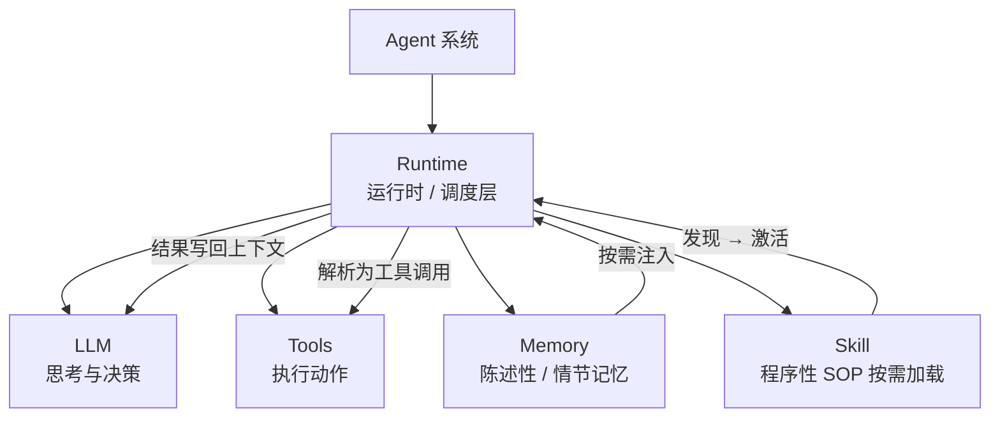
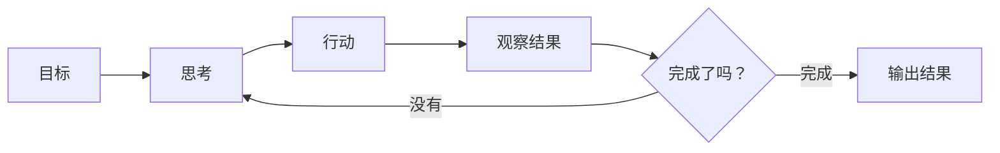

---
tags:
  - concept
aliases:
  - agent
  - AI Agent
  - 智能体
prerequisites:
  - "[[llm]]"
  - "[[context-window]]"
related:
  - "[[workflow]]"
  - "[[llm]]"
  - "[[tool-use]]"
  - "[[planning]]"
  - "[[plan-and-solve]]"
  - "[[agent-paradigms]]"
  - "[[reflection]]"
  - "[[multi-agent]]"
  - "[[react]]"
  - "[[skill]]"
  - "[[agent-context-stack]]"
  - "[[hallucination]]"
stability: long
layer: application
updated: 2026-06-14
---

# Agent（智能体）

> [!tip] 核心本质
> 大语言模型（LLM）是无状态的一问一答系统，无法主动执行多步任务。智能体（Agent）在模型外套感知-思考-行动循环，由运行时（Runtime）维持状态、调度工具、管理上下文，把语言生成能力扩展为任务执行能力。若没有这个循环，模型只能描述「如何订机票」，却无法真正订票——没有持续执行的结构，也无法在每步结束后基于真实结果决定下一步。

适合已理解 [[llm]] 与 [[context-window]]、要在产品与架构里区分「对话 / 工作流 / 智能体」的读者。读完 [[#1 系统谱系：智能体在哪里|§1]] 能判断该不该上 Agent；[[#2 执行架构|§2]] 建立 Runtime 与循环图景；[[#3 经典执行范式|§3]] 指向三范式选型；生产治理见 [[#5 生产架构|§5]]。

## 生命周期与演进

**当前定位**：从研究概念到工程产品。OpenAI、Anthropic、Google 均有原生 Agent 框架（Agents SDK、Claude Code、[[claude-managed-agents|Claude Managed Agents]]、Gemini Agent）；LangChain、LlamaIndex、AutoGen 提供可组合的运行时层；代码生成加工具调用是当前最成熟的落地场景。

**预期寿命**：长期。输入输出边界、权限控制、可观测性需求使 Runtime 层不会消失；Agent 模式已确立为 LLM 落地的核心范式之一。

**近期演进**：推理模型（Reasoning model，如 o3 / Claude 3.7+）提升任务规划质量，减少无效循环；计算机使用（Computer Use）类工具将 Agent 边界扩展到图形界面操作；更长的上下文窗口（context window）使单次调用能完成更多推理，降低循环轮次。

**终极威胁**：足够强的模型在一次推理内完成更多步骤（逻辑 → 代码 → 验证），将减少对 Runtime 循环的依赖；但权限边界与外部系统交互无法被模型内化，Runtime 层最终会变薄而不会消失。

## 1 系统谱系：智能体在哪里

「要不要上 Agent」取决于谁握有下一步的决策权——不是所有任务都需要自主循环。

**表 1 — 按控制流划分 LLM 应用形态**

| 形态 | 谁决定下一步 | 典型场景 |
| --- | --- | --- |
| 对话（Chat） | 用户一问一答 | 问答、写作、解释概念 |
| [[workflow\|Workflow（工作流）]] | 代码写死的流程 | 摘要 → 翻译 → 格式化 |
| Agent | 模型根据观察动态决定 | 查资料、试错、多步推理 |
| [[multi-agent\|Multi-Agent（多智能体）]] | 多个 Agent 分工协作 | 复杂项目、角色分工明确的流程 |

越往右灵活性越高，成本和不确定性也越高。能用工作流（Workflow）解决的任务，不要上 Agent。

## 2 执行架构

Agent 不是「更大的 Chat」，而是一套由 Runtime 调度的能力组合：模型负责想，工具负责做，记忆负责跨轮保留信息，技能（Skill）负责按需注入程序性标准作业程序（SOP）。

### 2.1 能力组件

**图 1 — 概念架构：Runtime 调度 LLM / 工具 / 记忆 / 技能**



### 2.2 感知-思考-行动循环

循环是 Agent 的控制核心：每轮模型看到目标、历史与上一步结果，再决定下一步行动；Runtime 负责把行动落到工具、把观察写回历史。

**图 2 — 控制流：思考 → 行动 → 观察**



### 2.3 运行时维持循环

[[llm|LLM]] 本身无状态——每次调用都像第一次对话。循环不能靠模型自己维持；这是 Runtime（也称 Orchestrator / Agent Framework）的职责：维护循环、拼装上下文（context）、解析工具调用（tool call）、写回记忆、兜底错误。LangChain、LlamaIndex 提供现成 Runtime，但几十行 Python 也能实现同样逻辑——Agent 不等于某个框架品牌。

```python
max_steps = 10
step = 0
done = False
history = []
goal = "订明天北京到上海价格最低的早班经济舱机票"

while not done and step < max_steps:
    step += 1
    action = llm.think(goal, history, last_result)
    try:
        result = tools.execute(action)
    except Exception as e:
        result = f"执行失败：{e}"
    history.append(result)
    done = llm.is_complete(goal, history)
```

`is_complete()` 是教学简化。真实系统里退出条件通常是：模型不再发起工具调用、达到 `max_steps` 上限，或关键动作触发人工确认。Runtime 不只转循环，还承担安全边界与工程兜底。

### 2.4 循环示例：订机票

下表展示同一目标下，三轮循环如何逐步收窄候选并最终退出。

**表 2 — 订机票任务的三轮循环（示意）**

| 轮次 | 模型决策 | 工具执行 | history 追加 | 是否完成 |
| --- | --- | --- | --- | --- |
| 轮 1 | 需要先查航班 | 搜索 API：「北京→上海，明天」 | 12 个航班，400–1200 元 | 未筛选，继续 |
| 轮 2 | 筛最低价、早班 | 过滤：经济舱 + 早班 | 剩 3 个，最低 420 元 | 未确认余票，继续 |
| 轮 3 | 确认最低价余票 | 查询余票 | 有票，可下单 | 目标达成，退出 |

每轮模型都能看到完整 history，知道做到哪、还差什么——这是循环相对单次问答的关键优势。

## 3 经典执行范式

[[agent-paradigms]] 把 Runtime 循环拆成三种可组合的组织方式（细节见各专文，此处只定目标）：

| 范式 | 一句话 | 专文 |
| --- | --- | --- |
| **ReAct** | 边想边做，Observation 驱动纠错 | [[reAct]] |
| **Plan-and-Solve** | 先完整计划，再按步执行 | [[plan-and-solve]] |
| **Reflection** | 初稿后评审修订，换质量 | [[reflection]] |

本库侧重**机制与选型**；从零实现（LLM 客户端、ToolExecutor、正则解析）可参考 [Hello Agents 第四章](https://datawhalechina.github.io/hello-agents/#/./chapter4/%E7%AC%AC%E5%9B%9B%E7%AB%A0%20%E6%99%BA%E8%83%BD%E4%BD%93%E7%BB%8F%E5%85%B8%E8%8C%83%E5%BC%8F%E6%9E%84%E5%BB%BA)。

## 4 核心组件

Runtime 调度的四类能力，分别回答「怎么动手」「怎么记住」「怎么按流程做」。

### 4.1 工具（Tools）

没有工具，模型只能「说」不能「做」：搜索、代码执行、文件读写、接口调用都经工具完成。设计模式见 [[tool-use]]。

### 4.2 记忆（Memory）

最简单做法是把每轮结果写入 history；但上下文窗口有上限，任务一长就会撑满。实践中常分两层：

**表 3 — 短期记忆与长期记忆**

| 类型 | 存在哪里 | 生命周期 | 典型内容 |
| --- | --- | --- | --- |
| 短期记忆 | 上下文窗口 | 当前任务结束清空 | 本轮对话、工具结果 |
| 长期记忆 | 外部数据库 | 跨任务持久 | 用户偏好、历史操作、学到的经验 |

没有长期记忆，每次启动都是全新 Agent。完整设计见 [[memory]]。

### 4.3 技能（Skill）

程序性 SOP：元数据 listing 常驻上下文，全文按需激活，避免把所有流程一次性灌进窗口。见 [[skill]]。

## 5 生产架构

概念架构（[[#2.1 能力组件|§2.1]]）之外，上线系统还要补治理层与可观测性：权限、审计、限流、追踪与人工审核通常包在 Runtime 外层。

**图 3 — 生产架构：治理层包裹 Runtime**

![[agent-architecture-l3.png]]

Runtime 系统设计见 [[harness-engineering]]；技能 / 记忆 / 检索增强生成（RAG）/ 规则在上下文中的分工见 [[agent-context-stack]]。

## 6 坑与误区

### 6.1 常见误解

- Agent 等于 ChatGPT：ChatGPT 是一问一答；Agent 有循环、工具与跨轮状态，差整个 Runtime 与工具层。
- Agent 等于 LangChain：LangChain 只是 Runtime 的一种实现；核心循环可以用任意语言手写。
- 模型越强越不需要 Runtime：模型再强也是无状态的；循环管理、工具调度、错误恢复仍需 Runtime。

### 6.2 工程风险

**表 4 — 常见工程风险与应对**

| 风险 | 表现 | 应对 |
| --- | --- | --- |
| 循环不终止 | 反复搜索、重复调用同一工具 | 设 `max_steps`；检测连续相同 action（如 3 次相同则强制终止） |
| 工具幻觉 | 调用不存在的 API 或参数格式错误 | 预定义工具 schema 校验；Runtime 拦截白名单外调用；见 [[hallucination]] |
| 成本失控 | 10 轮循环 ≈ 10 倍 token 消耗 | 设 token 预算；对长 history 摘要压缩；能用 Workflow 就不用 Agent |
| 错误累积 | 第 2 步错了，后续全在错误前提上继续 | 加反思步骤检查结果；关键动作（如下单）触发人工确认 |

## 要点收束

- Agent = Runtime + 感知-思考-行动循环；LLM 只负责每轮的「想」，不自己维持状态。
- 选型先看谁决定下一步：流程能写死用 Workflow，需要试错与动态规划才上 Agent；范式组合见 [[agent-paradigms]]。
- 工具、记忆、技能是 Runtime 调度的三类外挂能力；缺工具只能描述，缺长期记忆则每次从零开始。
- 生产系统要在 Runtime 外包治理与可观测性；循环要有步数上限、工具白名单与关键节点人工确认。

## 进一步阅读

### 库内关联

- [[agent-paradigms]] — ReAct / Plan-and-Solve / Reflection 选型与组合
- [[tool-use]] — 工具调用的设计模式
- [[reAct]] — ReAct 循环（Think → Act → Observe）的设计与实现
- [[plan-and-solve]] — 两阶段先规划后执行
- [[planning]] — 复杂目标如何拆解与规划
- [[reflection]] — 自我检查、纠错与错误累积
- [[multi-agent]] — 多 Agent 分工协作
- [[workflow]] — 何时用 Workflow 而不是 Agent
- [[harness-engineering]] — 让模型长期可靠干活的系统设计
- [[agent-context-stack]] — Skill / Memory / RAG / Rules 分工
- [[memory]] — Agent 记忆机制完整设计

### 外部参考

- [[building-effective-agents]] — Anthropic 官方 Agent 设计指南
