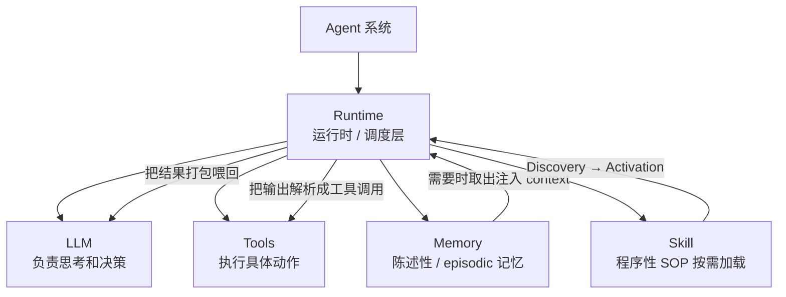
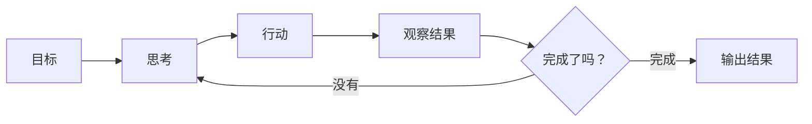

---
tags:
  - concept
aliases:
  - agent
  - AI Agent
  - 智能体
prerequisites:
  - "[[llm]]"
  - "[[context-window]]"
related:
  - "[[workflow]]"
  - "[[llm]]"
  - "[[tool-use]]"
  - "[[planning]]"
  - "[[reflection]]"
  - "[[multi-agent]]"
  - "[[react]]"
  - "[[skill]]"
  - "[[agent-context-stack]]"
stability: long
layer: application
updated: 2026-05-31
---
# Agent（智能体）

> [!tip] 核心本质
> LLM 是无状态的一问一答系统，无法主动执行多步任务；Agent 通过在 LLM 外套一个**感知-思考-行动**循环，由 Runtime 维持状态、调度工具、管理上下文，将 LLM 的语言能力扩展为真正的任务执行能力。若没有这个循环，LLM 只能描述「如何订机票」，却无法真正完成订票——因为它没有持续执行的结构，也无法在每步结束后基于真实结果决定下一步。

## 生命周期与演进

**当前定位**：从研究概念到工程产品。OpenAI、Anthropic、Google 均有原生 Agent 框架（Agents SDK、Claude Code、[[claude-managed-agents|Claude Managed Agents]]、Gemini Agent）；LangChain、LlamaIndex、AutoGen 提供可组合的 Runtime 层；代码生成 + 工具调用是当前最成熟的落地场景。

**预期寿命**：长期。I/O 边界、权限控制、可观测性需求使 Runtime 层不会消失；Agent 模式本身已确立为 LLM 落地的核心范式之一。

**近期演进**：Reasoning 模型（o3/Claude 3.7+）提升任务规划质量，减少无效循环；Computer Use 类工具将 Agent 边界扩展到 GUI 操作；更长的 context window 使单次 LLM 调用能完成更多推理，降低循环轮次。

**终极威胁**：足够强的模型在一次推理内完成更多步骤（逻辑 → 代码 → 验证），将减少对 Runtime 循环的依赖；但权限边界与外部系统交互无法被模型内化，Runtime 层最终会变薄而不会消失。

## 系统谱系：Agent 在哪里

不是所有任务都需要 Agent——按**谁来决定下一步**区分：

| 形态 | 谁决定下一步 | 典型场景 |
| --- | --- | --- |
| Chat | 用户一问一答 | 问答、写作、解释概念 |
| [[workflow\|Workflow]] | 代码写死的流程 | 摘要 → 翻译 → 格式化 |
| **Agent** | LLM 根据观察动态决定 | 需要查资料、试错、多步推理的任务 |
| [[multi-agent\|Multi-Agent]] | 多个 Agent 分工协作 | 复杂项目、角色分工明确的流程 |

越往右灵活性越高，成本和不确定性也越高。**能用 Workflow 解决的任务，不要上 Agent。**

## 执行架构

Agent 由 Runtime 调度 **LLM、Tools、Memory、Skill（程序性 SOP）** 等能力组件：



![[agent-architecture-l1.png]]
*图 L1 · 概念架构：Runtime 调度 LLM / Tools / Memory*

### 感知-思考-行动循环

Agent 的核心是一个由 Runtime 维持的循环——LLM 每轮能看到目标、历史和上一步结果，自主决定下一步：



![[agent-architecture-l2.png]]
*图 L2 · 控制流：Think → Act → Observe，由 Runtime 维持循环*

### Runtime：谁来维持循环

[[llm|LLM]] 本身是**无状态**的——每次调用都像第一次对话。循环不能靠 LLM 自己维持，这是 **Runtime**（也叫 Orchestrator / Agent Framework）的职责：维护循环、拼装 context、解析 tool call、写回 memory、兜底错误。LangChain、LlamaIndex 提供现成的 Runtime，但几十行 Python 也能实现同样逻辑——**Agent ≠ LangChain**。

```python
max_steps = 10
step = 0
done = False
history = []
goal = "订明天北京到上海价格最低的早班经济舱机票"

while not done and step < max_steps:
    step += 1
    # LLM 看到目标、历史、上一步结果，决定下一步做什么
    action = llm.think(goal, history, last_result)
    # Runtime 真正去执行（调搜索、写文件、调 API……）
    try:
        result = tools.execute(action)
    except Exception as e:
        result = f"执行失败：{e}"  # 出错继续循环，不直接崩溃
    # 把结果写回历史，下一轮 LLM 能看到
    history.append(result)
    # LLM 判断目标是否已完成
    done = llm.is_complete(goal, history)
```

`is_complete()` 是教学简化。真实系统里退出条件通常是：LLM 不再发起 tool call、达到 `max_steps` 上限、或关键动作触发人工确认。Runtime 不只转循环，还承担**安全边界和工程兜底**。

### 循环示例

以订机票为例，循环如何逐步推进：

| 轮次 | LLM 决策 | 工具执行 | history 追加 | 是否完成 |
| --- | --- | --- | --- | --- |
| 轮 1 | 需要先查航班 | 搜索 API："北京→上海，明天" | 12 个航班，400-1200 元 | 还没筛选，继续 |
| 轮 2 | 筛价格最低、早上出发 | 过滤：经济舱 + 早班 | 剩 3 个，最低 420 元 | 还没确认余票，继续 |
| 轮 3 | 确认最低价有没有票 | 查询余票 | 有票，可以下单 | 目标达成，退出 |

每轮 LLM 都能看到前面所有 history，知道做到哪了、还差什么。

## 核心组件

**Tools**：Agent 真正动手的地方。没有工具，LLM 只能「说」，不能「做」——搜索、代码执行、文件读写、API 调用都通过工具完成。详见 [[tool-use]]。

**Memory**：最简单的记忆是把每轮结果存入 history，但 context window 有上限，任务一长就撑满。实践中分两层：

| 类型 | 存在哪里 | 生命周期 | 典型内容 |
| --- | --- | --- | --- |
| 短期记忆 | context window | 当前任务结束清空 | 本轮对话历史、工具结果 |
| 长期记忆 | 外部数据库 | 跨任务持久保留 | 用户偏好、历史操作、学到的经验 |

没有长期记忆，每次启动都是全新 Agent——不记得上次做过什么。详见 [[memory]]。

**Skill**：程序性 SOP，以元数据 listing 常驻、全文按需激活，避免所有流程都占用 context。详见 [[skill]]。

## 生产架构

落地到真实系统时，L1 的四个组件之外还要补上**治理层**和**可观测性**：

![[agent-architecture-l3.png]]
*图 L3 · 生产架构：Guardrails 包裹 Runtime，并连接 User / Environment / 分层 Memory*

详细的 Runtime 系统设计见 [[harness-engineering]]；Skill / Memory / RAG / Rules 的上下文分工见 [[agent-context-stack]]。

## 坑与误区

**常见误解**：

- **Agent = ChatGPT**：ChatGPT 是一问一答，Agent 是有循环、有工具、有状态的系统，差了整个 Runtime 和工具层。
- **Agent = LangChain**：LangChain 是 Runtime 的一种实现，几十行 Python 就能写同样的循环。
- **LLM 越强就越不需要 Runtime**：LLM 再强也是无状态的，循环管理、工具调度、错误恢复这些事 LLM 自己做不了。

**工程常见风险**：

| 风险 | 表现 | 应对 |
| --- | --- | --- |
| **循环不终止** | 反复搜索、重复调用同一工具 | 设 `max_steps`；检测连续相同 action（连续 3 次相同则强制终止） |
| **工具幻觉** | 调用不存在的 API 或参数格式错误 | 预定义工具 schema 做校验；Runtime 拦截白名单外的调用 |
| **成本失控** | 10 轮循环 ≈ 10 倍 token 消耗 | 设 token 预算上限；对长 history 做摘要压缩；能用 Workflow 就不用 Agent |
| **错误累积** | 第 2 步错了，后面全在错误前提上继续 | 每轮加反思步骤让 LLM 检查结果合理性；关键步骤（如下单）触发人工确认 |

## 进一步阅读

- [[tool-use]] — Tools 是 Agent 的「手脚」，工具调用的设计模式
- [[react]] — ReAct 循环（Think → Act → Observe）的设计与实现
- [[planning]] — Agent 面对复杂目标时怎么拆解和规划
- [[reflection]] — Agent 怎么自我检查、纠错，应对错误累积
- [[multi-agent]] — 多个 Agent 分工协作是怎么工作的
- [[workflow]] — 搞清楚什么时候该用 Workflow 而不是 Agent
- [[harness-engineering]] — 搭系统让模型长期可靠地干活
- [[agent-context-stack]] — Skill / Memory / RAG / Rules 分工
- [[memory]] — Agent 记忆机制的完整设计
- [[resources/building-effective-agents]] — Anthropic 官方 Agent 设计指南
