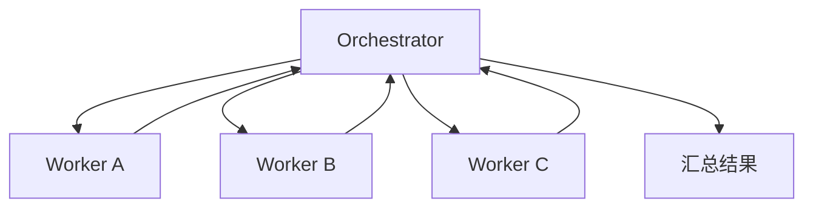

---
tags:
  - concept
aliases:
  - Multi-Agent
  - 多智能体
  - 多 Agent 协作
related:
  - "[[agent]]"
  - "[[workflow]]"
  - "[[planning]]"
  - "[[tool-use]]"
  - "[[context-window]]"
stability: long
layer: application
updated: 2026-06-04
---

# Multi-Agent（多智能体协作）

> [!tip] 核心本质
> Multi-Agent 是多个 [[agent]] 各负责不同子任务、由协调者汇总结果的架构；典型分工是 **Orchestrator（协调者）** 拆任务、派工、合并输出，**Worker** 在独立 context 里执行单一子任务。若没有这种分工，单 Agent 会卡在 [[context-window]] 装不下的超长任务上，也无法把互不依赖的子任务并行化——墙钟时间只能按步骤累加。Multi-Agent 用**协调成本**换**并行与分片 context**；只有「能拆开、且拆开后子任务足够独立」时才值得上，否则 [[planning]] 在单 Agent 内分解往往更便宜。

## 生命周期与演进

**当前定位**：复杂任务上的架构选项，而非默认形态。工程上常见 Orchestrator + 多个 Worker；最简单实现是 Orchestrator 把另一个 LLM 当作 [[tool-use|工具]] 调用，不必上专用 Multi-Agent 框架。

**预期寿命**：长期存在，但适用面会随单 Agent 能力变化而收缩。更长 context、更强单次规划会减少「必须拆库」的场景，却不会消除权限边界、专业工具集与并行吞吐的需求。

**近期演进**：子 Agent **隔离 context**（spawn 后独立会话再汇报）、并行 workstream、层级编排（主 Agent 再 spawn 子 Agent）；产品侧倾向把「多角色」做成可观测、可限权的 Runtime 能力，而非裸奔多进程对话。

**终极威胁**：子任务强耦合时，通信与状态同步成本会指数上升，错误在 Agent 间传播；若协调开销超过收益，应退回单 Agent + [[planning]] 或 [[workflow]]。Agent 数量不是越多越好。

## 架构与角色

在 [[agent]] 谱系里，Multi-Agent 位于最右侧：下一步由**多个 Agent 分工**决定，而不是单个 LLM 或写死的 [[workflow]]。



| 角色 | 职责 |
| --- | --- |
| **Orchestrator** | 分解目标、分配子任务、汇总 Worker 输出、处理冲突 |
| **Worker** | 单一子任务、专用工具集与 prompt；结果回传 Orchestrator |

单 Agent 的两个核心瓶颈：**context 装不下**、**独立子任务无法并行**。Multi-Agent 用多个 Worker 的 context 分片与并行执行应对；Orchestrator 自己的 context 仍要装下任务分解与汇总逻辑。

## 通信与编排

常见三种协作面，可组合使用：

| 方式 | 机制 | 适用 |
| --- | --- | --- |
| **共享状态** | 所有 Agent 读写同一状态存储 | 需要全局一致视图、可接受锁与冲突处理 |
| **消息传递** | 结构化消息在 Agent 间传递 | 子任务边界清晰、接口稳定 |
| **工具调用** | Orchestrator 把 Worker 当工具调 | 实现最简单；与单 Agent 的 tool loop 同构 |

与 [[planning]] 的关系：Planning 是**单 Agent 内部**的任务分解；Multi-Agent 是**跨 Agent** 的分解，决策逻辑相似，规模与协调成本不同。

## 何时采用 Multi-Agent

| 更适合 Multi-Agent | 更适合单 Agent / Workflow |
| --- | --- |
| 子任务可清晰拆分且**可并行** | 子任务依赖复杂，频繁互相同步 |
| 子任务需要**不同工具集或 prompt 风格** | 任务简单，拆分只增加协调开销 |
| 整体超出单 Agent 的 context 预算 | 需要**高度一致**的共享上下文，拆分后易信息不同步 |
| 墙钟时间敏感（并行 ≈ 最慢 Worker） | 流程可提前完全定义 → 用 [[workflow]] |

决策口诀：先问「能拆开吗？拆开后互相独立吗？」——两项都是「是」再考虑 Multi-Agent。

## 实践与应用

**代码审查 Multi-Agent 架构**（示意）：

```
Orchestrator：接收 PR，分解任务

Worker A（安全审查）：
  - 工具：静态分析、CVE 查询
  - 输出：安全问题列表

Worker B（性能审查）：
  - 工具：复杂度分析
  - 输出：性能问题列表

Worker C（风格审查）：
  - 工具：linter
  - 输出：风格问题列表

Orchestrator：汇总三份报告 → 生成最终审查意见
```

Worker A/B/C **并行**时，总耗时约等于最慢的一路，而非三者相加——前提是子任务无强顺序依赖且 Orchestrator 不成为串行瓶颈。

## 坑与误区

**常见误解**：

- **Agent 越多越强大**：协调成本与错误传播路径随数量上升；应匹配任务可分解度，而非堆角色。
- **Multi-Agent 一定需要复杂框架**：Orchestrator 通过工具调用唤起另一个 LLM 即是最小 Multi-Agent。
- **各 Worker 可完全独立**：共享状态设计不当会导致汇总矛盾；需要在接口层约定输入输出 schema。

**工程风险**：

| 风险 | 表现 | 应对 |
| --- | --- | --- |
| **协调瓶颈** | Orchestrator context 膨胀、串行等待 Worker | 限制 Worker 输出长度；分层汇总；只传摘要 |
| **状态不一致** | 各 Worker 基于不同事实做结论 | 共享只读事实层；关键字段由 Orchestrator 下发 |
| **错误级联** | 上游 Worker 错，下游全偏 | 汇总前校验；关键步骤人工确认 |
| **成本失控** | N 个 Agent × 多轮 × 全量 history | 子 Agent 隔离 context；设步数与 token 预算 |

## 进一步阅读

- [[agent]] — Multi-Agent 是多个 Agent 的组合；谱系中与 Workflow、单 Agent 的对比
- [[workflow]] — 流程可完全定义时用代码控制流，不必 Multi-Agent
- [[planning]] — Orchestrator 的核心能力；单 Agent 内分解的轻量替代
- [[tool-use]] — 把 Worker 当作工具调用是最简实现路径
- [[context-window]] — 分片 context 是采用 Multi-Agent 的主要动机之一
- [[agentic-ai-deeplearning]] — DeepLearning.AI Agentic AI 课程 Mod5
- [[resource-berkeley-llm-agents]] — Berkeley MOOC：Multi-Agent 专讲
