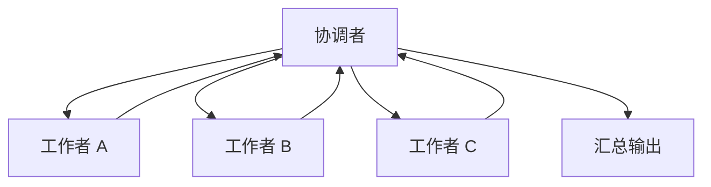
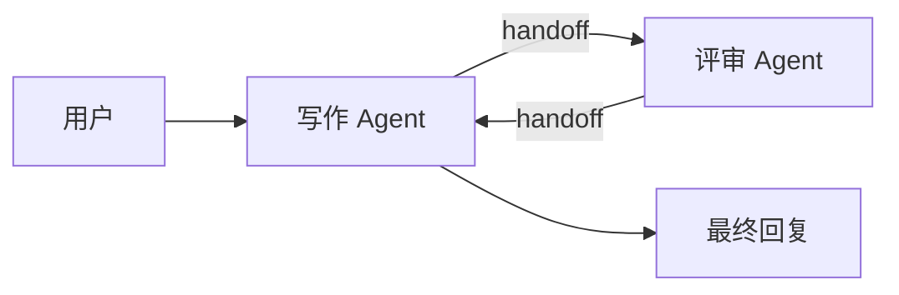

---
tags:
  - concept
aliases:
  - Multi-Agent
  - 多智能体
  - 多 Agent 协作
  - Swarm
  - Handoff
prerequisites:
  - "[[agent]]"
  - "[[context-window]]"
related:
  - "[[agent]]"
  - "[[workflow]]"
  - "[[planning]]"
  - "[[tool-use]]"
  - "[[context-window]]"
  - "[[harness-engineering]]"
  - "[[claude-managed-agents]]"
  - "[[reAct]]"
  - "[[memory]]"
  - "[[langgraph]]"
stability: long
layer: application
updated: 2026-06-16
---

# Multi-Agent（多智能体协作）

> [!tip] 核心本质
> 多智能体（Multi-Agent）是多个 [[agent|智能体（Agent）]] 分工协作的架构。**最常见**是协调者（Orchestrator）拆任务、工作者（Worker）在独立上下文里执行后汇总；也有**路由（Router）**只把请求转给单一专家、或**族群（Swarm）**由当前活跃智能体通过**移交（Handoff）**把控制权交给 peer，无中心协调者。若没有这种分工，单智能体会卡在 [[context-window|上下文窗口]] 装不下的超长任务上，也无法把互不依赖的子任务并行化——墙钟时间只能按步骤累加。多智能体用协调成本换并行与分片上下文；只有「能拆开、且拆开后子任务足够独立」时才值得上，否则 [[planning|规划（Planning）]] 在单智能体内分解往往更便宜。

适合已读 [[agent]] 与 [[context-window]]、要在 Workflow / 单 Agent / Multi-Agent 之间做架构选型的读者。读完 [[#1 在 Agent 谱系中的位置|§1]] 能判断该不该上；[[#2 协调者与工作者|§2]] 讲监督者模式与派生契约；[[#3 编排模式：不只协调者一种|§3]] 对照 Router / Handoff / Swarm 等拓扑；[[#4 走一遍派工：PR 审查与调研对照|§4]] 用叙事收束直觉。检查点、预算闸门、终态评测等驾驭层细节见 [[harness-engineering]]。

*检索说明：协调者-工作者与派生字段对照 [Anthropic Engineering, 2025][anthropic-ma]；编排模式 taxonomy 对照 [Anthropic Building effective agents][building-effective-agents]、[OpenAI Agents SDK — multi-agent][openai-ma]、[LangGraph supervisor vs swarm][langgraph-swarm]（观测 2026-06-15）。*

## 生命周期与演进

**当前定位**：复杂任务上的架构选项，而非默认形态。工程上常见「一个协调者 + 多个工作者」；最简单实现是协调者把另一个大语言模型当作 [[tool-use|工具]] 调用，不必上专用多智能体框架。Anthropic Claude **Research**（2025）把主研究员、并行子智能体与引用智能体产品化，是协调者-工作者模式的公开参考。

**预期寿命**：长期存在，但适用面会随单智能体能力变化而收缩。更长上下文、更强单次规划会减少「必须拆库」的场景，却不会消除权限边界、专业工具集与并行吞吐的需求。

**近期演进**：子智能体隔离上下文（派生后独立会话再汇报）、外置产物（工作者写文件或对象存储，主协调者只收引用）减少传话失真；产品侧（Claude Research、[[claude-managed-agents|Claude Managed Agents]]、[[langgraph|LangGraph]] 子图）把多角色做成可观测、可限权的运行时能力。

**终极威胁**：子任务强耦合时，通信与状态同步成本指数上升；若协调开销超过收益，应退回单智能体 + [[planning]] 或 [[workflow]]。智能体数量不是越多越好。

## 1 在 Agent 谱系中的位置

在 [[agent]] 定义的自主执行谱系里，多智能体位于最右：工作流 → 智能体 → 多智能体。越往右，运行时把「下一步」交给模型决策的程度越高，成本与不确定性通常也越高。

| 形态 | 谁决定下一步 | 多智能体何时出现 |
| --- | --- | --- |
| [[workflow\|Workflow（工作流）]] | 代码写死 | 流程已完全可定义时，不必多智能体 |
| 单 [[agent\|Agent（智能体）]] | 一个大语言模型在驾驭层内循环 | 子任务可串行、上下文够用时常足够 |
| **Multi-Agent（多智能体）** | 协调者 + 多个工作者 | 可并行、或角色/工具集需隔离时 |

单智能体的两个核心瓶颈是上下文装不下、独立子任务无法并行。多智能体用多个工作者的上下文分片与并行执行应对；但协调者的上下文仍要装下任务分解、各工作者摘要与汇总——协调者本身也会膨胀，不是「拆出去就万事大吉」。

与 [[planning]] 的分工：规划是单智能体内部分解；多智能体是跨智能体分解。都会拆任务，后者多了会话隔离、并行调度、结果合并，以及 [[harness-engineering|驾驭工程（Harness）]] 上的观测与预算面。

## 2 协调者与工作者（监督者模式）

协调者只写一句「并行调研供应链各环节」，三个工作者各自搜同一批头条、回传重复摘要——没人负责上游晶圆还是下游封装，汇总时仍缺关键缺口。这不是模型笨，而是**没有中心派工与终局合成**：工作者缺契约与边界，也没有谁把碎片收成一条可交付答案。

直觉上，**监督者（Supervisor）** / **协调者-工作者**让中心大语言模型担当协调者：分解目标、派工、合并；工作者在隔离上下文里执行，通常彼此不直接对话。§3 中的 Router、Handoff、Swarm 是同一「多智能体」层上的其他控制流；选型先看**谁路由、谁对用户负责**。

协调者-工作者是生产里最常见的拓扑：子任务从中心派出、结果回到中心合成。下图把「谁对谁说话」画成星形，便于与 §3 的 Handoff / Swarm 对照。

**图 1 — 协调者-工作者**



星形结构意味着工作者默认**不互聊**——只与协调者往返；最终对用户负责的合成逻辑集中在协调者一侧。下表拆开各角色职责。

| 角色 | 职责 |
| --- | --- |
| 协调者（Orchestrator） | 分解目标、分配子任务、汇总输出、决定是否追加轮次 |
| 工作者（Worker） | 单一子任务、专用工具集与提示词；独立上下文内执行后回传压缩结果 |
| 校验者（Verifier，可选） | 独立上下文做引用或格式校验；与生成解耦（如 CitationAgent） |

最小实现：协调者通过一次 [[tool-use|工具调用]] 唤起「子大语言模型 + 子提示词 + 子工具列表」——被调用的「工具」本身又是一个完整智能体循环。OpenAI Agents SDK 把同一形态称为 **智能体作工具（agents-as-tools）**：经理调 `specialist.as_tool()`，子智能体只回结果，**经理仍合成最终答案**——与下节 Handoff / Swarm **移交控制权**不同。

### 2.1 派生契约：协调者须写清什么

[Anthropic 工程文][anthropic-ma] 记录过一个典型早期故障：主协调者只派生一句「研究半导体短缺」，三个子智能体各自去搜同一批头条新闻，汇总时没有覆盖供应链环节，也没有分工互补——不是模型笨，是**派生契约太短**，工作者无法知道「我只负责上游晶圆」还是「我负责下游封装」。

生产级派生至少应写清五件事：

| 字段 | 作用 | 缺失时的典型故障 |
| --- | --- | --- |
| 目标（objective） | 本子任务要回答什么 | 与兄弟任务重复或跑题 |
| 输出格式（output_format） | 结构化字段约定 | 主协调者无法可靠合并 |
| 工具与数据源（tools / sources） | 可用工具与优先来源 | 用错工具或搜错域 |
| 边界（boundaries） | 深度/广度预算、禁止事项 | 无限搜索或过早结束 |
| 工作量提示（effort_hint） | 简单题 1 工作者 vs 复杂调研多工作者 | 简单查询派生数十个子智能体 |

长任务还应在开跑前把研究计划写入 [[memory|Memory（记忆）]]：上下文截断后仍能恢复「已经查过什么、还缺什么」。Anthropic 在约 20 万词元截断场景下依赖此模式。

工作者默认**强隔离**：不知彼此存在，只拿本子任务与工具；回传应是摘要或结构化字段，长报告写入外置产物、只给引用——否则大段文本在对话历史里反复拷贝，主协调者上下文会先于工作者爆掉。

### 2.2 派生与并行汇总：教学示例

`SpawnContract` 把 [[#2.1 派生契约：协调者须写清什么|§2.1]] 五字段落成结构体；`spawn_worker` 即「把工作者当 [[tool-use|工具]] 调」的最小形态——内部是独立 context 上的智能体循环。`asyncio.gather` 只在子任务**无顺序依赖**时用；生产还须派生上限、摘要回传、外置产物（见 [[harness-engineering]]）；[[langgraph]] Send API 是同一拓扑的图编排写法。

```python
from dataclasses import dataclass
import asyncio

@dataclass
class SpawnContract:
    objective: str
    output_format: str
    tools: list[str]
    boundaries: str

async def spawn_worker(contract: SpawnContract, ctx: str) -> list[dict]:
    return await harness.run_agent_loop(contract, ctx)

async def review_pr(pr_diff: str) -> str:
    tasks = [
        spawn_worker(SpawnContract(
            "Security issues only", "json list", ["semgrep", "cve_lookup"],
            "No perf or style",
        ), pr_diff),
        spawn_worker(SpawnContract(
            "Perf hotspots only", "json list", ["complexity"],
            "No security analysis",
        ), pr_diff),
        spawn_worker(SpawnContract(
            "Linter violations only", "json list", ["linter"],
            "No security analysis",
        ), pr_diff),
    ]
    findings = await asyncio.gather(*tasks)
    return orchestrator.merge(findings)

# 若性能审查依赖安全审查的调用图 → 流水线，勿 gather：
# sec = await spawn_worker(security_contract, pr_diff)
# perf = await spawn_worker(perf_contract, pr_diff, extra=sec.call_graph)
```

## 3 编排模式：不只协调者一种

多智能体常被误写成「只有并行汇总」。工程上按**谁决定下一步、谁对最终答案负责**区分模式；[Anthropic 模式菜单][building-effective-agents] 与 [OpenAI 编排文档][openai-ma] 命名略有出入，但控制流可对照下表。

**表 2 — 常见编排模式**

| 模式 | 谁在路由 | 谁对用户负责 | 典型场景 |
| --- | --- | --- | --- |
| **监督者 / 协调者-工作者** | 中心 LLM 分解并汇总 | 协调者 | 广度调研、PR 多路审查（本篇 §2、§4） |
| **智能体作工具** | 中心 LLM 把子 Agent 当工具调 | 中心 LLM | 与监督者同构；子 Agent 只回结构化结果 |
| **移交（Handoff）** | **当前活跃** Agent 交给下一 Agent | **接手后的专家** | 客服分流：账单专家接管后续对话 |
| **族群（Swarm）** | 无中心；peer 互调 handoff 工具 | 最后一个不再移交的 Agent | 写→审→写 多轮环；动态 specialist 网 |
| **路由（Router）** | 分类器或 LLM 选一个下游 | 被选中的专家（端到端） | 意图已分好类、**不需**分解与合并 |
| **流水线（Pipeline）** | 代码或固定图边 | 最后一环或外层代码 | 提取→分析→成稿；强顺序依赖 |

### 3.1 移交（Handoff）

用户问「上月账单为何多扣费」，分流 Agent 已识别意图，却仍自己查账、自己解释——账单专家永远接不上手，用户得到的是泛化答复。直觉：**移交（Handoff）** 把控制权转给对口专家，分流者不再合成最终答案。

形式化地说，Handoff 是当前活跃 Agent 调用 `handoffs=[billing_agent]` 一类工具，把会话 thread 交给下一 Agent；[OpenAI Agents SDK][openai-ma] 与客服 triage 典型形态都走此路径。与 [[#2 协调者与工作者（监督者模式）|§2 图 1]] 对照：监督者是「中心派工 → 回传 → 中心合成」；Handoff 是「控制权离开当前 Agent，且通常不再回到分流者汇总」。

Handoff 适合「一次分流、专家端到端接管」——下图强调分流节点在 handoff 后退出责任链。

**图 2 — Handoff（移交：专家接管对话）**


读者应带走：**最终答案由接手专家负责**，分流 Agent 只完成路由，不再 fan-in 子结果。后续轮次在共享 thread 上由专家继续。

### 3.2 族群（Swarm）

写稿 Agent 改完想请人把关，评审 Agent 提意见后又得回到写作侧再改——若每次都经中心协调者汇总，对话历史会反复膨胀。直觉：**族群（Swarm）** 让 peer 之间直接 handoff，没有常驻中心 LLM 做每轮合成。

Swarm 是 Handoff 的 mesh 形态：当前 Agent 在 peer 列表里选 `handoff_to_*`，把控制权交给对方；可形成「写作 → 评审 → 再写」环，直到某 Agent 直接回复用户。[LangGraph Swarm][langgraph-swarm] 与早期 OpenAI Swarm 示例库都走这条路径。下图与图 1 的差别是**没有协调者节点**——路由由当前活跃 Agent 本地决定。

**图 3 — Swarm（族群：peer 互移交，无中心协调者）**



读者应带走：Swarm 省中心 fan-in/fan-out，但仍有共享 thread、`activeAgent`、`max_handoffs` 等状态——不是「完全无协调」。peer 重复劳动或无限互踢时，要靠显式共享状态（任务队列、黑板）与 handoff 上限约束。

与监督者的取舍：**路由在 specialist 本地**，不必每轮把子结果塞进中心上下文；代价是**难审计、难预算**——追踪与评测须按系统级做（见 [[harness-engineering]]）。对话式分流、专家应直接对用户说话、或写—审多轮环 → Handoff / Swarm；必须单一合成答案、要强派生契约、要中心预算闸门 → 监督者。

**路由（Router）** 与监督者的差别在**不做汇总**：「退款 / 技术 / 闲聊」分桶后，专家端到端处理即可；若还要并行搜三路再合并，已升级为监督者 + 并行工作者，不是 Router。

### 3.3 并行、流水线与何时退回单 Agent

并行汇总、流水线、辩论/裁决是**监督者内部**的常见子拓扑（见 [[#4.1 并行汇总：代码审查|§4.1]]）：并行要求子任务无顺序依赖；流水线适合 A 的输出是 B 的唯一输入。方案比选、红队审查可用辩论/裁决：多路结论交给协调者或校验者选——接近 [Building effective agents][building-effective-agents] 的 evaluator-optimizer 工作流。

上一步输出是下一步唯一输入的强耦合链——例如改代码必须等测试日志——应退回**单智能体顺序 [[reAct|推理-行动（ReAct）]]**，不要硬拆多智能体。Anthropic 亦指出：多数编码任务可并行子任务少于调研类。层级编排（协调者再派子协调者）只在主协调者上下文装不下分工逻辑时值得。

选型口诀：**能写死 → 工作流；不能写死但可串行 → 单智能体；必须并行或分上下文 → 多智能体（再选监督者 / Router / Swarm）。** 先问「要中心合成答案，还是专家接管对话？」

| 更适合多智能体 | 更适合单智能体 / 工作流 |
| --- | --- |
| 子任务可清晰拆分且可并行 | 子任务强依赖、频繁互相同步 |
| 子任务需要不同工具集或提示词 | 拆分只增加协调、无并行收益 |
| 信息总量超出单智能体上下文 | 需要高度一致的共享上下文 |
| 墙钟敏感，且任务价值覆盖词元溢价 | 流程可完全定义 → [[workflow]] |

词元成本常被低估。Anthropic 内部：Claude Research 相对普通聊天约 **15 倍**词元（单智能体 Agent 单独约 **4 倍**）；BrowseComp 等任务上性能方差约 **80%** 可由词元用量解释——多智能体本质是在可承受成本下换更多并行上下文容量，不是免费午餐。Swarm 省的是中心 fan-in/fan-out 词元，但 handoff 链过长时总 token 仍可能更高。

## 4 走一遍派工：PR 审查与调研对照

### 4.1 并行汇总：代码审查

PR 三路并行审查（安全 / 性能 / 风格）只收束 [[#2.1 派生契约：协调者须写清什么|§2.1]] 与 [[#3.3 并行、流水线与何时退回单 Agent|§3.3]] 的直觉：无顺序依赖才并行，强耦合链应退回单智能体 [[reAct]] 而非假装多工作者——与 [[agent]] 里「何时停在单智能体、何时才值得拆工作者」同一条决策线。

### 4.2 产品级对照：Claude Research

[Claude Research][anthropic-ma] 是监督者-工作者模式的产品级样例，印证 [[agent]] 谱系最右端「协调者合成 + 隔离工作者」的生产形态；步骤可完全代码定义的环节仍应优先 [[workflow]]，Handoff / Swarm 见 [[#3.1 移交（Handoff）|§3.1]]、[[#3.2 族群（Swarm）|§3.2]]。

## 5 坑与误区

本篇不教你选用哪套多智能体框架 API，也不覆盖部署拓扑、告警规则等运维 playbook。下文坑点聚焦架构选型与派生契约；检查点恢复、预算闸门与终态评测见 [[harness-engineering]]。

- 智能体越多越强大：协调与错误传播路径随数量上升；应匹配任务可分解度，不堆角色。
- 多智能体必上框架：工具调用唤起子大语言模型即最小形态。
- 工作者完全独立即可：没有输出格式约定的汇总必然矛盾或重复。
- 多智能体替代工作流：步骤可代码定义时，工作流更省、更可审计。
- 编码默认多智能体：并行子任务少、强顺序依赖时，单智能体 [[reAct]] 常更便宜。
- **Swarm 不是银弹**：无中心协调不等于无状态；handoff 环难审计，要单一合成答案时用监督者。

主协调者同步等待一批子智能体完成再下一步，实现简单但会被最慢工作者阻塞——Anthropic 当前 Research 以同步为主，并视为已知瓶颈。每工作者应设 `max_steps`、工具调用与墙钟上限；主协调者设总词元与最大派生数，否则简单查询也会派生几十个工作者（早期真实故障）。错误级联、检查点恢复、终态评测与追踪见 [[harness-engineering]]；主协调者提示词启发式见 [Anthropic 工程文][anthropic-ma] 原文。

## 要点收束

- 多智能体 ≠ 只有监督者：Router 只分发；Handoff / Swarm 由活跃 Agent 移交，专家可能直接对用户负责。
- 监督者模式：派生契约（目标、格式、工具、边界、工作量）是生产分水岭；短指令是 Research 早期主要故障源。
- Swarm 仍需共享状态与 `max_handoffs`；要单一合成答案时用监督者，不要默认 Swarm。
- 强耦合链用单智能体 [[reAct]]；并行汇总前确认子任务真的无顺序依赖。

## 进一步阅读

- [[agent]] — 工作流 / 智能体 / 多智能体谱系
- [[workflow]] — 流程可定义时不必多智能体
- [[planning]] — 单智能体内分解的轻量替代
- [[tool-use]] — 工作者即工具的最简实现
- [[context-window]] — 分片上下文的主要动机
- [[harness-engineering]] — 预算闸门、检查点、追踪、终态评测
- [[memory]] — 主协调者计划持久化
- [[claude-managed-agents]] — Anthropic 托管驾驭层
- [[langgraph]] — 子图与并行 Send
- [[reAct]] — 单智能体顺序循环，对照并行工作者
- [anthropic-ma]: [How we built our multi-agent research system](https://www.anthropic.com/engineering/multi-agent-research-system) — 监督者模式、派生契约、外置产物
- [building-effective-agents]: [Building effective agents](https://www.anthropic.com/engineering/building-effective-agents) — Routing、Parallelization、Orchestrator-workers、Evaluator-optimizer
- [openai-ma]: [OpenAI Agents SDK — Agent orchestration](https://openai.github.io/openai-agents-python/multi_agent/) — agents-as-tools vs handoffs
- [langgraph-swarm]: [LangGraph Swarm — multi-agent handoffs](https://langchain-ai.github.io/langgraphjs/reference/modules/langgraph-swarm.html) — peer handoff vs supervisor 包
- [DeepLearning.AI Agentic AI — Mod5 Multi-Agent](https://www.deeplearning.ai/courses/agentic-ai/)
- [Berkeley LLM Agents MOOC](https://llmagents-learning.org/)
