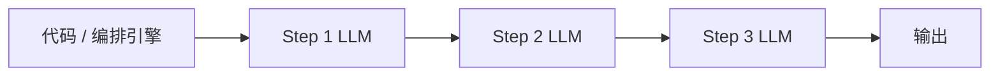

---
tags:
  - concept
aliases:
  - 工作流
  - 流水线
related:
  - "[[agent]]"
  - "[[multi-agent]]"
  - "[[prompt-engineering]]"
stability: long
layer: application
updated: 2026-06-04
---

# Workflow（工作流）

> [!tip] 核心本质
> Workflow 把任务流程**提前定死**，由**代码**决定每一步的顺序与分支，[[llm|LLM]] 只负责各步的内容生成，不决定「下一步走哪」。若没有这层固定控制流，同样的事会交给 [[agent]] 在循环里动态规划——可预测性、可审计性和成本都会变差。Workflow 与 Agent 共享底层（LLM + 工具），差别仅在**谁来握控制流**：能完整定义步骤时，用不着 Agent 的自主性。

## 生命周期与演进

**当前定位**：LLM 落地中最常见、也最该优先尝试的形态之一。编排框架（LangGraph、Temporal、自研 pipeline）把「摘要 → 翻译 → 格式化」类任务做成可复现流水线；在 [[agent]] 谱系里位于最左：灵活性最低，可控性最高。

**预期寿命**：长期。无论模型多强，需要**合规审计、固定 SLA、确定性重试**的场景仍会保留代码写死的流程。

**近期演进**：与 Agent 框架边界变模糊——图编排、条件边、人工审核节点常出现在同一产品里；但「分支条件由代码/规则决定」与「由 LLM 当场决定」仍是选型分水岭。

**终极威胁**：不是被 Agent 全面取代，而是被误用：在流程本可定义的任务上强行上 Agent，牺牲可预测性换不必要的规划开销。更强模型不会消除「谁来做 go/no-go」的审计需求。

## 控制流由谁决定

不是所有任务都需要 Agent 的自主性。流程固定时（如摘要 → 翻译 → 格式化），Workflow 足够且更可控：

```
Step 1（固定）：调用 LLM 做摘要
    ↓
Step 2（固定）：调用 LLM 做翻译
    ↓
Step 3（固定）：调用 LLM 格式化输出
```



LLM 不决定跳步、改序或提前结束；Runtime 或业务代码持有控制流。

## Workflow 与 Agent、Multi-Agent

在 [[agent]] 一文中的谱系对比（越往右灵活性越高、成本与不确定性越高）：

| 形态 | 谁决定下一步 | 典型场景 |
| --- | --- | --- |
| Chat | 用户一问一答 | 问答、写作 |
| **Workflow** | 代码写死 | 摘要 → 翻译 → 格式化 |
| [[agent\|Agent]] | LLM 根据观察动态决定 | 查资料、试错、多步推理 |
| [[multi-agent\|Multi-Agent]] | 多 Agent 分工 | 可并行、角色分明的复杂任务 |

| 维度 | Workflow | Agent |
| --- | --- | --- |
| 控制流 | 代码决定 | LLM 决定 |
| 步骤 | 固定（含代码定义的分支） | 动态 |
| 可预测性 | 高 | 低 |
| 适合任务 | 流程可提前定义 | 需规划、纠错、工具顺序不固定 |
| 成本 | 相对低 | 相对高（多轮、多工具） |

**选 Workflow**：流程可完全定义；要高可靠性、可审计；成本敏感。

**选 Agent**：需根据中间结果改路径；多工具且顺序不固定；目标模糊、需自主规划。

**选 Multi-Agent**：在 Agent 之上，子任务可拆且可并行——见 [[multi-agent]]。能用 Workflow 解决的，不要上 Agent；能用单 Agent 解决的，不要上 Multi-Agent。

## 实践与应用

日常类比：磨豆、烧水、冲泡——步骤固定，不必每步重新想「下一步做什么」。工程上同样：把编排写进代码，而不是交给模型临场发挥。

**文章处理流水线**（示意）：

```
输入：一篇英文文章

Step 1 → LLM 提取关键点（固定）
Step 2 → LLM 翻译成中文（固定）
Step 3 → LLM 生成社交媒体帖子（固定）

输出：中文社媒帖子
```

编排层保证顺序；LLM 不能跳过 Step 2 或调换 Step 1/3。若需「质量不达标则重跑 Step 2」，分支条件仍由**代码**判断（例如长度、格式校验），而非 LLM 自由改图。

## 坑与误区

**常见误解**：

- **Workflow 能做的事用 Agent 更好**：不对。可预测性、可复现 run、易做单元测试是 Workflow 的优势，不是缺陷。
- **Workflow 只能线性 pipeline**：可以有条件分支、并行扇出/汇聚，只要分支逻辑由代码或规则引擎决定，而非 LLM 当场改控制流。

**工程注意**：

| 风险 | 表现 | 应对 |
| --- | --- | --- |
| **步骤定义不全** | 边界 case 无分支，流水线卡死或输出垃圾 | 补齐校验与 fallback 分支；搞不定的步骤再考虑 Agent |
| **步间状态膨胀** | 每步全文传递，token 浪费 | 步间只传结构化摘要；见 [[technique-prompt-chaining]] |
| **误当 Agent 用** | 在 Workflow 里让 LLM 决定跳步 | 把「是否继续」写成显式规则或独立校验节点 |

## 进一步阅读

- [[agent]] — Workflow 的自主化升级版；谱系与 Runtime 循环
- [[multi-agent]] — 再往上才是多 Agent 分工
- [[technique-prompt-chaining]] — Workflow 各步之间如何传递 prompt 与中间结果
- [[prompt-engineering]] — 单步 LLM 调用的提示设计
- [[building-effective-agents]] — Anthropic 对 Workflow vs Agent 的权威区分
