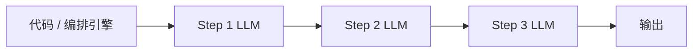

---
tags:
  - concept
aliases:
  - 工作流
  - 流水线
related:
  - "[[agent]]"
  - "[[multi-agent]]"
  - "[[prompt-engineering]]"
  - "[[langgraph]]"
stability: long
layer: application
updated: 2026-06-16
---

# Workflow（工作流）

> [!tip] 核心本质
> Workflow 把任务流程**提前定死**，由**代码**决定每一步的顺序与分支，[[llm|LLM]] 只负责各步的内容生成，不决定「下一步走哪」。若没有这层固定控制流，同样的事会交给 [[agent]] 在循环里动态规划——可预测性、可审计性和成本都会变差。Workflow 与 Agent 共享底层（LLM + 工具），差别仅在**谁来握控制流**：能完整定义步骤时，用不着 Agent 的自主性。

适合已理解 [[llm]]、要在固定流水线与 [[agent]] 自主循环之间做选型的读者。读完 [[#核心原理|核心原理]] 能复述控制流归属与 Workflow 边界；[[#Workflow 与 Agent、Multi-Agent|对比节]] 给出工程维度对照。四形态全貌与选型信号见 [[agent#1 系统谱系：智能体在哪里|agent §1]]，本篇不重复谱系表。

## 生命周期与演进

**当前定位**：LLM 落地中最常见、也最该优先尝试的形态之一。编排框架（LangGraph、Temporal、自研 pipeline）把「摘要 → 翻译 → 格式化」类任务做成可复现流水线；在 [[agent]] 谱系里位于最左：灵活性最低，可控性最高。

**预期寿命**：长期。无论模型多强，需要**合规审计、固定 SLA、确定性重试**的场景仍会保留代码写死的流程。

**近期演进**：与 Agent 框架边界变模糊——图编排、条件边、人工审核节点常出现在同一产品里；但「分支条件由代码/规则决定」与「由 LLM 当场决定」仍是选型分水岭。

**终极威胁**：不是被 Agent 全面取代，而是被误用：在流程本可定义的任务上强行上 Agent，牺牲可预测性换不必要的规划开销。更强模型不会消除「谁来做 go/no-go」的审计需求。

## 核心原理

本篇展开 Workflow 的三条机制：控制流为何由代码持有、分支与重试归谁管、任务何时仍落在 Workflow 内。与 [[agent]] 共享底层（大语言模型 + 工具），差别仅在**谁来握控制流**；四形态谱系与选型信号见 [[agent#1 系统谱系：智能体在哪里|agent §1]]，此处只链出、不重复表 1。

### 控制流为何代码持有

「摘要 → 翻译 → 格式化」这类任务，若交给智能体（Agent）每轮临场决定下一步，同一输入可能走不同路径——合规审计与单测都难以复现。Workflow 的取舍是：**在设计阶段把箭头画死**，模型只负责各步内容生成。

编排引擎在调用大语言模型之前就定好下一节点；模型输出不能新增「我决定跳过翻译」这类边。任何跳步、改序或提前结束都发生在代码一侧，大语言模型节点没有「选下一步工具」的出口。这与 [[agent#2.2 感知-思考-行动循环|agent §2.2]] 里由模型根据观察改道的 Harness 循环形成对照。

**图 1 — 代码持有控制流，大语言模型只执行单步生成**



读图 takeaway：控制流（control flow）是可版本化的程序结构；大语言模型是步内生成器，不是图上的路由器。

### 分支与重试的归属

关键点提取只得到两条 bullet、翻译结果超字数上限——流水线不能卡死，也不能让模型自由改图。Workflow 的做法是：**go/no-go 与重试次数由代码或规则引擎判定**，模型只在被调用的那一步里改内容。

「关键点太少则重跑提取」的分支写在 `if len(bullets) < 3` 里，而不是写进提示词里问模型「你觉得要不要再提取一次」。质量校验、格式检查、人工审核节点同理：触发条件可单测，重试上限可配置，审计日志能回答「谁在何时因何规则走了哪条边」。若反复需要模型根据上一步 observation 临场决定「换工具还是继续」，控制流已越出 Workflow，应显式升级到 [[agent]] 并在 [[harness-engineering]] 层补齐循环与终止条件。

### Workflow 边界

边界问题只有一个：**步骤与分支能否在设计阶段画成固定有向无环图（DAG）**——含并行扇出、条件边、人工卡点，只要分支条件能写成代码或规则。

能画死 → 留在 Workflow，换可预测性与低成本。画不死（工具顺序随中间结果变化、要试错改道、目标模糊需规划）→ 上 [[agent]]；子任务可并行且角色边界清楚时再考虑 [[multi-agent]]。这不是「越智能越好」的刻度，而是**下一步决策权**该落在哪一侧：Workflow 把决策权前移到设计期，Agent 把决策权留给运行时模型。误用典型是在本可 DAG 化的工单流水线里让模型决定跳步——牺牲 SLA 与审计，却换不来必要的路径弹性。

## Workflow 与 Agent、Multi-Agent

谱系位置与「下一步谁拍板」的选型信号见 [[agent#1 系统谱系：智能体在哪里|agent §1]]。下文只保留 Workflow 与 Agent 的**工程维度**对照，便于落地时逐项核对。

**表 1 — Workflow 与 Agent 的工程维度对照**

| 维度 | Workflow | Agent |
| --- | --- | --- |
| 控制流 | 代码决定 | LLM 决定 |
| 步骤 | 固定（含代码定义的分支） | 动态 |
| 可预测性 | 高 | 低 |
| 适合任务 | 流程可提前定义 | 需规划、纠错、工具顺序不固定 |
| 成本 | 相对低 | 相对高（多轮、多工具） |

表 1 的取舍轴是**可预测性 vs 路径弹性**：左列适合 SLA、审计与单测；右列适合中间结果会改变工具顺序、且分支条件无法在设计阶段写死的任务。何时不必上 Agent 或 Multi-Agent，见 [[#Workflow 边界|Workflow 边界]]。

## 实践与应用

日常类比：磨豆、烧水、冲泡——步骤固定，不必每步重新想「下一步做什么」。工程上同样：把编排写进代码，而不是交给模型临场发挥。

**文章处理流水线**（示意）：

```
输入：一篇英文文章

Step 1 → LLM 提取关键点（固定）
Step 2 → LLM 翻译成中文（固定）
Step 3 → LLM 生成社交媒体帖子（固定）

输出：中文社媒帖子
```

编排层保证顺序；大语言模型不能跳过 Step 2 或调换 Step 1/3。质量不达标时的重跑逻辑见 [[#分支与重试的归属|分支与重试的归属]]。

### 代码写死的控制流：教学示例

下面片段对应上文文章流水线：函数体决定**先提取、再翻译、再格式化**；`if len(bullets) < 3` 把分支落在 Python 里。完整图编排、检查点、人工审核节点见 [[langgraph]]。

```python
def run_article_pipeline(article: str) -> str:
    bullets = llm.complete("extract_key_points", article)
    if len(bullets) < 3:  # 代码持有分支，不是 LLM 决定跳步
        bullets = llm.complete("extract_key_points_retry", article)
    zh = llm.complete("translate", bullets)
    return llm.complete("format_social_post", zh)
```

对比 [[agent#2.4 维持循环：教学示例|agent §2.4]]：Agent 每轮由 `llm.think()` 决定下一步调哪个工具；Workflow 在进大语言模型之前，下一步调用哪个 prompt 已由代码写死。

## 坑与误区

**常见误解**：

- **Workflow 能做的事用 Agent 更好**：不对。可预测性、可复现 run、易做单元测试是 Workflow 的优势，不是缺陷。
- **Workflow 只能线性 pipeline**：可以有条件分支、并行扇出/汇聚，只要分支逻辑由代码或规则引擎决定，而非 LLM 当场改控制流。

**工程注意**：

**表 2 — Workflow 常见工程风险与应对**

| 风险 | 表现 | 应对 |
| --- | --- | --- |
| **步骤定义不全** | 边界 case 无分支，流水线卡死或输出垃圾 | 补齐校验与 fallback 分支；搞不定的步骤再考虑 Agent |
| **步间状态膨胀** | 每步全文传递，token 浪费 | 步间只传结构化摘要；见 [[context-engineering]] |
| **误当 Agent 用** | 在 Workflow 里让 LLM 决定跳步 | 把「是否继续」写成显式规则或独立校验节点 |

三行坑表可收束为一条设计原则：**控制流与 go/no-go 留在代码侧**（机制见 [[#分支与重试的归属|分支与重试的归属]]）；前两行是「定义不全」与「状态传递」的补洞路径；第三行是选型回退——若反复需要模型临场改图，说明任务已越出 [[#Workflow 边界|Workflow 边界]]，应显式升级到 Agent。

## 进一步阅读

- [[agent]] — Workflow 的自主化升级版；谱系与 Runtime 循环
- [[multi-agent]] — 再往上才是多 Agent 分工
- [[context-engineering]] — Workflow 各步之间如何传递 prompt 与中间结果
- [[prompt-engineering]] — 单步 LLM 调用的提示设计
- [[building-effective-agents]] — Anthropic 对 Workflow vs Agent 的权威区分
- [[langgraph]] — 图编排、条件边与检查点的框架实现
