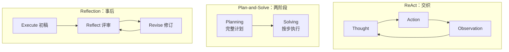
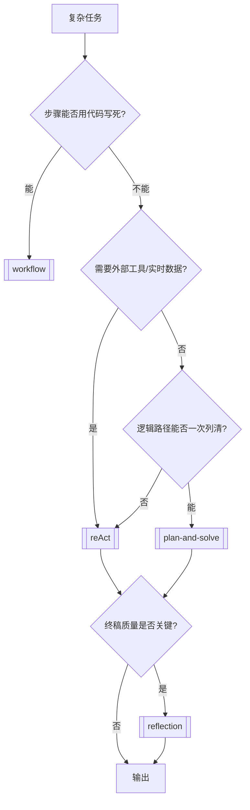
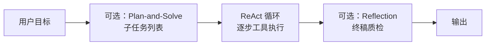

---
tags:
  - pattern
  - index
aliases:
  - Agent Paradigms
  - 智能体范式
  - 经典范式
  - 范式选型
prerequisites:
  - "[[agent]]"
  - "[[llm]]"
related:
  - "[[reAct]]"
  - "[[plan-and-solve]]"
  - "[[planning]]"
  - "[[reflection]]"
  - "[[chain-of-thought]]"
  - "[[workflow]]"
  - "[[tool-use]]"
  - "[[harness-engineering]]"
stability: long
layer: application
updated: 2026-06-16
---

# 智能体经典范式（Agent Paradigms）

> [!tip] 核心本质
> 经典 Agent 范式回答同一件事：**思考（Reason）与行动（Act）如何组织**。ReAct 把二者**交织**在每一步（边想边做、靠 Observation 纠错）；Plan-and-Solve **先**产出完整计划再逐步执行（结构稳、路径可审计）；Reflection 在初稿完成后做**事后**评审与修订（用 token 换质量）。三者不是互斥框架，而是可组合的循环片段；选型取决于任务是否需要外部工具、计划能否事先写死、以及结果质量相对实时性的权重。

适合已读 [[agent]]、要在 ReAct / Plan-and-Solve / Reflection 之间做架构决策的读者。读完 [[#2 选型决策|§2]] 能按场景拍板；[[#3 组合架构|§3]] 说明生产里常见的混合栈；各范式机制细节分别见 [[reAct]]、[[plan-and-solve]]、[[reflection]]。动手教程可外链 [Hello Agents 第四章](https://datawhalechina.github.io/hello-agents/#/./chapter4/%E7%AC%AC%E5%9B%9B%E7%AB%A0%20%E6%99%BA%E8%83%BD%E4%BD%93%E7%BB%8F%E5%85%B8%E8%8C%83%E5%BC%8F%E6%9E%84%E5%BB%BA)。

*检索说明：三范式分工对照 [ReAct (Yao et al. 2022)](https://arxiv.org/abs/2210.03629)、[Plan-and-Solve (Wang et al. 2023)](https://arxiv.org/abs/2305.04091)、[Reflexion (Shinn et al. 2023)](https://arxiv.org/abs/2303.11366)、[Anthropic — Building effective agents](https://www.anthropic.com/engineering/building-effective-agents) 与 Hello Agents ch4（观测 2026-06-16）。*

## 生命周期与演进

**当前定位**：Agent 入门与产品设计的**选型索引**；各范式机制分别在 [[reAct]]、[[plan-and-solve]]、[[reflection]] 展开。工业界常见「Plan → ReAct 执行 → Reflect 润色」混合栈。

**预期寿命**：长期。控制流形态会演进（原生 function calling、Reasoning 模型），但「交织 / 先谋后动 / 事后校正」三种组织方式仍覆盖绝大多数 Runtime 设计。

**近期演进**：Reasoning 模型内化部分规划与自检，外显范式步骤变薄；Harness 层（[[harness-engineering]]）承担解析、步数上限与工具白名单。

**终极威胁**：单次超长推理 + 强工具生态使外显循环变少；可审计、权限边界与成本上限仍要求保留可读的范式产物。

## 1 三种组织方式

三种范式差异不在「有没有思考」，而在**思考与行动谁先谁后、能否被外部反馈打断**。

**表 1 — 三范式机制对照（本篇唯一权威表）**

| 维度 | [[reAct]] | [[plan-and-solve]] | [[reflection]] |
| --- | --- | --- | --- |
| **控制流** | 每轮 Thought→Action→Observe 闭环 | Planning 一次产出步骤列表，Solving 按序推进 | Generate→Reflect→Revise 迭代，直至通过或达上限 |
| **新事实从哪来** | 每轮 **Observation**（工具/环境） | 多为参数内推理；子步可嵌 ReAct 取外部数据 | 主要靠已有 context；缺事实须回到 ReAct/[[triggering-retrieval|检索]] |
| **纠错窗口** | 边做边改，Observe 即纠错信号 | 计划阶段可自检；执行中遇意外需**重规划** | 产出后评审，不能替代实时 grounding |
| **更适合** | 搜索/API、路径不确定、需试错 | 逻辑链可事先列清、数学/报告骨架稳定 | 代码/文稿终稿质量优先、可离线多轮打磨 |
| **主要代价** | 轮次与延迟高；易空转循环 | 静态计划怕意外；全局蓝图强但僵化 | token 与延迟陡增；难补训练截止后新事实 |
| **论文锚点** | Yao et al. 2022 | Wang et al. 2023 | Shinn et al. Reflexion；工程上常指 Generate→Reflect→Revise |

与 [[chain-of-thought]] 的边界：思维链（CoT）是**单轮**外化推理，不与外部工具交替，属于「纯思考」侧；ReAct 在 CoT 式 Reason 上叠加 Act+Observe。Plan-and-Solve 的 Planning 阶段常借用 CoT 式分解，但 Solve 阶段关注的是**按步兑现**而非继续发散。详见 [[chain-of-thought#1 与 ReAct、Plan-and-Solve 的边界|chain-of-thought §1]]。

与 [[workflow]] 的边界：步骤能由**代码**完全写死、无需 LLM 当场决定下一步时，用 Workflow 即可——Anthropic 将其归为「预定义路径上的编排」，而非让模型自主选路的 Agent[^anthropic]。只有下一步依赖实时 Observation 或模型判断时，才进入上表三范式。

## 2 选型决策

选型遵循「**先求最简单可验证的方案，再按需加范式**」[^anthropic]：单轮 prompt + 检索能过关就不必上多轮；多轮里能写死控制流就用 [[workflow]]，只有路径开放时才引入 ReAct 或其组合。

**表 2 — 场景 → 范式（含常见组合）**

| 任务 | 推荐 | 决策要点 |
| --- | --- | --- |
| 查「华为最新机型」并总结 | ReAct | 必须靠搜索 Observation 拿新事实 |
| 水果店三天销量应用题 | Plan-and-Solve | 步骤可事先列清，无外部工具 |
| 素数筛法代码优化 | Reflection | 功能已正确，迭代算法与可读性 |
| 北京→上海机票+酒店+租车 | Plan → ReAct | Planner 列子任务；每子任务 ReAct 查价预订 |
| 客服退款（查单+政策+发邮件） | ReAct → Reflect | 工具 grounding；低置信时 Reflect 审慎复核 |
| 固定 SLA 的工单路由与填表 | [[workflow]] | 分支由规则/分类器决定，不必 Agent 范式 |

表 2 末行说明：范式索引针对「LLM 需**动态**决定下一步」的任务；高频、可枚举分支应下沉到 Workflow，Agent 只处理长尾开放问题——这与 [Anthropic 工程文](https://www.anthropic.com/engineering/building-effective-agents) 中 workflow vs agent 的分工一致。

## 3 组合架构

生产系统很少只选一种范式。组合的本质是：**在正确的阶段打开正确的循环**——Plan 定骨架，ReAct 填外部事实，Reflect 收质量。

| 组合 | 做法 | 典型场景 |
| --- | --- | --- |
| **Plan → ReAct** | Planner 输出步骤；每步用 ReAct 或单次 tool call 完成 | 旅行规划、多数据源调研 |
| **ReAct → Reflect** | 循环结束后对答案/代码做评审修订 | 技术报告、代码生成 |
| **Plan → Solve → Reflect** | 按计划执行纯推理步骤，最后润色 | 数学题 + 书面化解答 |
| **Reflect 挂 ReAct 内** | 某步 Observe 后加短 Reflect，防错误累积 | 长链工具任务、高风险写操作 |

Harness 职责（解析 Action、[[function-calling]]、[[tool-use]] 白名单、`max_steps`）见 [[harness-engineering]] 与 [[reAct#输出解析与调试|reAct §输出解析]]。Reasoning 模型可能把 Planning 与短 Reflect 内化进单轮长思考，但 Harness 仍须保留可观测的步界与工具审计轨迹。

## 4 常见误区

- **三选一**：Reflection 常叠加在 ReAct 或 Plan-and-Solve **之后**，不是替代关系；表 2 的组合行才是常态。
- **有框架就不用懂范式**：LangGraph 等是 Harness 实现；选型仍要回到「交织 / 两阶段 / 事后校正」。
- **Plan-and-Solve = Planning 全部**：[[planning]] 是泛化能力；[[plan-and-solve]] 是 Wang et al. 命名的**两阶段静态计划**特例，动态重规划见 [[planning]]。
- **Reflection 代替 RAG**：反思不能检索训练截止后的新事实，见 [[hallucination]]。
- **凡事上 Agent**：可枚举步骤、可测 SLA 的流程应优先 Workflow；Agent 范式用在对开放路径付得起延迟与成本的地方。

## 要点收束

- 差异轴 = **思考与行动的组织时机**：交织（ReAct）、先谋后动（Plan-and-Solve）、事后校正（Reflection）；机制细节见各兄弟文，本篇只保留表 1 一处对照。
- 有外部工具、路径不确定 → ReAct；逻辑链可事先写清 → Plan-and-Solve；质量优先于延迟 → 叠加 Reflection。
- 真实任务多用 **组合栈**；写死控制流用 [[workflow]]，动态选路才进范式。
- 选型顺序：单轮够用 → Workflow → 单范式 → 组合；每加一层应用评测证明收益。

## 进一步阅读

### 库内关联

- [[agent]] — 感知-思考-行动循环与 Runtime
- [[reAct]] — Thought / Action / Observation
- [[plan-and-solve]] — Planner + Executor 两阶段
- [[planning]] — 静态 vs 动态规划泛论
- [[reflection]] — Generate → Reflect → Revise
- [[chain-of-thought]] — 纯思考侧基础
- [[workflow]] — 代码写死控制流时的替代
- [[tool-use]] / [[function-calling]] — ReAct 的 Act 层
- [[hallucination]] — 无 grounding 时的结构性风险

### 外部参考

- [Hello Agents 第四章：智能体经典范式构建](https://datawhalechina.github.io/hello-agents/#/./chapter4/%E7%AC%AC%E5%9B%9B%E7%AB%A0%20%E6%99%BA%E8%83%BD%E4%BD%93%E7%BB%8F%E5%85%B8%E8%8C%83%E5%BC%8F%E6%9E%84%E5%BB%BA) — 从零实现三种范式（教程）
- [ReAct (Yao et al., 2022)](https://arxiv.org/abs/2210.03629)
- [Plan-and-Solve (Wang et al., 2023)](https://arxiv.org/abs/2305.04091)
- [Reflexion (Shinn et al., 2023)](https://arxiv.org/abs/2303.11366)
- [Building effective agents (Anthropic)](https://www.anthropic.com/engineering/building-effective-agents) — Workflow vs Agent 总选型

[^anthropic]: [Building effective agents (Anthropic)](https://www.anthropic.com/engineering/building-effective-agents) — 建议从最简单方案起步，仅在评测证明收益时增加 agentic 复杂度；Workflow 为预定义路径编排，Agent 为模型动态主导流程与工具使用。
