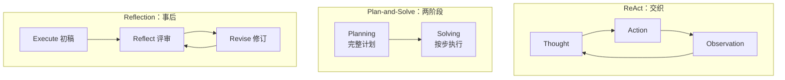
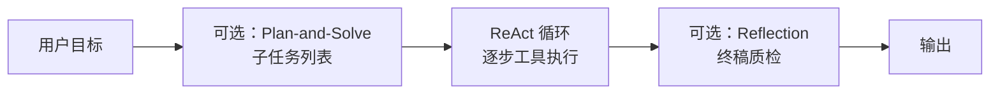
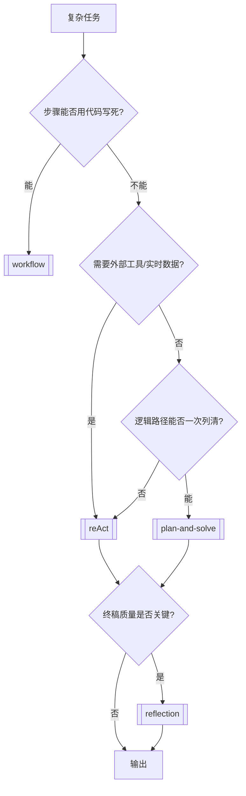

---
tags:
  - pattern
  - index
aliases:
  - Agent Paradigms
  - 智能体范式
  - 经典范式
  - 范式选型
prerequisites:
  - "[[agent]]"
  - "[[llm]]"
related:
  - "[[reAct]]"
  - "[[plan-and-solve]]"
  - "[[planning]]"
  - "[[reflection]]"
  - "[[chain-of-thought]]"
  - "[[workflow]]"
  - "[[tool-use]]"
  - "[[harness-engineering]]"
stability: long
layer: application
updated: 2026-06-14
---

# 智能体经典范式（Agent Paradigms）

> [!tip] 核心本质
> 经典 Agent 范式回答同一件事：**思考（Reason）与行动（Act）如何组织**。ReAct 把二者**交织**在每一步（边想边做、靠 Observation 纠错）；Plan-and-Solve **先**产出完整计划再逐步执行（结构稳、路径可审计）；Reflection 在初稿完成后做**事后**评审与修订（用 token 换质量）。三者不是互斥框架，而是可组合的循环片段；选型取决于任务是否需要外部工具、计划能否事先写死、以及结果质量相对实时性的权重。

适合已读 [[agent]]、要在 ReAct / Plan-and-Solve / Reflection 之间做架构决策的读者。读完 [[#2 三范式对照|§2]] 能按场景选型；[[#3 组合架构|§3]] 说明常见混合栈；动手教程可外链 [Hello Agents 第四章](https://datawhalechina.github.io/hello-agents/#/./chapter4/%E7%AC%AC%E5%9B%9B%E7%AB%A0%20%E6%99%BA%E8%83%BD%E4%BD%93%E7%BB%8F%E5%85%B8%E8%8C%83%E5%BC%8F%E6%9E%84%E5%BB%BA)。

*检索说明：三范式分工对照 [ReAct (Yao et al. 2022)](https://arxiv.org/abs/2210.03629)、[Plan-and-Solve (Wang et al. 2023)](https://arxiv.org/abs/2305.04091)、[Reflexion (Shinn et al. 2023)](https://arxiv.org/abs/2303.11366) 与 Hello Agents ch4（观测 2026-06-14）。*

## 生命周期与演进

**当前定位**：Agent 入门与产品设计的**选型索引**；各范式机制分别在 [[reAct]]、[[plan-and-solve]]、[[reflection]] 展开。工业界常见「Plan → ReAct 执行 → Reflect 润色」混合栈。

**预期寿命**：长期。控制流形态会演进（原生 function calling、Reasoning 模型），但「交织 / 先谋后动 / 事后校正」三种组织方式仍覆盖绝大多数 Runtime 设计。

**近期演进**：Reasoning 模型内化部分规划与自检，外显范式步骤变薄；Harness 层（[[harness-engineering]]）承担解析、步数上限与工具白名单。

**终极威胁**：单次超长推理 + 强工具生态使外显循环变少；可审计、权限边界与成本上限仍要求保留可读的范式产物。

## 1 思考与行动：三种组织方式

| 维度 | [[reAct]] | [[plan-and-solve]] | [[reflection]] |
| --- | --- | --- | --- |
| **思考与行动** | 每步交织 | 先全量思考（计划），再分步行动 | 先完成一轮执行，再思考质量 |
| **新信息来源** | 每轮 **Observation**（工具/环境） | 多为参数内推理；可叠加工具 | 主要靠已有 context；缺事实应回到 ReAct/检索 |
| **纠错时机** | 边做边改 | 计划阶段一次纠错；执行中需**重规划**才灵活 | 产出后迭代修正 |
| **论文锚点** | Yao et al. 2022 | Wang et al. 2023 | Shinn et al. Reflexion；工程上常指 Generate→Reflect→Revise |

与 [[chain-of-thought]] 的关系：CoT 是**单轮**外化推理，不与外部工具交替——属于「纯思考」；ReAct 在 CoT 式 Reason 上增加 Act+Observe。详见 [[chain-of-thought#与 ReAct、Plan-and-Solve 的分工|chain-of-thought §与 ReAct]]。

## 2 三范式对照

**表 1 — 选型速查（任务需求 → 范式）**

| 范式 | 核心思路 | 更适合 | 优势 | 局限 |
| --- | --- | --- | --- | --- |
| **ReAct** | 思考-行动-观察循环 | 需搜索/API、路径不确定、要试错 | 适应性强、可解释、动态纠错 | 多轮成本高；易循环；缺全局蓝图 |
| **Plan-and-Solve** | 先规划，后执行 | 逻辑链清晰、多步推理、数学/报告结构 | 稳定、可审计、状态好管理 | 静态计划怕意外；需重规划才灵活 |
| **Reflection** | 执行→反思→优化 | 代码/报告质量要求高、可离线打磨 | 显著提升终稿质量 | 延迟与 token 陡增；不能补外部新事实 |

**表 2 — 场景举例**

| 任务 | 推荐范式 | 理由 |
| --- | --- | --- |
| 查「华为最新机型」并总结 | ReAct | 需实时搜索 Observation |
| 水果店三天销量应用题 | Plan-and-Solve | 步骤可事先列清，无外部工具 |
| 素数筛法代码优化 | Reflection | 功能正确后做算法层迭代 |
| 北京→上海机票+酒店+租车 | **Plan + ReAct** | 先列子任务，每子任务 ReAct 查价预订 |
| 客服退款（查单+政策+发邮件） | **ReAct + Reflect** | 工具拿事实；低置信时 Reflect 审慎复核 |

与 [[workflow]]：步骤能由**代码**完全写死时用 Workflow，不必上 Agent 范式；需要 LLM **当场决定**下一步时才进入上表。

## 3 组合架构

生产系统很少只选一种范式：

| 组合 | 做法 | 典型场景 |
| --- | --- | --- |
| **Plan → ReAct** | Planner 输出步骤；每步用 ReAct 或单次 tool call 完成 | 旅行规划、多数据源调研 |
| **ReAct → Reflect** | 循环结束后对答案/代码做评审修订 | 技术报告、代码生成 |
| **Plan → Solve → Reflect** | 按计划执行纯推理步骤，最后润色 | 数学题 + 书面化解答 |
| **Reflect 挂 ReAct 内** | 某步 Observe 后加短 Reflect，防错误累积 | 长链工具任务 |

Harness 职责（解析 Action、[[function-calling]]、[[tool-use]] 白名单、`max_steps`）见 [[harness-engineering]] 与 [[reAct#输出解析与调试|reAct §输出解析]]。

## 4 选型流程

## 5 常见误区

- **三选一**：Reflection 常叠加在 ReAct 或 Plan-and-Solve 之后，不是替代关系。
- **有框架就不用懂范式**：LangGraph 等是 Harness 实现；选型仍要回到「交织 / 两阶段 / 事后校正」。
- **Plan-and-Solve = Planning 全部**：[[planning]] 是泛化能力；[[plan-and-solve]] 是 Wang et al. 命名的**两阶段静态计划**特例。
- **Reflection 代替 RAG**：反思不能检索训练截止后的新事实，见 [[hallucination]]。

## 要点收束

- 范式差异 = **思考与行动的组织时机**：交织（ReAct）、先谋后动（Plan-and-Solve）、事后校正（Reflection）。
- 有外部工具、路径不确定 → **ReAct**；可分解且逻辑链稳定 → **Plan-and-Solve**；质量优先于延迟 → **Reflection**。
- 旅行预订、客服等真实任务多用 **组合栈**；固定流程用 [[workflow]]。
- 机制细节分别读 [[reAct]]、[[plan-and-solve]]、[[reflection]]；Runtime 工程读 [[harness-engineering]]。

## 进一步阅读

### 库内关联

- [[agent]] — 感知-思考-行动循环与 Runtime
- [[reAct]] — Thought / Action / Observation
- [[plan-and-solve]] — Planner + Executor 两阶段
- [[planning]] — 静态 vs 动态规划泛论
- [[reflection]] — Generate → Reflect → Revise
- [[chain-of-thought]] — 纯思考侧基础
- [[workflow]] — 代码写死控制流时的替代
- [[tool-use]] / [[function-calling]] — ReAct 的 Act 层
- [[hallucination]] — 无 grounding 时的结构性风险

### 外部参考

- [Hello Agents 第四章：智能体经典范式构建](https://datawhalechina.github.io/hello-agents/#/./chapter4/%E7%AC%AC%E5%9B%9B%E7%AB%A0%20%E6%99%BA%E8%83%BD%E4%BD%93%E7%BB%8F%E5%85%B8%E8%8C%83%E5%BC%8F%E6%9E%84%E5%BB%BA) — 从零实现三种范式（教程）
- [ReAct (Yao et al., 2022)](https://arxiv.org/abs/2210.03629)
- [Plan-and-Solve (Wang et al., 2023)](https://arxiv.org/abs/2305.04091)
- [Reflexion (Shinn et al., 2023)](https://arxiv.org/abs/2303.11366)
- [Building effective agents (Anthropic)](https://www.anthropic.com/engineering/building-effective-agents) — Workflow vs Agent 总选型
