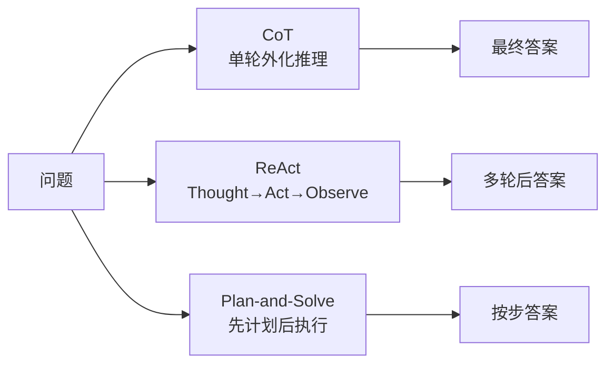

---
tags:
  - pattern
  - technique
aliases:
  - CoT
  - 思维链
  - 链式推理
  - Chain of Thought
prerequisites:
  - "[[llm]]"
  - "[[prompt-engineering]]"
related:
  - "[[planning]]"
  - "[[plan-and-solve]]"
  - "[[agent-paradigms]]"
  - "[[reflection]]"
  - "[[reAct]]"
  - "[[prompt-chaining]]"
  - "[[workflow-patterns]]"
stability: long
layer: application
updated: 2026-06-16
---

# Chain of Thought（思维链）

> [!tip] 核心本质
> **思维链（Chain of Thought，CoT）** 是在给出最终答案**之前**，把中间推理步骤写进 context 的提示技巧——每一步成为下一步 token 预测的可见上文，减少「一步跳结论」的算术与逻辑错误。大语言模型（LLM）本质是逐 token 自回归；若不在复杂推理任务上强制分步，模型会在单次预测里压缩中间步骤，错误往往在最终答案才暴露。CoT 不调用工具、不持久化跨轮状态，属于 [[agent-paradigms]] 里「纯思考」侧的基础能力；[[reAct]]、[[plan-and-solve]]、[[reflection]] 在其上叠加行动、计划或事后校正。

适合已读 [[llm]]、要在单轮复杂推导与 Agent 范式之间划界的读者。读完 [[#2 机制：为何外化推理有效|§2]] 能解释 CoT 为何有效；[[#1 与 ReAct、Plan-and-Solve 的边界|§1]] 与 [[#6 Reasoning 模型时代的取舍|§6]] 分别回答「和 Agent 范式怎么分」「还要不要手写 CoT」。变体深潜（树状推理 ToT 等）见延伸阅读。

*检索说明：Few-shot / Zero-shot CoT 与局限对照 [Wei et al. 2022](https://arxiv.org/abs/2201.11903)、[Kojima et al. 2022](https://arxiv.org/abs/2205.11916)、[Wang et al. 2023 Self-consistency](https://arxiv.org/abs/2203.11171)；Reasoning 模型与显式 CoT 关系见 [OpenAI Reasoning best practices](https://developers.openai.com/api/docs/guides/reasoning-best-practices)（观测 2026-06-16）。*

## 生命周期与演进

**当前定位**：提示工程与 Agent 规划的基础技巧；Zero-shot / Few-shot CoT、Self-consistency、[[plan-and-solve]]、[[reAct]] 均由此延伸。Wei et al.（2022）在 PaLM 等**大模型**上展示：few-shot 示例里把答案改成逐步推理链，算术与符号推理准确率显著跃升——能力随规模「涌现」，小模型收益有限。

**预期寿命**：长期。推理专用模型把部分 CoT **内化**为隐藏思考链，显式 CoT 在简单题上收益下降；但可审计、可约束步骤格式、需向用户展示推导过程的场景仍需要外显链。

**近期演进**：与 thinking budget、工具交替（ReAct）、[[prompt-chaining]] 多轮链组合；生产侧更关注 token 成本、步骤可控性与 Self-consistency 的采样开销。

**终极威胁**：默认内建强推理后，手写「一步步思考」变成冗余甚至有害（见 [[#6 Reasoning 模型时代的取舍|§6]]）；合规与调试场景仍保留外显中间步骤。

## 1 与 ReAct、Plan-and-Solve 的边界

CoT 解决的是**单轮内跳步推理**；不引入工具 Observation，也不维护「第几步未完成」的跨步状态机。

| | **CoT** | [[reAct]] | [[plan-and-solve]] |
| --- | --- | --- | --- |
| **外化什么** | 纯文本推理链 | 推理 + 工具行动 + 环境反馈 | 先完整计划，再按步执行 |
| **新信息从哪来** | 仅已有 context | 每轮 Observation | 计划 + 每步执行结果 |
| **典型形态** | 单轮「让我一步步思考」 | Thought → Action → Observe 循环 | Planner → Executor 两阶段 |
| **控制流** | 模型自生成步骤 | Harness 驱动多轮 | 计划结构由 Planner 定稿（默认可静态） |

[[workflow-patterns]] 里的 Prompt Chaining 是**多轮 API 调用**、顺序由代码预定；CoT 常在**同一轮**生成内完成推理。Zero-shot CoT（「Let's think step by step」）仍易漏步、算错；Wang et al.（2023）的 [[plan-and-solve]] 在其上增加显式计划阶段。三范式组合选型见 [[agent-paradigms]]。

## 2 机制：为何外化推理有效

算术题「小明有 5 个苹果，给出 2 个，又买 3 个，还剩几个？」若直接要答案，模型常在**一次**前向传播里隐式完成 \(5-2+3\)，中间量不可见，错在最终数字才暴露。

CoT 把子步骤写成可见 token 序列：先写「剩 \(5-2=3\)」，再写「共 \(3+3=6\)」。每一步成为下一步的条件分布输入——错误有机会在链中被后续步骤「拉回」，而不是只在结尾显现。这与 [[llm]] 的自回归机制一致：不是证明模型在「真正推理」，而是**把多步推导拆成多步预测**，降低单步负担。

**表 1 — 有 CoT vs 无 CoT（同一道题）**

| 路径 | 生成形态 | 典型失败 |
| --- | --- | --- |
| **无 CoT** | 问题 → 直接「6 个」 | 跳步、进位或传递关系算错 |
| **有 CoT** | 问题 → 步骤 1 → 步骤 2 → 结论 | 某步仍可能错，但中间可人工或程序抽检 |

CoT **减少的是推理跳步错误**，不能消除事实幻觉：前提知识错了，链再清晰也错。也不保证路径正确——论文明确路径可通向正确或错误答案。

## 3 Zero-shot、Few-shot 与 Self-consistency

三种用法按**准备成本**与**可控性**递增。

### 3.1 Zero-shot CoT

Kojima et al.（2022）发现：在问题后追加 *Let's think step by step*（或中文「让我一步步思考」）即可在**无示范**时激发逐步推理，算术与常识推理上相对普通 zero-shot 大幅提升。

- **优点**：零标注、即插即用
- **缺点**：步骤格式与粒度不受控；复杂题仍易漏步（催生 [[plan-and-solve]]）

### 3.2 Few-shot CoT

Wei et al.（2022）在 few-shot 示例里把「问题 → 最终答案」改成「问题 → **完整推理链** → 答案」。模型从示例模仿推理风格与颗粒度。

- **优点**：可精确控制步骤写法、单位、是否先列已知条件
- **缺点**：占 context；示例与真实题分布不一致时可能负迁移

### 3.3 Self-consistency

Wang et al.（2023）在 CoT 之上换**解码策略**：对同一问题用较高 temperature **采样多条**推理路径，对最终答案做**多数投票**，而非贪心解码单条链。直觉是难题常有多条正确思路，一致终点更可信；GSM8K 等基准上有两位数百分点增益，且可与 Zero-shot CoT 叠加。

**表 2 — 三种 CoT 用法对照**

| 方法 | 额外成本 | 可控性 | 典型场景 |
| --- | --- | --- | --- |
| Zero-shot CoT | 极低 | 低 | 日常复杂问答、快速试验 |
| Few-shot CoT | 示例 token | 高 | 固定格式报告、领域推理模板 |
| Self-consistency | 多次采样 × 链长 | 中（答案层） | 高价值单题、可承受延迟 |

## 4 变体谱系（简表）

CoT 家族向「更多路径」与「与行动交织」延伸；深度机制另文展开，此处只标位置。

| 变体 | 做法 | 与基础 CoT 的关系 |
| --- | --- | --- |
| **Self-consistency** | 多路径采样 + 投票 | 解码层增强 |
| **Tree of Thoughts（ToT）** | 分支探索 + 评估选优 | 搜索层增强 |
| **[[plan-and-solve]]** | 先计划再逐步解 | 针对 Zero-shot CoT 漏步 |
| **[[reAct]]** | Reason 与 Act 交替 | CoT 式 Reason + 工具 Observation |

## 5 适用与不适用

**更适合**：

- 多步算术、比例与单位换算
- 演绎逻辑、约束满足（先列已知再推导）
- 代码 Debug（假设 → 验证 → 修正）
- 需向用户展示推导过程的合规场景

**慎用或不必用**：

- 单步事实检索（「法国首都是哪」——直接答更省）
- 创意写作（长链干扰节奏）
- 单标签分类（情感极性等一步可决任务）
- 已用 **Reasoning 模型**且任务不需要可审计外显链（见 [[#6 Reasoning 模型时代的取舍|§6]]）

冗长链不等于高质量：错误步骤也会拉长；关键是**步骤正确**与**格式可解析**，不是 token 越多越好。

## 6 Reasoning 模型时代的取舍

OpenAI o 系列等**推理模型**在训练中已内化链式思考：模型在回答前生成隐藏 reasoning token，用户常只看到摘要或最终答案。[官方建议](https://developers.openai.com/api/docs/guides/reasoning-best-practices)明确：对这类模型再追加「think step by step」**通常无益，有时有害**——与内部推理重复或引入冗余指令。

经验法则：

| 模型类型 | 显式 CoT 提示 | 更应关注 |
| --- | --- | --- |
| 常规模型（GPT-4o、开源 Instruct 等） | 复杂单轮推理仍有效 | 示例质量、Self-consistency、与工具链组合 |
| 推理模型（o1/o3、DeepSeek-R1 类等） | 优先简洁直接指令 | 任务约束、输出格式、reasoning token 成本上限 |

外显 CoT 在 Agent 里仍有价值：**Planner 产出可审批的计划**、**向用户展示分析思路**、**与程序 gate 对齐的结构化步骤**——即使底座模型已会「内部想」，产品层仍可能要可读 artifact。这与「还要不要在 prompt 末尾加魔法句」是两层问题。

## 7 常见误区

- **CoT 万能**：简单任务加 CoT 浪费 token，还可能过度思考反而错。
- **链越长越好**：冗链增加幻觉与成本；应对齐任务所需粒度。
- **CoT 治幻觉**：只缓解跳步；事实错误需检索、工具或 [[reflection]]。
- **只有一句触发词**：「请列出已知条件再推导」「系统地分析」等同族，效果取决于任务与模型。
- **CoT 仅限数学题**：法律要件分析、商业多因素权衡等同属多步推导。

## 要点收束

- CoT = 在最终答案前外化中间推理步骤，利用自回归「上一步可见」降低跳步错误。
- Zero-shot 最便宜；Few-shot 控格式；Self-consistency 用多路径投票换稳定性。
- 单轮纯思考，不与工具交替；多轮需 [[reAct]]，先蓝图需 [[plan-and-solve]]。
- 推理模型内化思考后，手写 CoT 提示收益下降；可审计外显链仍有产品价值。
- 不保证正确路径、不消除事实幻觉；复杂 Agent 选型见 [[agent-paradigms]]。

## 进一步阅读

### 库内

- [[prompt-engineering]] — CoT 在提示工程中的位置
- [[llm]] — 自回归与 token 预测机制
- [[agent-paradigms]] — CoT 与 ReAct / Plan-and-Solve / Reflection 组合
- [[plan-and-solve]] — 针对 Zero-shot CoT 漏步的两阶段改进
- [[planning]] — 任务分解与跨步状态
- [[reAct]] — CoT 式 Reason + 工具 Act
- [[reflection]] — 生成后再用推理链检验答案
- [[prompt-chaining]] — 多轮调用 vs 单轮 CoT
- [[workflow-patterns]] — 编排层五模式索引

### 论文与官方

- [Chain-of-Thought Prompting (Wei et al., 2022)](https://arxiv.org/abs/2201.11903) — Few-shot CoT 原始论文
- [Large Language Models are Zero-Shot Reasoners (Kojima et al., 2022)](https://arxiv.org/abs/2205.11916) — Zero-shot CoT
- [Self-Consistency (Wang et al., 2023)](https://arxiv.org/abs/2203.11171) — 多路径投票解码
- [Tree of Thoughts (Yao et al., 2023)](https://arxiv.org/abs/2305.10601) — 树状推理搜索
- [ReAct (Yao et al., 2022)](https://arxiv.org/abs/2210.03629) — 推理与行动交织
- [OpenAI — Reasoning best practices](https://developers.openai.com/api/docs/guides/reasoning-best-practices) — 推理模型上避免冗余 CoT 提示
