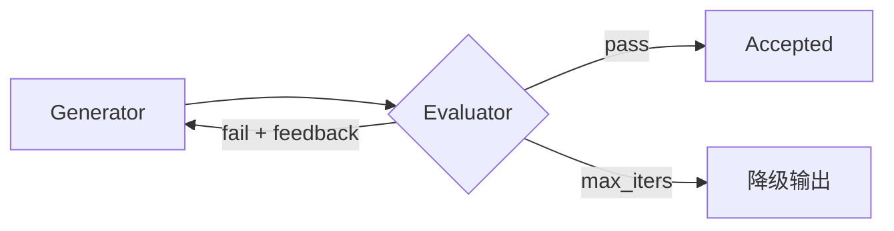

---
tags:
  - pattern
  - workflow
aliases:
  - Evaluator-Optimizer
  - 评估器-优化器
  - Generator-Evaluator Loop
prerequisites:
  - "[[workflow]]"
  - "[[workflow-patterns]]"
  - "[[reflection]]"
related:
  - "[[llm-as-judge]]"
  - "[[agent-evaluation]]"
  - "[[langgraph]]"
  - "[[building-effective-agents]]"
stability: long
layer: application
updated: 2026-06-15
---

# Evaluator-Optimizer（评估器-优化器）

> [!tip] 核心本质
> **Evaluator-Optimizer** 是 Workflow 五模式之一：**Generator** 产出草稿，**Evaluator** 按**可表述标准**打分或给可执行反馈，未达标则**带反馈再生成**，直到 pass 或达轮次上限。控制流在代码的 `while` / 条件边里，不是 [[agent]] 自决。与 [[reflection]] 同属「生成→批评→修订」，但 Evaluator-Optimizer 强调**双角色分离**、**机器可读判据**（schema/enum/rubric），适合文学翻译、合规文案、多轮检索完整性等「人类审稿能明显改好」的任务。

Anthropic 判据：若人类能 articulating feedback 且 LLM 能模拟该 feedback，则 fit 此模式。

*检索说明：定义与 when-to-use/avoid 对照 [Anthropic: Building effective agents][bea]（2024-12-19）；与 [[reflection]] 分工经库内交叉核对（观测 2026-06-15）。*

[bea]: https://www.anthropic.com/engineering/building-effective-agents

## 生命周期与演进

**当前定位**：[[workflow-patterns]] 五模式专文；LangGraph 教程常作条件边循环示例。

**预期寿命**：长期。有 rubric 的质量任务都会保留「写→审」环。

**近期演进**：Evaluator 用 structured output（Pydantic/JSON）；Generator 与 Evaluator 用不同模型；工具结果（test/lint）作硬 Evaluator。

**终极威胁**：单次生成已达标 → 纯 token 浪费；判据主观模糊 → Evaluator 幻觉反馈。

## 1 何时使用 / 避免

| 适合 | 避免 |
| --- | --- |
| 判据清晰（法条、品牌 tone、测试用例） | 实时低延迟（聊天首 token） |
| 迭代能 measurably 提升质量 | 首次输出已够用 |
| 人类审稿流程可类比 | 判据主观且无法 rubric 化 |
| 多轮搜索/分析直到「够全」 | 有确定性算法解 |

Anthropic 例：文学翻译 nuance；复杂搜索 Evaluator 决定是否继续搜。

## 2 与 Reflection 的分工

| | [[reflection]] | **Evaluator-Optimizer** |
| --- | --- | --- |
| 视角 | Agent **行为模式**（范式） | **Workflow 编排**（五模式之一） |
| 角色 | 常同模型换 prompt | **显式 Generator / Evaluator 两路** |
| 判据 | 可模糊（「有何问题」） | 强调 **rubric + pass/fail** |
| 实现 | ReAct 后可选节点 | 固定循环直到 accept |

二者可组合：Workflow 层 Evaluator-Optimizer，Agent 内某步用 Reflection。

## 3 机制



**四组件**：

1. **Generator** — 任务 + 上轮 feedback → 新草稿
2. **Evaluator** — 对照 rubric；输出 `grade` + **可执行**修改建议（非重写全文）
3. **Loop 控制** — max_iters（通常 2–4）；防 infinite loop
4. **降级** — 超限返回 best-so-far 或简化答案

Evaluator prompt 须约束：**只评不改**（避免 Evaluator 偷偷生成最终稿）。

## 4 实现要点

1. **Rubric 机器可读** — enum、`score` 阈值、checklist JSON
2. **反馈要 actionable** — 「第二段缺少免责条款」优于「不够好」
3. **分离模型/prompt** — Evaluator 用更严 system；可小模型评大模型稿
4. **硬 Evaluator** — 单元测试、JSON schema、[[structured-json-output]] 校验与 LLM Evaluator 并联
5. **可观测** — 每轮 grade、feedback 入 trace（[[langsmith]]、[[agent-evaluation]]）

[[langgraph]]：

```text
generate → evaluate → conditional_edges(route)
  Accepted → END
  Rejected → generate
```

## 5 与评测栈

- 离线：Evaluator rubric 即 [[agent-evaluation]] 子集
- Judge：Evaluator 是 **in-loop** 的 [[llm-as-judge]]；dataset eval 是 **out-of-loop** 回归
- 设计重点：**invest in evaluation criteria**，而非无限雕 Generator prompt

## 6 常见坑

| 坑 | 后果 |
| --- | --- |
| Evaluator 重写答案 | Generator 学不到、难审计 |
| 无 max_iters | 成本失控 |
| rubric 与业务脱节 | 高分低质 |
| 该 [[routing]] 却 EO | 不同输入类应分 handler 再各自 EO |
| 忽略工具验证 | LLM 互评自嗨 |

## 要点收束

- Evaluator-Optimizer = Generator + Evaluator 循环至 pass；代码持环。
- 要清晰 rubric + 可执行 feedback + 轮次上限 + 降级。
- 与 [[reflection]] 互补：Workflow 编排 vs Agent 范式。
- 硬判据（test/schema）与 LLM Evaluator 并联最稳。

## 进一步阅读

### 库内

- [[workflow-patterns]] — 五模式总览
- [[reflection]] — 反思范式
- [[llm-as-judge]] — Judge rubric 设计
- [[langgraph]] — 条件边实现

### 外部

- [Building effective agents — Evaluator-optimizer][bea]
