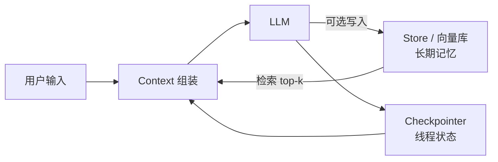

---
tags:
  - technique
aliases:
  - 记忆
  - agent memory
  - 长期记忆
  - 短期记忆
prerequisites:
  - "[[llm]]"
  - "[[context-window]]"
related:
  - "[[agent]]"
  - "[[context-window]]"
  - "[[rag]]"
  - "[[llm]]"
  - "[[skill]]"
  - "[[agent-context-stack]]"
  - "[[langgraph]]"
  - "[[context-engineering]]"
  - "[[agentmemory]]"
  - "[[memgpt]]"
  - "[[mem0]]"
  - "[[honcho]]"
  - "[[memx]]"
stability: long
layer: application
updated: 2026-06-14
---

# Memory（记忆）

> [!tip] 核心本质
> **Memory** 是对「[[llm|大语言模型]] 无状态」的补偿：推理时权重固定，API 调用之间不持有状态，跨会话信息必须由 Agent **运行时在外部**管理——写什么、何时写、何时忘、冲突信谁，都是工程决策。没有 Memory，Agent 每次对话都是失忆新手；设计不当则比没有更危险：过期或冲突记忆会让 Agent 在错误前提上行动。

适合已读 [[llm]]、[[context-window]]，要设计或评审 Agent **跨轮状态**的读者。读完 [[#2 记忆放在哪：CoALA 三分法|§2]] 能复述 CoALA 三分法并判断该用哪类载体；[[#5 记忆操作链|§5]] 能决策写入路径与遗忘策略。若只做会话内续跑，[[#3 运行时架构：Checkpointer 与 Store|§3]] 与 §2 即可停；跨会话个性化与治理须读到 §5–§7。产品实现见 `latest/`（[[agentmemory]]、[[memgpt]]、[[mem0]] 等）。

*检索说明：CoALA [arXiv:2309.02427](https://arxiv.org/abs/2309.02427)；MemGPT [arXiv:2310.08560](https://arxiv.org/abs/2310.08560)；LangMem [概念指南](https://github.com/langchain-ai/langmem/blob/main/docs/docs/concepts/conceptual_guide.md)、[SDK 发布说明](https://www.langchain.com/blog/langmem-sdk-launch)；OpenAI [Dreaming / Memory](https://openai.com/index/chatgpt-memory-dreaming/)、[个性化控制](https://openai.com/index/memory-and-new-controls-for-chatgpt/)（观测 2026-06-14）。*

## 生命周期与演进

**当前定位**：Agent **基础范式组件**（long）。机制成熟（向量检索、KV、摘要、分页），争议在**治理**：选择性写入、冲突、隐私与评测。

**预期寿命**：长期。只要 LLM 保持无状态推理，外部 Memory 就不会消失；工程上并非单线「换代」，而是**并存光谱**——按场景在 KV、向量、摘要、分层分页、后台巩固之间选型与组合。

**近期演进**（多轨并行，非先后替代）：
- **框架工具链轨**（如 LangMem，2025）：语义 / 情节 / 程序性记忆；**热路径** `manage/search` 工具与 **后台** `memory_manager` 提取合并并存；原生挂 [[langgraph]] **Store**（[概念指南](https://github.com/langchain-ai/langmem/blob/main/docs/docs/concepts/conceptual_guide.md)）。
- **消费产品轨**（如 ChatGPT Memory）：**Saved memories**（显式）+ **Chat history 引用** + **Dreaming** 后台合成用户画像；2026 年 **Dreaming V3** 强调跨会话异步合成与时序过期（如行程从「将要去」改为「已去过」）（[OpenAI Dreaming](https://openai.com/index/chatgpt-memory-dreaming/)）。
- **编码 Agent 轨**：[[agentmemory]]、[[memx]] 等 Hook/MCP + 混合检索；[[memgpt]] / [[honcho]] 强调分页或 peer 表征——与产品轨解法不同，但同属「外部持久 + 选择性注入」光谱上的不同落点。

**终极威胁**：单次 context 极长时，**当次会话**对外部 Memory 依赖下降；**跨会话、多用户、可审计**场景仍须外部层。产品侧「全历史注入」带来噪声与隐私成本，不等于可替代治理良好的 External Memory。

## 1 问题语境：无状态逼出外部记忆

[[llm]] 是纯函数：给定输入返回输出，调用间无状态。聊天产品里「它记得刚才说的话」是应用层把历史消息打进 [[context-window]]，不是权重里长了新突触。

没有 Memory 的典型失败：

- **偏好消失** — 上次说用 Obsidian，下次又推荐 Notion。
- **进度断档** — 长任务跨会话，不知做到哪一步。
- **重复犯错** — 某工具上次失败，无记录则再踩坑。
- **无法积累** — 同类任务做多次仍像新手。

## 2 记忆放在哪：CoALA 三分法

评审 Agent 记忆方案时，第一个问题往往是「这条信息该放哪」——塞进 prompt、落外部库，还是指望模型权重？先对齐物理位置与生命周期，再谈写入策略，否则后续选型会反复打架。

[CoALA（2023）](https://arxiv.org/abs/2309.02427) 把 Agent 记忆分为三类；下表按**载体、寿命、典型内容**对照，供设计前快速归类。

**表 3：CoALA 记忆三分法对照**

| 类型 | 物理位置 | 生命周期 | 典型内容 |
| --- | --- | --- | --- |
| **In-context（上下文）** | [[context-window]] | 当次会话 | 对话历史、tool result、[[rag]] 注入块 |
| **External（外部）** | 向量库 / KV / 关系库 / 文件 | 可配置持久 | 用户偏好、任务进度、对话摘要 |
| **Parametric（参数）** | 模型权重 | 随模型版本 | 预训练知识、微调技能 |

**表 3 结论**：跨会话、运行时可读写的个体化事实归 **External**；当次推理可见的一切（含从 Store 检索进来的块）归 **In-context**；推理时只读的预训练与微调知识归 **Parametric**——本文主讨论 External。

**关键区分**：

- In-context **不是**「短期记忆」的全部——RAG 块、从 Store 检索进的记忆条目都在 context 里，**来源**不同。
- Parametric 推理时**只读**；微调是写入参数记忆的唯一常规路径，代价高、难细粒度撤销。
- **本文主讨论 External**——运行时可读写的存储；与 [[rag]] 的边界见 [[#7 与 RAG、Skill 的分工|§7]]。

CoALA 三分法回答「放哪类载体」；落地到 LangMem 等框架时，还要区分**记的是事实、经历还是做事规程**——类型不同，检索方式与过期策略也不同。

LangMem 在应用层细分为 **语义（semantic）**、**情节（episodic）**、**程序性（procedural）** 记忆（[概念指南](https://github.com/langchain-ai/langmem/blob/main/docs/docs/concepts/conceptual_guide.md)）；下表把三类与常见存储形态对齐。

**表 4：LangMem 记忆类型与载体对照**

| LangMem 类型 | 存什么 | 典型载体 |
| --- | --- | --- |
| Semantic | 事实、偏好、知识三元组 | Collection（可语义搜）或 Profile（按用户/schema） |
| Episodic | 过去经历、对话摘要、few-shot 范例 | Collection |
| Procedural | 行为规则、风格、怎么做任务 | 多写在 **prompt / [[skill]]**，也可 Collection |

**表 4 结论**：语义与情节宜进可检索的 Collection/Profile；程序性优先落在 **prompt / [[skill]]**，避免与个体化事实混库导致检索噪声。

## 3 运行时架构：Checkpointer 与 Store

用户关掉页面再回来，Agent 要能续跑上次对话——这是**会话内**状态；同时「偏好深色模式」要在**新会话**里仍可用——这是**跨会话**记忆。在 [[langgraph]] 栈里，两件事由不同持久层承担，混用会导致「能续跑但记不住人」或「记得人但图状态丢了」。

两层分工如下（[Persistence 文档](https://docs.langchain.com/oss/python/langgraph/persistence)）：

**表 5：Checkpointer 与 Store 对照**

| 机制 | 持久什么 | 作用域 | 典型用途 |
| --- | --- | --- | --- |
| **Checkpointer** | 图状态快照 | **单 thread（会话）** | 对话续跑、HITL、故障恢复 |
| **Store** | 应用自定义键值/文档 | **可跨 thread** | 用户偏好、长期事实、LangMem 记忆条目 |

**表 5 结论**：**Memory 范式**多指 **Store + 检索注入**；Checkpointer 管「这条图跑到哪了」，不替代「用户喜欢深色模式」这类跨会话事实——选型与权限模型须分开设计。

**图 1：运行时 Memory 与 Checkpointer 分工** — 单轮请求里，线程快照与长期记忆各走一路，在 context 组装处汇合后再进模型。



读者应带走：**Checkpointer 续跑本会话图状态，Store 供跨会话读写**；长期事实经检索注入 context，而非与对话历史混为一谈。

## 4 External Memory 存储形态

选型前先问：这条信息要靠**精确键**找回，还是靠**语义相似**召回？要保留审计级细节，还是可压缩摘要？下表按存取机制对照——实践中常组合使用，而非四选一。

**表 1：External Memory 存储形态对照**

| 形式 | 存取 | 适合 | 不适合 |
| --- | --- | --- | --- |
| **键值（KV）** | 精确键 O(1) | `user_language: zh-CN`、检查点 JSON | 模糊语义问句 |
| **向量库** | 语义相似度 | 「用户提过用 GitLab」 | 必须精确键的场景 |
| **摘要条目** | 压缩后注入 | 长对话精华 | 细节不可丢的审计 |
| **关系/图库** | 结构化遍历 | 实体关系、知识图谱 | 纯语义模糊召回 |

**表 1 结论**：没有万能载体——任务状态偏 KV，模糊偏好偏向量，长史偏摘要，实体关系偏图库；组合时须约定每类信息的**主键与过期策略**，否则检索阶段无法判断信谁。

实践常 **组合**：KV 存任务状态，向量存语义记忆，摘要压历史；检索实现可与 [[rag]] 共用嵌入与 [[ann]]，但**用途**不同（见 [[#7 何时需要外部 Memory|§7]]）。

## 5 记忆操作链

本节是**范式总览**：回答「写 → 检索 → 遗忘 → 合并」四步在 Agent Memory 里**各解决什么问题、如何选型**。机制、公式与可运行 demo 应像 [[retrieval-pipeline]] 一样**拆到专文**再链回——Memory 检索可复用 RAG 算法节点，但须叠加个体化过滤、importance 与 namespace 隔离；遗忘与合并则缺独立专文与 demo（见下表「缺口」）。

**表 9：记忆操作链 — 技术分解与专文索引**

| 环节 | 核心问题 | 库内专文（已有） | 缺口（建议新建） |
| --- | --- | --- | --- |
| **写入** | 何时写、谁写、写前校验 | [[memgpt]]、[[mem0]]、[[memx]]（`latest/`）；LangMem 见 §8.3 | `memory-write-path`：热路径 / 后台 / 事件驱动选型与噪声控制 |
| **检索** | 有限 token 内召回相关记忆 | [[retrieval-pipeline]]、[[bm25]]、[[ann]]、[[rrf]]、[[rerank]]、[[fts5]]、[[query-transformation]] | `memory-retrieval`：Memory 语境下的混合召回、时间/importance 加权、namespace 过滤；附最小 Python demo |
| **遗忘** | 降权 / 删除 / 版本替代 | §5.3、[[llm-wiki-overview]]（supersession） | `memory-forget`：TTL、指数衰减、显式删除（GDPR）、supersede 状态机；附 cron / 写入钩子 demo |
| **合并** | 碎片压条、对齐、冲突信谁 | [[conflict-resolution]]、[[knowledge-fusion]]（实体对齐）、[[knowledge-extraction]] | `memory-consolidation`：摘要压缩、语义去重、**归一化**（schema/实体表述）、**对齐**（同指检测）、supersede；**消融**评测（合并前后 recall@k / 冲突率） |

**表 9 结论**：检索子问题不要重造轮子——链 [[retrieval-pipeline]] 与 `algorithms/`；遗忘与合并是 Memory 治理的主缺口，宜各写一篇带 demo 的专文，再由本篇 §5 只做索引与选型。

### 5.1 写入路径：热路径与后台巩固

用户刚说完「周报用正式语气」，若等会话结束才入库，下一轮已可能按默认风格起草——**写入时机**决定记忆是「跟得上对话」还是「事后补课」。直觉上：对话中立刻落盘响应快但易脏写；会话后批量提取更干净但有延迟。形式化后，完整操作链为 **写入 → 检索 → 遗忘 → 合并**，工程难点在 **何时写、谁写**。

三条写入路径在延迟与噪声之间取舍不同；下表按时机对照代表实现。

**表 2：记忆写入路径对照**

| 路径 | 时机 | 代表 | 权衡 |
| --- | --- | --- | --- |
| **热路径（hot path）** | 对话进行中 | LangMem `create_manage_memory_tool`；模型主动 `remember` | 低延迟个性化；易噪声，需工具策略 |
| **后台（background）** | 会话结束 / 定时 | LangMem `create_memory_manager`；OpenAI **Dreaming**；[[memx]] Hook 编译 | 可做多轮提取合并；延迟、需异步管线 |
| **事件驱动** | 任务完成 / 报错 | 检查点 `status: in_progress` → `done` | 状态干净；中断时可能缺进度 |

**表 2 结论**：关键状态宜事件驱动校验后写入；可容忍噪声的偏好可热路径；长史与画像宜后台巩固。三者可并存，但须避免同一条事实被多路径重复写入且无合并策略。

OpenAI 产品层拆分（[Help Center](https://help.openai.com/en/articles/11146739-how-does-reference-saved-memories-work)）：

- **Saved memories** — 用户明确要求「记住」；持久直到删除。
- **Reference chat history** — 从过往对话**推断**偏好；会随模型判断变化，**不等同**永久事实。
- **Dreaming** — 后台跨会话合成画像，可**重写过期**条目（[Dreaming 博文](https://openai.com/index/chatgpt-memory-dreaming/)）。

工程建议：**关键状态事件驱动 + 偏好可热路径 + 历史后台摘要**；写入前校验完整性，避免把未验证的「执行中」写成「已完成」。

### 5.2 检索（Query）

新会话开头，用户问「按我平时的习惯写周报」——若运行时把 Store 里上千条记忆全塞进 [[context-window]]，预算瞬间耗尽且噪声淹没信号。检索的任务是：**在有限 token 内召回与当前意图最相关的子集**。全链路分阶段、消融与生产选型见 [[retrieval-pipeline]]；Memory 与 RAG 共用底层算法，但须额外约定 namespace、过期与 importance（表 9）。

机制上，查询先经路由（语义向量、精确键或混合），再按相似度、时间与重要性排序截断 top-k，最后带来源标注注入 context，让模型能判断条目是否仍可信。

常见召回策略如下（算法专文见第二列）：

- **语义相似度** — [[ann]] + [[embedding]] + [[cosine-similarity]]；LangMem / [[mem0]] 默认路径。
- **关键词 / 稀疏** — [[bm25]] 或 [[fts5]]（会话级、单机）；与向量互补，融合见 [[rrf]]。
- **精排** — [[cross-encoder]] / [[rerank]]，修正粗排「词像义偏」；见 [[retrieval-pipeline#第四阶段：精排（Rerank）]]。
- **精确键** — KV / Store `get`。
- **查询改写** — [[query-transformation]]（指代消解、多查询扩展）。
- **时间过滤** — 优先近 N 天，防过期干扰。
- **重要性 / 强度** — LangMem 强调相似度 + importance + 近期使用频率（[概念指南](https://github.com/langchain-ai/langmem/blob/main/docs/docs/concepts/conceptual_guide.md)）。

注入时**标注来源与时间**，让模型能判断可信度；与 [[context-engineering]] 的预算管理一致。最小混合检索 demo 见 [[retrieval-pipeline#第三阶段：融合（RRF）]] 与 [[bm25#最小 Python 示例（rank_bm25）]]；Memory 专文 `memory-retrieval`（待建）应在此基础上加 `user_id` 过滤与 TTL 门控。

### 5.3 遗忘（Forget）

三个月前用户说「下周去东京」，行程早已结束——若该条仍参与语义检索，模型可能继续按「即将出行」给建议。遗忘不是「删掉所有历史」，而是**在写入量持续增长时，主动降低过期或低价值条目的召回权重**，否则检索 top-k 会被旧事实占满。这一风险在**长期运行、只增不减、且依赖语义召回**的 Store 上最明显；短会话或纯 KV 精确读取、且键随任务结束删除时，压力小得多。

按场景可选策略：

- **TTL** — 偏好 30/90 天；任务结束删进度键。
- **衰减** — 长期未访问降权或归档。
- **显式删除** — 用户「忘掉这条」；存有个体可识别信息的合规场景须支持按请求彻底删除（**删除权**，GDPR Right to erasure）。
- **版本替换** — 同一事实更新时，新条成为**活跃版本**，旧条标为**已替代**（supersede）并退出默认检索，旧版归档可审计（对齐 [[llm-wiki-overview]] v2 的 supersession 思想）。

遗忘策略的状态机与定时任务 demo 见专文 `memory-forget`（待建）；评测宜做单策略**消融**（只开 TTL / 只开衰减 / 全开），指标可参考 [[mrr-ndcg]] 与 [[agent-evaluation]]。

### 5.4 合并（Consolidate）

热路径与后台若各自写入，Store 里会出现多条表述同一偏好的碎片，甚至新旧矛盾——检索时模型不知信谁。合并是在**写入侧或后台任务**里把多条记录压成更少、更一致的条目：摘要丢掉冗余细节，去重合并近义表述。**同一事实互斥**时须先定**信谁**规则：无业务优先级则**较新写入覆盖较旧**（按 `updated_at` 等时间戳），有则按**显式优先级**（如用户点「记住」> 模型后台推断）；败者标为**已替代**（supersede），退出默认检索、可归档审计，避免新旧两条并列被 top-k 同时召回。MemGPT 的 **working memory ↔ archival** 分页（[MemGPT 论文](https://arxiv.org/abs/2310.08560)）是经典隐喻——活跃上下文与冷存储互换；[[memgpt]] 产品化实现见 `latest/`。

典型合并手段：**摘要压缩**、**语义去重**、**schema 归一化**（同一字段口径）、**实体对齐**（判断两条是否同指，见 [[knowledge-fusion]] §实体对齐）、**冲突消解**（见 [[conflict-resolution]]）。合并管线 demo 与合并前后**消融**（冲突条数、检索 precision）见专文 `memory-consolidation`（待建）。

## 6 程序性 vs 陈述性 vs RAG

团队常把「用户上周说的偏好」「产品文档 chunk」「写周报的 SOP」都塞进同一向量库——检索时三类信号纠缠，模型不知按规程还是按个人习惯行事。边界不清是 Memory 治理失败的高频根因；先按**内容性质**与**变更节奏**分栏，再谈共用嵌入与 ANN。

**表 6：陈述性记忆与程序性记忆分工**

| | 陈述性（含 episodic） | 程序性 |
| --- | --- | --- |
| 内容 | 事实、偏好、历史、状态 | 怎么做某类任务的 SOP |
| 载体 | External Memory、[[rag]] chunk | [[skill]]（`SKILL.md`） |
| 加载 | 检索后注入 | Discovery → Activation |

**表 6 结论**：Memory 存**个体化、常变**事实；Skill 存**稳定规程**。勿用 Memory 存完整 SOP（与 Skill 冲突），勿用 Skill 存频繁更新的运行状态。见 [[agent-context-stack]]。

陈述性内部还要再切一刀：**知识库策划的静态文档**与**运行时沉淀的个体记忆**常共用向量检索，但治理责任不同——下表对照 [[rag]] 与 Memory。

**表 7：[[rag]] 与 Memory 边界对照**

| | [[rag]] | Memory |
| --- | --- | --- |
| 来源 | 人事先策划的知识库 | 运行时产生或感知的信息 |
| 变更频率 | 相对静态 | 动态、个体化 |
| 底层 | 常共用向量检索 | 常共用向量检索 |

**表 7 结论**：底层可共用嵌入与 [[ann]]，但 **RAG 管集体知识、Memory 管个体状态**；混库时须在 namespace、过期策略与注入标注上隔离，否则静态文档噪声会淹没个性化信号。

## 7 何时需要外部 Memory

**需要**：跨会话任务进度；个人助手偏好；多 [[agent]] / [[multi-agent]] 共享状态；从成败中积累策略。

**可弱化**：一次性任务；会话内 context 已够且无需跨用户持久；临时对话（ChatGPT **Temporary Chat** 模式——不读不写记忆）。

## 8 工程片段

> 以下为**契约示意**（写入字段、TTL、LangMem 接入）；分环节可运行 demo（BM25+向量+RRF、衰减 cron、合并去重）见表 9 专文，检索侧可直接对照 [[retrieval-pipeline]]、[[bm25]]。

### 8.1 偏好：显式写入 + 带时间检索

```
# 会话 1
用户：周报先结论后数据，语气正式。
Runtime → memory.write("report_style", {...}, ttl=90d)

# 会话 2（一周后）
Runtime → memory.query("周报") → 注入「偏好（7 天前）：…」
```

### 8.2 长任务检查点（KV + 向量摘要）

```python
memory.write("competitive_analysis", {
    "total": 100,
    "completed": 35,
    "last_url": "https://example.com/product/35",
    "findings_vector_id": "vec_xxx",
    "status": "in_progress",  # 仅验证后改为 completed
    "written_at": "2026-06-14T10:00:00Z",
})
```

### 8.3 LangMem + LangGraph Store（示意）

```python
from langgraph.prebuilt import create_react_agent
from langgraph.store.memory import InMemoryStore
from langmem import create_manage_memory_tool, create_search_memory_tool

store = InMemoryStore()
agent = create_react_agent(
    "anthropic:claude-3-5-sonnet-latest",
    tools=[
        create_manage_memory_tool(namespace=("memories", "{user_id}")),
        create_search_memory_tool(namespace=("memories", "{user_id}")),
    ],
    store=store,
)
```

生产将 `InMemoryStore` 换为 `PostgresStore` 等；namespace 隔离多用户（[langmem README](https://github.com/langchain-ai/langmem)）。

## 9 坑与反模式

上线 Memory 后，用户反馈「它怎么又忘了」或「它怎么还在提三个月前的行程」——往往不是模型变笨，而是**写入过宽、遗忘缺失、或与 context 冲突未消解**。评审或排障时，可对照下列反模式：是否把会话全量入库、是否只增不减、关键状态是否在未验证时标为完成、多租户是否共用 namespace。

**表 8：Memory 常见反模式与对策**

| 反模式 | 危险 | 对策 |
| --- | --- | --- |
| 全量对话入库 | 噪声淹没信号 | 选择性写入 + 后台摘要 |
| 只增不减 | 过期干扰；成本高 | TTL、衰减、supersede |
| 未验证写「已完成」 | 错误前提执行 | 关键状态事件驱动 + 校验 |
| context 与 Memory 旧版冲突 | 不知信谁 | 注入带来源、时间、优先级 |
| 多用户不隔离 namespace | 泄露 | 强制 `user_id` / ACL |
| 以为 Memory 提升推理能力 | 只扩 context，不改模型 | 边界写清 |
| 把「参考全历史」当精确记忆 | OpenAI chat history 非永久 | 重要事实用显式 saved memory 或自建 KV |

**表 8 结论**：多数事故可归入「写太滥、忘太慢、冲突不标注、租户不隔离」四类；对策与 §5 操作链（选择性写入、遗忘、合并、注入带来源）一一对应，落地时宜做成可观测指标而非事后口头约定。

## 要点收束

- Memory 补偿 **LLM 无状态**；CoALA：**In-context / External / Parametric**，本文聚焦 External。
- **Checkpointer**（线程图状态）≠ **Store**（跨会话长期记忆）；见 [[langgraph]]。
- 操作链：**写（热路径/后台）→ 检索 → 遗忘 → 合并**；OpenAI Dreaming 代表后台合成 + 时序更新。
- 与 [[rag]]（静态知识库）、[[skill]]（程序性）三分工。
- 产品实现分散在 `latest/`：[[agentmemory]]、[[memgpt]]、[[mem0]]、[[honcho]]、[[memx]]；框架侧见 LangMem + LangGraph Store。

## 进一步阅读

### 库内关联

- [[agent]] — Memory 在 Agent 三大组件中的位置
- [[context-window]] — In-context 载体；长度限制催生 External
- [[context-engineering]] — 检索结果如何进 context、预算控制
- [[rag]] — 与 Memory 共用检索、不同用途
- [[skill]] / [[agent-context-stack]] — 程序性 vs 陈述性分工
- [[langgraph]] — Checkpointer vs Store
- [[retrieval-pipeline]] — Memory 检索可复用的全链路（BM25、向量、RRF、Rerank、消融表）
- [[bm25]] / [[ann]] / [[rrf]] / [[rerank]] — 检索子算法与 demo
- [[conflict-resolution]] — 多源记忆冲突
- [[knowledge-fusion]] — 实体对齐、多源融合（合并子问题）
- [[knowledge-extraction]] — 写入前原子断言与溯源
- [[skill-loading-library]] — 库漂移与记忆治理类比
- [[llm-wiki-overview]] — supersession、置信度（v2 模式）

### 产品实现（`latest/`）

- [[agentmemory]] — MCP + Hook 编码 Agent 记忆
- [[memgpt]] — 分页记忆与 Letta Runtime
- [[mem0]] — 可插拔记忆 API
- [[honcho]] — Peer 表征与 Dreaming 式巩固
- [[memx]] — 三层 lineage + 原生 Hook

### 外部参考

- [CoALA (2023)](https://arxiv.org/abs/2309.02427) — 三类记忆架构
- [MemGPT (2023)](https://arxiv.org/abs/2310.08560) — working / archival 分页
- [LangMem 概念指南](https://github.com/langchain-ai/langmem/blob/main/docs/docs/concepts/conceptual_guide.md) — 语义/情节/程序性；写入策略
- [LangMem SDK 发布](https://www.langchain.com/blog/langmem-sdk-launch)
- [OpenAI — Dreaming](https://openai.com/index/chatgpt-memory-dreaming/) — 后台记忆合成
- [OpenAI — Memory 控制](https://openai.com/index/memory-and-new-controls-for-chatgpt/) — Saved vs chat history
- [LangGraph Persistence](https://docs.langchain.com/oss/python/langgraph/persistence) — Store vs checkpointer
