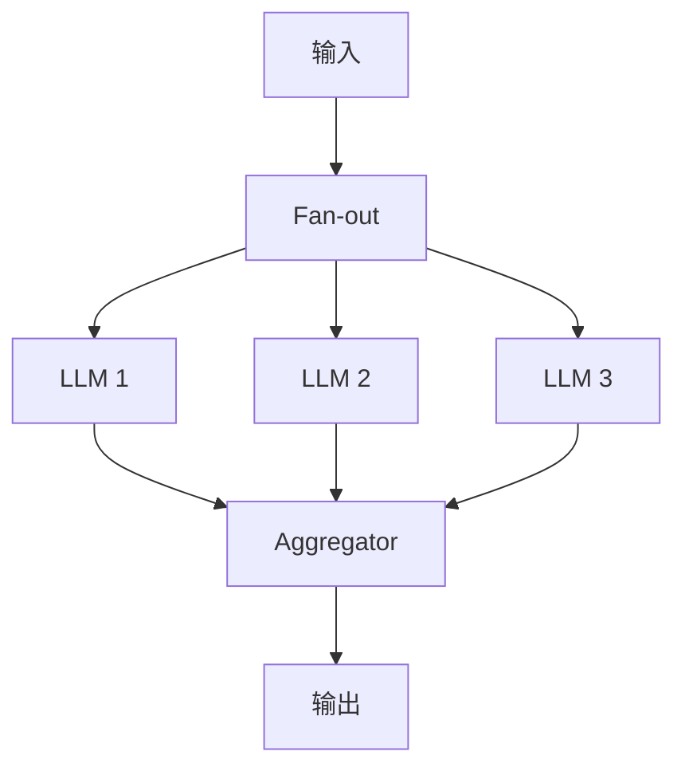

---
tags:
  - pattern
  - workflow
aliases:
  - Parallelization
  - 并行化
  - Sectioning
  - Voting
prerequisites:
  - "[[workflow]]"
  - "[[workflow-patterns]]"
related:
  - "[[prompt-chaining]]"
  - "[[multi-agent]]"
  - "[[langgraph]]"
  - "[[building-effective-agents]]"
stability: long
layer: application
updated: 2026-06-15
---

# Parallelization（并行化）

> [!tip] 核心本质
> **Parallelization** 让多个 **互不依赖** 的 LLM 调用**同时**执行，再**程序聚合**结果——Anthropic 分 **Sectioning**（拆子任务并行）与 **Voting**（同任务多路采样/多 prompt 投票）。控制流仍是 Workflow：fan-out/fan-in 由代码调度，不是 [[agent]] 自派。换 wall-clock 延迟（≈最慢一路）换专精或多视角置信度；**子任务有依赖则禁止并行**。

Guardrail（一路生成、一路审核）、多维度 eval、代码多 reviewer 是 canonical 用例。

*检索说明：Sectioning/Voting 定义与 when-to-use/avoid 对照 [Anthropic: Building effective agents][bea]（2024-12-19）；与 [[workflow-patterns]] 索引交叉核对（观测 2026-06-15）。*

[bea]: https://www.anthropic.com/engineering/building-effective-agents

## 生命周期与演进

**当前定位**：[[workflow-patterns]] 五模式最后一篇专文；与 [[multi-agent]] 并行 Worker 易混但控制流归属不同。

**预期寿命**：长期。`Promise.all` / LangGraph Send 只是语法，fan-out 模式稳定。

**近期演进**：结构化输出（JSON schema）作 Aggregator 输入；guardrail 与主回复并行成标配。

**终极威胁**：强模型单次多维度自检；仍有 latency 与专精分工场景。

## 1 两种变体

| 变体 | 做什么 | 典型场景 |
| --- | --- | --- |
| **Sectioning** | 大任务拆**独立**子任务，各一路 LLM | 内容生成 ∥ 安全审核；eval 各评一维 |
| **Voting** | **同一任务**多 prompt/多采样，再投票/合并 | 代码漏洞多 reviewer；敏感内容多阈值投票 |

Sectioning 求**专精**；Voting 求**置信度**与降 bias。

## 2 何时使用 / 避免

| 适合 | 避免 |
| --- | --- |
| 子任务图无依赖边 | B 依赖 A 的输出 |
| 要降 latency（并行 vs 串行求和） | 必须严格顺序的操作 |
| 要多视角 / 共识 | 写共享状态无冲突策略 |
| 各维可分开评 | 聚合逻辑比收益还复杂 |

与 [[prompt-chaining]]：链是**序**；并行是**宽**。与 Orchestrator-Workers：后者**动态**拆任务；Parallelization 子任务通常**预先已知**。

## 3 机制

**Aggregator 策略**：

- **合并** — 拼接各维 findings（代码 review 报告）
- **投票** — k-of-n 触发 flag（2/3 reviewer 报漏洞）
- **择优** — 选 judge 最高分（Voting 变体）
- **阻塞** — 任一路 guardrail fail → 丢弃主输出

用 [[structured-json-output]] 让 Aggregator **可编程**（`verdict` + `confidence`），避免解析 prose。

## 4 实现要点

1. **独立性校验** — 设计时画 DAG；有边则串行或 [[prompt-chaining]]
2. **Straggler** — wall-clock = max(各路)；设 timeout 与 partial aggregate
3. **成本** — N 路 = N 倍 token（Voting 尤甚）；与延迟 trade-off
4. **归因** — 合并时保留来源（哪路 flag）供审计
5. **[[langgraph]]** — `Send` API / 多节点同层；checkpointer 注意并发写 state

Guardrail 模式：`Promise.all([generate(), screen()])` → screen fail 则拒答。

## 5 与 Multi-Agent 边界

| | **Parallelization** | [[multi-agent]] 并行 Worker |
| --- | --- | --- |
| 控制流 | Workflow 代码 fan-out | 可有 Agent 自协调 |
| 子任务 | 通常预定 | 可运行时派生 |
| 状态 | 少共享；聚合只读各路输出 | 常写共享 store |

Orchestrator **动态**拆活 → Workers；Parallelization **静态**拆活 → 并行。

## 6 常见坑

| 坑 | 后果 |
| --- | --- |
| 并行有依赖 | 错结果 / race |
| 无聚合规范 | 多路 prose 难合并 |
| Voting 无阈值 | 全 flag 或全漏 |
| 与 [[routing]] 混淆 | 应先路由再各支内并行 |
| 共享 DB 并发写 | 需事务或单写者 |

## 要点收束

- Parallelization = Sectioning 或 Voting + Aggregator；子任务须独立。
- 换并行降延迟或多视角；Aggregator 宜 structured output。
- 五模式专文齐备；详见 [[workflow-patterns]]。
- 有依赖 → 链或 Orchestrator，勿硬并行。

## 进一步阅读

### 库内

- [[workflow-patterns]] — 五模式总览
- [[prompt-chaining]] — 串行对比
- [[evaluator-optimizer]] — 迭代环 vs 并行 fan-out
- [[langgraph]] — Send / 并行节点

### 外部

- [Building effective agents — Parallelization][bea]
