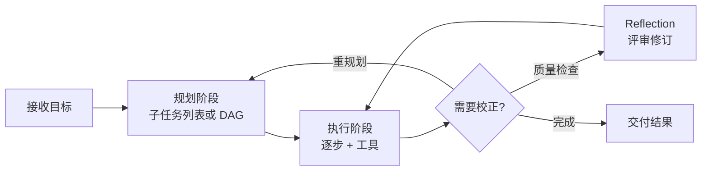

---
tags:
  - pattern
aliases:
  - Planning
  - 规划模式
  - 任务规划
prerequisites:
  - "[[llm]]"
  - "[[chain-of-thought]]"
related:
  - "[[agent]]"
  - "[[tool-use]]"
  - "[[reflection]]"
  - "[[multi-agent]]"
  - "[[chain-of-thought]]"
  - "[[reAct]]"
  - "[[plan-and-solve]]"
  - "[[agent-paradigms]]"
  - "[[workflow]]"
  - "[[harness-engineering]]"
stability: long
layer: application
updated: 2026-06-15
---

# Planning（规划模式）

> [!tip] 核心本质
> Planning 让智能体（Agent）在执行复杂目标前，先把任务拆解成有序子任务并跟踪进度，而不是在单轮生成里「一口吞掉」整个目标。没有规划，大语言模型（LLM）容易遗漏步骤、前后脱节，或在某步卡住时失去全局视角；规划解决的是**方向与顺序**，与执行后的质量检查、工具落地互补——三者组合才构成可落地的 Agent。显式推理依赖思维链（Chain of Thought）；最常见的动态实现是推理与行动交替（ReAct）——先画地图再出发，遇到岔路再更新地图。

适合已读 [[agent]]、要在「要不要外显计划」「静态清单还是边走边改」之间做决策的读者。读完 [[#2 规划在 Agent 循环中的位置|§2]] 能说明 Planning 在循环中的位置：[[#2.1 Planning、Tool Use 与 Reflection 的分工|§2.1]] 对照 Tool Use 与 Reflection 的分工，[[#2.2 Planning 与 CoT、Workflow、Reflection 的层级与边界|§2.2]] 厘清与 CoT、Workflow 的层级与边界；[[#3 静态规划、动态重规划与按需规划|§3]] 以对照表为路线图，经 [[#3.1 静态规划|§3.1]]–[[#3.3 按需规划|§3.3]] 各述一种策略的选型条件，[[#3.4 「何时规划」：不是越多越好|§3.4]] 讨论规划频率；[[#4 工程选型与 Harness 形态|§4]] 给出可审计性与灵活性的落地取舍。机制细节分别在 [[plan-and-solve]]、[[reAct]]、[[agent-paradigms]] 展开。

*检索说明：静态两阶段对照 [Plan-and-Solve (Wang et al. 2023)](https://arxiv.org/abs/2305.04091)、动态交织对照 [ReAct (Yao et al. 2022)](https://arxiv.org/abs/2210.03629)、按需规划频率见 [Learning When to Plan (Paglieri et al., ICML 2025)](https://arxiv.org/abs/2509.03581)（观测 2026-06-15）。*

## 生命周期与演进

**当前定位**：Agent 四大设计模式之一，已内置于 Cursor、Claude Code、LangGraph 等产品的「先 plan 再 act」流程；静态计划清单与 ReAct 式动态重规划并存，工程上按可审计性 vs 灵活性选型。

**预期寿命**：长期。只要复杂任务仍需要多步工具调用与中间状态，「先分解再执行」就不会被单次超长推理完全取代。

**近期演进**：推理（Reasoning）模型减少无效规划轮次；人机协同里「计划待用户批准再执行」成为常见 Harness 模式；与 [[multi-agent|Multi-Agent]] 结合时，规划层负责子任务分配而非单 Agent 包办；研究侧开始显式建模「何时值得花 token 做规划」而非固定每步都 plan。

**终极威胁**：模型在一次调用内稳定完成更长工具链时，外显 Planning 步骤会变薄；但合规审计、成本上限与「计划可回放」仍要求 Runtime 保留可读的规划产物，不会归零。

## 1 没有规划时，复杂任务在哪一环断链

把「分析这份财报并给出投资建议」直接丢给 LLM 一次生成，常见三类失败：

- **漏步**：跳过读原始数据或行业对比，直接给结论。
- **脱节**：前几段算出的指标与后面建议用的数字不一致。
- **局部最优**：卡在某一步（如 API 404）反复重试，不知道整体还剩什么、能否跳过。

这不能单靠「模型不够聪明」来解释——**缺少可追踪的子目标结构**，长链任务的工作记忆在 context 里漂移。Planning 在第一轮执行前（或每轮执行前）产出**子任务列表或 DAG**，把「现在要完成哪一块、完成后还剩什么」外化到可读的 artifact 或 state 字段里。

§1 的三类失败可串成一条机制链：无显式规划时，跨步锚点缺失，工作记忆随 context 漂移，表现为漏步或在未就绪时错序调用工具；Planning 把子目标与顺序外化到可追踪的 artifact，让 Runtime 知道「当前该做哪一步、还剩什么」。这一补救**仅在任务跨多步且须全局跟踪进度时成立**——单步可完成的目标不必强行 plan。若分支与顺序已由 [[workflow]] 写死，缺 Planning 不会必然导致错序；此时链式断点常落在**路径依赖实时 Observation** 或执行边缺少 replan 入口，应优先加固 Workflow 而非叠加 Planner。

五步竞品调研若未外显规划：Agent 可能在未读完竞品数据时就调用「写报告」工具——单步调用成功，却与整体顺序无关。随后 context 里只剩零散 Observation，缺少「第几步未完成」的跨步锚点，前段指标与后段建议开始脱节。卡在 API 404 时，Agent 不知道剩余里程碑，只能在错误步骤上空转重试。这三段正是 §1 三类失败在同一任务上的连续断点——Planning 缺的并非 Tool Use 能力，而是「当前该做哪一步」的外化状态。

## 2 规划在 Agent 循环中的位置

Planning 回答 **做什么、什么顺序**；它发生在**执行前**（或执行间隙的**重规划**），与执行后的 [[reflection|Reflection]]（做得好不好）不可混谈。

**图 1 — 典型「规划 → 执行 → 可选校正」流水线**

要把 §1 里的「漏步、脱节」落到 Runtime，须先看清循环里三类职责各自产出什么——与 [[tool-use|Tool Use]]、[[reflection|Reflection]] 的分工见 [[#2.1 Planning、Tool Use 与 Reflection 的分工|§2.1]]，与 CoT、[[workflow|Workflow]] 的层级与边界见 [[#2.2 Planning 与 CoT、Workflow、Reflection 的层级与边界|§2.2]]。

**表 1 — Agent 循环中 Planning、Execution 与 Reflection 的分工**

| 环节 | 产出什么 | 典型负责方 |
| --- | --- | --- |
| **Planning** | 子任务序列、依赖、成功条件 | LLM（Planner 角色）或 Harness 模板 |
| **Execution** | 每步工具结果、中间 state | LLM + [[tool-use|Tool Use]]，Harness 执行与写回 |
| **Reflection** | 对已完成输出的评审与修订 | 独立 Reflect 轮次或 [[reflection]] 循环 |

单次迭代可读成：**先定路线 → 逐步落地 → 必要时校正质量**。静态两阶段范例见 [[plan-and-solve]]；动态交织见 [[reAct]]；三范式总览见 [[agent-paradigms]]。

### 2.1 Planning、Tool Use 与 Reflection 的分工

想象一个五步调研任务：Agent 还没读完竞品数据就去调「写报告」工具——调用本身成功，却与整体顺序无关。根因往往不是 Tool Use 失灵，而是**缺少跨步的「当前该做哪一步」**这一层外化状态。

一句话：**Planning 定路线，Tool Use 跑单步，Reflection 查成品**——三者回答的问题不同，常串联而非互替。

形式化分工如下。**Tool Use** 回答「这一步能不能在外部系统里做到」（读文件、调 API、跑命令）。**Planning** 回答「总共分几步、当前该做哪一步」——**仅当任务需跨多步且顺序须全局跟踪时**才成立；若步骤已由 [[workflow]] 写死或目标单步可完成，缺 Planning 并不会必然导致 Tool Use 浪费，此时应优先 Workflow 而非强行加 Planner。**Reflection** 回答「已产出的答案是否达标、哪里要改」，发生在一段执行之后，不替代事先的路线。上文的**表 1** 把三者在 Agent 循环中的产出与负责方并列，便于对照 §1 的失败模式：漏步与错序多因缺 Planning，而非 Tool Use 或 Reflection 失灵。

三者常串联：先 plan → 逐步 ReAct 执行 → 末段 reflect 润色；Harness 负责把各阶段产物写进 state，便于回放与人工审批（见 [[harness-engineering]]）。

### 2.2 Planning 与 CoT、Workflow、Reflection 的层级与边界

Planning 常与思维链（Chain of Thought）、[[workflow|Workflow]]、Reflection 组合，但四者不在同一粒度——须先看清层级，再读下表解释 §1 里「漏步、脱节」究竟缺的是哪一种机制。

从粒度看，四机制呈层级而非简单并列：**CoT**（[[chain-of-thought]]）在同一轮内做显式推理，不持久化跨步状态；**Planning** 在其上外化「总共几步、当前第几步」，供 Runtime 跟踪全局进度；**Workflow** 在更外层把分支与顺序钉死在代码或产品配置里，Planning 只在步骤无法预先写死时才必要。**Reflection** 发生在一段执行之后，不在此层级链上替代路线制定。

**表 2 — Planning 与 CoT、Workflow、Reflection 的边界**

| 机制 | 回答什么 | 成立条件 / 不适用 |
| --- | --- | --- |
| **Planning** | 总共分几步、当前该做哪一步 | 跨多步且须全局跟踪进度；单步可完成或顺序已由代码写死时不必要 |
| **CoT**（[[chain-of-thought]]） | 本步如何推理、如何分解 | 单轮内显式推理；不持久化「第几步未完成」等跨步状态 |
| **Workflow** | 控制流由谁、按何顺序执行 | 分支与顺序可由产品或代码钉死；路径依赖实时 Observation 时易断链 |
| **Reflection** | 已产出是否达标、哪里要改 | 一段执行之后的质量检查；不替代事先的路线 |

表 2 的 takeaway：漏步、脱节多因缺 Planning 或误用 Workflow；单轮推理断链应补 CoT 而非强行加长计划；成品质量问题交给 Reflection，不要在规划阶段重复质检。

Planning 的非目标也须明确：它不负责单步推理的质量（那是 CoT）、不负责工具调用的成败（那是 Tool Use），也不负责成品是否达标（那是 Reflection）。若顺序已由 Workflow 写死，强行叠加 Planner 只会增加 token 与不确定性——此时应加固 Workflow 或 replan 入口，而非在规划阶段重复质检或重写控制流。

## 3 静态规划、动态重规划与按需规划

选定 Planning 之后，下一道抉择是**计划何时生成、何时改写**：一次性写全清单、每步边走边改，还是只在关键节点再 plan？三种策略在可审计性、灵活性与 token 成本上此消彼长，宜先对照再落到 Harness。

**三种规划策略对照 — 静态、动态与按需**

| 策略 | 做法 | 优点 | 缺点 |
| --- | --- | --- | --- |
| **静态规划** | 一次性生成完整计划，再按序执行 | 清晰、可审计、易做人工审批 | 执行中遇意外需额外**重规划**机制 |
| **动态规划** | 每步执行后根据观察决定下一步 | 灵活应对工具失败、新信息 | 多轮 token，路径难预测，易缺全局蓝图 |
| **按需规划** | 仅在里程碑、失败或不确定性高时再 plan | 平衡成本与长程稳定性 | 需 Harness 或训练策略决定「何时 plan」 |

**静态**适合路径可预期、需人工审批的场景；**动态**适合工具反馈不确定的路径；**按需**则在长程任务上平衡前两者的 token 与稳定性。以下 [[#3.1 静态规划|§3.1]]–[[#3.3 按需规划|§3.3]] 各述一种策略的选型条件与要点；[[#3.4 「何时规划」：不是越多越好|§3.4]] 与 [[#4 工程选型与 Harness 形态|§4]] 分别讨论「何时 plan」与 Harness 落地。

### 3.1 静态规划

**规划频率决策**：在第一次工具调用前，里程碑集合与依赖关系是否已足够稳定、且 stakeholders 需要一份可入库的完整路线图？若答案是「是」，选**静态**——规划频率定为「入口一次、执行期不改」，把 planning token 摊销到后续 N 步，用单次 artifact 换跨步锚点与审批窗口。若执行中 Observation 会系统性改写子目标顺序（而非偶发失败），静态频率本身就不成立，应降级为按需或动态，而非事后硬补 replan。

**Planning lens takeaway**：静态不是「计划写得长」，而是把 planning **从循环里摘出来**——频率上等于 batch commit；代价是执行期默认冻结路线，Harness 必须为「计划与观测矛盾」预留显式 replan 边，否则频率选择就锁死在死清单上。两阶段实现见 [[plan-and-solve]]。

### 3.2 动态重规划

**规划频率决策**：下一步该锁定的子目标，是否**必须**等当前步 Observation 落地后才能定？若不确定性主要来自外部反馈（API 试探、搜索结果、环境状态），选**动态**——规划频率与执行步长对齐，每轮执行后重新回答「还剩什么、下一步做什么」，用持续改道换路径敏感。若任务其实只需偶发全局校正、多数步序在入口即可枚举，把频率拉到「每步都 plan」会重复支付 planning 成本且稀释全局里程碑；此时应改按需或静态+局部执行，而非默认全动态。

**Planning lens takeaway**：动态把 planning 嵌入**执行节拍**——频率上接近「每 Observation 一次局部承诺」，买的是改道速度，卖的是可审计的全局蓝图；工程上须用步数上限、重复 action 检测或前置短 plan 约束频率，否则 planning 成本与路径漂移会同步放大。循环机制见 [[reAct]]。

### 3.3 按需规划

**规划频率决策**：任务够长、够贵，但多数步在**已锁定子目标**内推进时，完整 replan 的边际收益是否低于 token 成本？若「总是 plan」与「从不 plan」都不划算，选**按需**——规划频率由 Harness 事件驱动（里程碑到达、工具失败、计划—观测冲突、模型自报高不确定），只在状态**跃迁**时插入完整或后缀级规划轮次。这与动态每步改道的区别在于：按需是**稀疏的全局/后缀 replan**，动态是**稠密的局部 next-step 决策；二者可叠在同一栈里，但频率旋钮独立。

**Planning lens takeaway**：按需把 planning frequency 从「固定周期」改成「**值得花 token 的时刻**」——长程任务上在稳定段省 planning、在断点处买全局一致性；触发器过松会回到 §1 的漏步与脱节，过紧则退化成动态每步重写。频率量化与训练侧见 [[#3.4 「何时规划」：不是越多越好|§3.4]]；Runtime 触发 pattern 见 [[harness-engineering]]。

### 3.4 「何时规划」：不是越多越好

一支十五步的竞品调研 Agent，若每调一次工具前都重写五页计划：到第十二步时 context 塞满过时计划、token 预算告急，却还没走到「写报告」里程碑——工具在跑，全局进度却丢了。反过来完全不做规划，又会在长链目标上反复漏步。直觉是：**规划频率应匹配任务不确定性**，不是越多越好，也不是越少越好。

Paglieri 等 [*Learning When to Plan*](https://arxiv.org/abs/2509.03581)（ICML 2025）在长程决策 benchmark 上量化了这一权衡：「总是 plan」与「从不 plan」都不如任务相关的**适中规划频率**；该结论来自特定评测设定，**不是**对 Cursor / LangGraph 式工具 Harness 的直接配置指南。

工程上与之**方向一致**、但须在各自任务上自行验证的做法是：**触发式重规划**——工具失败、Observation 与当前计划明显矛盾、到达里程碑或步数阈值时再 plan，而不是机械每轮产出一份完整新计划。

## 4 工程选型与 Harness 形态

### 4.1 可审计性 vs 灵活性

上线前评审会上，产品问「这支研团队接下来要做什么」——若计划只散落在各轮 Thought 里、没有可入库的 artifact，人工无法批准，事后也无法回放决策链。另一种常见翻车是：静态清单已锁死「先调 A API 再汇总」，执行中 A 返回 404，Harness 却没有 replan 入口，Agent 只能在错误步骤上空转，不知能否跳过或改道。

这两条失败分别指向工程选型的双轴拉扯：**可审计性**（计划能否回放、能否人工批准、路径是否可预估）与**灵活性**（工具失败或新 Observation 出现时能否改道）。二者通常此消彼长，很少有一种策略在两轴同时占优。

**表 3 — 策略在可审计性与灵活性上的权衡**

| 策略 | 可审计性 | 灵活性 | Harness 要点 |
| --- | --- | --- | --- |
| **静态 plan artifact**（Plan-and-Solve 式） | 高：完整计划 upfront，易入库与审批 | 低：遇意外须显式 replan | 计划 JSON/Markdown 入库；用户确认后再执行 |
| **动态 ReAct**（可选前置短 plan） | 中：Thought 可读，完整路径难预测 | 高：每步随 Observation 调整 | `max_steps`、重复 action 检测；失败边触发 replan |
| **强 Planner + 弱 Executor** | 高：计划一次生成，执行可分工计费 | 中：失败时仅修订剩余步骤 | 分模型/角色；replan 只改未完成步 |

机制与提示结构见 [[plan-and-solve]]；动态循环见 [[reAct]]。若步骤可由代码完全写死，应直接采用工作流（Workflow）DAG，不在上表 Planning 选型范围内——见 [[workflow]]。

Cursor、Claude Code 等产品的「Plan 模式」本质是：**把规划产物外显给用户**，再进入工具执行——静态 plan artifact 在 Harness 层的工程化，而非新算法。

### 4.2 常见组合栈

「先搜资料再写报告」很少纯静态或纯动态：竞品调研可用固定五步大纲（静态），某家 API 限流时又要改走缓存或换源（动态）。若强行二选一，要么计划太死、遇意外就卡死，要么每步都重画地图、token 与路径都难控。

直觉是：把**顺序相对稳定**的部分交给 Plan artifact，把**单步反馈不确定**的部分交给 ReAct——于是复杂任务常见三类组合栈，而非单选一种范式：

1. **Plan → ReAct 执行**：Planner 产出 3–7 步大纲，Executor 用 ReAct 逐步完成每步（[[agent-paradigms#3 组合架构|agent-paradigms §组合]]）。适合宏观顺序可枚举、单步内又须工具试错的任务；常见翻车是 Planner 把微操作写进清单、Executor 误当脚本逐步照抄，或大纲过粗导致 ReAct 在步间丢失「当前处于第几步」的锚点。
2. **ReAct + 失败 replan**：默认动态；某步 Observation 异常时，插入一轮「修订剩余计划」。适合以探索为主、只需偶发全局校正的长链任务；触发过敏会在局部抖动与完整 replan 之间空转，触发过钝则 Agent 在错误子目标上循环而无法跳出剩余计划。
3. **Multi-Agent 规划层**：规划 Agent 拆分子任务并委派，执行 Agent 各自 ReAct；见 [[multi-agent]]。适合子任务可并行、边界清晰且需分角色计费的场景；某一 Worker 的 Observation 若会改写其他 Worker 已领任务的依赖，而规划层不同步修订分配，就会出现「局部成功、全局脱节」的协调失败。

静态两阶段与 PS 提示见 [[plan-and-solve]]；动态 ReAct 循环与 Observation 注入见 [[reAct]]。

## 5 常见误区

下列误区多源于把 Planning 与 CoT、Workflow、Reflection 当成可互替的「多写几轮推理」——§2.1 与 §2.2 已划清分工与边界；此处收束工程上最常踩的坑。

- **规划越详细越好**：过度细化的计划在真实执行中易失效；保留可调整的粒度，并在 Harness 留 replan 入口。
- **Planning 与 Reflection 是一回事**：Planning 定「做什么、什么顺序」；Reflection 评「做得好不好、要不要改稿」。
- **有 Planning 就不需要 CoT**：规划依赖显式推理；[[chain-of-thought]] 是分解与排序的基础能力，不是可选项。
- **一切任务都先写长计划**：步骤可由 [[workflow]] 写死的任务，用 LLM Planning 只会增加 token 与不确定性。
- **每步都必须外显 plan**：长程任务上「总是 plan」可能降效；应按失败信号与里程碑触发重规划。

## 要点收束

- Planning 外化**子任务与顺序**，解决长链任务中的漏步、脱节与失去全局视角。
- 它在**执行前**（或失败/里程碑时**重规划**），与 Reflection（执行后质检）、Tool Use（单步落地）分工不同、常组合使用。
- **静态**计划利于审计与人工批准；**动态** ReAct 利于不确定路径；**按需**重规划平衡成本与长程表现。
- 步骤可确定的流水线优先 [[workflow]]；需要 LLM 分解时再引入 Planning，并保留 plan artifact 供回放。

## 进一步阅读

### 库内关联

- [[agent-paradigms]] — ReAct / Plan-and-Solve / Reflection 选型与组合栈
- [[plan-and-solve]] — 两阶段 Planner + Executor 与 PS 提示
- [[reAct]] — 动态规划的主流循环实现
- [[agent]] — Planning 在 Agent 谱系与设计模式中的位置
- [[chain-of-thought]] — 显式推理，Planning 的认知基础
- [[reflection]] — 执行后的质量检查，常与 Planning 串联
- [[tool-use]] — 计划各步通常依赖工具落地
- [[multi-agent]] — 规划层上的子任务分配与协作
- [[workflow]] — 控制流由代码写死时的替代选型
- [[harness-engineering]] — 计划批准、state 与 Runtime 分工

### 论文与参考

- [ReAct: Synergizing Reasoning and Acting (Yao et al., 2022)](https://arxiv.org/abs/2210.03629) — Reason + Act 交替，每步 Reason 即局部规划
- [Plan-and-Solve Prompting (Wang et al., 2023)](https://arxiv.org/abs/2305.04091) — 静态两阶段规划的论文锚点
- [Learning When to Plan (Paglieri et al., ICML 2025)](https://arxiv.org/abs/2509.03581) — Crafter（类 Minecraft 网格世界）与 POGS（部分可观测图搜索）等长程 benchmark 上测量规划频率；「适中规划频率」优于 always/never plan；经 SFT + RL 训练按需规划策略，环境设定与训练细节见原文
