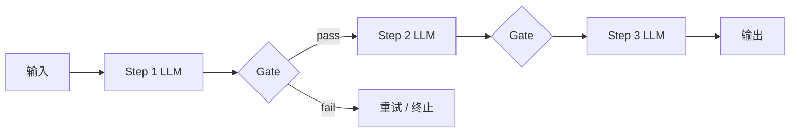

---
tags:
  - pattern
  - workflow
aliases:
  - Prompt Chaining
  - Prompt 链
  - 提示链
prerequisites:
  - "[[workflow]]"
  - "[[workflow-patterns]]"
  - "[[chain-of-thought]]"
related:
  - "[[routing]]"
  - "[[reflection]]"
  - "[[langgraph]]"
  - "[[building-effective-agents]]"
stability: long
layer: application
updated: 2026-06-15
---

# Prompt Chaining（提示链）

> [!tip] 核心本质
> **Prompt Chaining** 把复杂任务拆成**固定顺序**的 LLM 调用链：第 *n* 步的输出作为第 *n+1* 步的输入，中间可插入**程序 gate**（校验、路由、终止）。控制流由**代码预定**，不是 [[agent]] 的模型自决——用**延迟换单步简单**，换每步准确率。Anthropic [Building effective agents][bea] 将其列为 Workflow 五模式之首；与 [[chain-of-thought|CoT]] 不同，链是**多轮 API 调用**而非单次 prompt 内推理。

适合任务可干净分解、且单 prompt 易漏步或混淆的场景。读完能判断何时用链、何时改 [[routing]] 或 [[reAct]]。

*检索说明：定义与 gate 概念对照 [Anthropic: Building effective agents][bea]（2024-12-19）；与 [[workflow-patterns]] 索引交叉核对（观测 2026-06-15）。*

[bea]: https://www.anthropic.com/engineering/building-effective-agents

## 生命周期与演进

**当前定位**：[[workflow-patterns]] 五模式之一的独立 wiki 节点；生产中最常见的基础编排形态。

**预期寿命**：长期。框架（[[langgraph]]、LCEL）只是语法糖，「顺序分解 + gate」不变。

**近期演进**：Sectioning 常与 Parallelization 组合；gate 从 regex 扩展到 schema/LLM 轻量分类。

**终极威胁**：强 reasoning 模型单轮完成短链；长链仍要 gate 与可观测分步。

## 1 何时使用

| 适合 | 不适合 |
| --- | --- |
| 子任务边界清晰、顺序固定 | 步骤数/顺序运行时未知 → [[agent]] / Orchestrator |
| 愿用延迟换每步更简单 | 输入类型差异大 → [[routing]] 先分类 |
| 中间结果需人工或程序审计 | 单步即可（奥卡姆：别链） |

Anthropic 口诀：**能分解且固定 → Chaining**；**分类后不同专精 prompt → Routing**。

## 2 机制

- **分解**：人工或 meta-prompt 列出子任务（大纲 → 段落 → 润色）
- **Handoff**：上步输出结构化（JSON/Markdown 段）供下步消费
- **Gate**：长度、schema、关键词、正则；失败早停比整条链跑错便宜

Gate 是 Chaining 相对裸 CoT 的**工程增量**——错误在中间步被截获。

## 3 与 CoT、Plan-and-Solve

| | CoT | **Prompt Chaining** | [[plan-and-solve\|Plan-and-Solve]] |
| --- | --- | --- | --- |
| 调用次数 | 通常 1 | ≥2，固定序 | 2 段（计划 + 执行） |
| 中间态 | 模型内部 | 显式传递、可 gate | 计划 artifact + 逐步执行 |
| 控制流 | 无程序 gate | **代码 gate** | 执行阶段可工具环 |

Chaining 可与 Plan-and-Solve 嵌套：Planner 一步，Executor 内再链多步。

## 4 实现要点

1. **每步单一职责** — prompt 只问一件事
2. **输出契约** — 下步需要的字段在 system 里声明
3. **可观测** — 每步落 log/trace（[[langsmith]]、[[agent-observability]]）
4. **失败策略** — gate 失败：重试该步、降级模板、或 [[reflection]] 修再入链

[[langgraph]]：`add_edge("step1","step2")` + 条件边作 gate；比裸函数链多了检查点与 HITL。

## 5 典型用例

- 营销：生成大纲 → gate 结构 → 写正文 → gate 事实 → 润色
- 代码：规格 → API 设计 → 实现 → 单测（每步 gate lint/test）
- RAG：query 改写 → 检索 → 答案（后两步常接 [[retrieval-pipeline]]）

## 6 常见坑

| 坑 | 后果 |
| --- | --- |
| 链过长无 gate | 错误传播、成本爆炸 |
| 上步输出非结构化 | 下步 parse 失败 |
| 该 Routing 却硬链 | 一种 prompt 牺牲其他输入类型 |
| 与 Agent 混淆 | 模型又自选下一步，链失效 |

## 要点收束

- Prompt Chaining = 固定序 LLM 链 + 可选程序 gate。
- 换延迟换单步简单；gate 是核心工程习惯。
- 输入需分类 → [[routing]]；步骤动态 → Agent / Orchestrator。
- 实现见 [[workflow-patterns]]、[[langgraph]]。

## 进一步阅读

### 库内

- [[workflow-patterns]] — 五模式总览
- [[workflow]] — Workflow vs Agent
- [[routing]] — 分类后专精（待建时可回索引）
- [[chain-of-thought]] — 单轮推理对比

### 外部

- [Building effective agents — Prompt chaining][bea]
