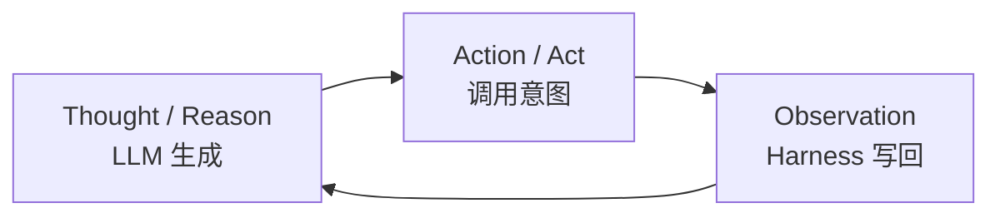

---
tags:
  - pattern
aliases:
  - ReAct
  - react
  - Reason and Act
  - 推理与行动
prerequisites:
  - "[[llm]]"
  - "[[agent]]"
  - "[[tool-use]]"
related:
  - "[[agent]]"
  - "[[tool-use]]"
  - "[[planning]]"
  - "[[plan-and-solve]]"
  - "[[agent-paradigms]]"
  - "[[reflection]]"
  - "[[chain-of-thought]]"
  - "[[function-calling]]"
  - "[[harness-engineering]]"
  - "[[triggering-retrieval]]"
  - "[[workflow]]"
stability: long
layer: application
updated: 2026-06-16
---

# ReAct（推理与行动）

> [!tip] 核心本质
> ReAct（**Re**ason + **Act**）是智能体（Agent）最常用的执行模式：大语言模型（LLM）在每一轮先写出推理（决定下一步意图），再发起行动（通常经工具调用），Harness 把真实环境反馈作为观察（Observe）写回 context，然后进入下一轮。名字里的 Act 不是「模型自己执行」，而是「输出可执行的调用意图」——循环、权限、重试、终止条件都由 Runtime / Harness 维持。若没有 ReAct 式交替，模型只能在训练权重里「空想」外部世界，无法根据搜索结果、命令退出码等新事实修正路线；思维链（Chain-of-Thought）只外化文本推理，ReAct 把推理与对外部系统的探测绑在一起。

适合已读 [[agent]]、[[tool-use]]，要在「单轮思维链」「固定工作流（Workflow）」与「多轮工具交替」之间做选型的读者。读完 [[#核心原理|核心原理]] 应能复述思考→行动→观察各由谁产出、Harness 在何种条件下终止循环；[[#1 没有 ReAct 时哪一环断链|§1]] 与 [[#2 固有局限|§2]] 帮助判断任务是否值得上 ReAct。工程落地从 [[#3 Prompt 与 Harness 落地|§3]] 起，若只需概念决策，读到 [[#要点收束|要点收束]] 即可停。

*检索说明：Thought/Action/Observation 交织与相对纯思维链的收益对照 [ReAct (Yao et al., 2022)](https://arxiv.org/abs/2210.03629)、[项目页](https://react-lm.github.io/)（观测 2026-06-16）。*

## 生命周期与演进

**当前定位**：Yao et al. 2022 提出后，已成为 Agent 教科书的默认循环——「思考 → 行动 → 观察」结构见 [[agent]]。现代产品（Cursor Agent、Claude Code、LangGraph）多在 API 层用函数调用（Function Calling）表达 Act，语义仍是 ReAct，只是 Observation 由 Harness 自动注入为 tool result。

**预期寿命**：长期。只要任务需要多轮、依赖实时外部状态，交替推理与行动就不会被单次超长生成取代。

**近期演进**：并行 tool call（一轮多个 Act）；推理（Reasoning）模型拉长单轮思考，减少无效循环；在 Observe 后挂 [[reflection|Reflection]] 做自检已成常见增强；图形界面 / Computer Use 把 Observation 扩展为截图与文档对象模型（DOM）状态。

**终极威胁**：更强模型缩短所需轮次，或一次调用内完成更多子步骤；但权限边界与可观测性仍要求 Harness 显式记录每轮 Thought/Action/Observation，模式会内化到工程实践而非消失。

## 1 没有 ReAct 时哪一环断链

用户问：「我们仓库里 `auth` 模块的登录接口为什么返回 401？」若只允许模型在单轮里凭训练记忆作答，常见断点不是「不会写代码」，而是**拿不到当前仓库与运行时的真实状态**：

- **幻觉事实**：模型编造文件名、行号或「已修复」的结论，读者无法核对。
- **错误不可恢复**：若它猜 API 路径为 `/api/login`，而实际路由是 `/v2/session`，没有真实 HTTP 响应写回 context，下一轮仍会在错误假设上继续推理。
- **局部打转**：纯文本思维链里可以写「再试一次」，但**没有 Observation 锚定「上一次究竟返回了什么」**，Harness 也无法检测重复失败。

这三段对应同一条机制链：**外部世界的新事实从未进入 context**，推理只在旧 token 上闭合。ReAct 在每一轮 Act 之后由 Harness 注入 Observation（文件内容、命令退出码、检索片段），让下一轮 Thought 建立在可核对证据上——**仅当任务依赖实时、私有或会变化的外部状态时**，这一补救才必要；纯心算或单轮问答不必强行套 Act。

论文在问答与事实核验任务上报告：与仅思维链相比，交替调用维基百科类 API 可缓解幻觉与错误传播[^react-cot]——根因正是 Observation 把生成锚定在外部检索结果，而非模型权重里的静态关联。

## 核心原理

[[agent]] 的感知-思考-行动循环在 ReAct 里被命名并论文化：模式规定**交替什么**；Harness 规定**如何实现**（拼 prompt、解析 tool call、设 `max_steps`、审批）。二者不可混谈。

要把 §1 的断链落到 Runtime，须先看清一轮里三类产物如何衔接，再对照与思维链、规划、工作流的边界。

### 思考-行动-观察为何必须交替

HotpotQA 式多跳问答：只开思维链时，模型常在第二跳「猜」中间实体；交替模式下，Thought 决定检索词，Action 调搜索 API，Observation 返回条目摘要，下一 Thought 才能引用**刚查到**的日期或人名。断点不在「推理不够长」，而在**推理与获取证据未绑在同一循环里**。

一句话：Thought 规划下一步，Action 向外探测，Observation 把探测结果写回——三者必须交替，推理才不会在封闭 context 里空转。

**图 1 — ReAct 单轮与循环**



图 1 的 takeaway：Observation 只来自环境或 Harness，**不是**模型的下一段生成；循环由 Harness 在「无新 Action / 达步数上限 / 声明完成」时打断。

**表 1 — 三阶段分工**

| 阶段 | 谁产生 | 典型内容 |
| --- | --- | --- |
| **Reason** | LLM 生成 | 「需要先查航班」「上一步 API 404，应改查备用源」 |
| **Act** | LLM 输出意图，Harness 执行 | `web_search(...)`、`read_file(...)` |
| **Observe** | 环境 / Harness 写回 | 搜索结果、文件内容、错误信息 |

与纯思维链的分工须写清**条件**：当答案只依赖已有 context 内的封闭推导（多步算术、逻辑题），外化推理链已够，插入 Act 只会多耗 token；**当答案依赖训练截止日之后的事实、私有代码库、或可变的 API 响应时**，没有 Observation 的纯文本推理必然在 §1 三类失败上断链。ReAct 不是「比思维链更聪明」，而是把**对外部世界的探测**嵌进同一轨迹。

### Harness 与模型的分工

模型输出 Action 意图，并不等于工具已执行。经典论文轨迹用显式标签（便于人类调试）：

```
Thought: 需要查询明天北京到上海的航班
Action: SearchFlights["北京", "上海", "2026-06-05"]
Observation: [航班列表 JSON…]
Thought: 筛选最早且最便宜的早班经济舱
Action: …
```

工程上常见两种落地：

1. **文本轨迹**：模型输出 Thought/Action 行，Harness 用正则或解析器提取 Action，执行后拼 `Observation:` 再继续生成。
2. **原生 tool call**：模型返回结构化 tool_calls，Reason 常出现在 `content` 或 reasoning 通道，Observation 即 `tool` role 消息——对用户不可见，但循环语义不变。

**表 2 — 模型与 Harness 职责**

| 职责 | 模型 | Harness / Runtime |
| --- | --- | --- |
| 生成 Thought、Action 意图 | ✓ | — |
| 执行工具、捕获异常 | — | ✓ |
| 注入真实 Observation | — | ✓（禁止模型代写） |
| 维护 history（含每轮 Observation） | — | ✓ |
| 校验工具白名单与参数 schema | — | ✓ |
| 终止循环 | 可声明完成 | ✓：`max_steps`、无新 tool call、关键写操作人工确认 |

运行时职责总览见 [[agent]]；让 ReAct 长期可靠运行的系统工程见 [[harness-engineering]]。

### 与 Planning、思维链、Workflow 的边界

ReAct 常与 [[planning]]、[[chain-of-thought]]、[[workflow]] 组合，但四者回答的问题不同。规划「总共分几步、何时重画地图」的机制见 [[planning]]；本篇只说明 ReAct 在交替循环里的**成立条件**。

**表 3 — ReAct 与相邻机制的边界**

| 机制 | 回答什么 | 成立条件 / 不适用 |
| --- | --- | --- |
| **ReAct** | 本步推理后调用何工具、据 Observation 再决定下一步 | 多轮且路径依赖实时 Observation；步骤可预先写死时 Workflow 更省 |
| **思维链**（[[chain-of-thought]]） | 单轮内如何分步推理 | 封闭推导；不引入外部新事实 |
| **Planning**（[[planning]]） | 子任务列表与全局进度 | 跨多步须跟踪「还剩什么」；可与 ReAct 串联（先大纲再逐步执行） |
| **Workflow**（[[workflow]]） | 控制流由代码或配置钉死 | 分支顺序确定、无强依赖逐步 Observation；路径依赖实时反馈时易断链 |

表 3 的 takeaway：思维链补「本步怎么想」，ReAct 补「本步之后向世界探一下」；静态 [[plan-and-solve]] 先出蓝图再执行，ReAct 更适合**每一步执行完再决定下一步**的动态路径。三范式组合选型见 [[agent-paradigms]]。

## 2 固有局限

ReAct 的逐步决策带来灵活，也带来结构性代价——下列问题**仅在多轮、开放路径、强依赖逐步 Observation 时**突出；固定流水线或单轮封闭题不必用本节当否决理由。

| 局限 | 表现 | 何时更严重 | 缓解 |
| --- | --- | --- | --- |
| **缺全局蓝图** | 只顾眼前 Observation，路径局部最优或原地打转 | 步数多、目标模糊、无先验大纲 | 前置 [[plan-and-solve]] 或 Planner 产出粗大纲；`max_steps` + 重复 action 检测 |
| **多轮成本** | 每步一次 LLM + 工具延迟 | 工具慢、步数上限高 | 并行 tool call；推理模型减少无效轮 |
| **强依赖模型能力** | 格式错乱、错误 Thought 导致链中断 | 文本标签解析、弱模型 | 见 [[#4 输出解析与调试|§4]]；换更强模型或降 temperature |
| **提示词脆弱** | 模板用词变动即行为漂移 | 手写 Thought/Action 标签 | Few-shot 轨迹；改用语义更稳的 [[function-calling]] |
| **工具路由退化** | 选错工具或参数 | **工具描述以纯文本塞满 prompt、数十上百工具同时暴露时**[^tool-scale] | 分组、按需暴露、动态发现；见 [[#5 工具失败与规模|§5]] |

## 3 Prompt 与 Harness 落地

同一 ReAct 模式可用几十行 Python 或 LangGraph 图编排实现。Harness 必做事项已列于 [[#核心原理|核心原理]] 表 2；落地时额外注意：

- 把执行异常写成 Observation（含可用工具名与 schema 提示），避免整链崩溃。
- 关键写操作走人工确认，再进入下一轮 Thought。
- 与 [[reflection|Reflection]] 组合：Observation 写入后增加「结果是否合理？是否偏离目标？」一轮，可缓解错误累积——发生在 Observe **之后**，不替代 Thought→Act。

## 4 输出解析与调试

**表 4 — Action 解析方案**

| 方案 | 做法 | 优点 | 脆弱点 |
| --- | --- | --- | --- |
| **文本标签 + 正则** | 解析 `Thought:` / `Action:` / `Finish[答案]` | 人类可读、易调试 | 模型多说话、漏标签即失败 |
| **结构化 JSON** | 约束输出 schema | 机器稳 | 模型仍可能 JSON 损坏 |
| **原生 function calling** | `tool_calls` 字段 | 工业默认 | Reason 可能在独立通道，需 Harness 拼 history |

行为异常时按序检查：

1. **打印完整 prompt**（含 history）——追溯模型决策输入
2. **打印 LLM 原始输出**——区分「没遵格式」与「解析器 bug」
3. **核对 tool 输入/输出**——参数类型、Observation 是否由 Harness 注入（非模型编造）
4. **加 1–2 条 Few-shot 轨迹**——稳住 Thought/Action 格式
5. **调 temperature**（常设 0）或换更强模型

## 5 工具失败与规模

**错工具 / 错参数**：连续失败时 Harness 应把错误写入 Observation，而非静默终止；必要时缩小当轮工具白名单。详见 [[tool-use]] 权限最小化。

**工具数量膨胀**：当工具目录达到数十上百、且全部以长文本描述塞进 system prompt 时，路由准确率往往下降——**并非 ReAct 模式本身失效，而是单轮可见工具集过大**。缓解：分组、按任务阶段按需暴露、[[function-calling]] 的 tool search 或 [[tool-mcp]] 动态发现。见 [[harness-engineering]]。

## 6 实践要点

**有效时**（须同时满足「多轮」+「依赖外部新事实或试错」）：

- 任务依赖实时或私有数据（搜索、数据库、仓库文件）
- 需要试错（命令失败 → 改参数重试）
- 中间状态应可审计（合规、调试）

**慎用或不必用**：

- 步骤固定、可代码编排 → [[workflow]] 更省 token、更可预测
- 单轮问答、无外部依赖 → 普通对话即可
- 纯心算推理、无工具 → 思维链足够，不必套 Act

## 7 常见误区

- **ReAct = 某框架**：任何维持 Think→Act→Observe 的 Runtime 都算实现，框架只是可选依赖。
- **Observation 由模型编造**：必须由 Harness 注入真实 tool result；让模型自己写 Observation 会幻觉环境状态。
- **Reason 越长越好**：冗长 Thought 浪费 context；应服务于下一步 Action 的选择。
- **有 Function Calling 就不是 ReAct**：API 形态变了，交替结构未变。
- **每轮只能一个工具**：现代模型支持并行 Act；Harness 需支持批量执行与合并 Observation。

## 要点收束

- ReAct 把**推理、工具调用意图、环境观察**绑在同一多轮循环里；没有 Observation，Agent 只能在旧 context 上闭合推理，在私有或实时数据任务上断链。
- **模型**产出 Thought 与 Action 意图；**Harness** 执行工具、注入真实 Observation、校验权限并决定何时终止——二者不可混谈。
- 相对纯思维链，ReAct **仅在需要外部新事实或试错时**成立；封闭单轮推导用思维链即可，步骤固定的流水线优先 [[workflow]]。
- 可与 [[planning]]、[[plan-and-solve]] 组合：先粗大纲再逐步 ReAct，或失败时触发重规划。
- 工具过多、纯文本描述塞满 prompt 时，路由退化是**规模与暴露策略**问题，宜用分组与动态发现而非放弃交替模式。

## 进一步阅读

- [[agent-paradigms]] — 三范式选型与组合
- [[plan-and-solve]] — 静态计划 vs ReAct 动态执行
- [[agent]] — 感知-思考-行动循环与 Runtime 职责
- [[tool-use]] — Act 阶段的能力边界与风险模型
- [[function-calling]] — 结构化 Action 的协议与 schema
- [[planning]] — 子任务分解与重规划，常与 ReAct 串联
- [[chain-of-thought]] — 纯文本外化推理，ReAct 的推理侧基础
- [[reflection]] — Observe 之后的自检增强
- [[workflow]] — 控制流写死时的替代选型
- [[harness-engineering]] — 让 ReAct 循环长期可靠运行的系统工程
- [ReAct: Synergizing Reasoning and Acting (Yao et al., 2022)](https://arxiv.org/abs/2210.03629) — 原始论文与 Thought/Action/Observation 轨迹

[^react-cot]: Yao et al. (2022) 在 HotpotQA、FEVER 等设定下对比纯思维链与 ReAct，报告交替行动可减轻幻觉与错误传播；任务需外部检索时收益更明显。
[^tool-scale]: 工具路由退化多见于「全量工具描述进 prompt」的部署方式；按阶段缩小可见工具集通常比换范式更有效。
