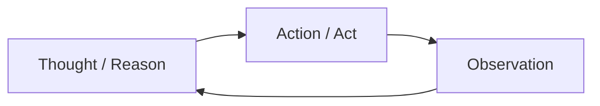

---
tags:
  - pattern
aliases:
  - ReAct
  - react
  - Reason and Act
  - 推理与行动
prerequisites:
  - "[[llm]]"
  - "[[agent]]"
  - "[[tool-use]]"
related:
  - "[[agent]]"
  - "[[tool-use]]"
  - "[[planning]]"
  - "[[plan-and-solve]]"
  - "[[agent-paradigms]]"
  - "[[reflection]]"
  - "[[chain-of-thought]]"
  - "[[function-calling]]"
  - "[[harness-engineering]]"
stability: long
layer: application
updated: 2026-06-14
---

# ReAct（推理与行动）

> [!tip] 核心本质
> ReAct（**Re**ason + **Act**）是 [[agent|Agent]] 最常用的执行模式：[[llm|LLM]] 在每一轮先写出**推理**（决定下一步意图），再发起**行动**（通常经 [[tool-use|工具调用]]），Harness 把真实环境反馈作为**观察**（Observe）写回 context，然后进入下一轮。名字里的 Act 不是「模型自己执行」，而是「输出可执行的调用意图」——循环、权限、重试、终止条件都由 Runtime / Harness 维持。若没有 ReAct 式交替，模型只能在训练权重里「空想」外部世界，无法根据搜索结果、命令退出码等**新事实**修正路线；[[chain-of-thought|CoT]] 只外化文本推理，ReAct 把推理与对外部系统的探测绑在一起。

## 生命周期与演进

**当前定位**：Yao et al. 2022 提出后，已成为 Agent 教科书的默认循环——「思考 → 行动 → 观察」结构见 [[agent]]。现代产品（Cursor Agent、Claude Code、LangGraph）多在 API 层用[[function-calling|函数调用（Function Calling）]]表达 Act，语义仍是 ReAct，只是 Observation 由 Harness 自动注入为 tool result。

**预期寿命**：长期。只要任务需要多轮、依赖实时外部状态，交替推理与行动就不会被单次超长生成取代。

**近期演进**：并行 tool call（一轮多个 Act）；Reasoning 模型拉长单轮思考，减少无效循环；在 Observe 后挂 [[reflection|Reflection]] 做自检已成常见增强；GUI / Computer Use 把 Observation 扩展为截图与 DOM 状态。

**终极威胁**：更强模型缩短所需轮次，或一次调用内完成更多子步骤；但权限边界与可观测性仍要求 Harness 显式记录每轮 Thought/Action/Observation，模式会内化到工程实践而非消失。

## 与 Agent 核心循环的关系

[[agent]] 的感知-思考-行动循环在 ReAct 里被**命名并论文化**：



| 阶段 | 谁产生 | 典型内容 |
| --- | --- | --- |
| **Reason** | LLM 生成 | 「需要先查航班」「上一步 API 404，应改查备用源」 |
| **Act** | LLM 输出意图，Harness 执行 | `web_search(...)`、`read_file(...)` |
| **Observe** | 环境 / Harness 写回 | 搜索结果、文件内容、错误信息 |

ReAct 是**模式**（交替什么）；Harness 是**实现**（如何拼 prompt、解析 tool call、设 `max_steps`、做审批）。二者不可混谈：同一 ReAct 模式可用几十行 Python 或 LangGraph 图编排实现。

## 与 Chain-of-Thought、Planning 的边界

| | [[chain-of-thought]] | ReAct | [[planning]] |
| --- | --- | --- | --- |
| **外化什么** | 纯文本推理链 | 推理 + 工具行动 + 环境反馈 | 子任务列表或动态重规划 |
| **新信息从哪来** | 仅已有 context | 每轮 Observation | 计划 + 每步执行结果 |
| **典型用途** | 单轮复杂推导 | 多轮需查资料、试错的任务 | 复杂目标的分解与顺序 |

CoT 解决「跳步推理」；ReAct 在 CoT 之上增加**对外部世界的探测**。静态 [[plan-and-solve]] 或 [[planning]] 可先列出 1→2→3 再执行；ReAct 更适合**每一步执行完再决定下一步**的动态规划，二者常组合（先 plan 一轮，再 ReAct 执行）。三范式对照见 [[agent-paradigms]]。

## 固有局限

ReAct 的逐步决策带来灵活，也带来结构性代价：

| 局限 | 表现 | 缓解 |
| --- | --- | --- |
| **缺全局蓝图** | 只顾眼前 Observation，路径局部最优或原地打转 | 前置 [[plan-and-solve]]；或 `max_steps` + 重复 action 检测 |
| **多轮成本** | 每步一次 LLM + 工具延迟 | 并行 tool call；Reasoning 模型减少无效轮 |
| **强依赖模型能力** | 格式错乱、错误 Thought 导致链中断 | 见下文「输出解析与调试」；换更强模型或降 temperature |
| **提示词脆弱** | 模板用词变动即行为漂移 | Few-shot 轨迹示例；改用语义更稳的 function calling |

## Prompt 与 Harness 分工

经典论文轨迹用显式标签（便于人类调试）：

```
Thought: 需要查询明天北京到上海的航班
Action: SearchFlights["北京", "上海", "2026-06-05"]
Observation: [航班列表 JSON…]
Thought: 筛选最早且最便宜的早班经济舱
Action: …
```

工程上常见两种落地：

1. **文本轨迹**：模型输出 Thought/Action 行，Harness 用正则或解析器提取 Action，执行后拼 `Observation:` 再继续生成。
2. **原生 tool call**：模型返回结构化 tool_calls，Reason 常出现在 `content` 或 reasoning 通道，Observation 即 `tool` role 消息——对用户不可见，但循环语义不变。

Harness 必做事项（运行时职责见 [[agent]]）：

- 维护 `history`（含每轮 Observation）
- 校验 Action 是否在工具白名单、参数是否符合 schema
- 捕获执行异常并写成 Observation（避免整链崩溃）
- 终止条件：`max_steps`、无新 tool call、LLM 声明完成、关键写操作人工确认

## 输出解析与调试

**表 — Action 解析方案**

| 方案 | 做法 | 优点 | 脆弱点 |
| --- | --- | --- | --- |
| **文本标签 + 正则** | 解析 `Thought:` / `Action:` / `Finish[答案]` | 人类可读、易调试 | 模型多说话、漏标签即失败 |
| **结构化 JSON** | 约束输出 schema | 机器稳 | 模型仍可能 JSON 损坏 |
| **原生 function calling** | `tool_calls` 字段 | 工业默认 | Reason 可能在独立通道，需 Harness 拼 history |

**调试清单**（行为异常时按序检查）：

1. **打印完整 prompt**（含 history）——追溯模型决策输入
2. **打印 LLM 原始输出**——区分「没遵格式」vs「解析器 bug」
3. **核对 tool 输入/输出**——参数类型、Observation 是否由 Harness 注入（非模型编造）
4. **加 1–2 条 Few-shot 轨迹**——稳住 Thought/Action 格式
5. **调 temperature**（常设 0）或换更强模型

## 工具失败与规模

**错工具 / 错参数**：连续失败时 Harness 应把错误写入 Observation（含可用工具名与 schema 提示），而非静默终止；必要时缩小当轮工具白名单。详见 [[tool-use]] 权限最小化。

**工具数量膨胀**（数十上百）：纯文本描述塞满 prompt 会降路由准确率——用分组、按需暴露、[[function-calling]] 的 tool search / [[tool-mcp]] 动态发现。见 [[harness-engineering]]。

## 实践要点

**有效时**：

- 任务依赖**实时或私有数据**（搜索、数据库、仓库文件）
- 需要**试错**（命令失败 → 改参数重试）
- 中间状态应**可审计**（合规、调试）

**慎用或不必用**：

- 步骤固定、可代码编排 → [[workflow]] 更省 token、更可预测
- 单轮问答、无外部依赖 → 普通 Chat 即可
- 纯心算推理、无工具 → CoT 足够，不必套 Act

**与 Reflection 组合**：在 Observation 写入后增加一轮「结果是否合理？是否偏离目标？」，可缓解错误累积；详见 [[reflection]]。

## 常见误区

- **ReAct = LangChain**：任何维持 Think→Act→Observe 的 Runtime 都算实现，框架只是可选依赖。
- **Observation 由模型编造**：必须由 Harness 注入真实 tool result；让模型自己写 Observation 会幻觉环境状态。
- **Reason 越长越好**：冗长 Thought 浪费 context；应服务于下一步 Action 的选择。
- **有 Function Calling 就不是 ReAct**：API 形态变了，交替结构未变。
- **每轮只能一个工具**：现代模型支持并行 Act；Harness 需支持批量执行与合并 Observation。

## 进一步阅读

- [[agent-paradigms]] — 三范式选型与组合
- [[plan-and-solve]] — 静态计划 vs ReAct 动态执行
- [[agent]] — 感知-思考-行动循环与 Runtime 职责
- [[tool-use]] — Act 阶段的能力边界与风险模型
- [[function-calling]] — 结构化 Action 的协议与 schema
- [[planning]] — 静态计划 vs ReAct 式动态重规划
- [[chain-of-thought]] — 纯文本外化推理，ReAct 的推理侧基础
- [[reflection]] — Observe 之后的自检增强
- [[harness-engineering]] — 让 ReAct 循环长期可靠运行的系统工程
- [ReAct: Synergizing Reasoning and Acting (Yao et al., 2022)](https://arxiv.org/abs/2210.03629) — 原始论文与 Thought/Action/Observation 轨迹
