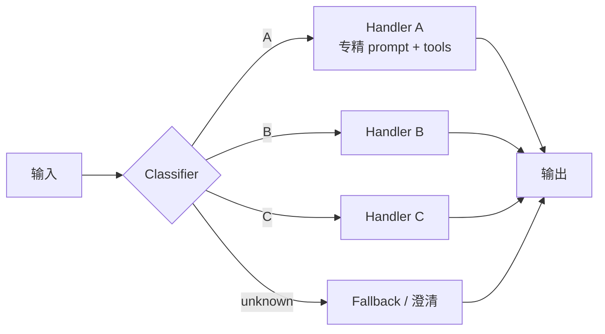

---
tags:
  - pattern
  - workflow
aliases:
  - Routing
  - 路由工作流
  - 意图路由
prerequisites:
  - "[[workflow]]"
  - "[[workflow-patterns]]"
  - "[[prompt-chaining]]"
related:
  - "[[agent]]"
  - "[[langgraph]]"
  - "[[building-effective-agents]]"
  - "[[multi-agent]]"
stability: long
layer: application
updated: 2026-06-15
---

# Routing（路由工作流）

> [!tip] 核心本质
> **Routing** 先**分类**用户输入，再派发到**专精子流程**（专用 system prompt、工具集或模型档位）——分离关注点，避免「一个万能 prompt」在某一类输入上优化却牺牲其他类型。控制流仍由**代码**持有：分类器输出枚举/标签，程序 `switch` 到 handler；与 [[agent]] 的模型自决下一步不同。Anthropic [Building effective agents][bea] 列为 Workflow 五模式之二；常与 [[prompt-chaining]] 组合（路由后再链）。

适合输入空间存在**可区分类别**、且分类可做得准（LLM structured output 或传统分类器）的场景。分类错则全盘错——这是 Routing 的首要风险。

*检索说明：定义与客服/模型档位示例对照 [Anthropic: Building effective agents][bea]；structured classify 模式参考 [Anthropic Cookbook basic_workflows](https://github.com/anthropics/anthropic-cookbook/blob/main/patterns/agents/basic_workflows.ipynb)（观测 2026-06-15）。*

[bea]: https://www.anthropic.com/engineering/building-effective-agents

## 生命周期与演进

**当前定位**：[[workflow-patterns]] 五模式专文；生产客服、代码助手、多模型成本优化中最常见。

**预期寿命**：长期。类别与 handler 会变，「先 classify 再 specialize」不变。

**近期演进**：分类与 handler 均可用不同模型（Haiku 分类 + Sonnet 处理）；[[langgraph]] 条件边即路由实现。

**终极威胁**：强 reasoning 单 prompt 覆盖多域；高 stakes 仍要专精 handler 与审计。

## 1 何时使用

| 适合 | 不适合 |
| --- | --- |
| 类别清晰（billing / tech / sales） | 输入同质、专精收益小 |
| 每类需不同 tools / prompt / 模型 | 分类本身不可靠 |
| 要按难度路由模型降本 | 该用 [[prompt-chaining]] 的线性分解 |

Anthropic 示例：客服 query 分 refund / technical / general；**简单题 → 小模型，难题 → 大模型**。

## 2 机制

**两步**：

1. **Classify** — LLM tool call / JSON schema / 传统 ML；输出**封闭枚举**
2. **Dispatch** — 程序映射到 handler（函数、子图、[[prompt-chaining]] 链）

Handler 收到**完整原始输入** + 路由元数据（类别、reasoning），而非仅类别标签。

## 3 与 Prompt Chaining、Agent

| | [[prompt-chaining]] | **Routing** | [[agent]] |
| --- | --- | --- | --- |
| 结构 | 固定线性序 | **分支**到专精路径 | 动态选步 |
| 决策点 | gate 校验 | **分类** | 每步模型 |
| 失败模式 | 链中传播 | **错分** | 工具环失控 |

Routing **不规划、不综合**：只识别「这是哪类问题」并**永久委托**给 specialist。复杂多步子任务 → Orchestrator-Workers（见 [[workflow-patterns]]）。

可与 Chaining 嵌套：Router → 每类一条链。

## 4 实现要点

1. **Structured classification** — enum + `reasoning` 字段；禁止自由文本类别名
2. **Fallback** — `unknown` / `clarify` 路由；不确定时 **err toward 更强 handler**
3. **分类器要轻** — 小模型、短 prompt；别把分类做成第二套完整 Agent
4. **可观测** — 记录 `content_type`、confidence；错分是首要 debug 信号（[[langsmith]]、[[agent-observability]]）
5. **评测** — 分类准确率单独测；端到端任务测 handler（[[agent-evaluation]]）

[[langgraph]]：`add_conditional_edges("classify", route_fn)`；每 handler 可为 subgraph。

## 5 典型用例

- **客服**：billing / technical / account / product 四套 system prompt（Cookbook 四路由）
- **内容工厂**：tutorial / news / concept → 不同 [[prompt-chaining]] 链
- **成本**：FAQ → Haiku；复杂推理 → Sonnet/Opus
- **工具集**：coding 路由带 IDE tools；写作路由无 shell

## 6 常见坑

| 坑 | 后果 |
| --- | --- |
| 关键词路由 | 「Python」≠ 编程题；需意图非 surface |
| 类别过多 | 分类混淆矩阵爆炸 |
| 无 fallback | 非法 enum 崩流程 |
| 路由后丢上下文 | handler 不知用户历史 |
| 该 Agent 却路由 | 步骤数运行时未知 |

## 要点收束

- Routing = classify → 专精 handler；代码持控制流。
- 分类准是前提；structured output + fallback 是工程标配。
- 可与 [[prompt-chaining]]、多模型档位、[[langgraph]] 条件边组合。
- 与 Orchestrator 分工：Router 只分类委托，不拆子任务。

## 进一步阅读

### 库内

- [[workflow-patterns]] — 五模式总览
- [[prompt-chaining]] — 路由后线性链
- [[workflow]] — Workflow vs Agent
- [[multi-agent]] — 动态派 Worker 对比

### 外部

- [Building effective agents — Routing][bea]
- [Anthropic Cookbook — basic_workflows.ipynb](https://github.com/anthropics/anthropic-cookbook/blob/main/patterns/agents/basic_workflows.ipynb)
