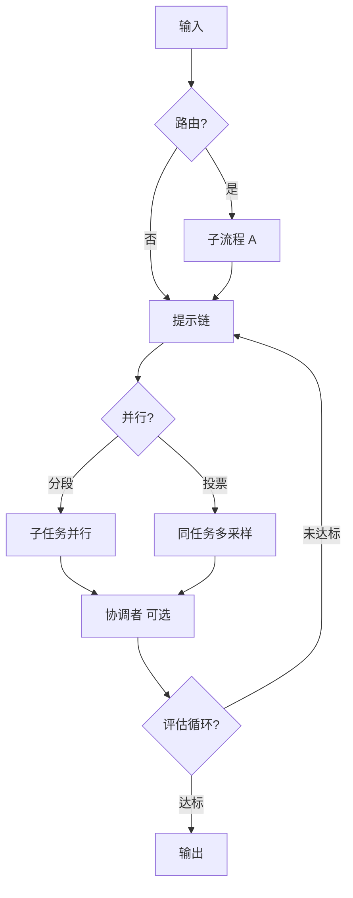

---
tags:
  - pattern
  - workflow
aliases:
  - Workflow 五模式
  - Anthropic 工作流模式
prerequisites:
  - "[[workflow]]"
  - "[[agent]]"
related:
  - "[[building-effective-agents]]"
  - "[[workflow]]"
  - "[[agent]]"
  - "[[prompt-chaining]]"
  - "[[routing]]"
  - "[[parallelization]]"
  - "[[evaluator-optimizer]]"
  - "[[multi-agent]]"
  - "[[reflection]]"
  - "[[chain-of-thought]]"
  - "[[langgraph]]"
stability: long
layer: application
updated: 2026-06-16
---

# Workflow 五模式（Anthropic 索引）

> [!tip] 核心本质
> Anthropic 在 [Building effective agents][bea] 中归纳的五种工作流（Workflow）编排模式——提示链（Prompt Chaining）、路由（Routing）、并行化（Parallelization）、协调者-工作者（Orchestrator-Workers）、评估器-优化器（Evaluator-Optimizer）——是生产里最常复用的组合积木：控制流由**代码预定**，大语言模型（LLM）只负责各步生成，与 [[agent]] 的「模型决定下一步」形成谱系对照。若没有这份索引，团队容易把五种模式混成「多智能体」，或误把 [[reflection]] 当成唯一的迭代手段。

适合已读过 [[workflow]]、正在选编排形态或对照 [[langgraph]] 建图的工程师。读完应能按任务特征匹配一种模式，并知道何时该升级到 [[agent]] 而非再加一层工作流。读到 [[#核心原理|§核心原理]] 与表 1 即可做粗选型；[[#2 分模式要点|§2]] 与 [[#3 与 Agent 的边界|§3]] 用于落地与升级决策。五种模式均已独立成文：[[prompt-chaining]]、[[routing]]、[[parallelization]]、[[evaluator-optimizer]]；协调者-工作者见 [[multi-agent]]。

*检索说明：模式定义与组合策略对照 [Anthropic: Building effective agents][bea]（2024-12-19）；与库内五篇专文及 [[multi-agent]] 交叉核对（观测 2026-06-16）。*

## 生命周期与演进

**当前定位**：[Building effective agents][bea] 在库内的结构化索引；五种模式均有专文可链。

**预期寿命**：长期。模式名可能随厂商文档漂移，但「固定控制流 + 五种组合策略」在编排领域稳定。

**近期演进**：并行化（Parallelization）在护栏（guardrail）、评测与代码审查场景增多；协调者-工作者与 [[multi-agent]] 监督者拓扑在框架实现中趋同。

**终极威胁**：被框架可视化编排隐式实现而「名存实亡」——若开发者只拖节点不理解控制流归属，索引价值下降。

## 1 问题语境

客服机器人要同时处理退款、技术支持与账单查询，产品却塞进一个超长系统提示（system prompt）：模型常在「查政策」与「改订单」之间跳步，分类错了后面全错，且无法按意图换工具集。更常见的失败是**把本可写死的步骤交给模型当场发明**：营销文案应先大纲后正文，团队却用单轮生成，漏结构又难在中间插校验。

这些断点不是「模型不够聪明」，而是**控制流归属不清**。当下一步该走哪条分支、是否并行、是否循环，其实可以由程序在运行前或运行时用枚举/图结构决定时，仍上开放循环的 [[agent]]，会带来不可审计的轨迹、偏高的 token 与延迟。Anthropic 五模式回答的是：在仍坚持「代码握控制流」的前提下，**拆步、分流、并行、动态派工、评估循环**各用什么形状——详见 [[building-effective-agents]] 与下文专文。

## 核心原理

五模式共享一条机制：**编排器（你的代码或图运行时）持有控制流**；每个节点调用 LLM 完成局部生成，节点之间的边（顺序、条件、扇出、扇入、循环）不由模型自决。因此它们与 [[workflow]] 定义一致，只是按**任务结构**拆成五种可命名、可组合的策略；复杂度应随评测递增，而非默认叠满[^bea-complexity]。

**表 1 — 五模式控制流与 trade-off（条件因果）**

| # | 模式 | 控制流特征 | 典型 trade-off（成立条件 → 后果） |
| --- | --- | --- | --- |
| 1 | [[prompt-chaining]] | 固定 LLM 调用链，中间可有程序 gate | **当**子步边界清晰且顺序固定 → 延迟上升，但单步 prompt 更简单 → 逐步准确率往往更高 |
| 2 | [[routing]] | 分类器把输入分到专路子流程 | **当**类别可区分且分类器可靠 → 专精 prompt 与工具；**若**分类错误 → 下游全盘偏离，且无自动纠错 |
| 3 | [[parallelization]] | 分段（Sectioning）或投票（Voting）并行多路 LLM | **当**子任务无依赖或需多视角 → 墙钟时间≈最慢一路或多路置信度；**若**缺少聚合逻辑 → 结果冲突或成本翻倍无收益 |
| 4 | [[multi-agent]] | 中心 LLM 动态拆任务派 Worker | **当**子任务列表运行时才能确定 → 比写死并行更灵活；**若**任务其实可枚举 → 比路由或提示链更贵且难审计 |
| 5 | [[evaluator-optimizer]] | 生成器 + 评估器循环直到达标 | **当**判据可表述且迭代能 measurably 提质 → 质量上升；**若**无清晰标准或首轮已够用 → token 浪费或评估器幻觉反馈 |

模式**可嵌套组合**（例如先 [[routing]] 再 [[prompt-chaining]]）。图 1 展示一种常见叠法，而非唯一管线；是否启用某支路取决于表 1 的成立条件，而非节点越多越好。

图 1 之前：读者应把五模式看成**同一张图上的可选子结构**——路由是条件边，提示链是串行边，并行化是扇出/扇入，评估循环是带退出条件的回边，协调者-工作者是中心节点动态生成子图。

**图 1 — 五模式可嵌套的组合示意（非唯一管线）**

图 1 之后：实际产品很少一次叠满全图；更常见是「路由 → 专精提示链」或「并行护栏 + 主生成」。选型时先问**控制流能否写死**，再问**哪一段需要并行或循环**；细节机制分别见 [[#2 分模式要点|§2]] 各节与对应专文。

## 2 分模式要点

### 2.1 提示链（Prompt Chaining）

营销文案要先出大纲、程序校验章节完整后再写正文——若塞进单轮 prompt，模型常跳过结构或把翻译与风格改写混在一趟里。提示链把任务拆成**固定顺序**的多轮调用：第 *n* 步输出作为第 *n+1* 步输入，中间可插程序 gate（schema 校验、人工审批、失败重跑）。控制流在代码的 `for` 或图串行边里，不是 [[agent]] 自决下一步。

与 [[chain-of-thought]] 的差别在于：思维链在**单轮**内展开推理；提示链是**多轮 API 调用**且由编排器串行。gate 设计、失败分支与观测分步见 [[prompt-chaining]]。

### 2.2 路由（Routing）

同一入口要处理退款、技术支持与一般咨询时，用「万能 prompt」往往在某一类上优化、牺牲其他类。路由先**分类**（大语言模型结构化输出或传统分类器），再由程序 `switch` 到专用下游：不同 system prompt、工具集或模型档位。分类正确时，专精 handler 的准确率与成本都更优；分类错误时没有下游自动纠错，这是首要风险。

典型组合：简单问句走小模型、复杂问句走大模型；或固定常见问题（FAQ）检索链在分类命中后直接返回，而不进入开放 [[agent]] 循环——见 [[routing]] 与 [[triggering-retrieval]]。

### 2.3 并行化（Parallelization）

主回复生成与安全审核互不依赖，串行做只会白白增加用户等待。并行化用代码同时发起多路 LLM 调用，再程序聚合：**分段（Sectioning）**拆独立子任务（如内容生成 ∥ 合规筛查），**投票（Voting）**对同一任务多 prompt 或多采样再合并（如多 reviewer 查代码漏洞）。墙钟时间接近最慢一路，换专精分工或多视角置信度；子任务存在依赖时禁止并行，否则聚合无法定义。

与协调者-工作者的边界：分段子任务列表可事先写死；若子任务要等读完输入才能列出，应看 [[#2.4 协调者-工作者（Orchestrator-Workers）|§2.4]]。实现上常用 `Promise.all` 或图运行时扇出；见 [[parallelization]]。

### 2.4 协调者-工作者（Orchestrator-Workers）

跨十个源码文件做一致性重构时，子任务清单取决于读入后的依赖图，无法在部署时写死成提示链或分段表。协调者-工作者让中心 LLM **读入任务后动态**决定拆哪些子任务、派给哪些 Worker，再合成结果；Worker 在独立上下文里执行，避免单窗口塞满。比 [[parallelization]] 的写死分段更灵活，也比开放 [[agent]] 循环更易审计「谁派了什么活」。

常与 [[planning]] 叠加：先产出粗计划再 delegate。拓扑、上下文隔离与汇总策略见 [[multi-agent]]；Anthropic 原文称 Orchestrator-Workers，库内以多智能体专文展开。

### 2.5 评估器-优化器（Evaluator-Optimizer）

文学翻译或合规文案需要「写 → 按 rubric 审 → 带意见改」多轮，但不必开放探索工具。评估器-优化器固定**生成器**与**评估器**两角色（可为不同 prompt 或模型）：评估器按可表述标准打分或给结构化反馈，未达标则带反馈再生成，直到 pass 或达轮次上限。控制流在代码的 `while` 或条件回边里。

适用前提：人类能清楚说明改进意见，且大语言模型能模拟该类反馈；判据模糊时评估器易产生幻觉反馈。与 [[reflection]] 同属生成—批评—修订，但本篇强调**双角色分离**与**机器可读判据**；rubric 与 structured output 见 [[evaluator-optimizer]]。

## 3 与 Agent 的边界

控制流归属是工作流五模式与 [[agent]] 的分水岭：前者下一步由代码/图结构决定，后者由模型根据 Observation 自决。表 2 用**成立条件**对齐升级路径，避免「为了 Agent 而 Agent」。

| 问题 | 倾向工作流五模式之一 | 倾向 [[agent]] |
| --- | --- | --- |
| 步骤序列能否预先定义？ | **能** → [[prompt-chaining]] / [[routing]] | **不能** → 需运行时规划 |
| 子任务是否运行时才知道？ | **否** → [[parallelization]]；**是** → 协调者-工作者 | Agent 循环规划 |
| 改进是否靠固定评估循环？ | **判据清晰** → [[evaluator-optimizer]] | **需开放探索**时用 Agent |
| 成本与审计 | **分支可枚举**时工作流优先 | **仅当**灵活性需求可度量地超过成本 |

升级检查清单（摘自 [bea] 与 [[building-effective-agents]]）：

1. 单轮 + 检索增强生成（RAG）是否已在评测中失败？
2. 最简单工作流是否已失败且**可度量**？
3. 是否有每步 ground truth 与停止条件？
4. 是否已在沙箱验证 Agent 轨迹？

与 [[agent-paradigms]] 的分工：范式索引针对「模型须动态决定下一步」的任务；可枚举分支应下沉到本篇五模式，Agent 处理长尾开放问题。

## 4 在 LangGraph 等框架中的落地提示

图编排框架常混合多种模式：条件边 ≈ [[routing]]；`Send` / fan-out ≈ [[parallelization]]；supervisor 子图 ≈ 协调者-工作者；双节点条件循环 ≈ [[evaluator-optimizer]]。实现细节见 [[langgraph]]；选型仍以**谁持有控制流**为准，不以节点数量或是否叫「Agent」为准。

## 要点收束

- 五模式共享「代码握控制流」，与 [[agent]] 动态规划形成谱系两端；索引价值在于**命名组合策略**，而非替代专文机制。
- [[prompt-chaining]] 与 [[routing]] 解决「拆步」与「分流」；[[parallelization]] 解决无依赖并行或多视角投票。
- 协调者-工作者适合子任务运行时才能确定的复杂任务；[[evaluator-optimizer]] 适合判据清晰、迭代能提质的质量环。
- 模式可嵌套；**仅当**评测证明收益时加复杂度[^bea-complexity]。
- 机制细节与 gate/聚合/rubric 实现见各专文，本篇只做选型地图。

## 进一步阅读

### 库内关联

- [[building-effective-agents]] — Anthropic 精读母文
- [[workflow]] — 工作流定义与控制流归属
- [[prompt-chaining]] — 顺序分解与程序 gate
- [[routing]] — 分类与专精 handler
- [[parallelization]] — 分段与投票
- [[evaluator-optimizer]] — 生成—评估循环
- [[multi-agent]] — 协调者-工作者拓扑
- [[agent]] — 何时升级到自主 Agent
- [[reflection]] — 与评估器-优化器的范式对照
- [[langgraph]] — 图编排实现
- [[triggering-retrieval]] — 路由与固定检索链

### 原文

- [bea]: [Building effective agents](https://www.anthropic.com/engineering/building-effective-agents) — 五模式定义、图示与 Agent 附录（2024-12-19）

[^bea-complexity]: [Building effective agents][bea] — 建议从最简单方案起步，仅在评测证明收益时增加 agentic 复杂度。
