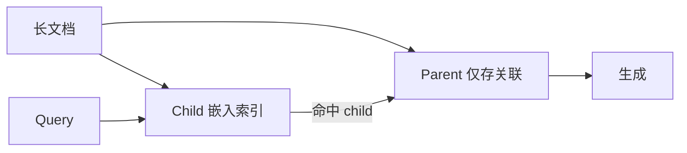

---
tags:
  - technique
aliases:
  - 文档分块
  - Document Chunking
  - Text Splitting
prerequisites:
  - "[[rag]]"
  - "[[embedding]]"
related:
  - "[[retrieval-pipeline]]"
  - "[[recall-at-k]]"
  - "[[query-transformation]]"
  - "[[hyde]]"
  - "[[crag]]"
  - "[[context-engineering]]"
stability: long
layer: application
updated: 2026-06-15
---

# 文档分块（Chunking）

> [!tip] 核心本质
> **文档分块（Chunking）**是把长文档切成可嵌入、可检索的小段；向量库按 chunk 粒度做相似度比较，生成阶段再把这些段拼进 prompt。若 chunk 在错误边界切断语义——代词失去指代、表格与标题分离——下游 [[embedding]] 与 [[cross-encoder]] 再强也只能在「已 poison 的片段」上精排，表现为答非所问或 citing 错段。Chunking 是 RAG **入库侧**的地基，不是可随便用默认 512 token 糊过去的预处理。

适合负责知识库入库、检索质量调优的工程师：已读 [[rag]] 与 [[embedding]]。读完 [[#2 策略谱系|§2]] 能按文档类型选策略；[[#3 生产默认与参数|§3]] 给出 2025–2026 社区默认栈；[[#4 评测与迭代|§4]] 说明如何用 [[recall-at-k]] 与下游任务验证，而非凭直觉调 size。

*检索说明：策略与参数对照 [Pinecone Chunking Strategies](https://www.pinecone.io/learn/chunking-strategies/)（2025-06）、[RAG Deep Dive 2026](https://aifoss.dev/blog/rag-architecture-deep-dive-2026/)、[Late Chunking arXiv:2409.04701](https://arxiv.org/abs/2409.04701)、[Anthropic Contextual Retrieval](https://www.anthropic.com/news/contextual-retrieval)、[adaptive-chunking](https://github.com/ekimetrics/adaptive-chunking)（观测 2026-06-15）。*

## 生命周期与演进

**当前定位**：RAG 工程从 Naive 转向 Advanced 后的**第一杠杆**——社区共识是 chunk 策略与 size 的失误会在全链路放大；此前库内仅在 [[rag]] 中零散提及，缺独立专文。

**预期寿命**：长期。只要检索仍按 chunk 粒度索引，边界问题就存在；超长上下文可对小库「少切或不切」，但大型私有库仍需显式分块与权限/metadata 绑定。

**近期演进**：**层次分块（parent-child）**成生产默认；**Late Chunking** 与 **Contextual Retrieval** 解决跨 chunk 指代；**Adaptive Chunking**（LREC 2026）按文档自动选 splitter；与 Agentic RAG 结合时 chunk 仍是一次入库决策，Agent 只选检索粒度而非替代入库策略。

**终极威胁**：端到端「整文档 embedding + 动态子 span 检索」或 ColBERT 类 late interaction 合并粗精排，使固定 offline chunk 边界变弱；但在多数向量库产品里，显式 chunk 仍是默认路径。

## 1 问题：为什么必须分块、错在哪

Embedding 模型有**上下文窗口**：整本书一次 embed 会截断或稀释信号。检索侧又需要**与 query 粒度匹配**的单元——用户问一句，返回整章往往噪声过大；返回半句话又缺上下文。

| 失败模式 | 典型原因 | 下游表现 |
| --- | --- | --- |
| 边界断句 | 固定长度切在代词/指代中间 | 命中 chunk 但 LLM 读不懂「它」指谁 |
| 信号稀释 | chunk 过大，多主题挤一向量 | 相似度虚高，[[recall-at-k]] 里混进无关段 |
| 结构破坏 | PDF 表格/标题与正文分离 | 检索到数字却没有列名 |
| 与 query 粒度失配 | 短问句 vs 长 chunk | 需 [[query-transformation]] 或 [[hyde]] 补救 |

Chunking 发生在 **Index 阶段**（[[rag#Index|rag §Index]]），在 [[retrieval-pipeline]] 之前；此处错误无法靠 Rerank 完全挽回。

## 2 策略谱系

### 2.1 固定长度与递归字符切分

**固定长度（Fixed-size）**：按 token/字符数切，实现最简单。[Pinecone 指南][pinecone-chunking] 建议多数场景**从此起步**，再迭代。

**递归字符切分（Recursive Character Splitting）**：按分隔符优先级（`\n\n` → `\n` → 空格）尽量在段落/句子边界切，再合并到目标 size。LangChain `RecursiveCharacterTextSplitter` 为事实标准；2026 社区默认 **400–512 token**，**10–20% overlap**（重叠保留边界上下文）。

适用：同质短文、日志、结构弱的长 prose。不适用：强结构 PDF/代码（见 §2.3）。

### 2.2 语义分块（Semantic Chunking）

先分句，对相邻句组 embed，在**语义距离突变**处切边界（Greg Kamradt 思路；[Pinecone 语义分块说明][pinecone-chunking]）。长文、技术文档上常优于纯 fixed-size，代价是入库时需**额外 embed 句子**做边界检测。

适用：长文、多主题报告、论文。慎用：短消息、同质 FAQ（收益小、成本高）。

### 2.3 结构感知分块

按 **Markdown 标题、HTML 标签、LaTeX 章节、代码 AST、PDF 块**切分，保持表格/列表/段落完整。Neo4j 等 Advanced RAG 指南强调：结构乱时先上 document-aware，再考虑语义。

与 [[knowledge-extraction]] 衔接：结构化块常作为「候选事实」最小单元。

### 2.4 层次分块 Parent-Child（生产默认）

**子 chunk（child）** ~128–200 token：用于**精确检索**；**父 chunk（parent）** ~512–1024 token：检索命中 child 后**返回 parent** 给 LLM，兼顾定位与上下文。[2026 RAG Deep Dive][aifoss-rag-2026] 称其为 LlamaIndex/LangChain 部署中最广泛采用的模式。

**Chunk expansion**：查询时对命中 chunk 取相邻 window，与 parent-child 同类思路。

### 2.5 Late Chunking 与 Contextual Retrieval

两者都解决 **「chunk 内看不到文档其余部分」** 的指代/主题缺失。

| 方法 | 机制 | 成本 | 来源 |
| --- | --- | --- | --- |
| **Late Chunking** | 长上下文 embed 模型先 encode **整篇** token，再在 mean pooling **前**按边界池化成 chunk 向量 | 需长上下文 embed 模型；无额外 LLM | [Günther et al. 2024][late-chunk-paper] |
| **Contextual Retrieval** | LLM 读全篇 + chunk，为每 chunk **生成上下文前缀**再 embed | 每 chunk 一次 LLM（可 cache 全篇） | [Anthropic 2024][contextual-retrieval] |

[Reconstructing Context (2025)][reconstruct-context] 对比：Contextual Retrieval 语义连贯性 often 更强但更贵；Late Chunking 更高效，部分场景 relevance 略逊。工程上可先 Late Chunking，难例再叠加 Contextual 前缀。

### 2.6 Adaptive Chunking（新兴）

[ekimetrics/adaptive-chunking][adaptive-chunking]：对每篇文档试多种 splitter，用**内在质量指标**（块内凝聚度、结构块完整度、指代链是否断裂等）自动选最优策略，LREC 2026。适合**异质语料**（法务+财报+技术混库），不适合追求极简 ingest 的 MVP。

## 3 生产默认与参数

**推荐起点**（异质企业文档、未评测前）：

1. **RecursiveCharacterTextSplitter**：512 token（或 400），overlap 10–15%
2. 若 citation 常错段 → 改 **parent-child**（child 200 / parent 800）
3. 若长文多主题 → 试 **semantic** 或 **Late Chunking**（embed 模型支持长上下文时）
4. PDF/表格多 → **结构感知 parser**（Docling 等）+ 结构边界

与 [[retrieval-pipeline]] 联动：chunk 定好后才谈 BM25 字段、dense 向量、[[cross-encoder]] Rerank——Rerank 只在「候选集大致含正确段」时有意义；社区建议 **context precision 低于 ~0.6 时先查 chunk/query，再加 Rerank**。

与 [[query-transformation]] / [[hyde]] 分工：chunking 解决**文档侧**粒度；改写/HyDE 解决 **query 侧**形态——二者互补，不能互相替代。

## 4 评测与迭代

不要凭主观调 size；用代表 query 集 + 检索指标：

| 指标 | 作用 | 节点 |
| --- | --- | --- |
| Recall@K | 正确 chunk 是否进 Top-K | [[recall-at-k]] |
| Context precision | 返回 context 有多少真相关 | RAGAS 等框架 |
| 下游答案质量 | 端到端是否 grounded | [[crag]] 可作生成侧门控 |

流程：固定 query 集 → 试 2–3 种 chunk 配置 → 比 Recall@K 与人工 spot-check → 记录参数与 rationale（Adaptive 思路的可手工版）。

## 5 坑与误区

| 误区 | 事实 |
| --- | --- |
| chunk 越大越好 | 大 chunk 稀释向量、增加 lost-in-the-middle 风险 |
| 只调 embedding 不调 chunk | 换模型不能修复边界切断 |
| 入库与 query 策略独立 | query 长度/口语化应影响 child size 与是否 parent 返回 |
| 忽视 overlap | 零 overlap 在段落边界处丢指代 |
| 表格当纯文本切 | 行列语义断裂，需结构 parser |

## 要点收束

- Chunking 决定检索粒度；错误边界会 poison [[retrieval-pipeline]] 全链路。
- 默认栈：recursive 400–512 token + 10–20% overlap；质量优先时用 parent-child。
- Semantic / Late / Contextual 解决跨边界上下文；Adaptive 适合异质大库。
- 先 Recall@K 评测再调参；precision 低时先查 chunk 再加 Rerank。
- 与 [[hyde]]、[[query-transformation]] 分工：文档侧 vs 查询侧。

## 进一步阅读

### 库内关联

- [[rag]] — RAG Index 阶段与 Naive 架构
- [[retrieval-pipeline]] — chunk 之后的粗排精排
- [[recall-at-k]] — 分块评测指标
- [[query-transformation]] — 查询侧对齐
- [[hyde]] — 短 query 与文档形态鸿沟
- [[knowledge-extraction]] — 结构化入库单元
- [[crag]] — 检索质量门控

### 外部来源

- [pinecone-chunking]: [Chunking Strategies for LLM Applications](https://www.pinecone.io/learn/chunking-strategies/) — 策略总览与 semantic/contextual（2025-06）
- [aifoss-rag-2026]: [RAG Deep Dive 2026](https://aifoss.dev/blog/rag-architecture-deep-dive-2026/) — hierarchical 默认与 rerank 时机
- [late-chunk-paper]: [Late Chunking (arXiv:2409.04701)](https://arxiv.org/abs/2409.04701) — 先 embed 后切分
- [contextual-retrieval]: [Anthropic: Contextual Retrieval](https://www.anthropic.com/news/contextual-retrieval) — LLM chunk 前缀
- [adaptive-chunking]: [ekimetrics/adaptive-chunking](https://github.com/ekimetrics/adaptive-chunking) — 按文档选策略（LREC 2026）
- [reconstruct-context]: [Reconstructing Context (2025)](https://arxiv.org/html/2504.19754) — Late vs Contextual 对比
