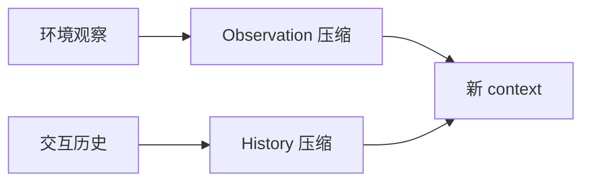

---
tags:
  - technique
  - context
aliases:
  - Context Compaction
  - 上下文压缩
  - ACON
prerequisites:
  - "[[context-engineering]]"
  - "[[context-window]]"
  - "[[memory]]"
related:
  - "[[agent]]"
  - "[[harness-engineering]]"
  - "[[agent-context-stack]]"
  - "[[crag]]"
stability: mid
layer: application
updated: 2026-06-15
---

# 上下文压缩（Context Compaction）

> [!tip] 核心本质
> **上下文压缩（Context Compaction）**在长程 [[agent]] 运行中，把膨胀的**观察历史、工具输出、对话**压成更短摘要再写回 [[context-window]]——否则 token 成本、延迟与 lost-in-the-middle 同时恶化。与 [[memory]] 长期记忆不同，compaction 是**会话内、可逆/有损的 working set 管理**；与 RAG [[chunking]] 不同，它处理的是**轨迹**而非静态语料。

适合多步工具 Agent、Computer Use、长对话 copilot。2025–2026 代表工作包括 Microsoft **ACON**（压缩 guideline 优化）与 parallel compaction Serving 研究。

*检索说明：对照 [ACON arXiv:2510.00615](https://arxiv.org/abs/2510.00615)、[microsoft/acon](https://github.com/microsoft/acon)、[Parallel Context Compaction 2026](https://arxiv.org/html/2605.23296)（观测 2026-06-15）。*

## 生命周期与演进

**当前定位**：[[context-engineering]] 延伸——map 待补充 `context-compaction`；Claude/Cursor 等产品称 "compact" 会话。

**预期寿命**：中期。压缩 prompt/小模型蒸馏快变；长程 Agent 必需要约机制。

**近期演进**：ACON 用失败分析优化**自然语言压缩指南**；蒸馏到小模型（Qwen3-8B 等）保留 ~95% 效果；并行分块压缩降 wall time。

**终极威胁**：百万 token 窗口缩小 compaction 需求；成本与注意力质量仍可能需摘要。

## 1 何时压缩

| 信号 | 动作 |
| --- | --- |
| 上下文 > 阈值（如 70% 窗口） | 触发 compaction |
| 工具输出巨型 JSON | 先沙箱内过滤（[[mcp-code-execution]]），再摘要 |
| 多 episode 任务 | 压 **observation history**；保留最近 k 步 raw |

**不要**压掉：当前任务 spec、未完成的 tool call、[[cursor-hooks]] 门禁所需字段。

## 2 压缩对象

- **Observation**：网页/文件/命令输出 → 摘要保留决策相关事实
- **History**：旧 tool 轮次 → 合并为里程碑；保留失败与修正（对 [[reflection]] 重要）

## 3 ACON 思路（研究 → 工程可借鉴）

[ACON](https://arxiv.org/abs/2510.00615)：**不微调主 Agent**，优化 **compressor prompt/guideline**：

1. 全 context 成功 vs 压缩后失败 → 配对
2. LLM 分析失败原因 → 更新 guideline
3. 可选：蒸馏 compressor 到小模型降开销

报告：peak token **降 26–54%**，任务准确率 largely 保持。

工程落地可简化为：**固定压缩 rubric + 周期性 eval**（[[agent-evaluation]] 轨迹对比），不必全套 ACON。

## 4 并行与阻塞

Sequential 压缩会 **阻塞 Agent 数十秒**。[Parallel compaction](https://arxiv.org/html/2605.23296) 将历史分块并行摘要再合并——可控摘要体积、降 wall time。适合 HotpotQA/LoCoMo 类长对话。

## 5 与兄弟机制

| 机制 | 分工 |
| --- | --- |
| [[memory]] | 跨 session 持久事实 |
| Compaction | 单 session working set |
| [[crag]] | 检索质量差时换源，非压历史 |
| [[context-engineering]] | 总预算与加载策略 |

## 6 坑

| 误区 | 后果 |
| --- | --- |
| 压掉错误 trace | Agent 重复犯错 |
| 无 eval 压缩 | 静默掉关键 ID/数字 |
| 只压 user 不压 tool | tool 输出才是大户 |
| 与 Rule of Two 冲突 | 压缩不能代替权限收缩 |

## 要点收束

- Compaction = 长程 Agent 的 session 内 context 预算管理。
- 压 observation + history；保留最近 raw 与任务契约。
- ACON：优化压缩 guideline；可蒸馏小 compressor。
- 与 [[context-engineering]]、[[memory]]、[[mcp-code-execution]] 组合使用。

## 进一步阅读

### 库内

- [[context-engineering]] — context 总策略
- [[context-window]] — 硬上限
- [[memory]] — 跨轮持久化
- [[agent-evaluation]] — 压缩前后轨迹对比

### 外部

- [ACON paper](https://arxiv.org/abs/2510.00615) / [GitHub microsoft/acon](https://github.com/microsoft/acon)
