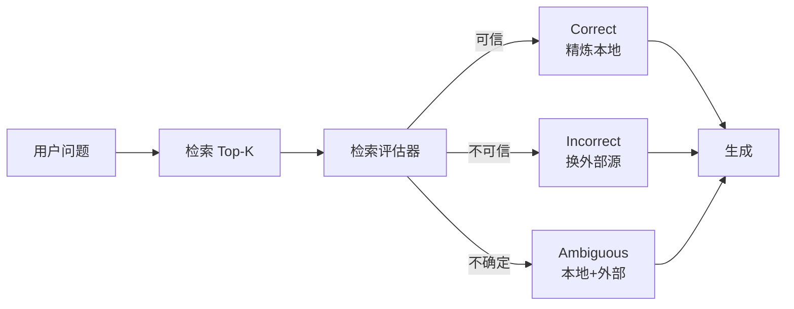

---
tags:
  - technique
aliases:
  - CRAG
  - Corrective RAG
  - 校正检索增强生成
  - 纠错 RAG
prerequisites:
  - "[[rag]]"
  - "[[retrieval-pipeline]]"
related:
  - "[[query-transformation]]"
  - "[[hyde]]"
  - "[[triggering-retrieval]]"
  - "[[langgraph]]"
  - "[[hallucination]]"
  - "[[recall-at-k]]"
stability: mid
layer: application
updated: 2026-06-14
---

# CRAG（Corrective Retrieval Augmented Generation）

> [!tip] 核心本质
> **CRAG** 在「检索 → 生成」之间插入**检索评估器**：先判断当前召回是否可信，再触发 **Correct / Incorrect / Ambiguous** 三种纠错动作——精炼本地文档、丢弃并换外部检索源、或二者组合。若没有这层校正，Naive RAG 会把无关 chunk 照样塞进 prompt，**错检索比不检索更危险**（见 [[hallucination]]）。

适合已搭 [[rag]]、召回率尚可但**答案仍常被错文档带偏**的读者。读完 [[#2 与查询改写、Self-RAG 的边界|§2]] 能判断要不要上 CRAG；[[#3 三态动作与知识精炼|§3]] 对应论文机制；[[#4 工程落地与简化版|§4]] 给出可实现的 Fallback 图。

*检索说明：机制与三态动作对照 [Yan et al., 2024 — CRAG](https://arxiv.org/abs/2401.15884)、官方实现 [HuskyInSalt/CRAG](https://github.com/HuskyInSalt/CRAG)；图编排范例见库内 [[langgraph]] §5.2（观测 2026-06-14）。*

## 生命周期与演进

**当前定位**：Advanced RAG 的**纠错回路**范式；论文为 plug-and-play，可叠在标准 RAG 或 Self-RAG 之上。工业界常见简化：用 LLM **grader** 打分 + 条件边（改写 / 扩检 / 拒答），未必复现 Web Search 全链路。

**预期寿命**：中期。「检索质量不确定 → 分支处理」这一结构长期有效；具体评估器（T5-small vs LLM judge）与外部源（Web vs 第二向量库）会随栈演化。

**近期演进**：[[langgraph]]、LangChain 等把 CRAG 写成**条件边 Fallback**；与 [[query-transformation]] 结合——**先原 query 检索打分，低分才改写**；与 [[triggering-retrieval]] 的「先搜再判」同构。

**终极威胁**：端到端检索模型或 Reasoning 模型内化「该不该信检索」；私有库场景下 Web Search 扩展常被**库内二次检索 / 人工审核队列**替代，但评估—分支骨架仍保留。

## 1 问题：检索错了，生成仍会一本正经

Naive RAG 默认：Top-K 文档无论相关与否都拼进 context。低质量召回会：

- 把模型引向**错误事实**（幻觉加重）；
- 浪费 [[context-window]]，稀释真正有用的信号。

[Yan et al., 2024][crag-paper] 针对的正是 **retriever 失败** 场景：不是「要不要检索」（Self-RAG 更偏这层），而是 **「检索结果能不能用、不能用怎么办」**。

## 2 与查询改写、Self-RAG 的边界

**表 1 — 易混分工**

| 机制 | 主要问题 | 典型时机 | 库内节点 |
| --- | --- | --- | --- |
| **[[query-transformation]]** | 问法与文档**不对齐** | 检索**前/后**改写 query | [[hyde]]、多查询、子查询 |
| **CRAG（本篇）** | 召回结果**能不能信** | 检索**后**评估与分支 | — |
| **Self-RAG** | **要不要**检索、生成中是否再检 | 模型自发射 `[Retrieve]` 等 | 论文实现，与 CRAG 可叠加 |
| **[[triggering-retrieval]]** | Agent **会不会去查** | 编排、路由、验收 | 工程实践总览 |

**工程简化版 CRAG**（社区与 [[langgraph]] 范例常见）：`retrieve → grade(score) → if low: rewrite → retrieve again → generate`。这吸收了 CRAG 的 **「低分才纠错」**，但不一定实现论文的 Web Search 与 strip 级精炼——对私有知识库往往更实用。

## 3 三态动作与知识精炼

论文 [Algorithm 1][crag-paper] 对**每个**召回文档打分，再按置信度触发动作（上下阈值之间为 Ambiguous）。

### 3.1 Correct（检索可信）

至少一篇文档分数高于**上阈值**。动作不是原样塞全文，而是 **Knowledge Refine**：

1. **Decompose**：把文档切成较短 **knowledge strips**（几句一段）；
2. **Filter**：用同一检索评估器对每条 strip 再打相关性分；
3. **Recompose**：保留高分 strip，按序拼接为 **internal knowledge**。

目的：去掉文档里的噪声句，减轻 [[context-engineering]] 里的信号稀释。

### 3.2 Incorrect（检索不可信）

**所有**文档分数低于**下阈值**。动作：**丢弃**本地召回，改走 **Web Search**（论文用查询改写后的关键词搜公开网，再对网页做同样的 refine，得到 **external knowledge**）。动机：静态私有库常只能返回次优文档，需要更大范围补上下文。

**私有库落地**：把「Web Search」替换为 **扩检**（混合检索、第二索引、[[query-transformation]] 改写后再检）或 **拒答 / 转人工**，逻辑仍是 Incorrect 分支。

### 3.3 Ambiguous（不确定）

分数落在两阈值之间。动作：**internal knowledge + external knowledge** 合并——论文指出仅 Correct/Incorrect 二分时系统过度依赖评估器准确率，Ambiguous 可缓和硬切换。

## 4 检索评估器（论文实现要点）

- 基座：**T5-large** 微调（约 0.77B），对 `(question, document)` 逐对预测相关性；比 Self-RAG 的 7B critic **更轻**。
- 训练信号：如 PopQA 用维基标题对齐正样本，检索结果中随机负样本；每问通常 **10** 篇待评文档。
- 与「用 ChatGPT 当 grader」对比：论文报告专用 evaluator 更稳（见原文 §5.5）。

生产常见替代：**LLM grader**（单 prompt 打 relevant/irrelevant）、**交叉编码器**、或 **BM25+向量分阈值**——用 [[recall-at-k]] / 人工标注集校准阈值即可，不必复现 T5 训练。

## 5 工程落地与简化版

### 5.1 最小闭环（推荐起步）

1. **固定检索** → **grader 打分**（0–1 或 relevant 二分类）；
2. `score ≥ τ_high` → 可选 [[retrieval-pipeline]] 精排后生成；
3. `score ≤ τ_low` → [[query-transformation]] 改写 **或** 混合扩检 **或** 模板拒答；
4. 中间带 → 生成时要求**引用** + 低置信度免责声明。

阈值用标注集扫 [[recall-at-k]] 与答案 EM，不要拍脑袋。

### 5.2 图编排（条件边）

[[langgraph]] §5.2 的 `route_after_retrieve` 即简化 CRAG：`retrieve → conditional_edges → rewrite → retrieve` 或 `generate`。检查点（checkpointer）可持久化「已改写几次」，防止死循环。

### 5.3 与 [[triggering-retrieval]] 的关系

CRAG 是 **「先搜再判」** 的一种具体实现（§4.4 路由表）；适合**已决定要走 RAG 分支**的事实类问题，而不是替代「要不要检索」的路由。

## 6 常见误区

| 误区 | 后果 | 更稳妥 |
| --- | --- | --- |
| 每问都改写 query | 延迟翻倍 | 先检索打分，低分再改写（[[query-transformation]]） |
| grader 与生成用同一超大模型 | 成本高 | 小模型 / 交叉编码器 grader |
| Incorrect 仍把原 Top-K 塞给模型 | 错检索继续毒化 | 丢弃或降权，走扩检/拒答 |
| 无 Ambiguous，阈值卡死 | 评估器稍不准就全盘翻车 | 中间带合并或人工审核 |
| 照搬 Web Search | 私有合规、幻觉网页 | 换第二知识源或库内 GraphRAG |

## 要点收束

- CRAG = **检索后评估 + 三态纠错**，不是另一种 embedding 模型。
- 论文全链路：评估器 → Correct 精炼 / Incorrect 外搜 / Ambiguous 合并 → 再生成。
- 工程上多数团队做 **grader + 条件边 Fallback**，外搜常换为扩检或拒答。
- 与 [[query-transformation]]、[[triggering-retrieval]]、[[langgraph]] 分工明确，宜链式组合而非重复造轮。

## 进一步阅读

### 库内关联

- [[rag]] — Naive / Advanced RAG 总览
- [[query-transformation]] — 低分触发的 query 改写（CRAG Fallback）
- [[retrieval-pipeline]] — 粗排 / 精排 / 融合
- [[triggering-retrieval]] — 编排层「条件再检索」
- [[langgraph]] — 条件边与 CRAG 代码范例
- [[hallucination]] — 错检索加剧幻觉

### 外部

- [Corrective RAG (Yan et al., 2024)][crag-paper] — 原文与 Algorithm 1
- [HuskyInSalt/CRAG][crag-code] — 官方实现与评估器权重
- [Self-RAG (Asai et al., 2024)](https://arxiv.org/abs/2310.11511) — 可与之叠加的「是否检索」范式

[crag-paper]: https://arxiv.org/abs/2401.15884
[crag-code]: https://github.com/HuskyInSalt/CRAG
