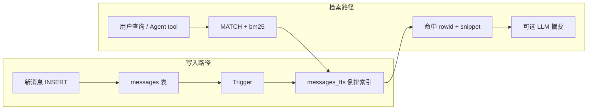

# FTS5 全文检索

> [!tip] 核心本质
> **FTS5** 是 SQLite 内置的全文检索（Full-Text Search）扩展：用**倒排索引**把「词 → 文档列表」预建好，查询时用 `MATCH` 在毫秒级命中关键词，并用 **BM25** 排序。若没有 FTS5，本地 Agent 要翻历史会话或笔记只能 `LIKE '%关键词%'` 扫全表——数据一多就 O(N) 拖垮；要独立搜索引擎（Elasticsearch）又引入运维与进程依赖。FTS5 让**单文件 SQLite** 同时具备事务存储与搜索引擎级关键词检索，是 Hermes 会话检索、Obsidian 插件、轻量 RAG 的常用底座。

## 生命周期与演进

**当前定位**：SQLite 3.9+（2015）起 FTS5 取代 FTS3/FTS4 成为官方推荐方案；2020 年代在 Agent 宿主（Hermes、各类本地知识库 POC）中作为「零依赖会话/笔记检索」标配。与 Elasticsearch BM25、Lucene Tantivy 同属**倒排 + BM25** 家族，但嵌入进程内、无网络 hop。

**预期寿命**：长期。倒排索引与 BM25 是搜索引擎三十年的稳定抽象；FTS5 作为 SQLite 官方扩展，随 SQLite 发行版维护，不依赖单独产品生命周期。

**近期演进**：CJK 场景下 **trigram tokenizer**（三字切分）补 substring 检索；**external content** 表 + trigger 同步成为 Agent 会话库标准模式（内容在 `messages`，索引在 `messages_fts`）；与向量检索的**混合召回**在单机 RAG 中普及（FTS5 一路 + sqlite-vec / 内存 ANN 一路）。

**终极威胁**：纯向量 + 超长上下文「少检索、多塞窗口」削弱关键词路的必要性；超大规模语料仍需要分布式 ES/OpenSearch。但在**单机、百万级文档以下、要强精确匹配**的场景，FTS5 不会被轻易替代。

---

## 问题背景：为什么需要全文检索

关键词检索要回答：**「哪些文档包含这些词，且按相关度排序？」**

### LIKE 的局限

```sql
SELECT * FROM messages WHERE content LIKE '%deploy%';
```

- **无法利用索引**：前后通配符导致全表扫描，复杂度 O(N × 平均文档长度)。
- **无相关度排序**：命中即返回，「deploy 出现 1 次」与「出现 20 次」同等对待。
- **无语法**：不支持 `AND`/`OR`、短语 `"exact phrase"`、前缀 `deploy*`。

### 与向量检索的分工

| 维度 | FTS5（关键词/BM25） | 向量检索（Dense ANN） |
| --- | --- | --- |
| 索引结构 | 倒排索引（词 → posting list） | 向量索引（HNSW 等，见 [[ann]]） |
| 擅长 | 精确 token、错误码、API 名、专有名词 | 语义近义、口语 vs 书面语 |
| 弱点 | 同义改写、跨语言语义 | 精确字符串、罕见标识符 |
| 典型延迟 | 毫秒（单机 SQLite） | 毫秒～十毫秒（视 ANN 规模） |
| 依赖 | 仅 SQLite | Embedding 模型 + 向量库 |

[[retrieval-pipeline]] 的工业标准是 **Dense + BM25 混合召回**；FTS5 提供的是 BM25 路在**嵌入式、单文件**场景下的实现，而非与 Elasticsearch 竞争分布式规模。

---

## 核心机制

### 倒排索引

与 [[retrieval-pipeline]] 中 [[bm25]] 一节相同的数据结构：

```
正排：rowid → 文本内容
  1: "fix deploy script error"
  2: "session search uses FTS5"

倒排：token → [rowid, 词频, 位置…]
  "deploy" → [1]
  "fts5"   → [2]
  "search" → [2]
```

查询 `deploy OR fts5` 时，引擎在倒排表里取 posting list 的并集，**不扫描全文**——这是 FTS 比 `LIKE` 快的根本原因。

### 虚拟表与两种存储模式

FTS5 通过 `CREATE VIRTUAL TABLE … USING fts5(...)` 创建**虚拟表**，对用户暴露为普通 SQL 表，底层维护独立索引结构。

**独立存储**（索引与内容都在 FTS 表内）：

```sql
CREATE VIRTUAL TABLE docs_fts USING fts5(title, body);
INSERT INTO docs_fts(title, body) VALUES ('Deploy', 'Steps to deploy…');
SELECT rowid, title, snippet(docs_fts, 0, '>>>', '<<<', '…', 64)
FROM docs_fts WHERE docs_fts MATCH 'deploy';
```

**External content**（内容在主表，FTS 只存索引——Agent 会话库常用）：

```sql
CREATE TABLE messages (
  id INTEGER PRIMARY KEY,
  session_id TEXT,
  role TEXT,
  content TEXT
);

CREATE VIRTUAL TABLE messages_fts USING fts5(
  content,
  content='messages',
  content_rowid='id'
);

-- 用 trigger 保持同步（INSERT/UPDATE/DELETE 各一条）
CREATE TRIGGER messages_ai AFTER INSERT ON messages BEGIN
  INSERT INTO messages_fts(rowid, content) VALUES (new.id, new.content);
END;
```

Hermes Agent 的 `~/.hermes/state.db` 即此模式：`messages` 存完整历史，`messages_fts` 供 `session_search` 跨会话检索（详见 [[hermes-agent]]）。



### MATCH 查询语法

FTS5 用 `WHERE table MATCH 'query'` 替代 `LIKE`：

| 语法 | 含义 | 示例 |
| --- | --- | --- |
| 隐式 AND | 空格连接，全部命中 | `'deploy error'` |
| OR | 任一词命中 | `'deploy OR rollback'` |
| NOT | 排除 | `'deploy NOT vercel'` |
| 短语 | 相邻 token 顺序 | `'"session search"'` |
| 前缀 | 以…开头 | `'deploy*'` |
| 列过滤 | 只搜某列 | `'title:api'` |

用户输入须** sanitize**（转义 `"`、`*` 等特殊字符），否则易触发语法错误或意外 broad match——生产 Agent 工具层应封装查询构造。

### BM25 排序

FTS5 内置辅助函数 `bm25(table)`，返回**相关度分数**（数值越小越相关——实现上对标准 BM25 乘了 -1，以便 `ORDER BY bm25(...) ASC` 即最佳在前）：

```sql
SELECT m.*, bm25(messages_fts) AS rank
FROM messages_fts
JOIN messages m ON m.id = messages_fts.rowid
WHERE messages_fts MATCH 'deploy error'
ORDER BY rank
LIMIT 20;
```

多列时可传列权重，例如标题命中比正文更值钱：`bm25(email, 10.0, 5.0)`。

`snippet()` 与 `highlight()` 辅助函数从命中列抽取带标记的摘要片段，适合直接展示给 Agent 或用户。

### Tokenizer 与中文

默认 **unicode61** tokenizer 按 Unicode 类别切词，对英文友好；CJK 无空格语言上，整句常被当成少量大块 token，**子串检索**（搜「检索」命中「会话检索」）可能失败。

常见补救：

| 方案 | 机制 | 适用 |
| --- | --- | --- |
| **trigram** | 每 3 字符一个 token | 中日韩 substring、短词 |
| **porter** | 英文词干化 | 英文形态变化（running → run） |
| **自定义 tokenizer** | SQLite 注册 C 扩展 | 中文分词器（jieba 等）接入 |

Hermes 等实现会同时维护 **unicode61 FTS 表** 与 **trigram FTS 表**，短 CJK 查询走 trigram 或 LIKE fallback。

---

## 实践与应用

### 在 Agent 栈中的位置

FTS5 通常承担 **Session search** 或 **本地知识库关键词路**，与 [[memory]] 中「程序性 Skill / 语义 Memory」互补：

| 层 | 机制 | 典型问题 |
| --- | --- | --- |
| Durable memory | 主动写入事实 | 「项目不用 Vercel」 |
| Skill | 匹配激活 SOP | 「怎么跑测试」 |
| **FTS5 会话/文档检索** | 被动按需搜历史 | 「上次 deploy 怎么失败的？」 |

流程：**用户问 → Agent 调 search tool → FTS5 取 Top-K 片段 → LLM 摘要**——避免把全部历史塞进 context window。

### 与 RAG 管线的关系

单机轻量 RAG 常见架构：

1. 文档 chunk 写入 SQLite（metadata + content）
2. `chunks_fts` 做 BM25 召回；embedding 存同库或 sidecar 文件做向量路
3. [[rrf]] 融合两路排名 → 可选 Cross-Encoder Rerank → 注入 prompt

FTS5 **不是** RAG 的全部——它只解决**关键词路**；语义路仍需 [[embedding]] + [[ann]]。但 POC 阶段「只有 SQLite + FTS5」已能覆盖错误码、API 名、日志行等向量易漏的场景。

### 业内最佳实践

1. **External content + trigger 同步**：正文只存一份，避免 FTS 表与主表 drift；重建索引用 `INSERT INTO fts(fts) VALUES('rebuild')`（见 SQLite 官方文档）。
2. **WAL 模式**：`PRAGMA journal_mode=WAL` 允许多读者 + 单写者并发——Gateway 多平台同时读会话库时必要。
3. **查询封装与 rank 截断**：Agent 工具层限制 `LIMIT`、过滤 `source`/`session_id`、排除 cron 噪声会话；FTS 按**消息**排序再聚合到**会话**时，scan limit 要足够大，否则高 rank 自动化消息会「淹没」用户会话。
4. **混合而非单路**：生产 RAG 在 FTS5/BM25 外保留向量路；评测时用 BEIR 类数据做消融，确认你的语料是否依赖精确 token。
5. **索引列与业务对齐**：若工具调用参数在 JSON 列，须把 `tool_calls`/`tool_name` 纳入 FTS 列——否则搜函数名永远 miss。

### 选型边界

**适合 FTS5：**

- 单机 Agent、桌面笔记、POC 知识库（≤ 数百万 chunk）
- 强依赖精确匹配（日志、代码、错误码、会话关键词）
- 希望零额外进程（一个 `.db` 文件带走）

**不适合 FTS5：**

- 十亿级文档、分布式 shard、复杂聚合分析 → Elasticsearch / OpenSearch
-  primarily 语义问答、无关键词锚点 → 向量路为主
- 需要复杂中文分词且不愿写 tokenizer 扩展 → 外部分词后入库，或换 ES + IK 等

### 最小可运行示例

```sql
-- 1. 主表
CREATE TABLE notes(id INTEGER PRIMARY KEY, title TEXT, body TEXT);

-- 2. FTS 虚拟表（external content）
CREATE VIRTUAL TABLE notes_fts USING fts5(
  title, body,
  content='notes',
  content_rowid='id'
);

CREATE TRIGGER notes_ai AFTER INSERT ON notes BEGIN
  INSERT INTO notes_fts(rowid, title, body)
  VALUES (new.id, new.title, new.body);
END;

-- 3. 写入
INSERT INTO notes(title, body) VALUES
  ('Deploy', 'Use kubectl apply -f deploy.yaml'),
  ('Debug', 'Error ORA-01000 max open cursors');

-- 4. 检索
SELECT n.title,
       snippet(notes_fts, 1, '>>>', '<<<', '…', 32) AS excerpt,
       bm25(notes_fts) AS score
FROM notes_fts
JOIN notes n ON n.id = notes_fts.rowid
WHERE notes_fts MATCH 'deploy OR ORA-01000'
ORDER BY score
LIMIT 5;
```

---

## 进一步阅读

- [[bm25]] — BM25 公式、与 TF-IDF/向量检索的分工
- [[retrieval-pipeline]] — BM25 在混合 RAG 全链路中的位置；与 Dense 路的互补
- [[ann]] — 向量路的索引结构（与倒排索引对比）
- [[rrf]] — 多路召回分数不可比时的排名融合
- [[hermes-agent]] — FTS5 会话检索的产品化实例（`session_search`）
- [[memory]] — Agent 记忆分层；Session search 与 Durable memory / Skill 的分工
- [SQLite FTS5 官方文档](https://www.sqlite.org/fts5.html) — MATCH 语法、bm25、tokenizer、content= 表
- [Hermes Session Storage](https://hermes-agent.nousresearch.com/docs/developer-guide/session-storage) — `messages_fts`  schema 与 `search_messages()` 行为
