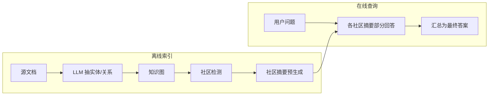

---
tags:
  - technique
  - rag
aliases:
  - GraphRAG
  - 图检索增强生成
prerequisites:
  - "[[rag]]"
  - "[[embedding]]"
  - "[[knowledge-fusion]]"
related:
  - "[[chunking]]"
  - "[[retrieval-pipeline]]"
  - "[[knowledge-extraction]]"
  - "[[crag]]"
  - "[[hyde]]"
stability: mid
layer: application
updated: 2026-06-15
---

# GraphRAG（图检索增强生成）

> [!tip] 核心本质
> **GraphRAG**（Microsoft 2024）在私有语料上先建**实体知识图**与**社区级摘要**，再对「整个数据集在讲什么」类**全局问题**做查询聚焦摘要（QFS）；传统 [[rag]] 按 chunk 向量检索擅长**局部事实**，对跨文档主题、多跳关系往往召回不全。若没有图索引层，「总结全部工单的主题分布」类问题会逼模型硬读 Top-K chunk，产生片面或幻觉性全局结论。

适合已上线向量 [[rag]]、遇到**全局/主题/多跳**问句仍失败的团队。读完 [[#2 机制|§2]] 能复述两阶段索引；[[#3 与向量 RAG 分工|§3]] 决定何时叠加 GraphRAG；[[#4 成本与 Lazy 变体|§4]] 评估索引成本。

*检索说明：机制对照 [GraphRAG arXiv:2404.16130](https://arxiv.org/abs/2404.16130)、[Microsoft Research GraphRAG 博客](https://www.microsoft.com/en-us/research/blog/graphrag-new-tool-for-complex-data-discovery-now-on-github/)、[GitHub microsoft/graphrag](https://github.com/microsoft/graphrag)（观测 2026-06-15）。*

## 生命周期与演进

**当前定位**：Advanced RAG 分支——库内 [[knowledge-fusion]] 提过图与多源，此前无 GraphRAG 专文；与 Agentic RAG 组合时常作**一种检索工具**（关系推理 vs 语义相似）。

**预期寿命**：中期。索引成本高、实体抽取依赖 LLM 质量；LazyGraphRAG 等变体在降本，但图+社区摘要范式仍有效。

**近期演进**：与向量检索并联；Neo4j/LlamaIndex/LangChain 集成；Microsoft Discovery 托管；BenchmarkQED 等评测集出现。

**终极威胁**：长上下文直灌小中库；统一多模态索引内化关系——大库权限与全局摘要需求仍留显式图层。

## 1 问题：Naive RAG 的「全局盲区」

| 问题类型 | 向量 RAG | GraphRAG |
| --- | --- | --- |
| 「Q3 营收是多少？」（局部事实） | ✅ 通常够用 | 过重 |
| 「数据集主要主题有哪些？」（全局） | ❌ Top-K 片面 | ✅ 社区摘要 |
| 「A 与 B 通过谁关联？」（多跳） | ⚠️ 易断链 | ✅ 图路径 |

[GraphRAG 论文][graphrag-paper] 将全局问句形式化为 **query-focused summarization（QFS）**，而非单点 retrieval。

## 2 机制：两阶段索引与查询

1. **索引**：LLM 从文档抽实体与关系 → 建图 → 社区划分 → 为每个社区预生成摘要（可层次化）。
2. **查询**：问题触发相关社区摘要 → 各摘要产生 partial answer → 再汇总为最终响应。

与 [[chunking]] 关系：GraphRAG 仍 consume 源文本，但检索单元从「flat chunk」升为「图 + 社区摘要」；chunk 边界问题部分转移到实体/关系抽取质量。

## 3 与向量 RAG 分工

**互补，非替代**（社区 Agentic RAG 文常见结论）：

| 检索器 | 擅长 |
| --- | --- |
| 向量 / BM25（[[retrieval-pipeline]]） | 精确事实、段落级证据、低延迟 |
| GraphRAG | 全局主题、跨文档结构、多跳关系 |

工程模式：**Router**（[[workflow-patterns]]）按问句类型选工具——事实题走向量，主题/全景题走 GraphRAG；或 Agent 在循环中动态选择。

与 [[knowledge-fusion]]：GraphRAG 是一种**结构化融合视图**；多源冲突仍见 [[conflict-resolution]]。

## 4 成本、LazyGraphRAG 与选型

**成本**：全量 LLM 抽实体 + 社区摘要，索引阶段 token 远高于 [[chunking]] + embed；Microsoft 博客承认需 **LazyGraphRAG**、NLP 近似图等降本路线。

**何时值得上**：

- 语料 ≥ 中等规模且**全局问句**占显著比例
- 愿意承担离线索引 pipeline 与图存储（Neo4j 等）
- 已有向量 RAG，局部题已达标

**何时不必**：

- 几乎全是 lookup 型 FAQ
- 语料很小，可人工摘要或直灌 [[context-window]]

## 5 坑与误区

| 误区 | 事实 |
| --- | --- |
| GraphRAG 替换所有 RAG | 局部事实仍靠向量/BM25 |
| 图一次建好永久有效 | 语料更新需增量索引策略 |
| 忽略实体抽取错误 | 图噪声会放大到社区摘要 |
| 不做 A/B | 应对同一 query 集比 naive RAG 的全面性/多样性 |

## 要点收束

- GraphRAG 解决**全局 QFS**，不是更好的 chunk 检索。
- 索引：实体图 + 社区摘要；查询：map-reduce 式汇总。
- 与向量 RAG 并联或 Routing；Agentic 场景作一种工具。
- 索引成本高；Lazy/近似变体用于降本。
- 开源：[microsoft/graphrag](https://github.com/microsoft/graphrag)。

## 进一步阅读

### 库内关联

- [[rag]] — Naive / Advanced 基线
- [[chunking]] — 向量侧入库粒度
- [[retrieval-pipeline]] — 混合检索与 Rerank
- [[knowledge-fusion]] — 多源结构化视图
- [[workflow-patterns]] — Routing 选型
- [[crag]] — 检索后质量门控

### 外部来源

- [graphrag-paper]: [From Local to Global: GraphRAG (arXiv:2404.16130)](https://arxiv.org/abs/2404.16130)
- [Microsoft GraphRAG 博客](https://www.microsoft.com/en-us/research/blog/graphrag-new-tool-for-complex-data-discovery-now-on-github/)
- [microsoft/graphrag](https://github.com/microsoft/graphrag) — 开源实现
