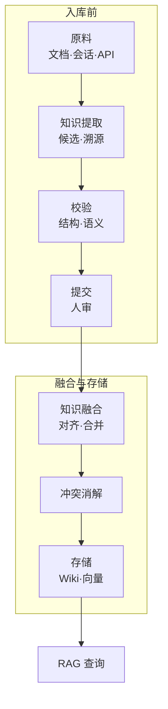

---
tags:
  - technique
  - knowledge-management
aliases:
  - 知识提取
  - Knowledge Extraction
  - 知识抽取
  - IE
prerequisites:
  - "[[llm]]"
  - "[[rag]]"
related:
  - "[[knowledge-fusion]]"
  - "[[conflict-resolution]]"
  - "[[llm-wiki-overview]]"
  - "[[structured-json-output]]"
  - "[[retrieval-pipeline]]"
  - "[[workflow]]"
  - "[[causal-chain]]"
stability: long
layer: application
updated: 2026-06-04
---

# 知识提取（Knowledge Extraction）

> [!tip] 核心本质
> **知识提取**是从异构原文（文档、对话、工单）中析出**带溯源的原子断言**，形成可验收的**候选记录**，再交给下游写入与对齐——它回答「源里说了什么、证据在哪一句」，**不**回答「多源该信谁」或「Wiki 页该怎么改」。若没有提取层，[[knowledge-fusion|知识融合]]只能合并粗糙文本块，实体对齐与 [[conflict-resolution|冲突消解]]缺少稳定键，错误会以「静默覆盖正确来源」的形式进入库。

## 生命周期与演进

**当前定位**：企业知识库、多文档 [[rag]]、会话洞察（Session Insight）流水线的**入库前契约**；与 [[llm-wiki-overview|LLM Wiki]] 的 Ingest 互补——Ingest 是「编译成可浏览 Wiki」，提取是「先产出可校验候选再决定写哪」。

**预期寿命**：长期。数据源只会增多；形态从离线批抽取演进到近实时「会话结束 → 候选包 → 人审/阈值放行 → 融合」。

**近期演进**：[[structured-json-output|结构化 JSON 输出]] 把「结构可靠」与「语义正确」拆开；LLM 抽取 + Schema 约束成为默认交付；图索引期抽取（GraphRAG/LightRAG 建库）与段落级事实抽取并存。

**终极威胁**：超长 context「整段塞进窗口让模型自己记」绕过显式提取与溯源；若平台内置可验证记忆且带来源，提取层在轻量场景变薄——但合规、版本追溯与多源对齐仍需要显式候选契约。

## 核心原理

### 在检索与知识管线中的位置

**图 1：** 提取位于「原料」与「融合」之间，查询时 [[rag]] 读的是已写入的结构，不是当场从 raw 现编。



| 环节 | 回答的问题 | 本篇 / 兄弟文 |
| --- | --- | --- |
| **知识提取** | 源里有哪些可审计断言？证据在哪？ | **本篇** |
| **知识融合** | 多源候选如何对齐到同一实体并更新库？ | [[knowledge-fusion]] |
| **冲突消解** | 同一属性互斥取值信谁？ | [[conflict-resolution]] |
| **RAG 检索** | 查询时召回哪些 chunk / 事实？ | [[rag]]（离线 Index 的 chunk 策略见该文，本篇只讲**抽取向**边界） |
| **LLM Wiki Ingest** | 如何把 raw 编译成持久页面与索引？ | [[llm-wiki-overview]]（工作流与 Schema；读 raw 后的**要点析出机制**链到本篇） |

**分界句（避免混用）**

- **提取**：产出候选，**不**选边、**不**覆盖旧库、**不**直接改实体页。  
- **融合**：在已有候选上做多源对齐与增量更新。  
- **Ingest**：面向 Wiki 制品（页面、链接、目录）；可把**已通过提取验收**的候选写进页面，但 Ingest 不等于「随便摘要一段就入库」。

单源、小库用户也可采用「先候选、再写入」——与多源企业库共用同一习惯，避免会话里的幻觉句直接变成长期记忆。

### 输出契约：抽什么、交付什么

每条**候选知识记录**应满足「人能复核、机器能路由」：

| 维度 | 要求 | 说明 |
| --- | --- | --- |
| **粒度** | 一条记录一句可检验主张 | 避免「整篇摘要」冒充多条事实 |
| **类型** | `definition` / `fact` / `relation` / `procedure` / `preference` / `claim` 等 | 关系类用 subject–predicate–object，属性类用 entity + attribute + value |
| **溯源** | ≥1 条 provenance：`source_id`、原文摘录 `quote`、偏移或标题路径 | 无摘录的主张不得进入 `submit` |
| **实体** | `label` + `entity_type`；`entity_id` 可空 | 跨源同一性留给融合，提取阶段只标本地指称 |
| **置信** | `extraction` 与 `validation` 分开；`aggregate` 供路由 | 与 [[structured-json-output]] 一致：**结构通过 ≠ 事实正确** |
| **阶段** | `sourced` → `extracted` → `validated` → `submitted` | 禁止从 `extract` 直跳融合 |

**最小字段示例**（教学用；生产可扩展）：

```json
{
  "record_id": "uuid",
  "record_kind": "fact",
  "assertion_text": "查询改写将口语映射到文档术语，可缩小检索语义差距",
  "subject": { "label": "查询改写", "entity_type": "technique" },
  "provenance": [{
    "source_id": "doc-rag-guide#chunk-3",
    "source_kind": "vault_chunk",
    "quote": "口语问法与文档术语不一致时，可先对用户查询做改写……",
    "captured_at": "2026-06-04T10:00:00Z"
  }],
  "confidence": { "extraction": 0.82, "validation": 0.9, "aggregate": 0.86 },
  "validation": { "structural_pass": true, "semantic_pass": true, "auto_decision": "accept" },
  "hitl": { "status": "approved" },
  "fusion_handoff": { "ready": true, "temporal_class": "evolving" }
}
```

### 固定流水线：source → extract → validate → submit

编排应用代码握控制流（[[workflow]]），模型只填结构化结果（[[structured-json-output]]）。

1. **source**：登记来源（vault 路径、会话导出、URL）；文档类做**抽取向**分块（标题感知优于纯固定长度）；会话类保留 `turn_id` / `speaker`。  
2. **extract**：按块或按轮调用 LLM，**strict schema** 或 strict tool arguments 输出候选数组；每条带 `quote` 与 `structural_compliance`。  
3. **validate**：JSON Schema 校验 → 批内去重 → 实体类型与 wikilink 合理性 →（可选）与库内已有条目做矛盾启发 → `auto_decision`: `accept` / `needs_review` / `reject`。  
4. **submit**：人审闸门（regulated 域**必须** `approved`；学习库可用阈值 + 抽检）→ `fusion_handoff.ready = true` → 整包交给 [[knowledge-fusion]]。

**禁止跃迁**：未 `validated` 或未过人审的候选，不得静默写入生产库或覆盖 Wiki 页。

### 抽取路径怎么选

| 路径 | 适用 | 注意 |
| --- | --- | --- |
| **规则 / 模板** | 表格、OpenAPI、固定报表 | 成本低；变更要维护规则 |
| **经典 IE / NER+RE** | 领域固定、标注集充足 | 与版面解析配合 |
| **LLM + Schema** | 非结构化文档、会话洞察 | 必须 strict 结构层 + 语义闸门；见 [[structured-json-output]] |
| **索引期图抽取** | GraphRAG/LightRAG **建库**阶段 | 产出边/节点供图检索；查询侧 GraphRAG 见 [[rag]] / [[knowledge-fusion]]，本篇不展开 |

会话提取额外约束：**输入边界**只含当前 `session_id` 的轮次；不要把其他会话记忆、未引用的 RAG 块、系统提示里的「背景常识」写成该会话的事实。若主张来自用户更正，在 provenance 标 `speaker: user` 并提高证据层级。

### Chunk 与文档边界（抽取向）

检索用的 chunk（[[rag]]）追求召回；**抽取用**分块追求「一句主张能对应一段完整语境」：

- 优先**标题感知**切分，避免从表格或列表中间截断。  
- 需要上下文时允许小重叠，但 `quote` 必须来自**同一块**内的连续文本。  
- 表格：单元格 + 列头绑定；图像/扫描件需 OCR 后再抽，并在 provenance 标 `source_kind`。

常见失效：边界截断导致主语丢失；指代未解析（「它」指谁不明）；模型**编造**三元组——用「摘录必须子串匹配」的语义校验挡掉。

## 实践与应用

### 与 LLM Wiki Ingest 的配合

[[llm-wiki-overview]] 的 Ingest 会读 `raw/` 并批量改 Wiki 页。推荐分工：

1. 对每篇 raw 先跑**提取**，得到带 `quote` 的候选；  
2. 人抽检或阈值放行后，再由 Ingest **写**实体页/概念页（或先提交融合再导出到 Wiki）；  
3. Query / Lint 仍按 Wiki 模式运转，**不**替代提取验收。

这样「复利」写在制品上，而不是把未校验的摘要直接编译进库。

### 质量闸门（写库前必做）

| 闸门 | 做法 |
| --- | --- |
| **结构** | Schema / strict tool；失败重试 ≤2 次并回灌校验错误 |
| **语义** | 抽检 `quote` 是否出现在源文本；矛盾于库内则 `needs_review` |
| **实体** | 同名异义（两个同名仓库）须 `contextIdentifier` 或分字段，禁止合并 |
| **去重** | 批内相似度 + 提交前与库内 reconcile；同会话重复跑不应 2× 静默入库 |
| **PII / 密钥** | 写入前 denylist；命中则 block 或 redact，**不**存原文密钥 |
| **指标** | 分开报 `structural_failure_rate` 与 `semantic_failure_rate` |

低置信候选默认 `needs_review`，不要为提高覆盖率放行无摘录记录。

### 交给融合：handoff 清单

提交给 [[knowledge-fusion]] 的 `SubmitBundle` 应包含：

- 全部 `pipeline_stage = submitted` 且 `fusion_handoff.ready = true` 的记录；  
- 每条带 `temporal_class`（`evolving` / `historical` / `timeless`），供融合决定覆盖策略；  
- 可选 `merge_strategy_hint`（`append` / `supersede` / `new_node`）——**提示**而已，最终合并策略由融合与 [[conflict-resolution]] 决定。

互斥属性（「主营硬件」vs「主营软件」）在提取阶段只**标注** `conflict_group_key`，**不**裁决信谁。

> [!note]- 提取阶段自检（可折叠）
> - [ ] 每条主张有 verbatim `quote` 或等价 turn 锚点  
> - [ ] 未在提取阶段做「选更可信来源」「覆盖旧值」  
> - [ ] 结构通过 ≠ 已提交；语义抽检已做  
> - [ ] 会话边界：未写入其他 session 的事实  
> - [ ] PII/密钥扫描通过  
> - [ ] `submit` 前人审或策略放行  

### 小练习

> [!question] 练习 1（约 5 分钟）
> 读下面 150 字片段，写出 **3 条**原子断言，每条附**原文子串**（可复制的一句）。禁止合并成摘要、禁止写「应信 A 不信 B」。  
> *「团队上了 hybrid search 后 NDCG 上升，但客服仍收到『答非所问』。排查发现精排把旧版 FAQ 排在前面，而新版说明在另一索引里；查询改写尚未开启。」*

> [!question] 练习 2（约 3 分钟）
> 将下列步骤标为 **仅提取 / 仅融合 / 仅 Ingest / 仅查询**：{分块, 抽候选, JSON 校验, 实体对齐, 写 Wiki 页, RRF 检索, Truth Discovery}。  
> **答案要点**：抽候选、JSON 校验 → 提取；实体对齐、Truth Discovery → 融合/消解；写 Wiki 页 → Ingest；RRF → 查询。

## 坑与误区

| 误区 | 实际后果 | 纠正 |
| --- | --- | --- |
| 「JSON 解析成功 = 提取成功」 | 结构 100% 通过但幻觉事实入库 | 分开结构/语义指标；强制 `quote` 校验 |
| 「读 PDF 写摘要 = 提取」 | 与 Ingest 重叠，无法融合对齐 | 输出候选记录 + provenance，不是散文摘要 |
| 「提取时顺便去重合并」 | 与融合/消解职责冲突 | 批内去重即可，跨源合并交给融合 |
| 「提示词里强调认真就不会 hallucinate」 | 共现推断仍会编造边 | .harness 闸门 + 人审，不只改 prompt |
| 「会话里模型说的都算知识」 | 把推理当事实，污染长期库 | 区分 `user` / `tool` 证据层级；助手推论默认低置信或拒绝 |

排障时：若库内事实错但来源难查，用 [[causal-chain]] 区分是**抽错**（无摘录、错 session）还是**融错**（对齐到错误实体、静默覆盖）。

## 进一步阅读

**本库节点**

- [[knowledge-fusion]] — 多源对齐与三层融合；假定本篇已产出候选  
- [[conflict-resolution]] — 互斥取值消解；发生在融合写入之后或批处理阶段  
- [[llm-wiki-overview]] — raw / wiki / schema 与 Ingest / Query / Lint  
- [[structured-json-output]] — strict schema 与结构/语义两层失败  
- [[rag]] — 查询侧检索与 Index chunk；与抽取向分块对照  
- [[retrieval-pipeline]] — 生产检索架构总览  
- [[workflow]] — 提取流水线应由代码编排  
- [[causal-chain]] — 抽错 vs 融错的归因  
- [[knowledge-fusion-tools]] — 融合与消解相关工具索引  

**外部**

- OpenIE、REBEL 等开放信息抽取基线（经典管线对照）  
- GraphRAG / LightRAG 原文（索引期图抽取）  
