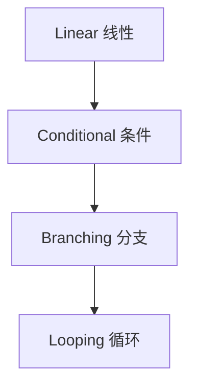

---
tags:
  - technique
  - rag
aliases:
  - Modular RAG
  - 模块化 RAG
prerequisites:
  - "[[rag]]"
  - "[[retrieval-pipeline]]"
related:
  - "[[query-transformation]]"
  - "[[crag]]"
  - "[[hyde]]"
  - "[[chunking]]"
  - "[[graph-rag]]"
  - "[[triggering-retrieval]]"
  - "[[langchain]]"
  - "[[langgraph]]"
stability: mid
layer: application
updated: 2026-06-15
---

# Modular RAG（模块化 RAG）

> [!tip] 核心本质
> **Modular RAG**（[Gao et al., 2024][modular-rag-paper]）把 RAG 从固定的「retrieve-then-generate」线性链，拆成可重组的**模块与算子**（路由、调度、融合、循环），像 LEGO 一样拼出 Naive / Advanced / Agentic 管线。若仍用单线 pipeline 思维，[[hyde]]、[[crag]]、[[graph-rag]] 等增强只能硬插步骤，难以表达「有时不检索、有时多轮换源」的条件与循环结构。

适合已读 [[rag]]、[[retrieval-pipeline]]，需要**架构 vocabulary** 设计或重构 RAG 的工程师。读完 [[#2 演进与模块|§2]] 能画出自己的模块图；[[#3 四种模式|§3]] 对照现有实现；[[#4 与框架|§4]] 连接 LangChain/LangGraph。

*检索说明：框架对照 [Modular RAG arXiv:2407.21059](https://arxiv.org/abs/2407.21059)；模式与库内节点交叉核对（观测 2026-06-15）。*

## 生命周期与演进

**当前定位**：RAG 架构**索引文**——map 待补充表 P1；库内已有各算子专文（[[hyde]]、[[crag]]、[[query-transformation]]），缺总框架。

**预期寿命**：中期。算子名随产品变，「非单线、可路由可循环」的设计语言稳定。

**近期演进**：LangGraph 等把 modular 模式落实为图；Agentic RAG 即 looping + routing 的极端形态。

**终极威胁**：托管 RAG 黑盒吸收模块差异；团队只需 API 时不关心算子名——但调试仍要模块边界。

## 1 问题：线性 RAG 装不下 Advanced 技巧

Naive：`chunk → embed → retrieve → generate`。

Advanced 实际可能是：

- 先判断**要不要检索**（[[triggering-retrieval]]）
- Query **改写 / HyDE**（[[query-transformation]]、[[hyde]]）
- 检索后 **CRAG 评估换源**（[[crag]]）
- **Graph + 向量**两路融合（[[graph-rag]]、[[retrieval-pipeline]]）

这些不是「更长的直线」，而是**条件分支与回路**——Modular RAG 用统一词汇描述。

## 2 演进与模块

论文归纳三代：

| 代际 | 特征 | 库内 |
| --- | --- | --- |
| Naive RAG | 单线 retrieve-generate | [[rag]] |
| Advanced RAG | 固定链上叠加改写、混合、Rerank | [[retrieval-pipeline]]、[[query-transformation]] |
| Modular RAG | 独立模块 + 算子，可路由/调度/融合 | 本篇 |

**模块**示例：索引、检索、生成、路由、融合。**算子**示例：rewrite、rerank、compress、validate——各算子可映射到库内专文。

## 3 四种架构模式

| 模式 | 控制流 | 例 |
| --- | --- | --- |
| **Linear** | 固定顺序 | Naive / 固定 Advanced 链 |
| **Conditional** | 按条件选路径 | 低置信度 → [[hyde]]；高置信度 → 直答 |
| **Branching** | 并行多路再融合 | BM25 ∥ Dense → [[rrf]]；向量 ∥ [[graph-rag]] |
| **Looping** | 迭代直到达标 | [[crag]] 换源；Agentic 多轮 retrieve |

[[workflow-patterns]] 的 Routing / Evaluator-Optimizer 与 Conditional / Looping 同构；差异在 RAG 域算子命名与数据契约。

## 4 与框架落地

- **LangChain**：LCEL / Runnable 链 = Linear；RouterRunnable = Conditional
- **LangGraph**：显式图 = Branching + Looping + 检查点（见 [[langgraph]]）
- **LlamaIndex**：QueryPipeline、RouterQueryEngine 等

选型原则：模块边界清晰 → 单测算子 → 图编排连起来；避免「一个 2000 行脚本」。

## 5 设计检查单

1. **检索触发**是否独立模块？（[[triggering-retrieval]]）
2. **Query 侧**与 **Index 侧**（[[chunking]]）是否分开迭代？
3. 失败路径是否有 **Loop**（[[crag]]）而非静默胡答？
4. 多源是否显式 **Fusion**（[[rrf]]、[[knowledge-fusion]]）？
5. 能否画出 Conditional/Loop 图给新同事？

## 要点收束

- Modular RAG = 模块 + 算子 + 路由/调度/融合，超越单线 retrieve-generate。
- 四代模式：Linear → Conditional → Branching → Looping。
- 库内专文（hyde/crag/graph/chunking）是算子；本篇是架构索引。
- LangGraph 等是模块化 RAG 的常用运行时。
- 论文：[arXiv:2407.21059][modular-rag-paper]。

## 进一步阅读

### 库内关联

- [[rag]] — Naive 基线
- [[retrieval-pipeline]] — Advanced 生产链
- [[triggering-retrieval]] — 是否检索
- [[crag]] — Looping 纠错
- [[graph-rag]] — 图检索模块
- [[langgraph]] — 图运行时

### 外部来源

- [modular-rag-paper]: [Modular RAG (arXiv:2407.21059)](https://arxiv.org/abs/2407.21059)
