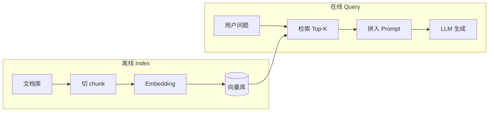

# RAG（检索增强生成）

> [!tip] 核心本质
> RAG 是在 LLM 生成答案**之前**，从外部知识库检索相关片段并注入上下文的技术框架。如果没有它，模型只能依赖训练权重里的压缩知识——私有文档进不去、知识截止后的事实查不到，要么拒答，要么在「看起来合理」的幻觉里编造；与其反复微调把世界塞进权重，不如让模型每次回答时**现查现用**。

## 生命周期与演进

**当前定位**：成熟期基础设施。Naive RAG（切 chunk → 向量检索 → 拼 prompt）已是企业知识库、客服、Copilot 类产品的默认架构；工程重心已从「能不能做」转向检索质量、延迟、评测与治理。

**预期寿命**：长期。只要 LLM 上下文有限、训练数据有截止、组织知识持续更新，「外部检索 + 生成」就比「全量进权重」更经济。形态会从单路向量检索，演化为多阶段 Agentic RAG 与混合检索栈。

**近期演进**：查询改写 / [[hyde]] / 子查询拆解（见 [[query-transformation]]）、重排序（Rerank）、GraphRAG、[[crag]] 式「检索评估后再换策略」、以及把 RAG 作为 Agent 工具节点而非固定流水线。多源异构知识场景向上衔接 [[knowledge-fusion]]。

**终极威胁**：超长上下文下中小库「全量塞进窗口」绕过检索；端到端检索（模型内置 retrieval head）吸收显式 RAG 管线；基础模型实时浏览/API 能力增强后，部分「查文档」场景退化为 [[tool-use]]。RAG 不会消失，但会从默认架构收缩为**大规模、多模态、需权限与版本治理**的知识接入层。

## 核心机制：从索引到生成

RAG 不改变模型权重，在每次推理时动态注入相关知识。经典四步可概括为 **Index → Retrieve → Augment → Generate**：



### 1. 索引（Index，离线）

- 将文档切分为 chunk（常见 200–500 token，需按文档类型调优）；
- 用 [[embedding]] 模型把 chunk 映射为向量，写入向量库（Chroma、Pinecone、pgvector 等）；
- 可选：同时建关键词索引（BM25）、知识图谱边，供混合检索。

索引质量决定上限：切得太碎丢上下文，切得太大稀释语义、占满 [[context-window]]。

### 2. 检索（Retrieve，在线）

- 用户问题（常经 [[query-transformation]] 改写）同样 embed 成向量；
- 在向量库中取 Top-K 最相似 chunk（常用余弦相似度）；
- 进阶：Rerank 交叉编码器重排、MMR 去冗余、按 metadata 过滤（时间、部门、权限）。详见 [[retrieval-pipeline]]。

语义检索的优势：「苹果手机」与「iPhone」不必关键词完全匹配。主要失效模式：**查询—文档语义鸿沟**——用户口语与文档书面语不对齐，检索到错误 chunk 比不检索更危险。

### 3. 增强（Augment）

- 将 Top-K chunk 与系统提示、用户问题组装进 prompt；
- 受 context 窗口硬约束——检索到 10 段却放不下时，需要裁剪、摘要或分层注入，属于 [[context-engineering]] 范畴；
- 应要求模型**基于文档作答**并标注来源，降低但不消除幻觉。

### 4. 生成（Generate）

- [[llm]] 阅读增强后的上下文生成答案；
- 在 Agent 场景中，RAG 常实现为 `search_knowledge_base` 类工具，由模型决定何时检索、检索什么，而非每条消息固定检索。

### Naive RAG vs Advanced RAG

| 层次 | 做法 | 典型痛点 |
| --- | --- | --- |
| **Naive** | 切 chunk → 单向量检索 → 拼 prompt | 语义鸿沟、多跳问题、chunk 边界断句 |
| **Advanced** | 查询转换 + 混合检索 + Rerank + 迭代检索 | 延迟、管线复杂、评测难 |
| **Agentic** | LLM 规划检索步骤、多轮查库、自检是否够答 | 成本高、需 Harness 约束 |

经验法则：**先 Naive 跑通评测基线，再按失败 case 加环节**——不要一上来堆满 HyDE + GraphRAG + 三跳 Agent。

## RAG 与相邻方案怎么选

### RAG vs 微调

| 场景 | 更合适的方案 |
| --- | --- |
| 知识频繁更新（日/周级） | RAG |
| 知识量大（百万文档级） | RAG |
| 需改变模型行为 / 风格 / 格式习惯 | 微调（或 RLHF / 偏好对齐） |
| 需内化领域推理模式（非单纯查事实） | 微调 + RAG 常组合 |
| 私有数据不能上传云端训练 | RAG（本地索引 + 本地模型） |

**先试 RAG，微调是改行为时的手段，不是查知识的默认解。**

### RAG vs Skill

| | RAG | Skill |
| --- | --- | --- |
| 知识类型 | 陈述性（文档事实） | 程序性（SOP、流程） |
| 加载 | 检索相关 chunk | Discovery → Activation |
| 典型问题 | 「规范里怎么写」 | 「按什么步骤审核」 |

二者常组合：RAG 拉规范原文，Skill 定步骤与输出格式。见 [[agent-context-stack]]。

### RAG vs 知识融合

[[knowledge-fusion]] 解决**多源异构知识如何对齐、冲突消解、版本更新**；RAG 常是其**推理层**实现之一（检索多源 chunk 再生成）。单源文档问答用 RAG 足够；多库、多格式、多版本矛盾时要在 RAG 之前或之中做融合与 [[conflict-resolution]]。

### RAG 在 Agent 中的位置

RAG 提供「读外部知识」能力；[[tool-use]] 提供「执行动作」能力。有效 Agent 往往两者兼有：先检索规范/手册，再调 API 改状态。见 [[building-effective-agents]]。

## 实践要点与常见坑

### 示例：内部知识库问答

```
知识库：500 份内部 PDF

用户：「Q3 财报里新产品发布计划是什么？」

1. （可选）查询改写 → 独立完整问句
2. 问题 embed → 向量库 Top-K → 命中 Q3 财报相关 chunk
3. Prompt：[系统角色] + [检索段落] + [用户问题]
4. LLM 基于段落作答；无 RAG 则拒答或编造
```

### 坑点清单

| 坑点 | 现象 | 对策 |
| --- | --- | --- |
| 以为 RAG = 零幻觉 | 检索错或模型不跟文档仍瞎编 | 引用约束 + 评测；检索置信度低时拒答/换策略 |
| chunk 越大越好 | 占满窗口、信号稀释 | 按段落语义切分；重叠窗口；Rerank |
| 检索即万事大吉 | 语义鸿沟导致错 chunk | [[query-transformation]]；混合检索 |
| RAG 替代微调 | 风格/技能仍不对 | 分工：RAG 管知识，微调管行为 |
| 忽略权限与版本 | 检索到过期或越权文档 | metadata 过滤；融合层版本策略 |

## 进一步阅读

- Lewis et al., [Retrieval-Augmented Generation for Knowledge-Intensive NLP Tasks](https://arxiv.org/abs/2005.11401) — RAG 原始论文（2020）。
- [[embedding]] — 向量从哪来、相似度为何有效；RAG 检索的地基。
- [[chunking]] — 入库分块策略：fixed、parent-child、Late/Contextual；检索质量第一杠杆。
- [[query-transformation]] — 查询改写、[[hyde]]、子查询拆解；Advanced RAG 的前置环节。
- [[crag]] — 检索后评估与三态纠错；检索失败时加固生成。
- [[rrf]] — 多路检索排名融合（RRF）原理、加权 k 与实现要点。
- [[retrieval-pipeline]] — 检索全链路深度拆解：粗排/精排/融合/Rerank 模型选型/生产架构。
- [[knowledge-fusion]] — 多源知识对齐与融合；RAG 只覆盖其子集。
- [[context-engineering]] — 检索结果如何塞进有限窗口、如何控信噪比。
- [[prompt-engineering]] — 检索段落与用户问题的 prompt 组装。
- [[agent-context-stack]] — RAG 与 Skill / Memory 分工。
- [[building-effective-agents]] — Agent 场景中 RAG 作为工具节点的用法。
- [LangChain RAG 文档](https://python.langchain.com/docs/tutorials/rag/) / [LlamaIndex 文档](https://docs.llamaindex.ai/) — 常用工程框架参考。
