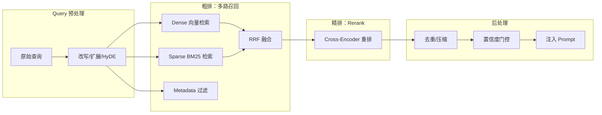

# 检索全链路（Retrieval Pipeline）

> [!tip] 核心本质
> RAG 的质量上限由检索决定——生成再强，喂错 chunk 也没用。检索全链路把一次「找相关文档」的请求分解为：**Query 预处理 → 粗排（多路召回）→ 融合 → 精排（Rerank）→ 后处理**，每一层用不同代价的模型逐步提升精准度。若只做单路向量检索，会同时丢失精确匹配（ID/错误码等）和语义匹配（口语与书面语鸿沟），进而产生可信度更高的错误答案。

## 生命周期与演进

**当前定位**：混合检索（BM25 + dense）+ Cross-Encoder Rerank 已成工业标准；评测框架（RAGAS、BEIR）进入产品落地必选项。单路向量检索仍是 POC 默认，生产系统已普遍升级为多阶段。

**预期寿命**：中长期。Embedding 模型、Reranker 选型演化快（BGE、Jina、Cohere 每年迭代）；但粗排→精排的两阶段架构本身稳定——来自传统搜索引擎十年的经验。

**近期演进**：端到端检索模型（ColBERT/PLAID）将粗精排合一；bge-m3 用一个模型同时输出 dense + sparse + ColBERT 三路向量；LLM-as-judge 用于在线评估检索质量；Agentic RAG 让模型动态决定检索策略。

**终极威胁**：超长上下文（10M token）在中小库直接「全量入窗口」绕过检索；模型内置实时检索 head 合并显式 pipeline；但大型私有知识库的权限管控、版本治理需求使显式检索长期存在。

### 本链路算法索引

| 算法 | 节点 | 在链路中的位置 |
| --- | --- | --- |
| 稀疏打分 | [[bm25]] | Sparse 粗排 |
| 稠密向量与相似度 | [[dense-vector]]、[[bi-encoder]]、[[cosine-similarity]] | Dense 粗排（实现常经 [[ann]]） |
| 向量索引 | [[ann]] | 大规模近似最近邻 |
| 排名融合 | [[rrf]] | 多路列表合并 |
| 精排打分 | [[cross-encoder]] | 第四阶段 Rerank |

## 全链路概览



下表为**示意性消融对比**，用于说明各阶段的相对贡献量级，数字并非来自单一可引用的权威 benchmark，**不应作为生产选型的精确依据**：

| 方案 | 准确率（示意） | 延迟（示意） | NDCG@10（示意） |
| --- | --- | --- | --- |
| 仅 Dense（FAISS） | ~62% | ~15ms | ~0.61 |
| 仅 Sparse（BM25） | ~58% | ~8ms | ~0.57 |
| 混合检索（无 Rerank） | ~79% | ~25ms | ~0.78 |
| **完整四级链路** | **~91%** | **~75ms** | **~0.90** |

核心结论是方向性的：Dense + Sparse 互补带来最大的召回增益；Rerank 以约 50ms 延迟换取最大的精准度提升。**实际数字强依赖数据集、模型选型和参数配置，应在自己的数据上跑消融实验。** 权威横向对比见 [BEIR benchmark](https://github.com/beir-cellar/beir)。

---

## 第一阶段：Query 预处理

用户原始查询往往不是最好的检索输入——口语短句、缩写、多语混用都会让向量或 BM25 偏移。

| 技术 | 做什么 | 适用场景 |
| --- | --- | --- |
| **查询改写** | 同义词扩展、补全上下文 | 口语查询、历史依赖查询 |
| **HyDE** | 先让 LLM 生成假设答案，用假设答案的 embedding 去检索 | 专业领域、用户表述和文档语言差距大 |
| **多查询拆解** | 将复合问题拆为 N 个子查询分别检索后合并 | 多跳问题、聚合型问答 |
| **语言归一** | 多语查询翻译为主语言 | 中英混库 |

详见 [[query-transformation]]。

**工程建议**：改写增加一次 LLM 调用（~100ms），不是所有场景值得。先测基线；仅当「语义鸿沟导致召回错误」是主要失败原因时引入。

---

## 第二阶段：粗排（多路召回）

粗排的目标是**高召回率**：以较低代价从库里捞出尽可能多的候选，允许一定噪声（精排来修正）。

### Dense 向量检索

用 Embedding 模型把查询和文档都映射到向量空间，通过 ANN（近似最近邻）搜索 Top-K。底层索引结构是**图/量化索引**（HNSW、IVF-PQ 等，详见 [[ann]]），与 BM25 的倒排索引是完全不同的数据结构——两者擅长的查询类型也因此互补。

**优势**：捕捉语义相似性，「iPhone」和「苹果手机」能互相命中。

**劣势**：对精确标识符（错误码、合同条款编号、API 参数名）效果差；多语言库中语言切换导致向量漂移。

**ANN 索引算法**（算法细节见 [[ann]]）：

| 算法 | 原理 | 适用场景 |
| --- | --- | --- |
| **HNSW** | 分层小世界图，搜索时按图遍历 | 默认首选；查询快，内存占用高 |
| **IVF-PQ** | 倒排 + 乘积量化压缩 | 超大库（亿级）节省内存 |
| **Flat** | 暴力精确搜索 | 小库（<10 万）或评测基准 |
| **ScaNN** | Google 开源，各向异性量化 | 大规模部署，精度/速度均衡 |

**常用 Embedding 模型**：

| 模型 | 参数量 | 特点 | 推荐场景 |
| --- | --- | --- | --- |
| `bge-m3` (BAAI) | 570M | Dense + Sparse + ColBERT 三合一，中英 MTEB 顶级 | 首选，尤其中文场景 |
| `text-embedding-3-large` (OpenAI) | — | 闭源 API，多语强，开箱即用 | 快速原型，预算充足 |
| `e5-mistral-7b-instruct` | 7B | 质量极高，延迟大 | 离线索引，对质量要求高 |
| `all-MiniLM-L6-v2` | 22M | 极轻，384 维 | POC、本地部署资源受限 |
| `jina-embeddings-v3` (Jina) | 570M | 多语，支持长文 | 多语言场景 |

### Sparse 关键词检索（BM25）

**[[bm25]]** 是粗排中「稀疏 / 词法」一路：倒排索引召回候选，BM25 公式排序。与 Dense 向量路（[[ann]]）互补——前者擅精确 token，后者擅语义近义；分数不可比，融合见 [[rrf]]。

实现选型（详表与公式见 [[bm25]]）：

| 库 | 语言 | 特点 |
| --- | --- | --- |
| `rank_bm25` | Python | 纯 Python，小库够用 |
| Elasticsearch / OpenSearch | Java | 生产级，分布式，支持 kNN 混合 |
| Apache Lucene / Tantivy | Java/Rust | 底层引擎；Tantivy 是 Rust 实现极快 |
| Qdrant sparse vectors | Rust | 向量库内置稀疏向量，无需额外 ES |
| Milvus + BM25 function | Go | Milvus 2.5+ 内置 BM25，一库解决混合 |
| SQLite **FTS5** | C（内嵌） | 单文件零依赖倒排+BM25；见 [[fts5]] |

### Metadata 过滤

在向量检索之前或之后按结构化字段过滤，属于「零代价的精排」：

- **时间过滤**：`created_at > 2024-01-01`（过滤过期文档）
- **权限过滤**：`user_role IN allowed_roles`（ACL 控制）
- **来源过滤**：`source == "official_docs"`（优先官方）
- **语言过滤**：`lang == query_lang`（避免语言混乱）

**Pre-filter vs Post-filter**：描述的是过滤条件在检索流程中的位置。

| | Pre-filter（先过滤再检索） | Post-filter（先检索再过滤） |
| --- | --- | --- |
| 流程 | 全量 → [条件过滤] → 子集 → ANN | 全量 → ANN Top-K → [条件过滤] |
| 优点 | 结果一定满足条件，精确 Top-K | ANN 索引结构完整，检索质量稳定 |
| 失效场景 | 子集太小（<1000 条），图索引退化 | 命中率低时（如只有 1% 文档满足），结果不足 K 个 |

**超采样（Milvus / Qdrant 主流做法）**：Post-filter + 放大初始召回量（fetch K×10），过滤后仍能凑齐 K 个结果，同时避免 Pre-filter 的索引退化问题。选择性 < 5% 时（绝大多数文档被过滤）倾向 Pre-filter；选择性 > 30% 时超采样更优。

---

## 第三阶段：融合（RRF）

多路召回（Dense、BM25、Sparse、多查询等）各自返回**不可比**的原始分数，本阶段用 **[[rrf]]（倒数排名融合）** 只按排名合并为统一候选榜：默认 `k=60`，可按文档类型对各路设 `weight_i`。公式、直觉、与 CombSUM/Condorcet 的对比、权重起点表与最小 Python 实现见专文；此处只强调在全链路中的位置——**融合在粗排之后、Rerank 之前**，负责把「捞得宽」的多路结果收成可精排的 Top-N。

---

## 第四阶段：精排（Rerank）

精排用 [[cross-encoder]] 对融合后的 Top-K（常见 50–100）逐对 **联合注意力打分**，修正粗排里「关键词像、语义偏」的噪声，再取 Top-N（3–10）注入 prompt。[[bi-encoder|双塔]]（[[embedding]] + [[cosine-similarity]]）与 [[bm25]] 保 **召回**；交叉编码器保 **精准**——架构对比、相似度计算、复杂度下界与 ColBERT 折中见专文，本篇只保留 **选型与落地**。

**实测延迟**：单 A10 GPU，`bge-reranker-v2-m3` FP16 约 200–400 pair/s，50 候选约 125–250ms。

### 主流 Reranker 模型

| 模型 | 来源 | 特点 | 推荐场景 |
| --- | --- | --- | --- |
| `bge-reranker-v2-m3` (BAAI) | 开源 | 中英双语强，轻量，生产首选 | 中文或中英混合场景 |
| `bge-reranker-v2-gemma` (BAAI) | 开源 | 质量更高，延迟更大 | 对质量要求最高时 |
| `Qwen3-Reranker` (Alibaba) | 开源 | 2025 新发布，中文有优势 | 中文场景替代/对比 |
| `jina-reranker-v2-base-multilingual` | 开源 | 多语言，延迟友好 | 多语言库 |
| Cohere Rerank 3 | 闭源 API | 多语强，开箱即用 | 快速原型，预算充足 |
| `cross-encoder/ms-marco-MiniLM-L-6-v2` | 开源 | 极轻（英文），老牌基线 | 英文，资源极受限 |

### ColBERT：粗精排合一的新选择

ColBERT 等 **late interaction** 介于双塔与全交互 Cross-Encoder 之间（机制见 [[cross-encoder]]）。`bge-m3` 可同时出 dense + sparse + ColBERT 路，在延迟敏感时替代或补充全交互 rerank。

### 代码示例

```python
from FlagEmbedding import FlagReranker

reranker = FlagReranker('BAAI/bge-reranker-v2-m3', use_fp16=True)

# query 与每个候选 chunk 配对打分
scores = reranker.compute_score(
    [[query, chunk] for chunk in candidate_chunks],
    normalize=True  # 输出 0-1 置信度
)

# 按分数降序取 Top-5
ranked = sorted(zip(scores, candidate_chunks), reverse=True)[:5]
```

```python
# Milvus 内置 Reranker（Python SDK）
from pymilvus.model.reranker import BGERerankFunction

bge_rf = BGERerankFunction(
    model_name="BAAI/bge-reranker-v2-m3",
    device="cuda:0"
)
results = bge_rf(query=query, documents=candidates, top_k=5)
```

---

## 第五阶段：后处理

### 去重与压缩

粗排多路召回会带来重复 chunk（同一文档的相邻段落都被召回）。

- **MMR（最大边际相关性）**：在相关性和多样性之间权衡，`score = λ × sim(q, d) - (1-λ) × max_sim(d, selected)`
- **语义去重**：若两个 chunk 余弦相似度 > 0.95，只保留排名高的
- **摘要压缩**：超长 chunk 用 LLM 压缩为关键句，节省 [[context-window]]

### 置信度门控

Reranker 的 Top-1 分数可作为「是否有足够证据作答」的判据：

```python
TOP1_THRESHOLD = 0.4  # 经验值，按库类型调整

if max(scores) < TOP1_THRESHOLD:
    return "抱歉，知识库中未找到与您问题相关的内容。"
```

这一步能显著降低「检索到无关 chunk 后仍强行作答」导致的幻觉。

### 引用与溯源

将 Top-K chunk 的来源（文件名、章节、页码、URL）随答案一起返回，便于用户验证：

```python
context = "\n\n".join([
    f"[来源 {i+1}: {chunk.source}]\n{chunk.text}"
    for i, (score, chunk) in enumerate(ranked)
])
prompt = f"根据以下资料回答问题，必须标注来源编号：\n{context}\n\n问题：{query}"
```

---

## 工具与库生态

### 向量数据库

| 库 | 托管 | 特点 | GitHub |
| --- | --- | --- | --- |
| **Milvus** | 自托管/云 | 功能最全；2.5+ 内置 BM25、sparse vector、Reranker | [milvus-io/milvus](https://github.com/milvus-io/milvus) |
| **Qdrant** | 自托管/云 | Rust 实现，极快，内置 sparse + dense | [qdrant/qdrant](https://github.com/qdrant/qdrant) |
| **Weaviate** | 自托管/云 | GraphQL API，内置混合检索 | [weaviate/weaviate](https://github.com/weaviate/weaviate) |
| **pgvector** | PostgreSQL 插件 | 无需额外服务，适合已有 PG 的项目 | [pgvector/pgvector](https://github.com/pgvector/pgvector) |
| **Chroma** | 嵌入式 | 极简，POC 首选 | [chroma-core/chroma](https://github.com/chroma-core/chroma) |
| **FAISS** | 本地库 | Meta 出品，底层 ANN 工具箱 | [facebookresearch/faiss](https://github.com/facebookresearch/faiss) |

### RAG 框架

| 框架 | 特点 | GitHub |
| --- | --- | --- |
| **LlamaIndex** | 最完整的 RAG 组件库，Pipeline 抽象强 | [run-llama/llama_index](https://github.com/run-llama/llama_index) |
| **LangChain** | 生态最大，Retriever / Reranker 丰富 | [langchain-ai/langchain](https://github.com/langchain-ai/langchain) |
| **Haystack** | 德国 deepset 出品，检索评测完善 | [deepset-ai/haystack](https://github.com/deepset-ai/haystack) |
| **RAGFlow** | 开源企业级 RAG，内置文档解析+混合检索 | [infiniflow/ragflow](https://github.com/infiniflow/ragflow) |

### Embedding 与 Reranker

| 库 | 用途 | GitHub |
| --- | --- | --- |
| **sentence-transformers** | 一站式 Bi-Encoder + Cross-Encoder | [UKPLab/sentence-transformers](https://github.com/UKPLab/sentence-transformers) |
| **FlagEmbedding** (BAAI) | BGE 系列模型官方库，支持 bge-m3 三模 | [FlagOpen/FlagEmbedding](https://github.com/FlagOpen/FlagEmbedding) |
| **rank_bm25** | 纯 Python BM25 实现 | [dorianbrown/rank_bm25](https://github.com/dorianbrown/rank_bm25) |

### 评测

| 工具 | 用途 | GitHub |
| --- | --- | --- |
| **RAGAS** | RAG 系统端到端评测（检索 + 生成） | [explodinggradients/ragas](https://github.com/explodinggradients/ragas) |
| **BEIR** | 信息检索 benchmark 基准集（18 个数据集） | [beir-cellar/beir](https://github.com/beir-cellar/beir) |
| **MTEB** | Embedding 模型排行榜，含中文 | [embeddings-benchmark/mteb](https://github.com/embeddings-benchmark/mteb) |

---

## 生产架构参考

```
API Gateway
  → Query Service
      → Query Rewriter（HyDE / 多查询 / 语言归一）
      → Router（意图识别 / 知识库选择）
      → Retriever（Milvus Dense + ES BM25 并行）
          → RRF 融合（k=60，按文档类型加权）
      → Reranker（bge-reranker-v2-m3，Top-50 → Top-5）
      → 置信度门控（score < 0.4 → 拒答）
      → Prompt Builder（拼 context + 引用标注）
  → LLM Gateway（vLLM / Bedrock）
  → 可观测性（全链路 trace：原始查询/改写/BM25结果/向量结果/rerank分数/选中chunk/拒绝chunk/token消耗/延迟）
```

**演进路径**（按需添加，不要一步到位）：

1. **最小可用**：Chroma + Naive 向量检索，跑通端到端
2. **加 BM25**：引入 Elasticsearch 或 Qdrant sparse，RRF 融合 → 准确率 +15–30%
3. **加 Reranker**：bge-reranker-v2-m3 对 Top-50 重排 → 再 +10–15%
4. **加 Query 改写**：HyDE 或多查询，改善语义鸿沟
5. **加评测**：RAGAS 建立每版本 benchmark，让每次改动有数据支撑

---

## 评测指标速查

| 指标 | 公式 | 衡量什么 |
| --- | --- | --- |
| **Recall@K** | 相关文档命中数 / 全部相关文档数 | 粗排阶段：有没有把对的捞出来（详见 [[recall-at-k]]） |
| **Precision@K** | Top-K 中相关文档数 / K | 精排阶段：捞出来的对不对 |
| **NDCG@K** | 考虑排名位置的 DCG 归一化 | 综合召回+排名质量 |
| **MRR** | 第一个相关文档排名的倒数均值 | 第一名命中率 |
| **Groundedness** | 答案可被检索片段支撑的比例 | RAG 生成是否基于文档 |
| **Answer Relevancy** | 答案与问题的相关性（LLM 打分） | 端到端生成质量 |

---

## 进一步阅读

- [[recall-at-k]] — Recall@K / Recall@5 定义、手算示例、与 Precision/NDCG 分工
- [[rag]] — RAG 整体框架概述与适用场景判断
- [[rrf]] — 多路排名融合（RRF）专文：公式、k、加权与常见误区
- [[query-transformation]] — Query 预处理的各种技术（HyDE、多查询、子查询）
- [[embedding]] — Embedding 模型原理，向量相似度为何有效
- [[context-engineering]] — 检索结果如何在有限窗口内高效组装
- [FlagEmbedding](https://github.com/FlagOpen/FlagEmbedding) — BGE 系列 embedding + reranker 官方实现
- [BEIR Benchmark](https://github.com/beir-cellar/beir) — 跨域检索评测基准
- [E.V.A. Cascading Retrieval](https://github.com/Eva-iq/E.V.A.-Cascading-Retrieval) — 四级级联检索生产实践
- Lewis et al., [RAG 原始论文](https://arxiv.org/abs/2005.11401)（2020）
