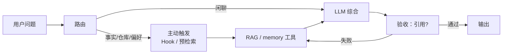
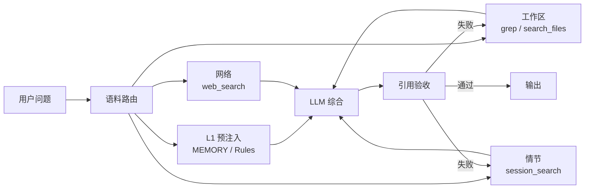

---
tags:
  - practice
aliases:
  - triggering retrieval
  - 触发检索
  - 如何触发检索
  - retrieval gating
  - 检索闸门
prerequisites:
  - "[[llm]]"
  - "[[agent]]"
  - "[[rag]]"
related:
  - "[[reAct]]"
  - "[[memory]]"
  - "[[token-prediction]]"
  - "[[rlhf]]"
  - "[[rlhf-bias]]"
  - "[[harness-engineering]]"
  - "[[workflow]]"
  - "[[query-transformation]]"
  - "[[retrieval-pipeline]]"
  - "[[function-calling]]"
  - "[[cursor-hooks]]"
  - "[[skill]]"
  - "[[agent-context-stack]]"
  - "[[langgraph]]"
  - "[[hermes-agent-memory]]"
stability: long
layer: application
updated: 2026-06-15
---

# 如何更好地触发检索

> [!tip] 核心本质
> **触发检索**是在 [[agent|Agent]] 回答前，让系统可靠地执行「查外部知识 / 回忆记忆 / 载入程序性 SOP」——靠编排、路由、工具设计与验收，而不是指望模型在 [[reAct]] 里「想起来」该搜。若只把 `search` 挂进工具列表却不设计触发路径，[[token-prediction|下一词元预测]]与 [[rlhf|人类反馈强化学习（RLHF）]] 对齐会压低检索概率，模型倾向凭参数记忆直答，[[rag]] 再完善也常在运行时接不上。

适合已搭好 [[rag]] 或 [[memory]]、却发现 Agent **很少主动查**的读者。建议阅读顺序：[[#1 为何 Agent 难触发检索|§1–§2]] 弄清问题与边界 → [[#3 框架：检索对象、语料库与问句锚点|§3–§4]] 建立语料与观感落差的框架 → [[#5 按问题类型选触发策略|§5]] 选型 → [[#6 触发链总览与成熟度|§6–§7]] 总览与实践六步 → [[#8 参考实现：Hermes 的三速记忆|§8–§9]] 行业参考与端到端伪代码 → [[#11 场景速查|§11]] 场景对照。

*检索说明：OpenAI [Function calling / tool_choice](https://developers.openai.com/api/docs/guides/function-calling)；CRAG [Yan et al., 2024](https://arxiv.org/abs/2401.15884)；Self-RAG [Asai et al., ICLR 2024](https://selfrag.github.io/)；Anthropic [Writing tools for agents](https://www.anthropic.com/engineering/writing-tools-for-agents)、[Context engineering for agents](https://www.anthropic.com/engineering/effective-context-engineering-for-ai-agents)；Hermes Agent [memory 用户指南](https://github.com/NousResearch/hermes-agent/blob/main/website/docs/user-guide/features/memory.md)、[prompt 组装](https://github.com/NousResearch/hermes-agent/blob/main/website/docs/developer-guide/prompt-assembly.md)、[`agent/prompt_builder.py`](https://github.com/NousResearch/hermes-agent/blob/main/agent/prompt_builder.py)、[`tools/session_search_tool.py`](https://github.com/NousResearch/hermes-agent/blob/main/tools/session_search_tool.py)、PR [#1329](https://github.com/NousResearch/hermes-agent/pull/1329)（观测 2026-06-15）。*

## 生命周期与演进

**当前定位**：Agent 检索域的**工程实践文**（long）——回答「检索能力有了，Agent 为什么还不查、怎么改」。

**预期寿命**：长期。基座「爱续写、爱直答」不变，触发策略就仍是刚需。

**近期演进**：图编排 Runtime 把「前置检索、条件再检索」写成固定边或条件边；[[query-transformation]] 中的校正检索增强生成（CRAG）把「先轻搜、再决定是否扩检」产品化；研究侧的 Self-RAG 用反思 token 做「要不要查、查得对不对」的自适应决策（工程上多被拆成路由 + 验收，而非重训基座）；[[cursor-hooks]]、[[memx]] 等把 recall 前移到会话启动；Hermes Agent 等开源栈把 **MEMORY.md 预注入 + `session_search` FTS5 + Prompt 契约**（`MEMORY_GUIDANCE` / `SESSION_SEARCH_GUIDANCE`）产品化；各厂商 API 的 `tool_choice` 与 `allowed_tools` 子集成为可调旋钮（观测 2026-06-15）。

**终极威胁**：宿主若内置「事实类必检索」且与业务库深度集成，自建触发逻辑变薄；验收标准与隐私边界仍须本地定义。

## 1 为何 Agent 难触发检索

典型故障：用户问「我们库里 X 怎么配？」，Agent 几秒给出完整配置——并未调用 `search_docs` 或 `memory_search`。

**机制层**：[[token-prediction]] 每步都在选「最像合理续写」的下一词元；上下文里一旦出现答案句式，轨迹会沿「把话说完」收敛，中途插入「先去查」需要外层打断。

**对齐层**：[[rlhf]] 奖励像助手的直接回答，标注数据很少奖励「我先停下去检索」——与 [[rlhf-bias]]、[[llm-generation-traps]] 叠加，形成**直答梯度**：不查更省事。

**系统层**（常被误判为「模型不听话」）：

| 现象 | 为何压低检索 |
| --- | --- |
| **上下文已显得很满** | Rules、[[skill]]、长 system prompt 让模型以为「材料够了」 |
| **工具过多且同质** | 多个 `search_*` 并存，模型选不出或干脆不调（见 [[function-calling]] 工具面设计） |
| **检索工具难用** | 返回全文、超时、错误信息含糊 → 模型学会回避 |
| **Naive RAG 与 Agent RAG 混谈** | 流水线侧已「每条消息固定检索」，Agent 侧却仍指望模型自发调工具——两层都没对准（见 [[rag]] § 生成） |
| **语料 Harness 不对称** | 工作区检索有 must-ground 套餐，记忆/网络停在 L0（见 [[#4 观感落差：工作区检索为何强于记忆与网络|§4]]） |
| **无观测** | 线上只有「答得像不像」，没有「本轮是否 recall / search」指标 |

因此实践目标是：**提高检索被触发的概率与可验收性**，而不是在 prompt 里恳求模型「要有好奇心」。下文先建框架（§3–§4），再选型（§5），最后按触发链顺序落实践（§6–§9）。

## 2 本篇管什么：触发，不管索引

[[rag]] 与 [[retrieval-pipeline]] 解决 **查什么、怎么切块、怎么排**；[[memory]] 解决 **写什么、何时忘**；**本篇**解决 **谁在什么时刻发起检索**。

**表 1 — 分工**

| 主题 | 管什么 | 不管什么 |
| --- | --- | --- |
| **触发检索（本篇）** | 路由、前置步、主动注入、API 约束、输出验收 | 向量维数、chunk 策略 |
| **[[rag]]** | 检索流水线与引用 | 模型会不会调 search |
| **[[memory]]** | 跨会话治理 | 本轮是否 recall |
| **[[reAct]]** | 推理—行动—观察循环 | 不保证 Act 一定是检索 |
| **[[agent-context-stack]]** | 六类资产进窗分工 | 不保证陈述性事实会被拉取 |

只注册工具、不设计触发路径，是线上最常见的「RAG 接了但没用上」原因。

## 3 框架：检索对象、语料库与问句锚点

触发设计要先回答两件事：**查哪类知识**、**从哪个语料库拉**。二者正交，但问句里的**锚点词**会把用户意图绑到某一语料——路由的核心就是识别锚点，而不是让主模型在生成中「想起来」。

### 3.1 三类检索对象

「查经验」在工程里常对应三类输入（对照 [[agent-context-stack]]）：

| 类型 | 知识形态 | 典型内容 | 常见入口 |
| --- | --- | --- | --- |
| **外部知识** | 陈述性 | 文档、Wiki、代码库 | [[rag]]、`search_docs`、`grep`、[[tool-mcp]] |
| **跨会话记忆** | Episodic | 用户偏好、历史结论、某次怎么处理 | [[memory]]、`session_search`、`memory_search`、[[cursor-hooks]] |
| **程序性经验** | 程序性 | SOP、仓库规范 | [[skill]]、[[skill-loading-library]] |

同一任务可叠加：改 `docs/` 文章 → recall 用户偏好 → [[qmd]] 查库内节点 → Activation 载入写作 [[skill]]。

**实时层**（工单状态、DB 行）通常走 [[tool-mcp]] 而非向量库；触发策略是「任务涉及当前状态则必调 API」，与 RAG 前置检索并列，不要混成一个 `search` 工具。

### 3.2 四类语料与默认触发强度

同一类知识可能落在不同**物理语料库**；Harness 对各语料的投入决定「看起来像主动搜还是从不搜」：

**表 2 — 语料库、工具与典型触发链**

| 语料 | 答什么 | 典型工具 | 行业常见做法 | 默认触发强度 |
| --- | --- | --- | --- | --- |
| **工作区** | 本仓库文档/代码/配置（含纯业务流程，不必含代码） | `grep`、`read`、`search_files`、[[qmd]] | 强 prompt + 打开文件预注入 | **高** |
| **持久记忆** | 跨会话偏好、环境事实 | `MEMORY.md` 注入、`memory` 写入 | 会话启动**冻结快照**注入（不调工具） | 注入高；自发 `memory_search` 低 |
| **情节记忆** | 某次对话里怎么处理的 | `session_search`、`memory_search` | 按需 FTS5 / 向量；靠 GUIDANCE 类契约 | **中低**（常弱于工作区） |
| **开放网络** | 实时版本、新闻、未入库事实 | `web_search` | 仅在「当前事实」类问句写入 mandatory 列表 | **按需**（窄触发） |

关键：**工作区与记忆在抽象上都是 grounded corpus**——都可以写成「答事实前先查」。现状是工作区语料被套了 L1–L3（预注入 + 硬 prompt + 验收，见 [[#6 触发链总览与成熟度|§6]]），情节记忆与网络往往停在 L0（挂工具 + 「需要时可搜」）。

问句锚点与语料的常见映射：

| 锚点示例 | 应绑语料 |
| --- | --- |
| 「本仓库 / 项目里 / 文档里」 | 工作区 |
| 「之前 / 上次 / 咱们定过」 | 情节记忆（+ 必要时工作区文档） |
| 「最新版本 / 今天 / 新闻」 | 开放网络 |
| 「工单 #123 现在啥状态」 | 实时 API（[[tool-mcp]]） |

## 4 观感落差：工作区检索为何强于记忆与网络

用户常观察到：`grep` / `search_files` **几乎总会调**，`web_search` 与 `memory_search` / `session_search` **却像可选**。三者底层都是 **system prompt + `tool_choice: auto` + 工具 schema**（§1），并非两套运行时。观感悬殊来自 **Harness 对语料库的投入不对等**——不是「仓库本质上比记忆更值得搜」。

即使不问代码、只问「本仓库里某业务流程」，编码类宿主也常先 `glob`/`grep`/`read` `docs/`；同时问「之前处理过的流程」却可能不调记忆工具——**不是因为问题类型不同，而是路由绑定的语料不同，且约束强度不同**：

1. **问句锚点**：「本仓库 / 项目里」强绑工作区；「之前 / 上次」应绑情节语料，但多数 Harness **未给同等硬约束**（对照表 2）。
2. **Prompt 矩阵不对称**：Hermes 在 `OPENAI_MODEL_EXECUTION_GUIDANCE` 里把 **文件内容 → `search_files`**、**实时外部事实 → `web_search`** 写成 mandatory 清单——本地检索条目多、网络条目窄（[`prompt_builder.py` L288–296][hermes-pb]）。编码宿主对 `grep` 的推动与此同构。
3. **预注入替代工具调用**：`MEMORY.md` / Rules / 打开文件已占满 context，模型以为「材料够了」（§1 系统层）；工作区全库无法被当前 buffer 覆盖，**仍须搜**。
4. **反馈与成本**：本地检索毫秒级、可 `read` 验证；网络检索慢、贵、难当场核对 → 在 `auto` 下优先级更低。
5. **直答梯度仍生效**：情节/流程类问题可用「通用 SOP」糊弄且不易当场证伪；工作区文档答错路径一眼穿帮——**同一机制，惩罚信号密度不同**。

结论：**不是 grep 有特殊通道，是工作区语料拿到了 must-ground 套餐，记忆与网络往往没有。** 解法是把每个语料库都当成「第二个仓库」配置同一套旋钮——[[#8 参考实现：Hermes 的三速记忆|§8]] 给行业参考，[[#9 端到端伪代码：语料路由与对称检索|§9]] 给可落地逻辑。

## 5 按问题类型选触发策略

不是所有问题都该检索。触发过猛会浪费延迟、污染 context；触发不足则幻觉。在 §3 语料框架上，可按问题类型选主策略：

**表 3 — 问题类型与推荐触发**

| 问题类型 | 示例 | 推荐触发 | 慎用 |
| --- | --- | --- | --- |
| **仓库 / 配置事实** | 「`hooks.json` 放哪？」 | 编排前置检索 + 引用验收 | 只靠模型自发 `search` |
| **库内流程（可无代码）** | 「本仓库 XX 业务流程是什么？」 | 工作区语料路由 + `grep`/`search_docs` | 当成通用 SOP 直答 |
| **用户偏好 / 历史** | 「像上次那样写」「之前怎么处理的」 | SessionStart 预注入 + 情节语料路由 + `session_search` | 全量塞进 system prompt |
| **程序性任务** | 「按仓库规范写知识节点」 | Skill Activation | 每次语义搜整库 SOP |
| **开放创作** | 「帮我想三个 slogan」 | 可不检索；`tool_choice: none` | 全任务 `required` |
| **实时状态** | 「工单 #123 现在啥状态？」 | 指定 MCP/API 工具 | 向量库搜工单号 |
| **已注入的短上下文** | 用户刚粘贴的日志 | 先读粘贴内容；必要时再扩检 | 重复搜同一段原文 |

**何时不必查**：创作 brainstorm、纯数学推导（无组织私有常数）、用户明确「就按下面材料」且材料已在当前消息里。Anthropic [Building effective agents](https://www.anthropic.com/engineering/building-effective-agents) 强调：能写成 [[workflow]] 的不要用 Agent——固定检索链路的 FAQ 往往应是 Workflow，不是「可选工具」。

研究侧 **Self-RAG** 用 `Retrieve` 等反思 token 在生成中自适应决定是否检索（[Asai et al., 2024][self-rag]）；多数产品团队不训专用 token，而是用**表 3 的路由 + §7 的验收**达到类似「该查才查」的效果。

## 6 触发链总览与成熟度

一条完整触发链按时间顺序是：**路由判语料 → 主动预取 → 编排检索 → 工具执行 → 注入综合 → 引用验收 → 指标回放**。§7 按此顺序展开；本节给鸟瞰与灰度路径。

**图 1 — 单语料触发链（基础）**



**图 2 — 多语料对称触发（§4 落地方向）**



**成熟度阶梯**（可灰度上线）：

| 阶段 | 做法 | 验证 |
| --- | --- | --- |
| **L0** | 注册 `search` 工具 + prompt「请先搜」 | 通常不够；作基线 |
| **L1** | 会话 Hook 注入 memory / Skill | recall 命中率 |
| **L2** | 事实类 workflow 前置检索 + 语料路由 | `retrieval_trigger_rate` |
| **L3** | 引用验收 + 失败重检 | `citation_coverage` |
| **L4** | CRAG / 路由分类 + 全链路指标看板 | 端到端幻觉率 |

**最小可行三步**（≈ L1–L3）：会话级主动注入 → 任务级语料路由与前置检索 → 输出级引用验收。

训练侧可选：工具调用 SFT、[[rlvr]] 奖励「查对再答」——对现成 API 团队，通常排在 L2–L3 Harness 实践之后。

## 7 工程实践：六步触发链

以下六步与 §6 图 1 一一对应；实现时可从 L1 逐步叠加，不必一次到位。

### 7.1 主动触发：不等模型想起要查

高频、高价值上下文应在**第一轮就进 context**，而不是赌 [[reAct]] 里会调 `search`：

- **会话启动**：[[cursor-hooks]]、[[memx]]、[[agentmemory]] 自动 recall、`MEMORY.md`、相关 [[skill]]。
- **编排层预检索**：Wiki / [[qmd]] 在进 LLM 前由流水线检索，结果以只读块注入。
- **Skill Discovery**：任务匹配时 Activation 载入 SOP（[[skill-loading-library]]）。
- **打开文件 / 光标上下文**：编码宿主常已注入当前 buffer；此时策略是「先读附加上下文，再决定是否扩检全库」，避免重复检索用户正在看的文件。

与 [[memory]] 的**热路径工具 + 后台巩固**一致：能预取的不要留给模型自发工具调用（Hermes 的 `MEMORY.md` 冻结注入是同一思路，见 [[#8 参考实现：Hermes 的三速记忆|§8]]）。

### 7.2 路由：别让主模型自判「要不要查」

自判 `needs_retrieval` 往往偏 false，与直答梯度同向（§1）。路由应识别 §3.2 问句锚点，切换**不同图分支**（必检索 vs 直达），而非只改 system prompt 语气。路由输出建议结构化落日志：`branch=must_ground|chat|realtime_api` 或 `corpora=[workspace,episodic]`，便于回放「该查没查」的 case。

| 方式 | 适用 | 成本 |
| --- | --- | --- |
| **规则 / 关键词** | 「版本」「配置」「本仓库」「之前」→ 走对应语料 | 低；易漏说法变体 |
| **廉价分类器** | 小模型或 embedding 二分类 | 中；需标注与回放 |
| **先搜再判（CRAG）** | 始终轻量检索，用阈值决定扩检或拒答 | 中；延迟稳定可预期 |

下面示例均可直接嵌进 [[workflow]] 编排层；**路由逻辑不经过主生成模型**。完整多语料版见 [[#9 端到端伪代码：语料路由与对称检索|§9]]。

**示例 1 — 规则 / 关键词路由（单分支）**

```python
import re
from dataclasses import dataclass
from enum import Enum

class Branch(str, Enum):
    MUST_GROUND = "must_ground"   # 必须先 RAG / memory
    REALTIME_API = "realtime_api" # 走 MCP / 工单 API
    CHAT = "chat"                 # 可不检索

GROUND_PATTERNS = [
    r"本仓库|咱们库|docs/",
    r"配置|怎么配|默认值|环境变量",
    r"版本|v\d+\.\d+|changelog",
    r"API|schema|hooks\.json",
]
EPISODIC_PATTERNS = [r"之前|上次|咱们定过|像那次|还记得吗"]
REALTIME_PATTERNS = [r"工单\s*#?\d+", r"现在.*状态", r"实时"]

@dataclass
class Route:
    branch: Branch
    reason: str

def route_by_rules(user_query: str) -> Route:
    q = user_query.strip()
    for pat in REALTIME_PATTERNS:
        if re.search(pat, q, re.I):
            return Route(Branch.REALTIME_API, f"matched realtime: {pat}")
    for pat in GROUND_PATTERNS + EPISODIC_PATTERNS:
        if re.search(pat, q, re.I):
            return Route(Branch.MUST_GROUND, f"matched ground/episodic: {pat}")
    return Route(Branch.CHAT, "no rule hit")
```

**示例 2 — 廉价分类器（embedding 余弦）**

用少量标注问句作锚点，查询与锚点最大相似度超过阈值则走 `must_ground`。比规则更能覆盖说法变体，比主模型自判更稳定。

```python
from typing import Iterable

GROUND_ANCHORS = [
    "我们项目里这个配置项默认值是什么",
    "文档里 API 的行为说明",
    "仓库里某个文件路径在哪",
    "之前咱们处理这个流程是怎么做的",
]

def embed(text: str) -> list[float]:
    ...  # 调用 embedding API 或本地模型

def cosine(a: list[float], b: list[float]) -> float:
    dot = sum(x * y for x, y in zip(a, b))
    na = sum(x * x for x in a) ** 0.5
    nb = sum(y * y for y in b) ** 0.5
    return dot / (na * nb + 1e-9)

def route_by_embedding(user_query: str, anchors: Iterable[str], threshold: float = 0.72) -> Route:
    q_vec = embed(user_query)
    best = max(cosine(q_vec, embed(a)) for a in anchors)
    if best >= threshold:
        return Route(Branch.MUST_GROUND, f"anchor_sim={best:.3f}")
    return Route(Branch.CHAT, f"anchor_sim={best:.3f}")
```

也可用更小号的 LLM 做二分类（单次 JSON 输出），成本略高于 embedding，但无需维护锚点表：

```python
def route_by_classifier(user_query: str, classifier_llm) -> Route:
    label = classifier_llm.classify(
        user_query,
        labels=["must_ground", "chat", "realtime_api"],
        prompt="判断该问题是否需要查文档/记忆才能可靠回答。",
    )
    return Route(Branch(label), "classifier")
```

**示例 3 — 先搜再判（CRAG 式）**

始终做一次轻量检索并打分；分数够高才进入综合，否则改写 query 再检或拒答。与 [[query-transformation]] 中 `modern_rag_workflow` 同构，但路由决策依据是**检索分**而非主模型口头判断。

```python
CRAG_HIGH = 0.75
CRAG_LOW = 0.45

def retrieve_and_grade(query: str) -> tuple[list[dict], float]:
    ...  # 返回 (hits, max_relevance_score)，可用 cross-encoder 或启发式

def route_by_crag(user_query: str) -> tuple[Route, list[dict]]:
    hits, score = retrieve_and_grade(user_query)
    if score >= CRAG_HIGH:
        return Route(Branch.MUST_GROUND, f"crag_correct score={score:.3f}"), hits
    if score < CRAG_LOW:
        rewritten = rewrite_query(user_query)  # 轻量 SLM，见 query-transformation
        hits2, score2 = retrieve_and_grade(rewritten)
        if score2 >= CRAG_HIGH:
            return Route(Branch.MUST_GROUND, f"crag_rewritten score={score2:.3f}"), hits2
        return Route(Branch.MUST_GROUND, "crag_incorrect refuse"), []
    return Route(Branch.MUST_GROUND, f"crag_ambiguous score={score:.3f}"), hits
```

### 7.3 编排层：在生成前插入检索步

路由命中 `must_ground` 后，不要在 [[reAct]] 循环里等模型「决定」搜——在 [[workflow]] 代码、图编排 Runtime 或 [[harness-engineering|Harness]] 状态机里把检索写成**默认前置步**：

1. **固定链路**：`用户问题 → 按语料并行 retrieve → LLM 综合`。
2. **两阶段**：先 Plan 列出待查项；Harness 执行工具后再开生成轮。
3. **条件再检索（CRAG）**：轻量检索评估器打分，触发 Correct / Incorrect / Ambiguous；低分则改写 query、扩检或拒答（[[query-transformation]]、[Yan et al., 2024][crag-paper]）。

图编排可用固定边或条件边；[[workflow]] 用代码写死顺序；纯 [[reAct]] 可用「未见 tool result 则不得进入 final」的守卫——三者是同一触发意图的不同实现面，无必选框架。

**伪代码（编排层最小闭环）**：

```python
def answer(user_query, branch):
    if branch == "must_ground":
        hits = rag.search(user_query) + memory.recall(user_query)
        if not hits and policy.require_sources:
            return refuse("未检索到依据")
        return llm.synthesize(user_query, hits, require_citations=True)
    return llm.chat(user_query, tools=optional_search)
```

**示例 4 — 路由结果驱动分支与 `tool_choice`**

```python
def handle_turn(user_query: str, log: list[dict]) -> str:
    route = route_by_rules(user_query)  # 或 embedding / CRAG / §9 语料路由
    log.append({"event": "route", "branch": route.branch, "reason": route.reason})

    if route.branch == Branch.MUST_GROUND:
        hits = rag.search(user_query) + memory.recall(user_query)
        return llm.synthesize(
            user_query,
            hits,
            tool_choice="none",           # 综合轮禁止再跳过 grounding
            require_citations=True,
        )
    if route.branch == Branch.REALTIME_API:
        return llm.chat(
            user_query,
            tools=["fetch_ticket"],       # allowed_tools 子集
            tool_choice="required",
        )
    return llm.chat(user_query, tools=["search_docs"], tool_choice="auto")
```

读代码 takeaway：路由函数返回**可日志化的结构化分支**；`must_ground` 分支在编排层完成检索，比把 `needs_retrieval` 交给主模型一次生成更可靠。

### 7.4 工具、契约与验收：让检索便宜、直答昂贵

默认 `tool_choice: auto` 时模型可跳过工具。事实类分支可收紧为 `required` 或指定 `function`（[Function calling][openai-fc]、[[function-calling]] 详述）；闲聊分支保持 `auto` 或 `none`。

| 手段 | 触发效果 |
| --- | --- |
| **工具好用** | 返回摘要、分页、过滤噪声；描述写清「何时必须调用」（[Anthropic 工具文][anthropic-tools]） |
| **引用契约** | 答案须带 `citations[]` / `source_ids[]`，否则验收失败 |
| **生成后校验** | 检查是否引用库内实体；失败则打回再检索 |
| **空结果模板** | 检索为空时明确「未找到」，禁止编造（[[hallucination]]） |
| **语料分责** | 工作区 / 情节 / 网络工具 schema 写清边界，禁止互相替代（§3.2） |

**检索工具 schema 要点**（描述即 prompt 工程）：

```json
{
  "name": "search_docs",
  "description": "在本仓库文档库中检索事实。用户问配置路径、API 行为、版本差异、库内流程时必须调用；禁止凭记忆回答此类问题。",
  "parameters": {
    "type": "object",
    "properties": {
      "query": { "type": "string", "description": "面向文档的检索问句，含产品/文件名更佳" },
      "top_k": { "type": "integer", "description": "返回条数，默认 5" }
    },
    "required": ["query"]
  }
}
```

情节记忆工具应同样写硬，例如：`用户问「之前/上次/咱们定过的」且当前消息无依据时必须调用；禁止臆测跨会话事实。`

- **命名空间**：`search_docs` / `session_search` / `search_web` 分清边界（[Anthropic 工具文][anthropic-tools]）。
- **返回体**：每条含 `id`、`title`、`snippet`（≤300 字）、`path`；避免一次塞入整篇 PDF。
- **`allowed_tools`**：事实轮只暴露检索相关工具，减少模型在无关工具间犹豫（OpenAI [Function calling][openai-fc]）。

激励应对齐**可验证目标**，而非聊天里的「乐于助人」。

### 7.5 检索结果注入：让模型分得清「刚查到的」

触发成功但答案仍幻觉，常见原因是**注入格式**让模型分不清参数记忆与检索块。

推荐做法：

1. **显式包裹**：用固定 XML/Markdown 块，如 `<retrieved corpus="workspace" source="docs/foo.md#§3">…</retrieved>`。
2. **与 Rules 分区**：检索块放在 user 或 tool 角色消息中，不要与 system Rules 粘成一段。
3. **条数与排序**：Top-K 按分数排序；超窗时先 Rerank 再截断（[[retrieval-pipeline]]）。
4. **指令绑定**：在综合轮明确「仅可依据 `<retrieved>` 内事实断言；无依据须说不知道」。

这属于 [[context-engineering]]，但是触发链路的最后一环——漏了则表现为「查了也像没查」。

### 7.6 可观测与排障

上线后应用**触发率**而不仅是答案满意度：

| 指标 | 含义 | 异常信号 |
| --- | --- | --- |
| `retrieval_trigger_rate` | 事实类问题中执行了 search/recall 的比例 | 长期 &lt; 阈值 → 直答梯度未压住 |
| `citation_coverage` | 最终答案含有效 `source_id` 的比例 | 检索了但不引用 → 注入或 prompt 问题 |
| `empty_retrieval_rate` | 检索无结果占比 | 高 → 索引或 query 改写问题 |
| `retry_after_failed_val` | 验收失败后二次检索次数 | 高 → 首轮检索质量或工具返回差 |
| `tool_error_rate` | 检索工具失败率 | 高 → 模型会学习回避工具 |
| `corpus_trigger_rate` | 按语料分桶的触发率（workspace / episodic / web） | 某桶长期为 0 → §4 不对称未修复 |

最小排障顺序：**日志里有没有 tool call** → 有则看返回体长度与格式 → 有检索无引用则查 §7.5 → 无 tool call 则查路由与 `tool_choice` 分支是否命中 → 工作区高、情节低则查 §4 与 §8。

## 8 参考实现：Hermes 的三速记忆

[NousResearch/hermes-agent](https://github.com/NousResearch/hermes-agent) 把「记忆读取」拆成 **三条速度**，避免全赌 ReAct 自发调工具——是 §4「对称设计」的成熟产品样本（写入侧见 [[hermes-agent-memory]]）：

| 速度 | 机制 | 源码锚点 |
| --- | --- | --- |
| **热（每轮）** | `MEMORY.md` / `USER.md` 会话启动注入 system prompt，冻结快照 | [memory 用户指南][hermes-memory-doc] |
| **温（按需）** | `session_search`：SQLite FTS5，~20ms，**零 LLM**；discovery / scroll / browse 三形态由参数推断 | [`session_search_tool.py`][hermes-session-tool] |
| **冷（外部）** | 可选 memory provider 预取 / 语义检索 | [memory 用户指南][hermes-memory-doc] |

Prompt 契约（触发链一环，不是装饰）：

- **`MEMORY_GUIDANCE`**：只存 **durable facts**；任务进度、已完成工作 **禁止**写入 memory，改走 `session_search`（[PR #1329][hermes-pr-1329] 收紧，避免把日记塞进持久记忆）。
- **`SESSION_SEARCH_GUIDANCE`**：用户引用**过去对话**或怀疑有跨会话上下文时，**先** `session_search`，再让用户重复（[`prompt_builder.py` L173–177][hermes-pb]）。
- **`OPENAI_MODEL_EXECUTION_GUIDANCE`**：mandatory 工具矩阵——文件 → `search_files`，实时事实 → `web_search`（[`prompt_builder.py` L288–296][hermes-pb]）。

与 §7.1 一致：**关键事实热注入；历史细节温检索；语料分责写进 Prompt，不靠模型自学。**

## 9 端到端伪代码：语料路由与对称检索

把 §4 的「镜像工作区 must-ground 套餐」落成编排层逻辑：问句 → 语料列表 → 并行检索 → 分桶注入 → 验收。可与 §7.2 示例 4 的 `handle_turn` 合并使用。

**对称配置清单**（每个语料库各做一遍）：

1. **L1 预注入**：高置信持久记忆 / Skill 摘要进 prompt。
2. **L2 语料路由**：问句锚点命中 → 编排层检索，不交给主模型自判。
3. **L3 工具契约**：各 `search_*` 写清何时必须调用、禁止用什么替代。
4. **L4 验收**：无 `source_id` / 无检索块则打回；情节断言无 `session_search` 命中则拒答。

```python
from enum import Enum
from dataclasses import dataclass
import re

class Corpus(str, Enum):
    WORKSPACE = "workspace"    # grep / search_files / read
    EPISODIC = "episodic"      # session_search / memory_search
    WEB = "web"                # web_search
    CHAT = "chat"              # 可不检索

WORKSPACE_PATTERNS = [r"本仓库|项目里|文档里|docs/", r"流程|怎么配|SOP|规范"]
EPISODIC_PATTERNS = [r"之前|上次|咱们定过|像那次|还记得吗"]
WEB_PATTERNS = [r"最新版本|今天|实时|新闻|上游变更"]

@dataclass
class RoutePlan:
    corpora: list[Corpus]
    must_ground: bool
    reason: str

def route_corpora(user_query: str) -> RoutePlan:
    q = user_query.strip()
    corpora: list[Corpus] = []
    if any(re.search(p, q, re.I) for p in EPISODIC_PATTERNS):
        corpora.append(Corpus.EPISODIC)
    if any(re.search(p, q, re.I) for p in WORKSPACE_PATTERNS):
        corpora.append(Corpus.WORKSPACE)
    if any(re.search(p, q, re.I) for p in WEB_PATTERNS):
        corpora.append(Corpus.WEB)
    if not corpora:
        return RoutePlan([Corpus.CHAT], must_ground=False, reason="no corpus hit")
    return RoutePlan(corpora, must_ground=True, reason=f"corpora={[c.value for c in corpora]}")

def retrieve(plan: RoutePlan, query: str, ctx) -> dict[str, list]:
    """编排层并行检索；返回按语料分桶的 hits。"""
    hits: dict[str, list] = {}
    if Corpus.WORKSPACE in plan.corpora:
        hits["workspace"] = ctx.workspace.search_files(query)  # 或 grep + read
    if Corpus.EPISODIC in plan.corpora:
        hits["episodic"] = ctx.memory.session_search(query=query, limit=3)  # Hermes FTS5 形态
    if Corpus.WEB in plan.corpora:
        hits["web"] = ctx.web.search(query)
    # 持久记忆：Hermes 已在 ctx.memory.snapshot（MEMORY.md）— 此处无需再 search
    hits["persistent"] = ctx.memory.snapshot or []
    return hits

def answer(user_query: str, ctx, log: list) -> str:
    plan = route_corpora(user_query)
    log.append({"event": "route", **plan.__dict__})

    if not plan.must_ground:
        return ctx.llm.chat(user_query, tools=ctx.all_tools, tool_choice="auto")

    hits = retrieve(plan, user_query, ctx)
    if Corpus.EPISODIC in plan.corpora and not hits.get("episodic"):
        if Corpus.WORKSPACE not in plan.corpora or not hits.get("workspace"):
            return ctx.llm.refuse("未在记忆或仓库文档中检索到依据，无法断言历史流程。")

    return ctx.llm.synthesize(
        user_query,
        hits,
        tool_choice="none",
        require_citations=True,
        instruction="仅可依据 <retrieved> 各桶内事实断言；无依据须说明不知道。",
    )
```

读代码 takeaway：**`grep` 与 `web_search` 的观感差 = 路由表行是否写进 mandatory + 是否有预注入替代 + 验收是否按语料分桶**；记忆库与工作区用同一套 `route_corpora → retrieve → synthesize` 即可拉平。

## 10 反模式

**表 4 — 常见反模式**

| 反模式 | 后果 |
| --- | --- |
| 只写「请先搜索」 | 对齐模型仍直答 |
| 检索工具返回全文、描述含糊 | 模型回避调工具 |
| 检索结果与 system 指令混排无来源标注 | 分不清「刚搜到的」与「权重里的」 |
| 只有 MCP、无 SessionStart recall | 跨会话经验常丢失 |
| 全任务 `tool_choice: required` | 闲聊也被迫乱调工具 |
| 工具面堆满相似 search | 选择瘫痪，任意不调 |
| 记忆库未镜像工作区 must-ground | `grep` 常调、`session_search` 从不调（§4） |
| 无触发率 / 无语料分桶指标 | 线上「感觉查了」无法证伪 |

## 11 场景速查

三类常见场景的可直接对照组合（仍与具体框架无关）：

**编码 Agent（如 Cursor 类宿主）**

| 触发点 | 做法 |
| --- | --- |
| 仓库事实 / 库内流程（不必含代码） | `search_docs` / `grep` / codegraph + 语料路由 `workspace`（§9） |
| 跨会话「之前 / 上次」 | 与 `grep` **同强度**：`episodic` 路由 + `session_search` / `memory_search` + 无命中拒答（§9） |
| 用户习惯 | SessionStart [[cursor-hooks]] recall、`MEMORY.md`（对标 Hermes 热注入，§8） |
| 任务 SOP | 写 docs / 提 PR 时 Skill Activation |
| 实时外部事实 | `web_search` 窄触发（版本、新闻）；勿与工作区检索混为一个 `search` |
| 当前文件 | 宿主已注入 open files 时，避免对同路径重复全库搜 |

**企业知识库问答**

| 触发点 | 做法 |
| --- | --- |
| 每条业务问题 | workflow 前置 [[rag]]，模型只做综合与引用 |
| 检索分低 | CRAG 改写 query 或拒答 |
| 权限 | metadata 过滤在检索侧完成，不靠模型自觉 |

**个人记忆助手**

| 触发点 | 做法 |
| --- | --- |
| 偏好 / 历史 | 热路径预注入 + `memory_search`；Hook 注入高置信记忆 |
| 新事实 | 对话中显式写入 + 后台巩固（[[memory]]） |
| 隐私 | 敏感记忆不进日志明文；触发策略与存储策略一起审 |

## 要点收束

- **难触发检索**来自直答梯度 + 系统层摩擦，不是「模型懒惰」；解法在编排、路由、工具与验收（§1、§7）。
- **语料框架**：三类检索对象 × 四类语料库；问句锚点决定路由（§3）；**工作区与记忆可对称为 grounded corpus**（§4）。
- **`grep` 与 `web_search` / 记忆搜索观感不同**：机制同为 tool call，差异在语料 Harness 是否对称（§4、§9）。
- **触发链顺序**：预注入 → 路由 → 编排检索 → 工具契约 → 注入格式 → 指标（§6–§7）。
- **Hermes 参考**：热注入 + 温 `session_search` + Prompt 分责（§8）。
- **灰度路径**：L0 prompt → L1 Hook → L2 语料路由与前置检索 → L3 引用验收 → L4 CRAG/看板（§6）。

## 进一步阅读

### 库内关联

- [[rag]] — 检索流水线与引用（触发之后「怎么查」）
- [[retrieval-pipeline]] — 粗排 / 精排 / 融合生产架构
- [[memory]] — 跨会话 recall 与热路径
- [[agent-context-stack]] — 六类资产与触发入口对照
- [[crag]] — 检索后评估与三态纠错（机制全文）
- [[query-transformation]] — 低分 Fallback 与 query 改写
- [[harness-engineering]] — Runtime 循环与工具编排
- [[reAct]] — 检索常作为 Act 或 Act 之前的编排步
- [[function-calling]] — `tool_choice`、schema、并行调用
- [[cursor-hooks]] — 会话级主动触发
- [[skill-loading-library]] — 程序性经验载入
- [[context-engineering]] — 检索块注入与窗口治理
- [[rlhf]] / [[rlhf-bias]] — 直答偏置来源
- [[hermes-agent-memory]] — Hermes 记忆写入、后台 Review 与 Skill 分工
- [[workflow]] — 代码编排的前置检索与分支
- [[langgraph]] — 图编排实现路由与条件再检索（可选实现之一）

### 外部参考

- [OpenAI Function calling][openai-fc] — `tool_choice`: auto / required / `allowed_tools`
- [Corrective RAG (CRAG)][crag-paper] — 检索评估与三态动作
- [Self-RAG][self-rag] — 自适应检索与反思 token（研究参考）
- [Anthropic: Building effective agents][anthropic-agents] — Workflow vs Agent、何时不必上 Agent
- [Anthropic: Writing tools for agents][anthropic-tools] — 工具描述与 token 高效返回
- [Anthropic: Effective context engineering for agents][anthropic-ctx] — 按需拉取上下文

### 源码与 Prompt 原文（Hermes Agent）

- [Persistent Memory 用户指南][hermes-memory-doc] — `MEMORY.md` 冻结注入、`session_search` 分工
- [`agent/prompt_builder.py`][hermes-pb] — `MEMORY_GUIDANCE`、`SESSION_SEARCH_GUIDANCE`、`OPENAI_MODEL_EXECUTION_GUIDANCE`（mandatory 工具矩阵）
- [`tools/session_search_tool.py`][hermes-session-tool] — FTS5 discovery / scroll / browse，零 LLM
- [PR #1329：收紧 memory / session recall][hermes-pr-1329] — 持久记忆 vs 情节检索分责

[openai-fc]: https://developers.openai.com/api/docs/guides/function-calling
[crag-paper]: https://arxiv.org/abs/2401.15884
[self-rag]: https://selfrag.github.io/
[anthropic-agents]: https://www.anthropic.com/engineering/building-effective-agents
[anthropic-tools]: https://www.anthropic.com/engineering/writing-tools-for-agents
[anthropic-ctx]: https://www.anthropic.com/engineering/effective-context-engineering-for-ai-agents
[hermes-memory-doc]: https://github.com/NousResearch/hermes-agent/blob/main/website/docs/user-guide/features/memory.md
[hermes-pb]: https://github.com/NousResearch/hermes-agent/blob/main/agent/prompt_builder.py
[hermes-session-tool]: https://github.com/NousResearch/hermes-agent/blob/main/tools/session_search_tool.py
[hermes-pr-1329]: https://github.com/NousResearch/hermes-agent/pull/1329
