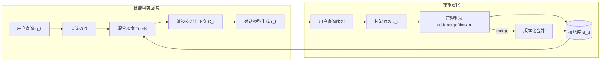

# AutoSkill（经验驱动的技能自演化）

> [!tip] 核心本质
> AutoSkill 把**重复出现的交互经验**结晶为可版本化、可检索、可人工编辑的 `SKILL.md` 资产，并在推理时注入相关技能——**不改底座模型权重**也能持续积累个性化能力。若没有这类机制，用户每轮重申的约束与偏好只能落在对话记忆或隐式 prompt 里，跨会话复用差、库内 duplicate 难控，[[skill-loading-library]] 描述的 Library Drift 会随「每次失败就 new 一个 Skill」而加速。

适合已理解 [[skill]] 渐进式披露、并关心**库级演化**（create / merge / retire）的读者；若只关心单份 `SKILL.md` 怎么写，读到「与手写工程的分工」即可停，细节见 [[skill-engineering]]。

*检索说明：正文关键事实对照 [ECNU-ICALK/AutoSkill](https://github.com/ECNU-ICALK/AutoSkill) 与论文 arXiv:2603.01145（观测 2026-06-11）。*

## 生命周期与演进

**当前定位**：成长期框架。华东师大 ICALK 与上海 AI Lab 提出并开源；2026 年 5 月仓库新增可安装的 **Local Skill Manager**（`skills/autoskill`），支持会话结束后的 `discard` / `improve` / `merge` / `create` 决策，并衍生 AutoSkill4Doc、AutoSkill4OpenClaw、SkillEvo 等子项目。

**预期寿命**：中期。在「训练免费、上下文注入」仍是 Agent 个性化主路径的前提下，**经验 → 显式 Skill 工件** 的范式会持续存在；具体实现会随宿主 Discovery 标准（agentskills.io、Cursor Skills 等）迭代。

**近期演进**：从论文双环架构走向**可部署 SDK**（Web UI、OpenAI 兼容反向代理、离线对话/轨迹抽取）；与 OpenClaw 等宿主的轨迹镜像、SkillEvo 的 replay–mutation–promote 闭环正在补齐「改完是否变好」的评测门。

**终极威胁**：一是底座模型内化更多通用偏好，显式 Skill 库边际下降；二是无治理的自动建库导致检索噪声与路由战争，反而不如受控的手写库——AutoSkill 解决「该不该入库」，不替代人工 intake 与测试金字塔（见 [[skill-governance]]）。

## 动机：经验为何应变成 Skill，而非只进 Memory

用户在与 Agent 的多轮协作里会反复表达**稳定约束**：少幻觉、固定公文格式、禁用某类措辞、固定工具调用顺序等。传统 **长程记忆（RAG over chat）** 把过去对话当文本片段检索回来，模型仍要在每轮重新「理解这些片段对当前任务意味着什么」。**Memory 记的是发生过什么；Skill 记的是以后该怎么做。**

AutoSkill 的论点是：把重复交互抽象为**行为单元**——约束、响应策略、工具规程、领域惯例——并固化为结构化工件 $s = (n, d, p, \tau, \gamma, \xi, v)$（名称、描述、可执行指令正文、触发集、标签、示例、版本）。工件可 diff、可 merge、可退役，并配套 creation gate 与库演化四动作（精炼（Refine）/ 合并（Merge）/ 退役（Retire）/ 版本（Version））。

[[tool-self-learning]] 偏「现场造工具/API 并沉淀」；AutoSkill 偏**已有 Skill 库上的库级决策**（新建还是改旧）。单篇正文质量仍依赖 [[skill-engineering]] 的写法与 Grounding 规范。

## 双环架构

系统由两个紧耦合回路组成（论文 Figure 1）：左侧在**当前请求**上用库内技能增强回答；右侧在**回合结束后**用用户侧信号更新技能库。全程 **training-free**，模块由专用 Prompt 驱动，可换 backbone 而不重训框架。

### 1.1 技能增强回答

**查询改写**（$P_{\mathrm{rw}}$）把多轮依赖解析成**单条检索用查询**：区分任务延续 vs 话题切换，继承或替换 topic anchor，只保留与检索相关的格式/风格/质量约束，避免「写报告」这类无锚点的泛化词进入检索。

**混合检索**对库中每个技能同时算稠密语义相似度与 BM25  lexical 分，归一化后加权融合，取超过阈值 $\eta$ 的 Top-$K$。无技能过线则**不注入**，避免无关 Skill 污染上下文——与宿主侧 listing 截断问题正交，但同样遵循「宁缺毋滥」。

**条件生成**（$P_{\mathrm{chat}}$）把命中技能压成紧凑外部记忆 $C_t$ 拼进回答 Prompt；策略明确要求：**仅当技能与当前意图直接匹配时才采纳**，否则忽略，且不向用户暴露「已检索技能」——降低检索误召对的用户体验伤害。

### 1.2 实时技能演化

演化回路**只以用户查询为抽取证据**，不用模型回复 $r_t$ 作证——防止把助手幻觉或一次性发挥固化进库。抽取模块（$P_{\mathrm{ext}}$）在最近窗口内寻找**可移植、可复用**的约束与流程；一次性请求、泛化任务、库内已覆盖的能力应输出空抽取。README 中的典型行为：用户只说「写一份报告」且无稳定偏好 → **不创建**；用户追加「不要幻觉」等持久约束 → 抽取或 merge 为 `v0.1.0`，后续再约束则 bump 至 `v0.1.1`。

## 库级决策：add、merge、discard

新候选 $z_t$ **不会直接写入**技能库。管理模块先在库内检索最相似邻居 $s_t^*$（同样用稠密+BM25 混合分，只比较 Top-M 邻居以保持可扩展），再由判决 Prompt（$P_{\mathrm{judge}}$）在 $\{\texttt{add}, \texttt{merge}, \texttt{discard}\}$ 中选择——论文三元组；工程 README 常扩展为 **discard / improve / merge / create** 四决策，其中 improve 针对单 Skill 补约束，create 对应 add（人工治理侧的 promote 流程见 [[skill-governance]]）。

| 决策 | 典型条件 | 技能库更新 |
| --- | --- | --- |
| **discard** | 低信号、不可移植、一次性偏好、或已有库已覆盖 | $B_u^{t+1} = B_u^t$ |
| **merge** | 与 $s_t^*$ 同一 capability family，差异仅为新约束/示例 | 版本 bump，语义并集替换 $s_t^*$ |
| **add**（create） | 持久、可区分的新能力域，且通过 discard gate | $B_u^{t+1} = B_u^t \cup \{z_t\}$ |

判决 Prompt 的四轴比较（job-to-be-done、交付物类型、硬约束/成功标准、工具与工作流）与 intake 四问（可复用、稳定、可路由、可验证）覆盖同一类门卫问题：AutoSkill 用模型自动化 gate，团队场景用人工 PR 落实（见 [[skill-governance]]）。

**版本化合并**（$P_{\mathrm{merge}}$）不是字符串拼接：保留原技能身份，对候选做**语义并集**——只纳入可复用、非冲突的新增，丢弃过时或实例化细节，版本号递增（如 `v0.1.0` → `v0.1.1`）。Merge 处理 overlap，Version 承载约束演进——库演化四动作见 [[skill-loading-library]]。

**图 1：** AutoSkill 双环——左环检索注入，右环抽取与库维护

## 开源实现与扩展生态

主仓库 [ECNU-ICALK/AutoSkill](https://github.com/ECNU-ICALK/AutoSkill) 提供 Python SDK、Web UI、OpenAI 兼容代理，以及三类离线 bootstrap：**对话抽取**、**轨迹抽取**、**文档抽取**（AutoSkill4Doc：论文/手册 → Skill）。2026-05-09 起的 **Local Skill Manager** 面向「会话结束后维护本地 Agent Skill 文件」：可复用经验分拣、相似 Skill 搜索、四类库决策，后端优先自动 add/merge，可选人工编辑 `SKILL.md`。

| 子项目 | 作用 |
| --- | --- |
| `autoskill/` | 核心 SDK、在线演化、离线抽取、代理层 |
| `AutoSkill4Doc/` | 领域文档 → 标准化 Skill 流水线 |
| `AutoSkill4OpenClaw/` | OpenClaw 轨迹驱动演化与原生 Skill 镜像 |
| `SkillEvo/` | replay、评测、变异、晋升的迭代自演化框架 |

**MUSE-Autoskill** 侧重单测失败时修单 Skill（Refine）；AutoSkill 论文与仓库侧重 **merge / add / discard** 与混合检索注入——二者可组合为「库结构演化 + 单 Skill 轨迹 refine」（MUSE 在 [[skill-loading-library]] 延伸阅读有述）。

## 落地要点与反模式

**默认 improve/merge 优于 create**：同一用户反复纠正时，应版本化更新既有 Skill，而非 duplicate 描述近似的第二份——否则发现阶段路由噪声与 Library Drift 同步恶化（promote 流程见 [[skill-governance]]）。

**抽取与判决都要防噪**：泛化请求、无稳定偏好的单次任务必须走 discard；团队场景下自动 promote 仍应接 **golden/negative 路由测** 与 scripts 契约（见 [[skill-governance]] 测试金字塔），AutoSkill 不替代 CI。

**检索权重与阈值需按库规模调参**：混合检索中 $\lambda$（稠密 vs BM25）与阈值 $\eta$ 决定「注入过宽」还是「永远命不中」；库变大后邻居检索 Top-M 管理判决比全库 judge 更可扩展，但 M 过小会漏掉应 merge 的远亲 Skill。

**与手写 Skill 的分工**：AutoSkill 优化**库决策与版本演化**；`description` 路由、正文篇幅、Lost in the Middle、脚本 Grounding 仍靠 [[skill-engineering]]。SkillOpt 等轨迹优化单篇正文；skill-compact / SkillClone 处理克隆与库压缩——正交能力，宜分层使用。

| 反模式 | 后果 | 对策 |
| --- | --- | --- |
| 无 discard gate 全量入库 | 泛化 Skill 淹没检索 | 启用抽取/判决 Prompt 门 + 人工 spot check |
| 只 merge 不版本 | 无法回滚约束演进 | 强制 `v` bump 与变更理由字段 |
| 把助手输出当抽取证据 | 幻觉固化进库 | 坚持仅用户查询序列 |
| 自动库无治理 PR | L3 规程误触发 | 高危 Skill 仍走显式 `@skill` + Hooks |

## 进一步阅读

### 库内关联

- [[skill]] — `SKILL.md` 工件与渐进式披露
- [[skill-loading-library]] — Discovery、库演化四动作、Library Drift
- [[skill-governance]] — intake 四问、四决策 promote、测试金字塔
- [[skill-engineering]] — 单篇写法；AutoSkill / SkillOpt 等前沿方向对照表
- [[tool-self-learning]] — 自造工具闭环与库决策衔接

### 外部参考

- [AutoSkill 论文（arXiv:2603.01145）](https://arxiv.org/html/2603.01145) — 双环架构、混合检索公式、$P_{\mathrm{ext}}$ / $P_{\mathrm{judge}}$ / $P_{\mathrm{merge}}$ 契约
- [ECNU-ICALK/AutoSkill](https://github.com/ECNU-ICALK/AutoSkill) — SDK、Local Skill Manager、子项目索引（观测 2026-06-11）
- [SkillClone（arXiv:2603.22447）](https://arxiv.org/abs/2603.22447) — 大规模 Skill 库克隆与去重背景
- [Library Drift / Ratchet（arXiv:2605.19576）](https://arxiv.org/abs/2605.19576) — 无界建库与 bounded active cap 理论动机
