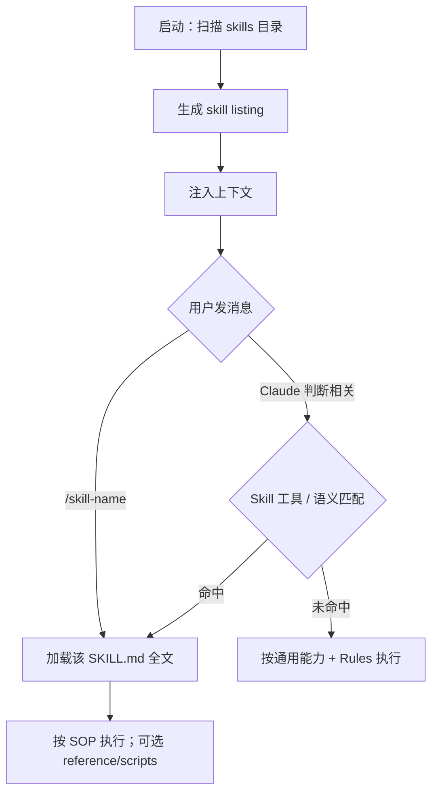

# Claude Code 如何选择 Skill

> [!tip] 核心本质
> Claude Code 并不在本地运行单独的「Skill 分类器」，而是会话启动时把可用 Skill 的**目录（name + description）**注入上下文，再由你在对话里 **`/skill-name` 显式调用**，或 Claude 在 agent 循环里通过 **Skill 工具**判断相关后加载完整 `SKILL.md`。若没有这套「先 listing、后全文」的机制，要么所有 SOP 常驻挤爆上下文，要么模型根本不知道该有哪些流程可复用。

## 生命周期与演进

**当前定位**：Claude Code 在 Agent Skills 开放标准之上，增加了 Skill 工具、listing 字符预算、`disable-model-invocation` 等产品级路由控制，是当前文档最完整的 Skill 选型参考实现之一。

**预期寿命**：随 Claude Code 与开放标准一起演进；listing 预算、权限模型可能调整，但「元数据路由 + 按需全文」的主线会保留。

**近期演进**：`skillOverrides`、`paths` 按文件激活、compaction 后对已调用 Skill 的 token 配额等能力持续细化；Skill 与 subagent（`context: fork`）的协作模式在文档中已成型。

**终极威胁**：若宿主改为 embedding 检索或编译式路由统一选 Skill，手写 `description` 的权重会下降；或模型内化常见流程后，自动 Skill 调用频率降低。届时本文描述的「语义 + listing」机制可能退居二线。

## 渐进式披露：listing 与全文何时进上下文

Claude Code 将 Skill 加载拆成两层，与 [[skill]] 中的发现 → 激活 → 执行一致，但实现细节更具体：

| 时机 | 进上下文的内容 |
| --- | --- |
| 会话开始（尚未输入） | 各 Skill 的 **name**；**description**（及可选 `when_to_use`）组成的 **skill listing** |
| Skill 被调用之后 | 渲染后的 **整份 `SKILL.md`**（含 `!` 命令预处理结果等） |

官方表述：*skill descriptions are loaded into context so Claude knows what's available, but full skill content only loads when invoked.*

因此「选哪个 Skill」发生在 **listing 已在上下文、正文尚未加载** 的阶段。

## 两条路径：你选 vs Claude 选

### 用户显式调用

- 在 Agent 中输入 **`/skill-name`**（命令名通常来自 **目录名**，不是 frontmatter 的 `name` 显示名）
- 也可用 **`@`** 将 Skill 挂入上下文

此路径不依赖 Claude 对 `description` 的猜测，适合部署、提交等必须由人点火的流程。

### Claude 自动调用

- 默认下，Claude 可根据当前对话认为某 Skill 相关时 **自动加载**
- 通过 agent 的 **Skill 工具** 发起（可在 `/permissions` 中 deny `Skill` 或按 `Skill(name)` 规则过滤）
- 主要依据 frontmatter：**`description`**（推荐；省略则用正文第一段）、**`when_to_use`**（拼入 listing，与 description 合计受长度限制）

公开文档**未给出**固定相似度阈值或打分公式；本质是 **大模型在 listing + 当前用户消息** 上做相关性判断，再决定是否调用 Skill 工具。

## Frontmatter 与宿主控制：谁能被选上

| 配置 | 你可 `/` | Claude 可自动调 | listing 中的 description |
| --- | --- | --- | --- |
| 默认 | 是 | 是 | **有**（常驻） |
| `disable-model-invocation: true` | 是 | **否** | **无**（直到你 `/` 才加载全文） |
| `user-invocable: false` | `/` 菜单不显示 | **是** | **有** |

补充说明：

- **`user-invocable: false`** 只影响 slash 菜单可见性，**不**阻止 Skill 工具调用；适合「背景知识型」Skill。
- **`paths`**（glob）：仅当 Claude 处理 **匹配路径的文件** 时，该 Skill 才参与自动激活。
- **`skillOverrides`**（settings）：对单个 Skill 设 `on` / `name-only` / `user-invocable-only` / `off`，控制 listing 暴露粒度；`name-only` 可减误触发，也削弱匹配信息。

## Skill listing 预算：为什么写了 description 仍选不中

发现阶段并非「无限列出全文摘要」：

- **所有 Skill 的 name 始终保留**
- 单条 **`description` + `when_to_use` 合并后上限 1536 字符**（可调 `maxSkillDescriptionChars`）
- 整体 listing 有字符预算，默认约为 **模型上下文窗口的 1%**（可调 `skillListingBudgetFraction` 或环境变量 `SLASH_COMMAND_TOOL_CHAR_BUDGET`）
- **预算溢出时**：**最少被调用的 Skill 的 description 先被裁短或移除**，常用 Skill 尽量保留完整 description

排查建议：description 含用户自然说法的关键词；问「What skills are available?」确认可见；运行 **`/doctor`** 查看 listing 是否溢出。

## 调用之后：正文如何留在会话里

Skill 一旦被调用（`/ ` 或 Skill 工具）：

1. 若有 **`!` 命令**，先执行并把输出替换进 Skill 内容，再注入对话
2. 渲染后的内容作为 **一条消息** 进入会话；**后续轮次不会自动重新读磁盘上的 Skill 文件**
3. **上下文压缩（compaction）** 后：每个曾调用的 Skill 最多再挂 **5000 token** 正文，合计上限 **25000 token**，**最近调用的优先**；超长 Skill 会截断，重要指令宜写在 `SKILL.md` 前部

若设置 **`context: fork`**，Skill 在 **子 agent** 中执行，`SKILL.md` 作为子任务 prompt，与主会话历史隔离。

### context: fork 与子代理

**何时 fork vs 留主会话**：

| 场景 | 建议 | 原因 |
| --- | --- | --- |
| 单文件修改、有明确 SOP | 主会话 + Skill | 流程短，需与用户持续对齐 |
| 全库探索、大规模 refactor | 子代理（`context: fork`） | 中间 tool output 量大，污染主线 |
| 用户可见交付物（PR 描述、报告） | 主会话 | 子代理结果需摘要回传 |
| 并行独立子任务 | 多子代理 | 与 Multi-Agent 多角色协作不同，见 [[multi-agent]] |

**Discovery / Activation 在 fork 内**：子上下文是否自动继承主会话的 Skill listing **因宿主而异**，Claude Code 下建议在目标环境实测。Compaction 后已激活 Skill 正文可能被裁减——长子任务须在 brief 里显式写明需要哪个 Skill，或保留 `/skill-name` 调用。

**Brief 设计要点**：主会话 Skill 写「子任务 brief 模板」时，传给子代理的应是**结构化摘要**（目标、约束、Done 定义），而不是复制整份 Skill 正文或万行 reference；子代理返回结果时同样要求结构化摘要（改了哪些文件、未决 blocker）。不要让两个 fork 并发写同一文件。

## 发现范围与优先级

Skill 从多处自动发现，例如：

- 个人：`~/.claude/skills/`
- 项目：`.claude/skills/`（自启动目录向上至仓库根，monorepo 子目录按需发现）
- 插件：`plugin-name:skill-name` 命名空间

同名冲突时大致为：**enterprise > personal > project**；插件 Skill 与本地 Skill 通过命名空间区分。

## 与通用 Skill 概念的差异（速查）

| 能力 | 通用 Agent Skills | Claude Code 特有 |
| --- | --- | --- |
| 路由信号 | 主要是 description | + Skill 工具、`when_to_use`、`paths` |
| 禁止自动调用 | 因产品而异 | `disable-model-invocation` |
| listing 裁剪 | 因产品而异 | 1% 上下文预算 + 按使用频率丢 description |
| 权限 | 因产品而异 | deny `Skill`、`Skill(name)` 规则 |
| 子 agent | 因产品而异 | `context: fork` + `agent` |

## 进一步阅读

- [[claude-code]] — Claude Code 产品总览（loop、CLAUDE.md、MCP、Hooks）
- [[skill]] — Skill 的通用概念、渐进式披露与工具链分工
- [[skill-loading-library]] — 跨产品的 Discovery 机制谱系（Claude Code 属于「listing + Skill 工具」一类）
- [[skill-engineering]] — 如何写好 `description`、触发边界与 SOP 结构
- [Extend Claude with skills](https://code.claude.com/docs/en/skills) — listing、frontmatter、Skill 工具、troubleshooting 的官方说明
- [How Claude Code works](https://code.claude.com/docs/en/how-claude-code-works) — Skills 与 subagent、上下文管理
- [Explore the context window](https://code.claude.com/docs/en/context-window) — compaction 后 Skill 正文的保留规则
