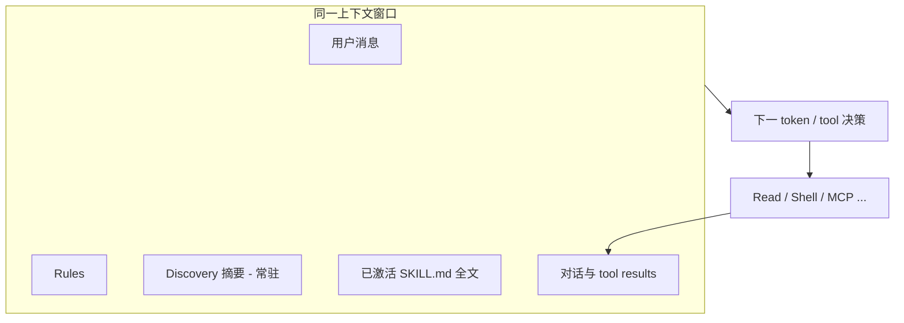

# Skill Engineering（技能工程）

> [!tip] 核心本质
> Skill Engineering 不是「把 SOP 写进 Markdown」，而是**按模型实际运行方式与 Skill 三阶段加载机制，把程序性知识拆成可路由、可激活、可执行三层**——让 Agent 在有限注意力里先选对 Skill，再在激活后按铁律走流程，并把易漂移的生成与可重复的校验分开。若没有这套工程纪律，Skill 要么永远进不了上下文，要么进了上下文却被模型当参考而非契约。

## 生命周期与演进

**当前定位**：Skill 生态进入「数量 > 10」后的必备规范。开放标准解决了格式互操作，但**写好、写稳**仍依赖人对模型行为与宿主 Discovery 差异的理解。

**预期寿命**：长期。只要 Agent 仍通过「上下文注入 + 工具调用」完成任务，就需要把 SOP 工程化；形态会从散文式 prompt 演化为更接近「带路由元数据的函数签名 + 控制流 + 附属资源」。

**近期演进**：与 Discovery 预算裁剪、显式 `@skill`、脚本闭环校验、`disable-model-invocation` 等宿主能力深度绑定；跨平台 Skill 必须按**目标宿主**验收，不能只验 Markdown 语法。轨迹驱动 Skill 优化（如 [SkillOpt](https://github.com/microsoft/SkillOpt)）开始把「改 `SKILL.md`」做成带验证门的离线训练环。

**终极威胁**：编译式 / 轨迹优化从数据自动推导 SOP，或模型内化常见流程后，手写 Skill 退化为初稿与审计兜底——但**路由、权限、组织私有规范**仍需要人类维护的 Skill 资产。

## 模型运行本质：Skill 如何真正生效

写 Skill 前必须建立正确心智模型：**Agent 不会进入「Skill 执行模式」**。激活后发生的是：

1. `SKILL.md` 全文（及 Rules、对话历史、其他已激活 Skill）一起进入**同一块上下文**；
2. 模型做**下一 token 预测**，决定是否调用 Read / Shell / MCP 等工具；
3. 工具返回的 stdout、文件内容再次以**文本**进入上下文，影响后续预测。

因此 Skill 生效的路径是：**注入文本 → 改变预测分布 → 改变工具调用序列 → 改变最终输出**。没有独立的解释器在「执行」Skill。

### 对写作的四条推论

| 推论 | 含义 | 工程对策 |
| --- | --- | --- |
| **注意力是零和** | Skill 正文与对话、Rules、其他 Skill 抢同一窗口 | 控制 `SKILL.md` 篇幅；长材料 lazy-load |
| **中间易丢失** | 长 SOP 中段约束最先被忽略（Lost in the Middle） | 关键「必须/禁止」前置；步骤短、编号清晰 |
| **语气决定权重** | 「建议」「尽量」在竞争中弱于用户话和通用习惯 | 用绝对指令 + 反面约束，不用礼貌软语 |
| **工具结果须可见** | 模型可能**声称**已校验而未真跑脚本 | Grounding：要求引用上一步 tool output 原文 |

Skill 与 [[tool-use]] 的关系：**Skill 规定何时、为何调工具；工具返回仍是文本，模型再读再写**。脚本细节见 [[skill-scripts]]。



## 加载机制决定写作分层

[[skill]] 的渐进式披露不是文档技巧，而是**与模型注意力成本对齐的分层存储**。写作时必须按层投放内容：

| 阶段 | 模型看到什么 | 应写什么 | 不应写什么 |
| --- | --- | --- | --- |
| **Discovery** | `name` + `description`（约 50–100 token/skill） | 能力 + 触发词 + **反向边界** | 步骤、模板全文、API 细节 |
| **Activation** | `SKILL.md` 全文 | **控制流**：步骤顺序、输出契约、禁止项、何时读 reference / 跑 script | 万行规范、大段示例代码 |
| **Execution** | 按需 `references/`、`scripts/`、模板 | 深度规范、确定性逻辑、样例 | 重复写已在正文说过的话 |

Discovery 层常见坑：Skill 在磁盘上存在，但**未进宿主 listing**（预算截断、未挂载、plugin 命名空间等）——见 [[skill-loading-library]]。因此 **`description` 是 Discovery 层唯一可靠信号**，正文写得再好，未激活前模型也看不到。

### 控制流 vs 数据承载

**第一性原理**：`SKILL.md` 只写「状态机」，不写「百科全书」。

- **控制流**：先做什么 → 再做什么 → 失败则如何 → 何时算完成。
- **数据承载**：术语表、API 字段、完整模板 → `references/`、`examples.md`、`assets/`。
- **确定性逻辑**：lint、解析、批处理 → `scripts/`，正文只写命令模板与返回值语义。

正文示例（控制流）：

```markdown
1. 读取 `references/output-template.md` 中的章节结构
2. 按用户输入起草，写入 `docs/draft.md`
3. 运行 `python scripts/validate.py docs/draft.md`
4. 若 exit code ≠ 0：根据 stdout 修改 draft，回到步骤 3
5. exit code = 0 后交付
```

## 方法论：从零写出一个可用 Skill

按以下顺序 authoring，可复用到个人与项目 Skill。

### 1. 定边界（Discovery 层）

- 用一句话：**这类任务完成时，用户得到了什么？**
- 列出 3–5 个**应触发**的用户说法 / 任务类型。
- 列出 2–3 个**严禁触发**的邻近场景（防误挂载）。
- 写入 `description`（第三人称、含 WHAT + WHEN + NOT WHEN）。

验收：把 description 单独贴给模型，问「用户说 X 该不该用这个 Skill」——应稳定 yes/no。

### 2. 画控制流（Activation 层）

- 步骤数控制在 **7±2** 以内；更多则拆 Skill 或拆阶段。
- 每步单一动词：**读取 / 生成 / 运行 / 确认 / 交付**。
- 在步骤 1 或 2 写清**缺参时问用户**，不要 silent default 错路径。
- 文末写 **完成定义（Definition of Done）**。

`SKILL.md` 建议 **< 500 行**；超长必拆 reference。

### 3. 外置重材料（Execution 层）

- 模板、字段定义、长篇规范 → `references/` 或 `examples.md`。
- 正文用相对路径链接，**一层深度**（`SKILL.md` → `references/x.md`，避免链链相套）。
- 仅在该步骤需要时才 `Read`，不要在激活后一次性读完所有 reference。

### 4. 固化确定性步骤（Execution 层）

- 可机器判定的检查 → `scripts/` + Feedback Loop（见 [[skill-scripts]]）。
- 在正文写清：参数从哪来、命令模板、stdout 含义、失败是否重试及上限。

### 5. 加固契约（Activation 层）

- 关键约束用 **必须 / 严禁**；禁止「建议、尽量、可以考虑」。
- 工具节点加 Grounding：「必须引用上一步 Shell 输出的前 200 字再决定下一步」。
- 高危操作（删库、部署、发版）设 `disable-model-invocation: true` 或文档化显式 `@skill`。

### 6. 在目标宿主验收

- Skill 是否出现在 Discovery 列表？（Skill 多时在 Codex 等宿主可能被省略。）
- 用 3 个典型任务 + 2 个**不应触发**的任务试跑。
- 记录失败 case，回改 description 或正文前置约束。

## 七大写作原则

### 1. 触发器工程（面向 Discovery）

`description` 写给**路由模型**，不是给人看的 README。

- ✅ 覆盖同义词：「ADR / 架构决策 / 技术选型记录」
- ✅ 写反向条件：「写代码、闲聊、改 typo 时**不要**使用」
- ❌ 「帮助用户提高效率」——无法路由

### 2. 控制流优先，数据懒加载

- SOP = 状态机；手册 = reference。
- 激活后不要要求「先读完所有 reference 再开始」——按步骤按需读。

### 3. 绝对口吻，不用软约束

| 弱（易失效） | 强（可执行） |
| --- | --- |
| 建议使用 JSON | **必须**输出 JSON |
| 尽量不要用 Emoji | **严禁** Emoji；自检未通过不得交付 |
| 可以适当补充背景 | **仅**在用户提供的材料范围内写；无依据处**标注假设** |

### 4. 严格接地（Grounding）

防止「假装跑过脚本 / 假装读过文件」：

- 要求复述 tool result 中的具体字段或 exit code。
- API / MCP 报错时：**终止并上报**，禁止猜测返回值。
- 与 [[context-engineering]] 一致：信噪比来自**真实数据引用**，不是更长 prompt。

### 5. 强制自检与脚本闭环

- 交付前 checklist（格式、链接、必填章节）。
- 能脚本化的检查**不要**只靠模型自检；模型自检适合语义，脚本适合结构。
- 模式：**生成 → validate → 失败则修订 → 再 validate**（上限 N 次）。

### 6. 粒度：拆还是合

| 拆成多个 Skill | 合并为一个 Skill |
| --- | --- |
| 触发时机不同（写代码 vs Review） | 严格顺序、一次会话内连续做完 |
| 激活会互相污染注意力 | 共享同一输出物、同一 Done 定义 |
| 其中一个是高危/显式调用 | 中间态无需单独 @skill |

### 7. 宿主感知

同一 `SKILL.md` 在多宿主行为可能不同：

- Discovery 预算、是否 Skill 工具二次加载、脚本是否走 Shell——写库时注明**主要目标宿主**或在 `compatibility` frontmatter 说明。
- 依赖自动路由的 Skill，须在目标宿主验证 **description 是否仍可见**。

## 坑点清单

按加载阶段与模型行为归类，便于排查。

### Discovery 层

| 坑点 | 现象 | 对策 |
| --- | --- | --- |
| description 过宽 | 无关 Skill 常驻激活，上下文污染 | 收窄 + 反向条件 |
| description 过窄 | 用户换说法即漏触发 | 补同义词与典型句式 |
| 未进 listing | Skill 存在但模型「不知道」 | 查宿主预算/挂载；缩短 description；显式 `@skill` |
| 与 Rules 冲突 | 激活后行为摇摆 | 统一优先级或合并到 Rules |

### Activation 层

| 坑点 | 现象 | 对策 |
| --- | --- | --- |
| 正文过长 | 跳步、忽略中段约束 | 压缩控制流；reference 外置 |
| 散文式 SOP | 模型当参考不当契约 | 改编号步骤 + 必须/严禁 |
| 软语气 | 约束被用户话覆盖 | 绝对指令 + Done 定义 |
| 多 Skill 并行激活 | 指令互相打架 | 拆 Skill；或要求单任务只激活一个 |
| 缺参 silent default | 错路径、错文件 | 缺参则问；写清默认值条件 |

### Execution 层

| 坑点 | 现象 | 对策 |
| --- | --- | --- |
| reference 一次全读 | token 暴涨、注意力分散 | 按步骤按需 Read |
| 脚本未写进 SOP | 磁盘有 script 但从不跑 | 正文写命令模板 + 失败闭环 |
| 无 stdout 约定 | 模型误判成功/失败 | 脚本输出明确；非 0 exit |
| 假装 grounding | 编造校验结果 | 要求引用 tool output |
| 静态数据写死 | Skill 内 API 路径过期 | 动态数据走 MCP；Skill 只写流程 |

### 模型行为层（跨阶段）

| 坑点 | 现象 | 对策 |
| --- | --- | --- |
| Lost in the Middle | 漏掉中间步骤 | 关键约束前置；步骤短 |
| 讨好式交付 | 半成品当完成 | Done + 脚本/blocker 检查 |
| 工具逃避 | 该 Shell 却纯生成 | 「必须运行 X，不得跳过」 |
| 过度发挥 | 超出 SOP 范围改代码 | 写清 in/out of scope |

## 前沿探索方向

手写 Skill Engineering 仍是主流；下列方向在**不改模型权重**或**少改权重**的前提下，把「写 SOP」推向可度量、可迭代。它们**不替代** Discovery 路由、库治理与团队 gate——优化的是**单份 Skill 正文**或**库结构**，选错 Skill、listing 截断等问题仍须见 [[skill-loading-library]]、[[skill-governance]]。

| 方向 | 优化对象 | 核心机制 | 与手写工程的关系 |
| --- | --- | --- | --- |
| **[SkillOpt](https://github.com/microsoft/SkillOpt)** | 单份紧凑 Skill 文档（`skill.md` / `SKILL.md`） | **冻结 target 模型** + 固定 harness；在训练 batch 上 rollout → optimizer 模型根据轨迹提出**有界文本编辑**（增删改）→ **held-out 验证**通过才接受；类比 epoch、batch、文本学习率；产出 `best_skill.md`（约数百～2k token） | 适合**有标注任务与可打分轨迹**的领域 Skill；手写提供初稿与边界，SkillOpt 做轨迹驱动改写。不解决 `description` 路由、多 Skill 库去重 |
| **DSPy 等编译式 prompt 优化** | 模块化的 signature / 指令组合 | 从演示或指标出发**编译**出更优 prompt 结构，偏程序合成而非人工散文 | 与 Skill 的「控制流 + reference 外置」可结合；多面向研究/流水线，生产 Skill 库仍常落回 Markdown 资产 |
| **轨迹反思式改写（Reflect / TEXTGRAD 等）** | 单 prompt 或 Skill 片段 | 失败轨迹 → 自然语言「梯度」→ 局部 patch；常缺 SkillOpt 式**系统化验证门** | 适合单次任务复盘后改一版 SOP；工程上要自建「改完是否变好」的评测，否则易过拟合单次失败 |
| **AutoSkill / MUSE-Autoskill** | 库内多 Skill 的 create / improve / merge | 根据复用与 overlap 决定**新建还是改旧**；Refine 针对单 Skill 失败 | 衔接 [[tool-self-learning]] 的自造闭环；偏**库决策**，正文质量仍依赖 engineering 规范 |
| **skill-compact / SkillClone** | 整个 Skill 库结构 | 克隆检测、merge / absorb / 共享抽取 | 属**库演化**，不是单篇写法；见 [[skill-loading-library#库演化]] |

### SkillOpt 为何值得单独关注

[SkillOpt](https://arxiv.org/abs/2605.23904)（微软研究院，2026）把 Skill 文档明确为 **frozen LLM 上唯一可训练的状态**：底座权重与工具 harness 不变，只演化自然语言规程。循环可概括为：


#### 术语与类比速查

SkillOpt 用神经网络训练的语言描述「优化 Markdown 文档」，以下是术语对照：

| SkillOpt 用法 | 对应 ML 概念 | 在这里的含义 |
| --- | --- | --- |
| **Rollout** | 前向传播 | Agent 用当前 Skill 完整跑一遍任务，把每步 action/observation/得分记录下来；这份记录叫一条轨迹 |
| **自然语言梯度** | 数值梯度 | optimizer 模型读完失败轨迹后，用自然语言写出「哪句话导致出错、该怎么改」——方向一样，介质从数字换成文字 |
| **edit_budget = L** | 学习率 | 每步最多允许改 L 条 Edit；L 大则改动激进，L 小则保守。控制「文字空间里单步走多远」 |
| **Minibatch（大小 M）** | 小批量 | 不把所有失败轨迹一次塞给 optimizer（token 超限 + 噪声大），而是每次取 M 条一组分析；不同组看到不同失败模式，改动更多样 |
| **Optimizer 模型** | 优化算法（Adam/SGD） | 一个独立的 LLM（通常比 target 模型更强），专门分析轨迹、提议 Skill 修改；target 模型跑任务，optimizer 模型改 Skill，两者分离 |
| **Epoch 级慢更新** | 梯度累积 / 慢参数 | Skill 里的高层策略区域只在跑完完整一轮（epoch）后才更新，防止被单次失败案例过拟合；详细行为见 `optimizer/skill.py` 中 `SLOW_UPDATE` 区域 |
| **Rejected Buffer** | 动量（Momentum） | 被验证集拒绝的 patch 存入缓冲区，下一步反思时当负反馈传入，避免 optimizer 在同一个错误方向上反复尝试 |
| **held-out 验证门** | 验证集 early stopping | 候选 Skill 在未见过的验证集上跑分，只有分数比现在高才接受这次改动；拒绝的不扔掉，进 Rejected Buffer |

**两个模型的角色分工**是理解 SkillOpt 架构的关键：

```
Target 模型（冻结）  ─── 跑任务 ──→  轨迹（成功/失败）
                                         ↓
Optimizer 模型        ─── 分析轨迹 ──→  Edit patch
                                         ↓
                      ─── 验证集 ──→  接受 or 拒绝
```

target 模型的权重从不改变；改变的只有传进它 context 的那份 `SKILL.md` 文本。

#### 核心数据结构：Edit 与 Patch

优化器对 Skill 文本的最小操作单元是 **Edit**，四种 op：

```python
# skillopt/optimizer/skill.py 中的 apply_edit()
# op: append | insert_after | replace | delete
edit = {
    "op": "replace",
    "target": "检索相关段落后直接输出",     # 要替换的原文片段
    "content": "检索相关段落后，先核对来源可信度，再输出"  # 新内容
}
```

多个 Edit 组成一个 **Patch**，每步训练最多写 `L`（edit_budget）条——这就是「文本学习率」的物理含义：

```python
patch = {
    "edits": [edit1, edit2],   # 最多 L 条
    "source_type": "failure"   # 来自失败轨迹分析
}
```

#### Reflect 阶段：如何从轨迹提「自然语言梯度」

`gradient/reflect.py` 把 Rollout 结果按**成功/失败**分组，各自组成 minibatch（大小 M），并行喂给 optimizer 模型：

```python
# run_minibatch_reflect() 的简化逻辑
fail_batches = [failures[i:i+M] for i in range(0, len(failures), M)]
succ_batches = [successes[i:i+M] for i in range(0, len(successes), M)]

# 失败批：找模式，提「纠错」edits
patch_from_failure = run_error_analyst_minibatch(
    skill_content, fail_batch, prediction_dir,
    edit_budget=L,
    step_buffer_context=rejected_edit_history  # 历史被拒绝 edit 作为负反馈
)

# 成功批：找什么指令在起作用，强化保留
patch_from_success = run_success_analyst_minibatch(
    skill_content, succ_batch, prediction_dir,
    edit_budget=L
)
```

optimizer 拿到的 user prompt 格式：

```
## Current Skill
（当前 SKILL.md 全文）

## Edit Budget
Produce at most L=4 patches.

## Previous Steps in This Epoch
（rejected edit buffer + 历史失败模式）

## Failed Trajectories (8 total)
### Trajectory 1 (id=task_042)
Task: 查询 2024 年北京 GDP
...
[action] search("北京 2024 GDP")
[obs] 搜索返回了 2023 年数据
[step 2 think] 结果疑似年份不符...
---
### Trajectory 2 ...
```

**关键设计**：失败与成功**分开分析**——失败批学「不该怎么做」，成功批提炼「什么指令有效应保留」，两组 patch 在 aggregate 阶段合并、排名。

#### Update 阶段：Slow Update Region

`optimizer/skill.py` 中有一个重要约束：Skill 里被 `SLOW_UPDATE_START/END` 标记包裹的区域**不受单步 edit 影响**，只在 epoch 级慢更新时才被修改：

```python
def _apply_edit_with_report(skill, edit):
    op, content, target = _edit_fields(edit)

    # 保护慢更新区域：快速 edit 跳过这里
    if target and _is_in_slow_update_region(skill, target):
        return skill, {"status": "skipped_protected_slow_update_region"}

    if op == "replace":
        if target not in skill:
            return skill, {"status": "skipped_replace_target_not_found"}
        return skill.replace(target, content, 1), {"status": "applied_replace"}
    
    if op == "append":
        # append 自动插在 slow update 区域之前，保持结构稳定
        su_start = skill.find(SLOW_UPDATE_START)
        if su_start != -1:
            return before + "\n\n" + content + "\n\n" + after, ...
```

这意味着 Skill 文档有**两个时间尺度**：
- **快层**（单步）：具体操作指令、工具调用顺序、失败处理逻辑
- **慢层**（epoch）：高层策略、跨任务通用规则——变化慢，防止被单次失败过拟合

#### Rejected Buffer：负反馈闭环

被验证集拒绝的 patch 不丢弃，而是存入 `step_buffer_context` 并在下一步 reflect 时回传给 optimizer，效果类似带动量的 SGD 避免重复犯同一个错：

```
## Previous Steps in This Epoch
[rejected edit]: replace "检索后立即输出" → "检索后等待用户确认"
  → reason: 验证集成功率从 0.82 下降到 0.79，已拒绝

[failure pattern summary]: 过去 3 步失败集中在「年份识别」与「来源可信度」两类
```

#### 与本文方法论的对照

- **一致**：仍强调紧凑 Skill、工具轨迹、可验证改进——与 Grounding、脚本闭环同一逻辑。
- **补充**：人工难系统覆盖的长尾失败模式，可用 batch 轨迹批量暴露；论文报告多 benchmark 上相对固定手写 Skill 约有 **+15%～25%** 绝对准确率提升（视任务与模型而定）。
- **局限**：需要**任务数据、评分与 harness 适配器**；产出是一份 `best_skill.md`，部署后仍要按本文 [[#6. 在目标宿主验收|§6]] 在目标宿主验 Discovery/Activation；**不能**代替 Librarian 治 Library Drift。

实践上可视为：[[#1. 定边界（Discovery 层）|§1]]–[[#5. 加固契约（Activation 层）|§5]] 手写初稿 → 离线 SkillOpt 训练 → [[#6. 在目标宿主验收|§6]] 宿主验收 → 纳入 [[skill-governance]] 发布流程。

## 与相邻机制的分工（避免写错层）

| 放 Skill | 不要放 Skill |
| --- | --- |
| 任务级 SOP、输出模板、领域术语 | 全局风格底线（→ Rules） |
| 何时调 MCP / 脚本 | 实时 DB schema（→ MCP） |
| 按需加载的长规范 | 整库探索（→ 子代理） |
| 组织私有流程 | 会频繁过期的环境配置 |

## 进一步阅读

- [[skill]] — 渐进式披露与 Skill 在工具链中的位置
- [[skill-loading-library]] — Discovery / Activation / 库演化与 listing 预算
- [[skill-scripts]] — 脚本传参、stdout 闭环、与 MCP/Hooks 区别
- [[skill-governance]] — 团队测试与安全
- [[context-engineering]] — 上下文窗口内的信噪比与注意力
- [[tool-use]] — 工具调用如何进入模型推理链
- [[tool-self-learning]] — 自动造工具 / skill library 与手写 SOP 的衔接与分工
- [SkillOpt — Executive Strategy for Self-Evolving Agent Skills](https://arxiv.org/abs/2605.23904) · [microsoft/SkillOpt](https://github.com/microsoft/SkillOpt)
- [Agent Skills Specification](https://agentskills.io/specification) — 标准推荐的 `SKILL.md` 结构与篇幅
