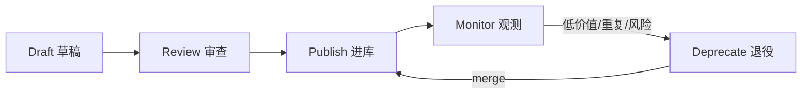
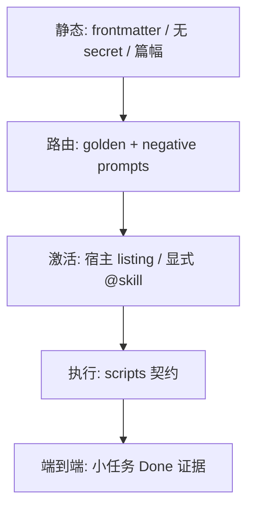

# Skill Governance（技能治理）

> [!tip] 核心本质
> Skill Governance 是把 Skill 当作**可发布、可审计、可退役的软件资产**来管——而不只是一份「写得不错的 Markdown」。若没有治理，Discovery 里 Skill 越多，误激活、脚本跳过、供应链克隆与路由战争就越严重；[[skill-engineering]] 解决「怎么写对」，[[skill-loading-library]] 解释「库为什么会漂」，本篇解决**谁、在什么门槛下、凭什么能让一个 Skill 进入团队库**。

## 生命周期与演进

**当前定位**：Skill 数量 > 10 或引入第三方/自造 Skill 后，仅靠「写得认真」不够。开放标准统一格式，但**路由冲突、脚本副作用、listing 截断、克隆传播**仍要靠流程 + 抽检 + 宿主能力（Hooks、frontmatter）兜底。

**预期寿命**：长期。合规、供应链、组织 SOP 审计不会消失；形态会从「人工 CR」演化为「静态检查 + golden prompt 回归 + 签名 skill 市场」组合。

**近期演进**：SkillClone 推动 provenance 与合并前扫描；skill-compact 类工具辅助 dedup；`disable-model-invocation` 成为高危 Skill 默认；项目 `.cursor/skills/` 与 CI 同权审查渐成惯例。

**终极威胁**：vendor 托管 skill 市场统一扫描/签名后，团队治理收缩为「私有 delta + 策略例外」；但 creation gate、事故复盘、领域合规 SOP 仍须人定标准。

## 治理在 Skill 栈中的位置

| 层次 | 文档 | 回答什么 |
| --- | --- | --- |
| 写法 | [[skill-engineering]] | 各层写什么、模型如何误读 |
| 加载与库演化 | [[skill-loading-library]] | Discovery / Activation / merge / Library Drift |
| **治理（本篇）** | skill-governance | 发布流程、测试、安全、退役、职责 |
| 执行 | [[skill-scripts]] | scripts 如何跑、stdout 如何闭环 |



**与 skill-loading-library 库演化的分工**：该篇讲 Ratchet、SkillClone、skill-compact 等**机制与研究**；本篇讲团队**何时启用、谁签字、检查什么**。

---

## 资产分级：什么 Skill 适用多严的门槛

不是每个 Skill 都要同一套 CI。按** blast radius** 分级：

| 级别 | 典型 Skill | 治理强度 |
| --- | --- | --- |
| **L0 参考** | 文档模板、写作风格 | 静态格式 + 1 条 golden 激活 |
| **L1 标准** | 代码审查清单、ADR 流程 | + 负例 prompt（不应激活）+ PR 1 人审 |
| **L2 操作** | 调用 MCP、改多文件、跑 scripts | + 脚本契约测试 + 跨宿主 smoke |
| **L3 高危** | 部署、删库、发版、权限变更 | `disable-model-invocation` + 仅 slash/`@skill` + Hooks 审批 + 2 人审 |

**存放范围**（见 [[skill]]）：

- **项目** `.cursor/skills/`：L1 及以上必须 CR；与 repo 同生命周期。
- **个人** `~/.cursor/skills/`：自用 L0–L1；**禁止** description 与项目 Skill 抢路由（过宽描述会污染全局 Discovery）。
- **第三方** `npx skills add`：默认按 **L2 审查** 降级使用，或 fork 去敏后再 publish。

---

## 发布流程：从草稿到入库

### 1. Intake（是否值得做成 Skill）

Creation gate（对齐 [AutoSkill](https://github.com/ECNU-ICALK/AutoSkill)）——先问四个问题：

1. **可复用吗？** 同一类任务会重复 ≥3 次，且不是一次性对话偏好？
2. **稳定吗？** 流程 30 天内不会全盘推翻？
3. **可路由吗？** 能用 1–2 句 `description` 说清「何时用 / 何时不用」？
4. **可验证吗？** 有 Done 定义，或 scripts 可客观校验？

任一为否 → **不新建**；写入 [[agent-context-stack]]、Memory 或单次对话即可。

**自造 Skill**（[[tool-self-learning]]）默认路径：**候选 → 单测/沙箱 → 人审 promote**，禁止 Agent 直接写入项目库无 review。

### 2. Authoring 门禁（合并 skill-engineering）

发布前作者自检（Review 前）：

| 检查 | 失败后果 |
| --- | --- |
| `description` 含触发词 + **反向边界** | 过宽 → 抢路由；过窄 → 永不激活 |
| 正文 ≤ 建议篇幅；长文进 `references/` | Lost in the Middle |
| 关键步骤可 Grounding（须引用 tool output） | 模型空口「已校验」 |
| 静态 secret / 内网 URL 不在正文 | 泄露 + 过期 |
| 高危步骤标 L3 + 显式调用策略 | 误触发事故 |

### 3. Review（PR 审查清单）

Reviewer 不应只读 prose，应对照**运行时行为**：

- [ ] 目标宿主 Discovery：`description` 是否进 listing（Skill 多时用 `/doctor` 或等价手段）？
- [ ] **Golden prompt（正例）**：典型用户说法能否激活**本 Skill**？
- [ ] **Negative prompt（负例）**：相邻 Skill 场景是否**不会**误激活本 Skill？
- [ ] scripts：样例输入 exit 0；失败路径是否写清「终止并上报」？
- [ ] 与 [[agent-context-stack]] / 其他 Skill 是否冲突？
- [ ] 第三方来源：是否标注 provenance；scripts diff 是否审过？

### 4. Publish & Register

- 合并进 `.cursor/skills/`（或团队 registry 目录）。
- 在团队索引（README 或内部表）登记：`name`、级别、owner、最后验证日期、依赖 MCP/脚本。
- L3 Skill 在 runbook 中写「仅可通过 `/skill-x` 调用」。

---

## 测试金字塔：验什么、怎么验

**不要**只跑 Markdown linter——Skill 的 bug 出在**路由与执行**，不在标题层级。



### 静态层（可自动化）

- `name` / `description` 非空；`name` 与目录名一致（按 [agentskills.io](https://agentskills.io/specification)）。
- `description` 长度在宿主预算内（Claude listing ~1%、Codex ~2% 是**全库**预算，见 [[skill-loading-library]]）。
- 禁止：API key、`.env` 路径、生产 URL 硬编码。
- 可选：`scripts/` 存在则要求 `SKILL.md` 中写清命令模板与 exit code 语义。

### 路由层（半自动 + 人工）

为每个 L1+ Skill 维护 **golden set**（3–5 条真实用户说法）与 **negative set**（应激活**邻域 Skill** 或**不激活任何 Skill** 的说法）。

| 类型 | 示例意图 | 期望 |
| --- | --- | --- |
| Golden | 「帮我写一份 ADR」 | 激活 `write-adr` |
| Negative | 「解释什么是 ADR」 | 不激活（或仅 RAG/通用） |
| Boundary | 「写架构决策记录」 | 激活 `write-adr`，非 `code-review` |

模型非确定性：同一 golden 跑 3 次，要求 **≥2 次** 正确激活或稳定走显式 `@skill` 路径。

### 激活层（宿主相关）

按 [[skill-loading-library]] 验收清单，在**主用宿主**验证：

1. Discovery 可见性。
2. 隐式 vs 显式触发是否符合设计。
3. `disable-model-invocation` 的 Skill 是否**无法**被泛化 prompt 误触。

### 执行层（scripts 契约）

见 [[skill-scripts]]：

```bash
# 示例：CI 中对 scripts/validate.sh 的契约
./scripts/validate.sh --fixture tests/fixtures/valid_input.json
echo $?  # 必须为 0
```

- 固定 fixture 输入；断言 exit code 与 stdout 关键字。
- 失败 fixture 应非 0；Skill 正文须要求 Agent **引用** stderr 而非猜测。

### 端到端层（抽检）

选 1 个 L2+ Skill，用 Agent 跑**最小真实任务**，验收：

- 是否调用了 Skill 规定的 scripts/MCP？
- 输出是否符合 Skill 中的 Done 定义？
- 是否出现「声称已跑脚本但 log 无记录」？

频率：L3 每次改 Skill 必跑；L1 季度抽检。

---

## 路由冲突与重叠治理

Skill 库最常见的「静默失败」不是写错步骤，而是**两个 Skill 抢同一条 description**。

### 症状

- 用户意图正确，却激活了错误 SOP。
- 多个 Skill 同时隐式激活，指令互相打架。
- listing 预算截断后，**关键 Skill 被尾部省略**（Codex 等）。

### 检测手段

| 手段 | 做法 |
| --- | --- |
| **人工邻域表** | 按业务域分组；同组 Skill 的 `description` 必须互斥边界 |
| **Negative 回归** | 每 Skill 的 negative set 覆盖同组其他 Skill 的 golden |
| **Embedding 相似度** | `description` 两两 cosine > 阈值 → 人工 merge 审查 |
| **skill-compact / SkillClone** | 库级 dedup；41% 家族内存在 strictly better variant（SkillClone 统计） |

### Remediation 优先级

1. **收窄 description** + 加「何时不用」。
2. **merge** 重叠 Skill（absorb 小 Skill 为 `references/`）。
3. **拆域** 子目录或前缀 `name`（如 `release-*` vs `doc-*`）。
4. **显式化** L2+：禁止隐式，只保留 slash/`@skill`。

发现层规模化（检索 vs listing）见 [[skill-loading-library#规模化发现：listing 不够之后]]；治理层要决定**何时**从「全量 listing」升级为「search + 白名单」。

---

## 安全与供应链

### 威胁模型

| 威胁 | 来源 | 后果 |
| --- | --- | --- |
| 恶意 scripts | 第三方 clone | 删文件、 exfil、挖矿 |
| 漏洞模式传播 | SkillClone：141 种子 → 1100+ clone | 一次合并，全库感染 |
| 误触发高危 SOP | description 过宽 | 生产误操作 |
| 密钥进 Skill | 作者图省事 | 泄露 + 进 git 历史 |

[SkillClone](https://arxiv.org/abs/2603.22447) 启示：**per-skill 扫描不够**，合并前要看**克隆族与 provenance**。

### 控制措施

1. **Provenance**：第三方 Skill 记录来源 URL、版本、import 日期；fork 后 diff scripts。
2. **最小权限 scripts**：只读校验优先；写操作需 L3 + Hooks。
3. **Hooks 硬拦**（[[cursor-hooks]]）：`beforeShellExecution` 对 `rm -rf`、prod deploy、云 API 等 pattern block 或 require 人工批准。
4. **Secrets**：动态数据走 [[tool-mcp]] / env；Skill 只写「调哪个 MCP」。
5. **隐式禁用**：部署、删库、force push 类 Skill 默认 `disable-model-invocation`。

### 第三方 Skill 引入流程

```
npx skills add → 隔离审查目录 → scripts 静态读 + 可选沙箱跑
→ 与现有库 overlap 检查 → 降级为 L2 或 fork 去敏
→ 项目 CR → 入主库
```

禁止：开发者本机 `~/.cursor/skills/` 装第三方后直接在生产 repo 用同一 prompt 赌路由。

---

## 运行观测与退役

治理不是「上线即结束」。Library Drift 的**团队版**是：Skill 在库中但**不再被正确激活或使用**。

### 建议跟踪（轻量即可）

| 信号 | 含义 | 动作 |
| --- | --- | --- |
| Golden 回归失败率上升 | 路由漂移 / 邻 Skill 干扰 | 修 description 或 merge |
| 脚本 skip（无 tool log） | 模型绕过 Grounding | 加强 Skill 正文；抽检 |
| 显式 `@skill` 占比过高 | 隐式 Discovery 失效 | 查 listing 截断或 description |
| 长期无使用 + 有更好 variant | 冗余 | retire 或 merge（见 discovery 库治理） |

**退役（Deprecate）** 不等于删文件：

1. frontmatter 或正文顶加 `deprecated: true` + 指向替代 Skill。
2. 从默认 Discovery 路径移除（子目录 `_archive/` 或取消挂载）。
3. 保留 1 个版本周期供迁移，再删。

**bounded active cap**：团队可约定「项目库活跃 Skill ≤ N」；新增须 merge 或 retire 一个（Ratchet 思路，见 [[skill-loading-library]]）。

---

## 自造与 Agent 提炼 Skill 的 promote 流程

模型从轨迹「总结出一个 Skill」时，默认 **improve/merge > create**（AutoSkill 四决策）：

| 决策 | 条件 |
| --- | --- |
| **discard** | 一次性偏好、无稳定复用价值 |
| **improve** | 已有 Skill 覆盖 80% 场景，补约束即可 |
| **merge** | 新旧 overlap 高，合成一个 |
| **create** | 新域 + 通过 intake 四问 + 人审 |

Promote 检查单：

- [ ] 新 Skill 的 negative set 不与现有库冲突。
- [ ] scripts（若有）已进 CI 契约。
- [ ] 非 L3 或已配置显式调用 + Hooks。

---

## 常见反模式

| 反模式 | 为什么危险 | 对策 |
| --- | --- | --- |
| 只 CR  prose 不测路由 | 上线即误激活 | golden + negative |
| 每个对话 new 一个 Skill | Library Drift | creation gate + merge |
| 个人 Skill description 过宽 | 全局抢路由 | 收窄或移入项目 CR |
| 把密钥写进 SKILL.md | 泄露 | MCP + env |
| 无 deprecated 直接删 | 旧 prompt 仍引用 | 过渡期 + 索引更新 |
| 假设「安装 = 可见」 | listing 截断 / 未挂载 | 宿主验收 |
| 治理与写法混在一篇 | 难执行 | engineering 写、governance 审 |

---

## 最小可行治理（小团队）

Skill < 20、无第三方时，仍建议至少：

1. 项目 Skill **必须 PR**；`description` 互审边界。
2. 每个 Skill **1 正 1 负** prompt 手测留档。
3. 有 scripts 的 Skill：**1 个 fixture** 进 CI 或 pre-commit。
4. 部署/删库类：**显式调用 + Hooks**。

Skill > 50 或引入第三方/自造库时，再补 overlap 扫描、cap、季度 E2E 抽检。

## 进一步阅读

- [[skill-loading-library]] — Discovery / Activation / merge / retire / Library Drift 机制
- [[skill-engineering]] — 写法、Grounding、坑点表
- [[skill-scripts]] — 脚本契约与 stdout 闭环
- [[tool-self-learning]] — 自造工具与 promote 衔接
- [[cursor-hooks]] — 高危操作硬 enforcement
- [[agent-context-stack]] — 与 Rules / AGENTS.md 边界
- [[claude-code-skill-selection]] — listing 预算与 Skill 工具
- [SkillClone](https://arxiv.org/abs/2603.22447) · [Library Drift / Ratchet](https://arxiv.org/abs/2605.19576) · [AutoSkill](https://github.com/ECNU-ICALK/AutoSkill)
