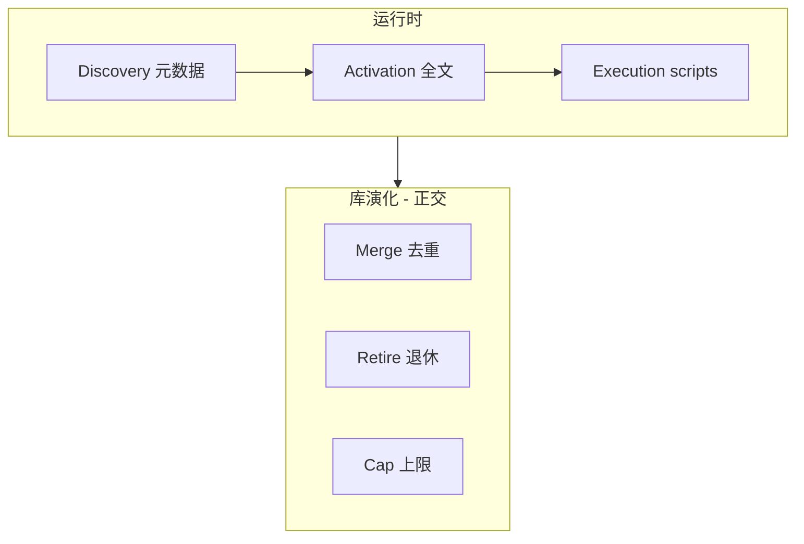
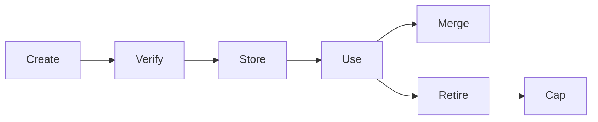

# Skill 加载与库演化

> [!tip] 核心本质
> Agent 侧的 Skill 机制，在**有限上下文**里用渐进式披露（元数据路由 → 正文规程 → scripts/references 按需）解决「当下载入什么」；在**会不断膨胀的 Skill 库**里用 Librarian 式维护（merge / retire / cap）解决「长期还能不能选对」。二者正交：前者不管库有多大，后者不管本轮对话多短。若没有渐进式披露，无关 SOP 会占满窗口或根本进不了 listing；若没有库演化，克隆冗余与 Library Drift 会让路由在规模化后静默失灵。

## 生命周期与演进

**当前定位**：[agentskills.io](https://agentskills.io/specification) 统一 **Discovery → Activation → Execution** 语义；具体 listing、触发、预算由各宿主实现。Skill 公开生态已达十万级，社区从「怎么写」转向「怎么当 Librarian」（Ratchet、SkillClone、skill-compact）。

**预期寿命**：中长期。元数据路由 + 按需全文的主线不变；发现形态从 flat listing → 检索 → 能力树演进。

**近期演进**：well-known 远程索引、`npx skills` 分发；`disable-model-invocation`；outcome-driven retirement；多模态 clone 检测（SkillClone）。

**终极威胁**：编译式路由器 + 宿主 skill 市场吸收 listing/去重；手写 `description` 权重下降，显式 `@skill` 与团队治理仍保留。

## 两条轴线：运行时加载 vs 库演化

| 轴线 | 时间尺度 | 回答的问题 |
| --- | --- | --- |
| **运行时** | 单次会话 | 目录从哪来 → 何时载入全文 → 何时跑 scripts |
| **库演化** | 跨会话 | 克隆、merge、退休、活跃 cap、Library Drift |

Execution（scripts / references）见 [[skill-scripts]]；写法见 [[skill-engineering]]；团队运维见 [[skill-governance]]。



---

## 开放标准：规定什么、不规定什么

[agentskills.io](https://agentskills.io/specification) 解决**文件长什么样、加载分几层**，不是宿主怎么 listing。

**标准规定**：

| 项目 | 内容 |
| --- | --- |
| 目录 | `SKILL.md` 必须；`references/`、`scripts/`、`assets/` 可选 |
| Frontmatter | 至少 `name`、`description` |
| 三阶段 | Discovery → Activation → Execution |
| 篇幅 | 正文宜短；长材料 lazy-load |

**标准未规定**（发布前按目标宿主验收）：

| 未规定 | 典型后果 |
| --- | --- |
| Discovery 载体 | prompt 注入 vs 工具 list vs 白名单 attach |
| Listing 预算 | Codex ~2%、Claude ~1%，尾部 Skill 被省略 |
| 激活触发 | 隐式 vs `@skill` vs Skill 工具 |
| 脚本执行 | Shell vs 专用 `run_skill_script` |
| 权限 | `disable-model-invocation` 等 |

**跨平台验收清单**：① Discovery 可见；② 显式/隐式触发符合预期；③ scripts 可跑且 exit code 回上下文；④ 长文已拆 `references/`。

**分发 vs 运行时**：skills.sh / `npx skills add` 解决安装到哪；Cursor / Claude / Hermes 的 Discovery 解决会话内能否看见——安装成功 ≠ listing 一定包含。

---

## Discovery：技能发现

Discovery 回答：Agent **在何时、以何种载体**知道有哪些 Skill 可用。只应暴露 **name + description**，而非全文。

### 三阶段 token 量级

| 阶段 | 模型拿到什么 | 典型 token |
| --- | --- | --- |
| **Discovery** | `name`、`description`（有时 path、category） | ~50–100 / skill |
| **Activation** | 完整 `SKILL.md` | 数百～数千 |
| **Execution** | `references/`、`scripts/` | 按需 |

**常见误解**：「所有产品都会在会话开头，把磁盘上每一个 Skill 的完整列表塞进上下文。」

**更准确**：共识是 Discovery **只给元数据（`name` + `description`），不给 `SKILL.md` 全文**；宿主差异落在下面四个**抽象维度**（具体产品对照见「宿主对照表」，避免与机制分类、例外表重复罗列）：

| 维度 | 在问什么 |
| --- | --- |
| **注入时机** | 首轮 prompt 里是否已有目录，还是依赖 Skill 工具 / `skills_list` / `search_skills`？ |
| **载体位置** | 元数据在 system 固定块、工具返回，还是 API `environment.skills`？ |
| **可见数量** | 全量 listing、预算内截断，还是仅 attach 白名单？ |
| **listing ≠ 磁盘** | 安装、命名空间、过滤、预算等导致「文件在、目录无」？（情形见下节「Discovery 例外」） |

因此不能假设「装好了 = 会话里一定能看见、一定能被隐式路由到」；发布前用目标宿主一行对照表验收 Discovery + Activation。

### 五种发现机制

**1. 启动时注入索引（Prompt 内嵌）** — Cursor、Hermes、Codex（~2% 或 8000 字符 metadata 预算）。优点：隐式路由简单；缺点：Skill 多时可截断。

**2. 工具内嵌目录 + 按需加载** — Claude Code Skill 工具、Agent Framework `load_skill`。优点：不占 system 预算；缺点：模型须记得调工具。

**3. 纯工具链发现** — 无预注入；`skills_list` / `search_skills` 首次需要时再拉。优点：启动 token 近零；缺点：latency + 可能忘记 list。

**4. 白名单挂载** — OpenAI API `environment.skills`；仅 attach 的 skill 进元数据。

**5. 远程与包管理** — `/.well-known/agent-skills/index.json`、`npx skills add`；解决「从哪来」，会话内仍落 1–4。

### Discovery 例外（磁盘有 ≠ listing 有）

| 情形 | 典型产品 |
| --- | --- |
| 插件 / 命名空间 Skill | Hermes `plugin:skill` |
| 未安装 Hub Skill | Hermes install 前不可见 |
| 平台 / toolset 过滤 | Hermes frontmatter |
| 禁止自动调用 | Claude `disable-model-invocation` |
| Metadata 预算溢出 | Codex 省略尾部 |
| 仅 attach 子集 | OpenAI API |

### 宿主对照表（Discovery + Activation）

与上表四维度、下文「五种机制」的关系：**机制**列标明属于哪类发现范式；本表是**按宿主的一行验收摘要**（含 Activation，上表不含）。

| 宿主 | 机制 | 注入时机 · 载体 · listing | Activation | 常见例外 |
| --- | --- | --- | --- | --- |
| **Cursor** | ① | 启动扫描 → prompt；通常**全量**摘要 | 隐式读 `SKILL.md`；`@skill` | Skill 极多时再观察是否截断 |
| **Claude Code** | ② | prompt **~1%** listing + Skill **工具**按需补全 | `/skill-name`、`@`、Skill 工具 | 预算省略尾部；`disable-model-invocation` 禁隐式 |
| **Hermes** | ①③ | prompt 索引 + 工具 `skills_list` | `skill_view`、slash | 未 install Hub；`plugin:`；frontmatter 过滤 |
| **OpenAI Codex** | ① | `Available skills` prompt 块 | `$skill` 或隐式 | metadata **~2%** / 字符上限截断尾部 |
| **OpenAI API** | ④ | 仅 `environment.skills` **attach** 子集 | 按 path 读 `SKILL.md` | 未 attach 的磁盘 Skill 不可见 |

Claude Code listing 预算与 Skill 工具细节见 [[claude-code-skill-selection]]。

### 规模化发现：listing 不够之后

Skill **100+** 或超 listing 预算时，Discovery 演进（仍是发现层，不是 Activation）：

| 阶段 | 做法 | 适用 |
| --- | --- | --- |
| L1 | 全量 listing | Skill 少 |
| L2 | Embedding `search_skills` | 100+ |
| L3 | Capability tree | 万级（AgentSkillOS） |
| L4 | Router LLM 两阶段 | 超大规模 |

**Fallback**：mechanism 2/3 工具链；分类子目录；显式 `@skill`；库 merge/retire/cap（见下文库演化）。

---

## Activation：技能激活

Activation 回答：目录已在上下文时，**何时、如何**载入完整 `SKILL.md`。Listing 里有 ≠ 一定会激活。

```mermaid
flowchart TD
  L[Discovery listing 已在上下文]
  Q{用户任务 / 显式调用}
  L --> Q
  Q -->|语义匹配 description| A[载入 SKILL.md 全文]
  Q -->|@skill / /name / Skill 工具| A
  Q -->|disable-model-invocation| X[仅显式路径]
  Q -->|未匹配| G[通用能力 + Rules]
  A --> E[Execution]
```

### 激活触发谱系

| 触发 | 谁发起 | 典型宿主 |
| --- | --- | --- |
| 隐式语义匹配 | 模型 | Cursor、Codex |
| `@skill-name` | 用户 | Cursor |
| `/skill-name` | 用户 | Claude Code、Hermes |
| Skill / `load_skill` 工具 | 模型 | Claude Code |
| 禁止隐式 | frontmatter | Claude `disable-model-invocation` |

**description 是激活前唯一可靠信号**——正文再好，未激活前模型看不到（[[skill-engineering]]）。

### 激活后的上下文竞争

激活非「Skill 执行模式」；`SKILL.md` 与 Rules、其他已激活 Skill、对话共享窗口。

| 坑点 | 对策 |
| --- | --- |
| 多 Skill 并行 | 单任务单激活；或拆 Skill |
| 与 Rules 冲突 | 合并到 Rules（[[agent-context-stack]]） |
| Lost in the Middle | 关键约束前置 |
| 声称已校验未跑脚本 | Grounding：引用 tool output |

优先级直觉：用户消息 > Rules > 已激活 Skill（宿主各异）。Compaction / 子代理见 [[claude-code-skill-selection]]。

---

## 库演化

**库演化**与单次 Discovery/Activation **正交**：解决 Skill 越积越多、模型自造加速膨胀的问题。

### Library Drift

[Library Drift / Ratchet](https://arxiv.org/abs/2605.19576) 指出：Skill 库若只增不减，在**不重新训练模型**的前提下，任务表现可能**慢慢变差，却很少有明显报错**——论文把这种现象称为在 frozen LLM 上的 **silent stagnation（静默停滞）**。

拆开三个词更容易读：

| 说法 | 含义 |
| --- | --- |
| **ever-growing library（只增不减的库）** | 自造 Agent、LATM/Voyager 式闭环往往只有 Create → Store，缺少 Retire/Merge；磁盘上 Skill 越来越多，listing 更长、重叠更多。 |
| **frozen LLM（冻结的大模型）** | 底座权重不变，**不会**因为你们多写了 50 个 Skill 就自动更会选 Skill；路由仍靠当次上下文里的 `description` 匹配、listing 预算、工具调用习惯。 |
| **静默停滞** | 不是某次调用直接 500 失败，而是成功率、选对 Skill 的概率、端到端任务完成度**长期横盘甚至缓降**——团队仍觉得「Skill 系统在用」，却很难归因到「库太大了」。 |

**因果链（为何库变大 → 表现变差）**：

1. **Discovery 变差**：listing 超预算 → 尾部 Skill **从目录里消失**；或目录里相似 `description` 太多 → **误激活 / 永不激活**。
2. **Activation 变差**：即便选对 Skill，窗口里还挤着其它已激活 SOP、Rules → 关键约束被稀释（Lost in the Middle）。
3. **反馈错觉**：单次对话里「读了一个 Skill 也跑通了」，容易误判整套库仍健康；**跨会话、跨任务**的统计几乎没人看。

因此需要 **Librarian**（管库）而不只是 **Author**（造 Skill）：

- **Author**（造）≠ **Librarian**（管）。
- Load-bearing：**outcome-driven retirement** + **bounded active cap** + creation gate。
- LATM / Voyager 闭环到 Store，缺 Retire/Merge → 须补 Librarian（[[tool-self-learning]]）。



### 去重谱系

[SkillClone](https://arxiv.org/abs/2603.22447)（~20K skills）：exact ~10%；~75% 参与 clone；概念 unique ~1/3.5 listed；~41% 家族内被 supersede。

[skill-compact](https://github.com/JuanJoseGonGi/skill-compact) 策略：**merge** / **absorb** / **extract-shared** / **refactor** / **no-op**。

### 维护四动作

| 动作 | 何时 | 代表 |
| --- | --- | --- |
| **Refine** | 单测失败 | MUSE-Autoskill |
| **Merge** | overlap | AutoSkill；skill-compact |
| **Retire** | 低贡献、长期未用 | Ratchet；SLIM |
| **Version** | 约束演进 | AutoSkill v0.1.x |

**反模式**：无 verify 入库；每次失败 new skill；description 过宽致路由战争。

与 Memory 类比见 [[agent-context-stack]]。团队流程见 [[skill-governance]]。

---

## 与 Rules、AGENTS.md 的边界

| 机制 | Discovery？ | 常驻？ |
| --- | --- | --- |
| **Skill** | 是（元数据） | 摘要常驻；正文按需 |
| **Rules** | 否 | 是 |
| **AGENTS.md** | 否 | 是（项目上下文） |

勿把长 SOP 写进 AGENTS.md。详见 [[agent-context-stack]]。

## 工程建议

1. **`description` 面向路由** — Discovery/Activation 唯一前置信号。
2. **按宿主测 listing** — Codex 省略、Claude `/doctor`、Hermes plugin。
3. **高危流程显式调用** — `disable-model-invocation` 或仅 slash。
4. **大库分类 + 检索** — 勿赌全量 listing。
5. **分发与发现分离** — 安装 ≠ 会话可见。
6. **库演化** — Skill 100+ 或自造 Skill 时启用 merge/retire/cap。

## 进一步阅读

- [[skill]] — Skill 总览 hub
- [[skill-scripts]] — Execution 层
- [[skill-engineering]] — 各层写什么
- [[skill-governance]] — 发布流程、golden/negative 测试、供应链与退役
- [[claude-code-skill-selection]] — Claude Code 专篇
- [Agent Skills Specification](https://agentskills.io/specification)
- [Anthropic — Equipping agents with Agent Skills](https://www.anthropic.com/engineering/equipping-agents-for-the-real-world-with-agent-skills)
- [Library Drift / Ratchet](https://arxiv.org/abs/2605.19576) · [SkillClone](https://arxiv.org/abs/2603.22447)
