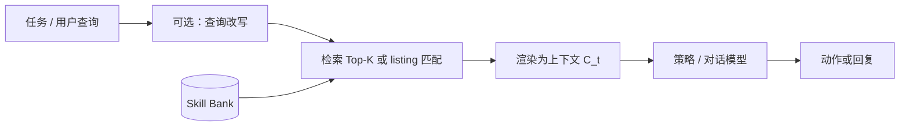
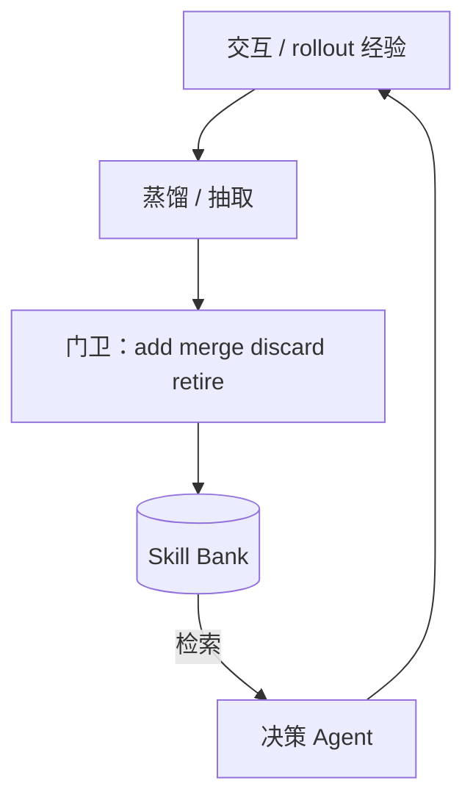

# Skill Bank（技能库）

> [!tip] 核心本质
> **Skill Bank** 是 Agent 在跨回合、跨任务中**持久存放、检索、维护**可复用行为单元的结构化仓库——单元可以是 `SKILL.md`、带 effect contract 的协议技能、或蒸馏后的策略条目，而非原始轨迹全文。若没有技能库，经验只能以 episodic memory 或隐式 prompt 片段存在：每局重学、token 冗余、难以 merge/退役，[[skill-loading-library]] 所称的 Library Drift 与 silent stagnation 在规模化后几乎必然出现。

适合已理解 [[skill]] 单份工件与渐进式披露的读者；本篇讲**库作为一等架构**（存什么、怎么取、怎么养），运行时 listing 预算与四动作治理分别见 [[skill-loading-library]]、[[skill-governance]]；具体自演化框架见 [[autoskill]]。

*检索说明：正文对照 SkillRL（arXiv:2602.08234）、COS-PLAY（arXiv:2604.20987）、AutoSkill（arXiv:2603.01145）及 agentskills.io 开放标准（观测 2026-06-11）。*

## 生命周期与演进

**当前定位**：从研究隐喻走向工程标配。2023 年 Voyager 在 Minecraft 中构建的**技能库（skill library）**证明「可执行代码入库 + 检索」能**拉长探索视野（exploration horizon）**；2026 年多条研究线把同一抽象命名并形式化——SkillRL 的 **SkillBank**、AutoSkill 的 $\mathcal{B}_u$、COS-PLAY 的**带契约的可学习技能库（learnable skill bank with contracts）**、生产侧的 `.cursor/skills/` 目录与 agentskills.io 分发，都在回答「经验如何变成可组合能力」。

**预期寿命**：中长期。在 frozen LLM + 上下文注入仍是主流部署形态时，**外置行为知识库**不会消失；差异在表示（Markdown vs JSON vs 代码）、谁维护（人 vs 轨迹管道 vs RL co-evolve）、以及检索接在 Discovery 还是独立 Top-K。

**近期演进**：分层库（通用策略 + 任务专用启发式）、带 **contract** 的可验证技能、与 GRPO/SFT 联训的「决策 Agent + 库管 Agent」双体共演化；工程侧 Ratchet、SkillClone 推动 **cap + dedup** 成为库运维默认项。

**终极威胁**：全参数持续学习或超长上下文「整库塞进窗口」会压缩独立 Skill Bank 的价值；更现实的威胁是**只建不养**的 ever-growing bank——表现静默变差却无报错，恰是 Ratchet 论文强调的 frozen-LLM 场景风险。

## 技能库不是什么

文献与产品里常把四类存储混称为「记忆」，但 Skill Bank 与它们的分工不同：

| 机制 | 存什么 | 检索后模型得到什么 | 典型问题 |
| --- | --- | --- | --- |
| **Episodic / 对话记忆** | 历史轮次、事实片段 | 原文或摘要片段 | 噪声大、难抽象为「下次怎么做」 |
| **RAG 知识库** | 文档、FAQ | 证据段落 | 偏陈述性知识，非程序性 SOP |
| **工具注册表** | API schema、MCP 清单 | 调用签名 | 解决「能调什么」，不解决「多步规程」 |
| **Skill Bank** | 可复用**行为模式**（约束、工作流、策略、可执行脚本） | 结构化技能正文 + 触发/适用条件 | 须治理：merge、版本、退役 |

[[tool-self-learning]] 的 Voyager/LATM 闭环往往在 **Store** 阶段写入技能库；若缺少 [[skill-loading-library]] 的 Retire/Merge，库会只增不减。AutoSkill 与 [[skill-governance]] 的 add/merge/discard 则是在库边界上的**门卫**。

## 库内单元：表示与元数据

不同系统对「一条技能」的字段不同，但可收敛为同一逻辑元组：**身份**（name/id）、**路由/触发**（description、triggers、when_to_apply）、**可执行正文**（prompt、workflow、code）、**证据或契约**（examples、effect contract）、**版本**（$v$ 或 semver）。

**工程 Skill（agentskills.io）**：目录 + `SKILL.md`，Discovery 用 `name`/`description`，Activation 载入全文，Execution 拉 `scripts/`——见 [[skill]]。这是当前最易人工审阅、跨宿主互操作的形态。

**SkillRL SkillBank**[^skillrl]：JSON 分层库 $\mathcal{S}_g \cup \bigcup_k \mathcal{S}_k$。每条技能含 `name`、`principle`、`when_to_apply`；另设 **common_mistakes** 条目，把失败轨迹蒸馏为「勿重复某类错误」。通用技能 $\mathcal{S}_g$ **推理时常驻**；任务类技能按任务描述 embedding 做 Top-K，过相似度阈值 $\delta$ 才注入。

**COS-PLAY 协议技能**[^cosplay]：从无标注 rollout 经边界提议、分段、**contract learning** 得到带紧凑 **effect contract** 的可复用技能；库管 Agent 对库做 refine、merge、split、retire，与决策 Agent 的检索策略 **GRPO 共训**。

**AutoSkill $\mathcal{B}_u$**[^autoskill]：用户级 `SKILL.md` 工件，混合稠密+BM25 检索，版本化 merge（`v0.1.0` → `v0.1.1`）；详见 [[autoskill]]。

[^skillrl]: [SkillRL（arXiv:2602.08234）](https://arxiv.org/abs/2602.08234)
[^cosplay]: [COS-PLAY（arXiv:2604.20987）](https://arxiv.org/abs/2604.20987)
[^autoskill]: [AutoSkill（arXiv:2603.01145）](https://arxiv.org/html/2603.01145)

## 运行时：从库到上下文

技能库对决策层的接口可以概括为 **Retrieve → Render → Condition**：按当前任务/query 选子集，压成上下文块 $C_t$，再参与生成。与 [[skill-loading-library]] 的 Discovery→Activation 对齐处在于：**不要全库灌入**；分歧处在于研究系统常用独立检索器（embedding、BM25、混合分），而 Cursor/Claude 等宿主把 Discovery 嵌在 listing 与 `@skill` 路由里。

### 1.1 检索策略谱系

| 策略 | 做法 | 代表 |
| --- | --- | --- |
| **全量元数据路由** | 会话内可见全部 `description`，模型自选 | 宿主 Discovery；受 listing 预算约束 |
| **语义 Top-K** | embedding 相似度 + 阈值 | SkillRL $\mathcal{S}_{\text{ret}}$ |
| **混合检索** | 稠密 + BM25 加权 | AutoSkill $\mathrm{Rel}(q,s)$ |
| **分层固定 + 动态** | 通用层常驻 + 专用层检索 | SkillRL $\mathcal{S}_g$ 恒注入 |
| **契约过滤** | 检索后再用 effect contract 筛适用性 | COS-PLAY |

SkillRL 报告相对原始轨迹约 **10–20× token 压缩**且推理效用不降反升[^skillrl]——说明库的价值不仅是「记住」，更是**抽象层级抬升**后同样窗口能塞更多可行动知识。

### 1.2 注入纪律

AutoSkill 的对话 Prompt 要求：检索技能**仅在与当前意图直接匹配时采纳**，否则忽略且不向用户暴露注入事实[^autoskill]。这条纪律对任何 Skill Bank 都适用：检索误召比「不检索」更糟，会触发错误规程或抢路由。

## 库演化：谁往库里写、写什么

静态「人写好一百个 Skill」只是技能库的一种来源；研究型系统强调 **从经验蒸馏 + 与策略共演化**：

| 框架 | 入库来源 | 库维护 | 是否改底座权重 |
| --- | --- | --- | --- |
| **Voyager / LATM** | 成功代码与轨迹 | 早期偏只增；工程须补 Librarian | 多为 frozen + 检索 |
| **AutoSkill** | 用户查询序列 | add / merge / discard + 版本 bump | training-free |
| **SkillRL** | 成功/失败轨迹蒸馏 | 验证失败触发递归演化 $\mathcal{S}_{\text{new}}$ | GRPO + SFT |
| **COS-PLAY** | 无标注 rollout | 分段、契约、curator 四动作 | GRPO 双 Agent |
| **团队 `.cursor/skills/`** | 人写 + PR | [[skill-governance]] gate + merge/retire | frozen |

SkillRL 的 **recursive evolution**：每个 validation epoch 收集失败轨迹，教师模型在现有 SkillBank 上生成 $\mathcal{S}_{\text{new}}$ 并合并[^skillrl]——库与策略 $\pi_\theta$ 同环迭代。COS-PLAY 则把「库管」拆成独立 **Skill Bank Agent** 流水线，与决策 Agent 对称共训[^cosplay]。

### 2.1 与 Library Drift 的关系

[[skill-loading-library]] 指出：ever-growing library 在 frozen LLM 上可导致 **silent stagnation**——Skill 越来越多、重叠描述越多，任务表现缓慢变差却少显性错误。Skill Bank 架构**必须**把 **Retire / Merge / Cap** 当作与 Retrieve 同等的一等操作；Ratchet、SkillClone、skill-compact 提供的是**库级算法与证据**，[[skill-governance]] 提供的是**团队何时执行**。

## 分层与分区：大库怎么组织

单扁平目录在技能数上百后检索与路由成本陡增。常见组织方式：

**通用 + 专用（SkillRL）**：$\mathcal{S}_g$ 放探索、状态管理、目标追踪等跨任务原则；$\mathcal{S}_k$ 按任务类型放领域动作序列与典型失败模式。推理时通用层常全量注入，专用层按任务相似度截取——在 token 预算与覆盖之间折中。

**用户 / 项目 / 全局（工程实践）**：个人 `~/.cursor/skills/`、项目 `.cursor/skills/`、第三方 registry——[[skill-governance]] 用级别与 description 边界防止全局抢路由。

**协议 + 契约（COS-PLAY）**：技能附带可学习的 effect contract，便于在长线任务中判断「这一段轨迹该切哪条技能边界」以及合并时是否语义重复。

**图 1：** 经验 → 蒸馏 → 门卫 → 银行；银行 → 检索 → Agent → 新经验

## 落地要点

1. **把库当产品，不当文件夹**：为库定义入库门卫（可复用、可路由、可验证——与 [[skill-governance]] intake 四问同构）、退役策略与活跃上限 cap。
2. **检索与 Discovery 分别调参**：研究系统的 $\delta$、$K$、混合权重 $\lambda$ 对应工程上的 listing 预算、negative prompt 集与 golden 路由测。
3. **默认 merge 优于 duplicate**：同一 capability family 应版本化更新，而非平行新建——AutoSkill、SkillRL 演化 loop 与治理 promote 流程一致。
4. **失败也是库输入**：SkillRL 的 common_mistakes、失败轨迹蒸馏，比只缓存成功 rollout 更能抑制重复犯错。
5. **区分「库」与「单 Skill 写法」**：库结构演化不替代 [[skill-engineering]] 的正文质量；SkillOpt 优化单篇，skill-compact 压缩整库——分层使用。

| 反模式 | 后果 | 对策 |
| --- | --- | --- |
| 轨迹原文直接进库 | token 爆炸、噪声固化 | 蒸馏为 principle + when_to_apply |
| 无 discard / retire | Library Drift | 门卫 + 季度抽检 + cap |
| 检索过宽 | 错误 SOP 主导行为 | 阈值、混合分、负例测试 |
| 库共训无验证门 | 坏技能污染策略 | SkillEvo / 验证 epoch / 人审 promote |

## 进一步阅读

### 库内关联

- [[skill]] — 单份 `SKILL.md` 与渐进式披露
- [[skill-loading-library]] — Discovery / Activation、merge / retire / Library Drift
- [[skill-governance]] — 入库 gate、测试金字塔、bounded active cap
- [[autoskill]] — training-free 双环与 $\mathcal{B}_u$ 维护
- [[tool-self-learning]] — Voyager/LATM 闭环与 Store 阶段
- [[skill-engineering]] — 单篇写法与前沿优化方向对照

### 外部参考

- [SkillRL（arXiv:2602.08234）](https://arxiv.org/abs/2602.08234) — 分层 SkillBank、检索公式、递归演化
- [COS-PLAY（arXiv:2604.20987）](https://arxiv.org/abs/2604.20987) — 可学习技能库、effect contract、双 Agent GRPO
- [AutoSkill（arXiv:2603.01145）](https://arxiv.org/html/2603.01145) — 用户技能库混合检索与版本 merge
- [Voyager（arXiv:2305.16291）](https://arxiv.org/abs/2305.16291) — 早期可执行技能库 + 自动课程
- [Library Drift / Ratchet（arXiv:2605.19576）](https://arxiv.org/abs/2605.19576) — ever-growing bank 与 silent stagnation
- [Agent Skills 开放标准](https://agentskills.io/specification) — 工程侧 SKILL.md 库互操作格式
