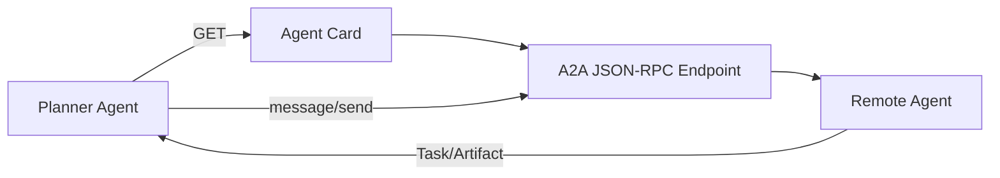

---
tags:
  - protocol
  - multi-agent
aliases:
  - A2A
  - Agent2Agent
  - Agent-to-Agent Protocol
prerequisites:
  - "[[agent]]"
  - "[[tool-mcp]]"
  - "[[multi-agent]]"
related:
  - "[[tool-use]]"
  - "[[function-calling]]"
  - "[[multi-agent]]"
  - "[[workflow-patterns]]"
stability: mid
layer: application
updated: 2026-06-15
---

# A2A（Agent-to-Agent 协议）

> [!tip] 核心本质
> **A2A**（Agent2Agent Protocol）是智能体之间的开放互操作标准：通过 **Agent Card**（`/.well-known/agent-card.json`）声明身份、技能与端点，用 JSON-RPC 等传输**任务委托**与消息——让不同框架（LangGraph、ADK、自研）-built 的 Agent 可被发现、可协作。它与 [[tool-mcp|MCP]] 互补：**MCP 连工具，A2A 连 Agent**；若没有 A2A 层，多 Agent 系统只能私有 RPC 或硬编码编排，无法跨组织发现「远程专家 Agent」。

适合设计 [[multi-agent]]、需跨服务/跨厂商委派子任务的架构师。读完 [[#2 Agent Card|§2]] 能发布可发现 Agent；[[#3 与 MCP 分工|§3]] 避免与 MCP 混淆；[[#4 任务模型|§4]] 理解 Task 生命周期。

*检索说明：对照 [A2A Protocol v1.0 规范](https://a2a-protocol.org/v1.0.0/specification/)、[a2a-protocol.org](https://a2a-protocol.org/dev/)（Google 发起、Linux Foundation；观测 2026-06-15）。*

## 生命周期与演进

**当前定位**：2025 由 Google 提出，捐赠 **Linux Foundation**；与 MCP（AAIF 下并列）组成「**MCP 连工具 + A2A 连 Agent**」社区叙事；库内 [[multi-agent]] 有拓扑但缺互操作协议专文。

**预期寿命**：中期。1.0 规范已固定 AgentCard、Task、Message；传输 binding 与鉴权仍演化。

**近期演进**：与 IBM ACP 合并路线、Cisco agntcy 等「Agent 互联网」栈；Oracle/LangChain 等多 Agent RAG 示例采用 A2A 委派检索 Agent。

**终极威胁**：单一超平台托管全部 Agent，私有 API 替代开放发现；短期内外部专家 Agent 联邦仍需要 Card + 标准 RPC。

## 1 问题：Multi-Agent 的互操作缝

[[multi-agent]] 解决**拓扑**（协调者-工作者、并行）；A2A 解决**跨边界调用**：

| 场景 | 无 A2A | 有 A2A |
| --- | --- | --- |
| 规划 Agent 委派「法务 Agent」 | 硬编码 URL + 私有 schema | 读 Agent Card → 标准 `message/send` |
| 第三方 Agent 接入 | N 套适配器 | Card 发现 + 统一 Task 模型 |
| 能力 advertisement | README 人读 | `skills[]` 机器可读 |

## 2 Agent Card 发现

Well-known URI：** `https://<host>/.well-known/agent-card.json`**

必填字段（v1.0 量级）：`name`、`description`、`version`、`supportedInterfaces`（含 `url`、`protocolBinding`、`protocolVersion`）、`capabilities`、`defaultInputModes`、`defaultOutputModes`、`skills[]`（每 skill 含 `id`、`name`、`description`、`tags`）。

Card 是**业务名片**：人类与 LLM 编排器都可读；`capabilities.streaming` 等声明是否支持 SSE 流式。

## 3 与 MCP 分工

| 层 | 协议 | 连接对象 | 库内 |
| --- | --- | --- | --- |
| 工具层 | [[tool-mcp\|MCP]] | API、数据库、文件、搜索 | 原子能力 |
| Agent 层 | **A2A** | 完整 Agent（多步+工具+策略） | 委派子任务 |

官方表述：Build with any framework → equip with MCP → **communicate with A2A**（本地/远程 Agent 与人）。

[[mcp-code-execution]] 降 token 在 MCP 侧；A2A 不关心工具实现，只关心**任务接口**。

## 4 任务与消息模型

A2A 数据模型核心：**Task**、**Message**、**Artifact**、**AgentCard**。

- 客户端向 endpoint 发 `message/send`（或 `message/stream`）
- Server 创建/更新 **Task**，返回状态与 **Artifact**（结构化输出）
- 长任务可轮询 `tasks/get`；支持 push notification（若 capability 声明）

与 [[workflow-patterns]] Orchestrator-Workers：Orchestrator 可通过 A2A **调用远程 Worker Agent**，而非仅本地子图。

## 5 实践要点

1. **Skill 粒度**：Card 上 `skills` 宜聚焦、可成功——与 [[writing-tools-for-agents]]「单一职责」同构。
2. **鉴权**：`securitySchemes` 对齐 OpenAPI 风格；Extended Agent Card 需认证能力。
3. **与 Multi-Agent 拓扑**：A2A 是**线协议**；拓扑设计仍见 [[multi-agent]]。
4. **勿重复 MCP**：不要把单个 REST API 既包 MCP 又包 A2A，除非 Agent 封装了多步策略。

## 要点收束

- A2A = Agent 互操作；MCP = 工具互操作；二者互补。
- Agent Card @ `/.well-known/agent-card.json` 是发现入口。
- Task/Message/Artifact 是委托与结果的标准壳。
- 适合跨框架、跨组织委派；本地子图不必强行 A2A。
- 规范：[a2a-protocol.org v1.0](https://a2a-protocol.org/v1.0.0/specification/)

## 进一步阅读

### 库内

- [[tool-mcp]] — 工具层协议
- [[multi-agent]] — 拓扑与协调
- [[mcp-code-execution]] — MCP 侧效率
- [[agent]] — 单 Agent 循环

### 外部

- [A2A Protocol Specification v1.0](https://a2a-protocol.org/v1.0.0/specification/)
- [A2A Protocol 概览](https://a2a-protocol.org/dev/)
