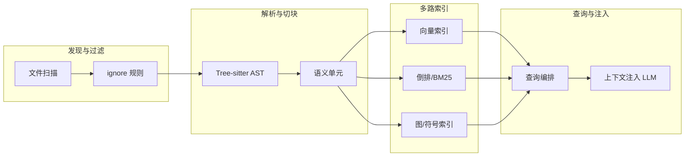
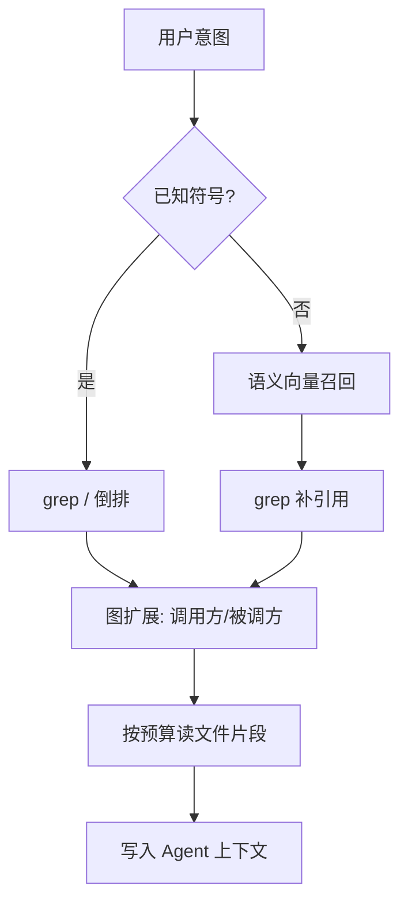

---
tags:
  - technique
  - tool
  - mcp
aliases:
  - Codebase
  - 代码库索引
  - codebase indexing
  - 仓库级上下文
prerequisites:
  - "[[tool-use]]"
  - "[[harness-engineering]]"
related:
  - "[[tool-mcp]]"
  - "[[chunking]]"
  - "[[retrieval-pipeline]]"
  - "[[triggering-retrieval]]"
  - "[[agent-context-stack]]"
  - "[[bm25]]"
  - "[[ann]]"
  - "[[rrf]]"
  - "[[cursor-hooks]]"
stability: mid
layer: application
updated: 2026-06-16
---

# 代码库（Codebase）

> [!tip] 核心本质
> 在代码智能体（code agent）语境里，**代码库（codebase）**不是「Git 仓库」的同义词，而是**把整仓源码变成可增量同步、可组合查询、可经工具注入上下文的运行对象**。若没有这层索引与查询编排，智能体要么每次全文件扫描撑爆上下文窗口，要么只靠关键词搜索在大型 monorepo 里迷路——跨文件重构、按语义找实现、追踪调用链都会在「找代码」这一步断掉。

适合已理解 [[tool-use]] 与 [[harness-engineering]] 的读者：你要解释 Cursor、Claude Code 等宿主为何强调「codebase awareness」，或评估自建索引方案。读完 [[#2 边界：仓库、文档与索引|§2]] 能区分 codebase 与裸仓库；[[#4 核心机制：从文件到可查询索引|§4]] 能画完整流水线；[[#5 Agent 侧的查询编排|§5]] 能说明宿主如何链式调用搜索工具。实现选型与具体 MCP 部署细节见 [[#进一步阅读|进一步阅读]]，本篇只讲机制。

*检索说明：Cursor 索引与安全复用见 [Securely indexing large codebases](https://cursor.com/blog/secure-codebase-indexing)、[Semantic & agentic search](https://cursor.com/docs/agent/tools/search)、[Fast regex search](https://cursor.com/blog/fast-regex-search)；开源实现对照 [codebase-index](https://github.com/LevelPanic/codebase-index)、[code-index-mcp](https://github.com/johnhuang316/code-index-mcp)、[Code Atlas architecture](https://github.com/SerPeter/code-atlas/blob/main/docs/architecture.md)；AST 解析见 [Tree-sitter](https://tree-sitter.github.io/tree-sitter/)（观测 2026-06-16）。*

## 生命周期与演进

**当前定位**：2024–2026 年 code agent 的标配能力。商业 IDE（Cursor）与开源 MCP 服务器（codebase-index、code-index-mcp、Code Atlas）都在做同一件事：把仓库变成**语义单元 + 多路索引 + 工具 API**。Cursor 内部评测称语义搜索与 grep 组合可使代码问答准确率平均提升约 12.5%[^cursor-eval]。

**预期寿命**：中长期。具体 embedding 模型、向量库、是否上云会轮换；但「仓库级索引 + 增量同步 + 多工具查询」的结构稳定——它解决的是上下文窗口硬限制，而非某个模型版本的技巧。

**近期演进**：三范式融合（图遍历 + 向量 + BM25/倒排）成为开源方案默认形态；MCP 把索引能力从单一宿主解耦；Merkle 树与团队索引复用把超大仓的首查延迟从小时级压到秒级；正则/grep 侧也开始预建倒排索引（Cursor Instant Grep），避免 Agent 每次全仓 `ripgrep`。

**终极威胁**：模型上下文扩到能「整仓塞进窗口」时，小项目可绕过显式索引；平台内置不可替换的整仓理解后，自建索引需求下降。大型 monorepo 的权限边界、增量成本与精确符号查询仍会使显式 codebase 层长期存在。

## 1 问题语境：Agent 为何需要「整仓对象」

用户让 Agent「把登录流程改成 OAuth」时，失败往往发生在第一步：**找全相关代码**。登录逻辑可能散落在 middleware、路由、前端 hook、测试与配置里；函数名还可能叫 `createSession` 而不是 `login`。

单次 LLM 调用装不下几万文件。朴素做法是每次对话让模型 `grep` 全仓库——在数万文件、数十万行的企业 monorepo 里，一次 `rg` 跑 15 秒以上并不罕见[^cursor-grep]，多轮探索会把 Agent 循环拖死。更糟的是：用户问的是**行为**（「失败支付怎么处理」），而源码里根本没有「payment failed」字样——纯关键词搜索必然漏召回。

Codebase 层要同时解决三件事：**缩小搜索空间**（索引而非全量读）、**按语义召回**（自然语言对齐实现）、**按结构追踪**（调用链、导入关系）。这三者分别对应后文的向量索引、图/符号索引与 grep/倒排索引——没有单一索引能包办。

## 2 边界：仓库、文档与索引

| 概念 | 指什么 | 与 codebase 的关系 |
| --- | --- | --- |
| **Git 仓库（repository）** | 版本历史 + 协作边界 | codebase 通常以仓库为物理边界，但还包含索引状态与工具契约 |
| **源码树（source tree）** | 工作区里的文件集合 | codebase 的输入；须尊重 `.gitignore` / `.cursorignore` 等过滤规则 |
| **文档 RAG** | 对 PDF/Markdown 的入库检索 | 共享 chunk、embedding、混合检索思想；切块单元与权限模型不同（见 [[chunking]]） |
| **语言服务器（LSP）** | 编辑器内符号跳转、类型信息 | 偏单文件/单工作区实时；Agent  harness 常把它与 codebase 索引并用，但不等价 |

**表 1 — 浅层索引与深层索引（以 code-index-mcp 为代表）**

| 层级 | 建什么 | 典型用途 | 更新成本 |
| --- | --- | --- | --- |
| **浅层索引（shallow）** | 文件列表、路径、基础元数据 | `find_files`、变更检测 | 低 |
| **深层索引（deep）** | AST 符号、导入、调用关系、复杂度 | `get_file_summary`、结构分析 | 高；常按需 `build_deep_index` |

开源实现普遍采用**双阶段**：先快扫文件树，再在需要时构建符号级深索引——避免每次保存都全量解析全仓 AST。

## 3 总体架构

**图 1 — Codebase 四层流水线**

四层可压缩记忆为：**发现 → 切块 → 索引 → 查询**。下面按因果顺序展开。

### 3.1 发现与过滤

索引器遍历工作区，应用 `.gitignore`、产品专用 ignore（如 `.cursorignore`）与可选 `include`/`exclude` 配置。目标是**排除构建产物、依赖目录、大二进制**，否则向量空间会被 `node_modules` 噪声淹没，搜索准确率下降——Cursor 文档明确建议忽略大型生成文件[^cursor-docs-search]。

Monorepo 还需识别子工程边界：开源 [codebase-index](https://github.com/LevelPanic/codebase-index) 通过路径规则打 `platform`/`app` 等 tag，使 MCP 搜索可带 metadata 过滤。

### 3.2 AST 解析与语义切块

自然语言文档可以按段落切；**代码若按固定 token 数切，会在函数中间截断**，返回给模型的片段语法不完整、语义残缺。工业做法是用 [Tree-sitter](https://tree-sitter.github.io/tree-sitter/) 等增量解析器生成具体语法树（concrete syntax tree），再提取**语义单元（semantic unit）**：函数、方法、类、组件、类型定义、配置对象等。

[codebase-index](https://github.com/LevelPanic/codebase-index) 的切块策略体现了常见工程细节：

- 大类拆成**方法级 chunk**，避免单个 embedding 被截断；
- 函数 chunk **内联引用的类型定义**，让向量捕获完整契约；
- 超大块保留**签名 + 头尾**而非硬截断底部（return/JSX 常在尾部）；
- 识别 React hook、store、Prisma model 等**块类型标签**，供过滤与展示。

这与 [[chunking]] 对文档 RAG 的主张同构：**切块边界应服从语义结构，而非 tokenizer 长度**；差异在于代码的「结构」来自 AST 而非 Markdown 标题。

### 3.3 多路索引：为何不能只做向量

| 索引类型 | 回答的问题 | 典型失效场景 |
| --- | --- | --- |
| **向量（dense）** | 「和这句描述意思相近的代码在哪」 | 精确符号名、错误码、版本号 |
| **倒排 / BM25（sparse）** | 「哪个文件包含这个标识符/字符串」 | 口语与实现命名不一致 |
| **图 / 符号（structural）** | 「谁调用它」「改这里会影响谁」 | 无语义相似但强依赖的跨模块链 |

Cursor 官方文档将 **语义搜索与 grep 并用**作为 Agent 默认策略：已知符号走 Instant Grep；概念/行为问题先语义召回，再 grep 补引用细节[^cursor-docs-search]。Code Atlas 则在查询层对图搜索、向量搜索、BM25 **并行执行后用 [[rrf]] 融合**[^code-atlas-arch]。

向量检索的实现与 [[retrieval-pipeline]] 同源：chunk embedding → [[ann]] 近似最近邻；查询 embedding 须与入库用**同一模型**。Cursor 使用自研 embedding 模型；[codebase-index](https://github.com/LevelPanic/codebase-index) 用本地 Ollama `nomic-embed-text` + LanceDB，体现**可完全离线**的另一条路径。

### 3.4 增量同步：让索引跟得上保存键

全量重索引大仓可能要数十分钟。[codebase-index](https://github.com/LevelPanic/codebase-index) 全量约 5k 文件需 15–20 分钟，而**增量**（仅变更文件）典型只需约 10 秒。

核心机制是**内容寻址的变更检测**：

1. **文件级哈希**：文件内容变才重解析；
2. **Merkle 树**（Cursor）：文件哈希 + 目录哈希自底向上；客户端与服务端对比树，只同步哈希不一致的子树分支[^cursor-merkle]。五万文件仓仅路径与 SHA-256 哈希约 3.2 MB，但 Merkle diff 使日常同步只走变更分支；
3. **Chunk 级 embedding 缓存**（Cursor）：多数编辑只改少量 chunk；未变 chunk 的 embedding 直接命中缓存，跳过最贵的一步；
4. **分级管道**（Code Atlas）：AST 阶段与 Embed 阶段用消息队列解耦；仅**语义显著**变更（签名、主体、文档串）才进入 embedding 阶段，纯格式化变更在 AST 阶段终止[^code-atlas-arch]。

团队场景还有**索引复用**：Cursor 观测同组织克隆仓平均 92% 相似；新机器用 simhash 在服务端找可复用队友索引，后台再 Merkle diff  reconcile，把首查时间从小时级降到秒级，并用内容证明（content proof）保证**搜不到本地没有的文件**[^cursor-merkle]。

### 3.5 新鲜度与分支

索引状态与 Git 提交、工作区脏文件可能不一致。常见策略：

- **定时/事件驱动刷新**：Cursor 约每 5 分钟自动同步变更文件[^cursor-docs-search]；
- **分支覆盖读盘**：[codebase-index](https://github.com/LevelPanic/codebase-index) 在 feature 分支上对「相对 main 有 diff 的文件」搜索时**直接读磁盘重解析**，索引只跟踪 main，避免每分支一套向量库。

## 4 工具面：MCP 与宿主内置

索引本身对 LLM 不可见；必须通过 **Harness 工具**暴露。两条交付路径：

1. **宿主内置**（Cursor）：索引、Instant Grep、语义搜索在 IDE 内闭环；Agent 由宿主按 prompt 自动选工具链。
2. **MCP 服务器**（通用）：符合 [[tool-mcp]] 的 `search_codebase`、`get_file_context`、`build_deep_index` 等工具，任意兼容客户端可挂载。

[code-index-mcp](https://github.com/johnhuang316/code-index-mcp) 的工具面较完整：`set_project_path` 绑定仓库 → `refresh_index` 浅层刷新 → `build_deep_index` 符号级构建 → `search_code_advanced`（字面/正则/模糊，底层优选 ugrep/ripgrep）→ `get_file_summary`（依赖深索引）。这体现了 codebase 工具设计的分工：**发现/搜索/结构分析**是不同成本的操作，不应混在一个「读文件」里。

## 5 Agent 侧的查询编排

索引建好后，价值在 **查询编排**——如何把有限 context 窗口填满「对任务真正有用的片段」。

**图 2 — 典型多跳查询链**

Cursor 文档给出的模式与上图一致[^cursor-docs-search]：

| 提问风格 | 工具链 | 例子 |
| --- | --- | --- |
| 具体符号/字符串 | Grep | 「哪些文件 import 了 `PaymentService`」 |
| 概念或行为 | 语义搜索 → grep 补细节 | 「失败支付怎么处理」 |
| 复杂探索 | 多轮搜索 + 读文件 + 追引用 | 「从结账到确认邮件的数据流」 |

复杂任务还可 spawn **Explore 子智能体**：在独立上下文里并行大量搜索，只把摘要回传主对话，避免搜索过程撑爆主窗口[^cursor-docs-search]——这是 [[context-engineering]] 在 codebase 场景的落地。

与 [[triggering-retrieval]] 的关系：codebase 搜索是 **Agent 运行时触发的检索**的一种，触发器是「当前任务需要仓库证据」；索引是离线/近线维护的资产，查询是在线编排。

## 6 实践要点与反模式

### 6.1 忽略规则优先于模型智商

未排除 `dist/`、`vendor/`、生成代码时，语义搜索会被噪声主导。Cursor 与开源方案均把 ignore 当作**准确率杠杆**，而非可选优化。

### 6.2 不要指望单向量解决一切

仅用 embedding 问答在「找错误码、找常量、找精确 API 名」上会系统性失败；生产级 codebase 必须保留 **grep/倒排 + 语义** 双通道。Cursor 与 Code Atlas 的实现都印证了这一点。

### 6.3 切块粒度影响下游编辑质量

函数级 chunk 使模型收到**语法完整**的片段，减少「半函数幻觉」；这与 [[chunking]] 里 parent-child 层次的思想类似——检索用细粒度，生成用稍宽上下文。Code Atlas 的 Context Expander 在命中后沿图向上走模块层次、沿调用链扩展，再在 token 预算内组装[^code-atlas-arch]。

### 6.4 隐私与部署轴

| 模式 | 索引/向量放哪 | 代表 |
| --- | --- | --- |
| 云辅助索引 | embedding 在服务商；源码明文不落库 | Cursor（路径加密、chunk 加密传输）[^cursor-docs-search] |
| 本地优先 | 解析、embed、检索全在本机 | codebase-index、Code Atlas |
| 混合 | 本地图 + 可选云 embed | Code Atlas LiteLLM 回退 |

选型取决于合规边界，而非检索算法本身。

## 要点收束

- **Codebase** 在 Agent 栈里是「整仓可查询对象」，= 语义切块 + 多路索引 + 增量同步 + 工具 API，不是 Git 的同义词。
- **Tree-sitter 语义切块**是代码索引与文档 RAG 固定长度切分的分水岭；块类型 metadata 支撑过滤与展示。
- **向量 + grep/倒排 + 图** 三通道互补；Cursor 与 Code Atlas 均不走「只 embedding」单路线。
- **Merkle 树、chunk 缓存、分级管道**解决大仓增量成本；团队索引复用解决冷启动。
- **Harness 查询编排**决定最终上下文质量：语义找入口、grep 追符号、图/读文件扩边界。

## 进一步阅读

### 库内关联

- [[tool-mcp]] — codebase 能力如何以 MCP 工具暴露
- [[chunking]] — 文档入库切块；与代码 AST 切块对照
- [[retrieval-pipeline]] — 粗排/精排/融合；codebase 语义层同源
- [[triggering-retrieval]] — Agent 何时触发仓库检索
- [[harness-engineering]] — 搜索工具在 Agent 循环中的位置
- [[agent-context-stack]] — codebase 索引在上下文资产栈中的分工
- [[bm25]]、[[ann]]、[[rrf]] — 三路索引背后的算法节点

### 官方与产品

- [Cursor — Securely indexing large codebases](https://cursor.com/blog/secure-codebase-indexing) — Merkle 同步、simhash 复用、content proof
- [Cursor — Semantic & agentic search](https://cursor.com/docs/agent/tools/search) — 工具组合、索引配置、隐私说明
- [Cursor — Fast regex search](https://cursor.com/blog/fast-regex-search) — Instant Grep 倒排索引动机
- [Tree-sitter](https://tree-sitter.github.io/tree-sitter/) — 增量多语言解析

### 开源实现（机制对照）

- [LevelPanic/codebase-index](https://github.com/LevelPanic/codebase-index) — 本地 Ollama + LanceDB + MCP；AST chunk 类型表
- [johnhuang316/code-index-mcp](https://github.com/johnhuang316/code-index-mcp) — shallow/deep 双索引；`search_code_advanced`
- [SerPeter/code-atlas — architecture.md](https://github.com/SerPeter/code-atlas/blob/main/docs/architecture.md) — 图+向量+BM25、RRF、事件驱动管道

[^cursor-eval]: [Cursor — Semantic & agentic search](https://cursor.com/docs/agent/tools/search)，2026-06 观测。
[^cursor-docs-search]: 同上。
[^cursor-grep]: [Cursor — Fast regex search](https://cursor.com/blog/fast-regex-search)，2026-06 观测。
[^cursor-merkle]: [Cursor — Securely indexing large codebases](https://cursor.com/blog/secure-codebase-indexing)，2026-06 观测。
[^code-atlas-arch]: [Code Atlas — architecture.md](https://github.com/SerPeter/code-atlas/blob/main/docs/architecture.md)，2026-06 观测。
