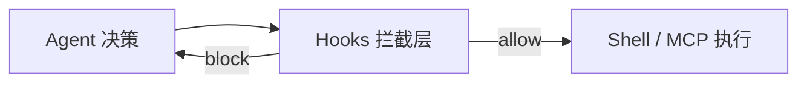

# Cursor Hooks（事件钩子）

> [!tip] 核心本质
> Hooks 是 Cursor Agent **生命周期事件**上的拦截与回调脚本——在工具执行前/后、会话结束等节点注入策略，而不是定义「怎么做某类任务」。若没有 Hooks，Skill 里的危险 Shell 步骤只能靠模型自觉；Harness 无法在「命令已发出」与「真正执行」之间插入审批、审计或阻断。

## 生命周期与演进

**当前定位**：产品级治理能力。Hooks 配置于 `.cursor/hooks.json`，按事件类型调用本地脚本（JSON stdin/stdout 协议）；与 Skill、Rules 并列，属 Runtime 策略层。

**预期寿命**：中长期。企业合规、沙箱、审计需求会持续需要事件拦截；协议与事件类型会扩展。

**近期演进**：与 Skill scripts 的 `beforeShellExecution` 审批联动；block/allow 工具调用；会话级 telemetry。

**终极威胁**：宿主内置统一 policy engine 吸收 Hooks 能力；或云端 Agent 将治理上收，本地 hooks 仅保留 IDE 场景。

## Hooks vs Skill scripts

| | Cursor Hooks | Skill `scripts/` |
| --- | --- | --- |
| 触发 | 宿主**事件**（tool 前后、session） | Skill **SOP 步骤**内显式调用 |
| 目的 | 拦截、审计、改写、阻断 | 完成任务（lint、转换、校验） |
| 配置 | `.cursor/hooks/` + `hooks.json` | Skill 目录内 |
| 谁写 | 平台/团队治理 | Skill 作者 |

**不要混用**：Hooks 不是「把 bash 挂到事件上替代 Skill」；Skill 正文写业务步骤，Hooks 写横切治理。

## 与 Skill / MCP / Harness 协作

- **Skill Governance**：高危 Skill 配合 Hooks 强制人工批准 Shell（见 [[skill-governance]]）。
- **MCP**：Hooks 可拦截 MCP 等价工具调用（视宿主实现）；MCP 仍提供能力，Hooks 管是否允许。
- **Harness**：Hooks 是 [[harness-engineering]] 中「安全边界」的 Cursor 实现之一。

## 实践要点

- 审计日志写文件或 SIEM，不依赖模型「记得」批准过。
- block 时返回明确 reason，便于模型调整计划。
- 与 Rules 分工：Rules 是 prompt 约束；Hooks 是**硬 enforcement**。

## 进一步阅读

- [[skill-scripts]] — Skill 脚本与 Hooks 边界。
- [[harness-engineering]] — Runtime 安全与错误处理。
- [[skill-governance]] — 团队审批策略。
- [Cursor Docs — Hooks](https://cursor.com/docs/agent/hooks) — 事件类型与配置（以官方为准）。
