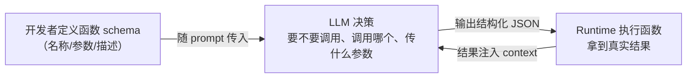

---
tags:
  - technique
aliases:
  - Function Calling
  - 函数调用
  - tool calling
prerequisites:
  - "[[tool-use]]"
  - "[[llm]]"
related:
  - "[[agent]]"
  - "[[reAct]]"
stability: long
layer: application
updated: 2026-05-26
---

# Function Calling（函数调用）

> [!tip] 核心本质
> Function Calling 是模型与外部工具之间的结构化协议——模型输出「调哪个函数、传什么参数」的 JSON，Runtime 负责真正执行并回传结果。模型本身不能发 HTTP 请求；若没有这层标准接口，Tool Use 只能依赖脆弱的正则解析，多工具场景下几乎无法稳定落地。

## 生命周期与演进

**当前定位**：Tool Use / Agent 循环的底层实现；OpenAI、Anthropic 等 API 的标配能力。

**预期寿命**：长期；schema 形态与并行调用语义会随厂商迭代。

**近期演进**：与 MCP 工具描述规范对齐；多函数并行、流式 tool result 成为默认。

**终极威胁**：统一 Agent 协议吞没厂商差异后，Function Calling 退为传输层细节；但 schema 设计与 Runtime 校验仍属工程核心。

## 核心原理

### 没有 Function Calling，Tool Use 会怎样

[[tool-use|Tool Use]] 的核心问题是：模型怎么告诉系统"我现在要用工具"？

最朴素的方案是让模型直接在文本里说——"我需要调用 search(query='今天天气')"，然后用正则表达式解析。但这个方案脆弱：模型输出格式不稳定，解析逻辑容易崩；不同工具的调用格式不统一；模型没有被明确训练来做这件事。

从第一性原理想：你需要一个可靠的机制，让模型能精确表达"调用哪个函数、传什么参数"，同时让外部系统能稳定解析这个意图。最直接的方案是：定义一个结构化的输出格式（JSON），让模型在训练时学会什么时候输出这个格式、怎么输出。这就是 Function Calling 的设计。

### 工作机制

Function Calling 的流程分三步：



关键点在第二步：模型不是"调用"函数，而是**输出一个调用意图的 JSON**。真正执行是 Runtime 的事。

函数 schema 的定义方式（OpenAI 格式）：

```json
{
  "name": "get_weather",
  "description": "获取指定城市的当前天气",
  "parameters": {
    "type": "object",
    "properties": {
      "city": {
        "type": "string",
        "description": "城市名称，如'北京'"
      }
    },
    "required": ["city"]
  }
}
```

模型看到这个 schema 和用户的问题，决定要调用时，会输出：

```json
{
  "name": "get_weather",
  "arguments": {"city": "北京"}
}
```

Runtime 拿到这个 JSON，真正去调 API，把结果塞回 context，模型再基于结果生成最终回答。

### Function Calling vs 直接让模型输出 JSON

很多人会问：直接在 prompt 里让模型"输出 JSON 格式"不行吗？

**可以，但不可靠。** 两者的核心区别是：

| 对比 | Function Calling | Prompt 要求输出 JSON |
|------|-----------------|---------------------|
| 模型训练 | 专门训练过这个任务 | 依赖通用指令跟随能力 |
| 格式稳定性 | 高，有 schema 约束 | 低，容易输出不合法 JSON |
| 多函数选择 | 模型能自主选择调用哪个 | 需要额外逻辑判断 |
| 不调用时的行为 | 模型知道"这次不用调用" | 容易强行输出 JSON |

Function Calling 是经过专门训练的能力，不只是格式要求。

### 边界

Function Calling 能做的：让模型可靠地触发工具调用、支持并行调用多个函数、让模型自主判断要不要调用。

Function Calling 做不到的：执行函数本身（那是 Runtime 的事）、保证模型选对函数（函数 schema 写得不清楚，模型会选错）、处理调用失败的恢复逻辑（那是 Agent 层的责任）。

---

## 实践与应用

用户问"帮我订明天北京到上海最便宜的机票"，系统定义了两个函数：`search_flights` 和 `book_ticket`。

| 轮次 | 模型输出 | Runtime 执行 | 结果 |
|------|---------|-------------|------|
| 1 | 调用 `search_flights(from='北京', to='上海', date='明天')` | 真正查询 API | 返回 12 个航班 |
| 2 | 调用 `search_flights` 附加 `sort_by='price'` 过滤 | 再次查询 | 返回最低价 420 元 |
| 3 | 调用 `book_ticket(flight_id='CA1234', price=420)` | 真正下单 | 订单确认 |
| 4 | 直接回复用户"已订成功，CA1234，420 元" | 无调用 | 任务完成 |

第 4 轮模型判断任务完成，不再发起调用，直接生成自然语言回复。这个"要不要调用"的判断，是 Function Calling 训练赋予的能力。

---

## 常见误区

Function Calling 和 Tool Use 不是同一层的概念。Tool Use 是设计理念（给模型接工具），Function Calling 是实现机制（怎么接）。理解这个区别，才能判断什么时候该关注 schema 设计，什么时候该关注 Agent 架构。

函数描述写得不好是最常见的问题。模型靠 `description` 字段判断要不要调用、怎么传参——描述含糊，模型就会选错函数或传错参数。这不是模型的问题，是 schema 设计的问题。

| 风险 | 表现 | 应对 |
|------|------|------|
| **函数描述歧义** | 模型调用了错误的函数 | description 写清楚"什么时候用"和"不适合什么场景" |
| **参数幻觉** | 模型传了不存在的参数值 | 用 enum 约束参数取值范围；Runtime 做参数校验 |
| **并行调用顺序依赖** | 并行调用了有依赖关系的函数 | 设计函数时明确哪些可以并行、哪些必须串行 |
| **无限调用循环** | 模型反复调用同一函数 | 设置 max_steps；检测重复调用模式 |

## 进一步阅读

- [[tool-use|Tool Use]] — Function Calling 是 Tool Use 的底层实现，两篇要对照看：一个讲设计理念，一个讲实现机制
- [[agent|Agent]] — Function Calling 是 Agent 里工具调用的核心机制，理解它才能真正理解 Agent 循环是怎么转的
- [[reAct|ReAct]] — ReAct 模式里的 Act 步骤，底层就是 Function Calling，读完这篇再看 ReAct 会更清晰
