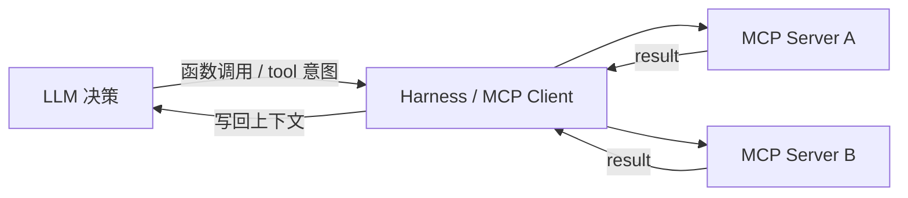

# MCP（Model Context Protocol）

> [!tip] 核心本质
> 模型上下文协议（MCP，Model Context Protocol）是连接智能体（Agent）与外部系统的开放标准：用 JSON-RPC 统一「工具有什么、怎么发现、怎么调用、结果怎么回传」。若没有它，每个数据源都要单独写一套宿主适配；技能（Skill）里的标准作业程序（SOP）也无法稳定指向可复用的外部能力——Agent 要么只能读本地文件，要么被 N 种私有集成绑死在单一宿主。

适合已读 [[tool-use]]、要在架构里区分「模型侧协议 / 工具服务器 / 宿主内置能力 / Skill」的读者。读完 [[#2 协议角色与能力原语|§2]] 能画 Host–Client–Server 与 Tools/Resources/Prompts；[[#3 在工具栈中的位置|§3]] 说明 MCP 与 [[function-calling]] 的分层；落地见 [[#5 实践要点|§5]]。

*（核对 [MCP 规范 2025-06-18](https://modelcontextprotocol.io/specification/2025-06-18)、[2025-11-25](https://modelcontextprotocol.io/specification/2025-11-25)、[Transports](https://modelcontextprotocol.io/specification/2025-06-18/basic/transports) 与 [2026-07-28 RC 说明](https://blog.modelcontextprotocol.io/posts/2026-07-28-release-candidate/)；观测日期 2026-06-14。下文「当前实现」以 2025-06-18/11-25 为准，「演进中」单独标注。）*

## 生命周期与演进

**当前定位**：事实上的开放标准。Anthropic 2024 年 11 月发起，已纳入 Linux Foundation [Agentic AI Foundation（AAIF）](https://aaif.io/projects/model-context-protocol/)；Cursor、Claude Desktop、OpenAI Responses API 等已支持 MCP 客户端/托管连接。工具以 server 进程或远程 HTTP 服务注册，客户端经 JSON-RPC 发现与调用。

**预期寿命**：中长期。只要 Agent 需访问多样外部系统（数据库、SaaS、浏览器、内部 API），标准化工具层就有价值；传输、鉴权与无状态化仍在快速演化。

**近期演进**：远程 **Streamable HTTP** 成为推荐远程传输（取代已弃用的 HTTP+SSE）；HTTP 传输配套 [Authorization 框架](https://modelcontextprotocol.io/specification/2025-06-18/basic/authorization)（生产远程部署应对齐 OAuth/OIDC 实践）；代码执行式调用 MCP 降 token；**2026-07-28 RC** 方向为协议层无状态化（取消 mandatory `initialize` 握手与 `Mcp-Session-Id`，跨请求状态改由 tool 返回的显式 handle 携带——**尚未定稿，集成时以所用 SDK 协商的版本为准**）。

**终极威胁**：统一 Agent 操作系统内置常用连接器后，自建 MCP 需求下降；或模型内置浏览/API 能力吞噬部分场景。领域私有集成、权限边界与跨宿主复用仍会保留 MCP 形态。

## 1 问题从哪来

每个 LLM 宿主若要为 Jira、数据库、Slack、内部 API 各写一套适配，集成成本随「模型数 × 系统数」线性膨胀——典型的 N×M 连接器问题。

工具使用（Tool Use）只规定「模型输出意图、Harness 执行」；它不规定**工具定义长什么样、如何跨宿主复用**。MCP 把「工具供给」抽成独立 server：写一次 MCP server，任意兼容客户端都能 `tools/list` 发现同一套能力，而不必每个宿主重写集成层。

## 2 协议角色与能力原语

MCP 用 [JSON-RPC 2.0](https://www.jsonrpc.org/specification) 在三个角色之间通信（规范以 TypeScript schema 为权威来源，见 [Overview](https://modelcontextprotocol.io/specification/2025-06-18/basic)）：

| 角色 | 职责 |
| --- | --- |
| Host（宿主） | 面向用户的 LLM 应用（IDE、Chat 客户端），发起连接、管权限与用户同意 |
| Client（客户端） | Host 内的连接器，维护与一个 MCP server 的连接/会话 |
| Server（服务器） | 对外暴露 Tools / Resources / Prompts 等能力 |

**图 1 — MCP 在工具链中的位置**

### 2.1 三类 Server 原语

**表 1 — MCP 能力原语**

| 原语 | 作用 | 典型 JSON-RPC | 典型例子 |
| --- | --- | --- | --- |
| Tools（工具） | 可执行动作，typed 输入输出 | `tools/list`、`tools/call` | 查库、创建工单 |
| Resources（资源） | 被动、只读上下文 | `resources/list`、`resources/read` | 配置文件、文档 URI |
| Prompts（提示） | 预置工作流模板 | `prompts/list`、`prompts/get` | 「汇总过去 7 天工单」 |

Client 也可向 Server 提供 **Sampling**（server 侧回问模型）、**Roots**（filesystem/URI 边界）等——日常 Agent 以 Tools 为主。

Tool 定义可带 **annotations**（如 read-only、destructive）供 Host 做 UI 提示或门控；规范将其视为**建议性**，不可当作安全保证——仍要在 Host 做鉴权。

### 2.2 生命周期与安全基线

在 **2025-06-18 / 2025-11-25** 实现中，连接通常经 `initialize` 协商协议版本与能力（**2026-07-28 RC 计划移除此握手**，改为每请求携带 `_meta` 中的版本与能力——升级 SDK 时需关注 breaking change）。

协议要求：Host 在把用户数据交给 server、或允许 server 发起 Sampling 前取得**明确用户同意**。HTTP 传输**应**实现 [Authorization 框架](https://modelcontextprotocol.io/specification/2025-06-18/basic/authorization)；**stdio** 传输不从 HTTP 走 OAuth，凭证通常由环境变量/本地配置注入。

## 3 在工具栈中的位置

MCP 不替代 [[tool-use]]——它是工具使用的一种**标准化 server 侧实现**。大语言模型仍只输出调用意图；Harness 经 MCP 客户端转发到 server 执行，再把结果翻译为当前模型的 [[function-calling]] 消息格式。

### 3.1 与相邻机制对比

**表 2 — MCP 与宿主内置能力、Skill**

| 机制 | 提供什么 | 谁维护 | 典型场景 |
| --- | --- | --- | --- |
| MCP Tool | 结构化 API + schema | MCP server 作者 | 查 DB、调 Jira、浏览器自动化 |
| Read / Write / Shell | 宿主内置通用工具 | IDE Agent | 读仓库、跑命令 |
| Skill `scripts/` | 任务 SOP 附带的本地脚本 | Skill 作者 | lint、批处理、确定性校验 |
| Skill `SKILL.md` | 程序性流程（何时调上述能力） | Skill 作者 | 发布审核、写 ADR |

Skill 回答「做这类任务的步骤与契约」；MCP 回答「此刻发布单状态是什么」。Skill 正文应写「先调 `get_release` MCP，再按 checklist 审核」，而不是把 schema 抄进 Skill。

### 3.2 与函数调用（Function Calling）的分层

[[function-calling]] 是**模型侧**格式（OpenAI `tool_calls`、Anthropic `tool_use`）。MCP 是 **server 侧**供给、发现与 JSON-RPC 传输。常见路径：MCP server 注册工具 → Client `tools/list` → 宿主映射为 function schema → 模型输出 FC 意图 → Client `tools/call` 执行。

OpenAI [Responses API](https://developers.openai.com/api/docs/guides/tools) 等也可直接配置**托管 MCP server** 地址，由平台侧完成部分连接与工具暴露——自定义 server 仍遵循同一 MCP 语义。详见 [[function-calling#4 能力边界|function-calling §4]]。

## 4 传输与部署

规范定义的两种标准传输（[Transports](https://modelcontextprotocol.io/specification/2025-06-18/basic/transports)）：

**表 3 — 传输方式**

| 方式 | 机制 | 适用 |
| --- | --- | --- |
| 本地 | **stdio**：Client 拉起 server 子进程，JSON-RPC 走 stdin/stdout | IDE 插件、本机 CLI、开发调试 |
| 远程 | **Streamable HTTP**：单端点 `/mcp`，POST 发 JSON-RPC，可选 SSE 流式；取代已弃用的 HTTP+SSE | 多租户 SaaS 连接器、集中运维 |

远程部署生产检查单（来自规范 Transport 安全要求）：

- 校验 **Origin** 头，防 DNS rebinding
- 本地监听优先 **127.0.0.1**，非 `0.0.0.0`
- HTTPS + OAuth/OIDC（远程多用户场景）

Streamable HTTP 在 2025-06-18 实现中可用 **`Mcp-Session-Id`** 维持会话；**2026-07-28 RC** 计划移除会话头、改为无状态请求 + 可选 tool 返回的 state handle——水平扩展会更简单，但迁移期需双版本测试。

## 5 实践要点

### 5.1 工具描述即 Prompt

MCP tool 的 `description` 与参数 schema 是模型选型的主要信号——与 [[function-calling]]、[[tool-use]] 同一逻辑。[Writing effective tools for agents（Anthropic）](https://www.anthropic.com/engineering/writing-tools-for-agents) 可作为 schema 写法对照。

### 5.2 少而精地暴露

单次任务只挂载相关 MCP tools——与 [[skill-loading-library]] 渐进披露一致。模型侧 OpenAI 建议 initially **约 20 个以内** function（软建议，见 [[function-calling#5 工具面规模|function-calling §5]]）。

### 5.3 错误回传

MCP `tools/call` 失败时，JSON-RPC 层返回 error；宿主须把错误文本注入模型可见的 tool result（Anthropic 侧可用 `is_error: true`）。Skill 应规定「API 报错则终止，禁止猜返回值」（[[skill-engineering]]）。

### 5.4 代码执行模式

工具很多时，用**代码执行**批量调 MCP（模型写脚本调 `tools/call`），减少全量 schema 进 context 的 token。见 [Code execution with MCP（Anthropic）](https://www.anthropic.com/engineering/code-execution-with-mcp)。

## 6 安全与误区

- 不可信 MCP server 可通过 tool **description** 或 **resource** 内容注入 prompt——只连可信源；Host 审计出域数据。
- MCP 不替代业务鉴权、速率限制、写操作审批——在 server 或 API 网关实现。
- 不要把 MCP 与函数调用混为一层：前者是 server 协议，后者是模型 API 格式。
- 跟进协议版本：弃用 HTTP+SSE、未来无状态 RC 等 breaking change 见 [规范 Changelog（draft）](https://modelcontextprotocol.io/specification/draft/changelog) 与 AAIF 公告。

## 要点收束

- MCP = JSON-RPC + Host/Client/Server；Tools / Resources / Prompts 是 server 三大原语；常用 `tools/list` → `tools/call`。
- 模型仍走函数调用；Client 执行 MCP 并把结果映射回对话；OpenAI 等可托管远程 MCP。
- 本地 stdio、远程 Streamable HTTP；远程须 OAuth/Origin 等安全基线。
- 2026-07-28 RC 方向是无状态 HTTP（取消 initialize / Session-Id）——集成以 SDK 协商版本为准。
- Skill 管流程；MCP 管外部实时能力；annotations 仅作提示，不作安全边界。

## 进一步阅读

### 库内关联

- [[tool-use]] — LLM 与 Harness 的职责分离
- [[function-calling]] — 模型侧 tool 消息格式、strict、托管 MCP
- [[skill]] — Skill 与 MCP 的分工
- [[skill-scripts]] — 本地 scripts 与 MCP 的边界
- [[skill-loading-library]] — 工具/技能列表渐进披露
- [[agent]] — Agent 循环中的工具层

### 外部参考

- [MCP 规范 2025-06-18](https://modelcontextprotocol.io/specification/2025-06-18) — 当前广泛实现的稳定修订
- [MCP 规范 2025-11-25](https://modelcontextprotocol.io/specification/2025-11-25) — 后续修订（含 governance / 传输演进）
- [2026-07-28 RC 博客](https://blog.modelcontextprotocol.io/posts/2026-07-28-release-candidate/) — 无状态化与 breaking change 说明
- [AAIF · MCP 项目页](https://aaif.io/projects/model-context-protocol/) — 治理与社区动态
- [Writing effective tools for agents（Anthropic）](https://www.anthropic.com/engineering/writing-tools-for-agents)
- [Code execution with MCP（Anthropic）](https://www.anthropic.com/engineering/code-execution-with-mcp)
