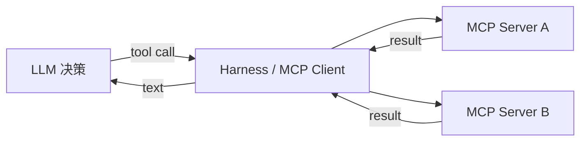

# MCP（Model Context Protocol）

> [!tip] 核心本质
> MCP 是连接 Agent 与外部系统的**开放协议**：统一「工具长什么样、怎么描述、怎么调用、结果怎么回传」。若没有它，每个数据源都要单独接一套 API 适配；Skill 里的 SOP 也无法稳定指向可复用的外部能力——Agent 要么只能读本地文件，要么被 N 种私有集成绑死在单一宿主。

## 生命周期与演进

**当前定位**：事实标准方向。Anthropic 发起 MCP，Cursor、Claude Desktop、各类 Agent 框架已内置 MCP 客户端；工具以 server 形式注册，Agent 通过 JSON-RPC 发现与调用。

**预期寿命**：中长期。只要 Agent 需访问多样外部系统（DB、SaaS、浏览器、内部 API），标准化工具层就有价值；具体传输与鉴权实现会演化。

**近期演进**：代码执行式调用 MCP（减少 tool schema 占用的 token）；远程 MCP server；与 [[skill]] 分工——Skill 写「何时调哪个 MCP、失败怎么办」，MCP 提供实时读写。

**终极威胁**：统一 Agent OS 内置常用连接器后，自建 MCP 需求下降；或模型内置 browsing/API 能力吞噬部分 MCP 场景。领域私有集成与权限边界仍会保留 MCP 形态。

## MCP 在工具栈中的位置

MCP 不替代 [[tool-use]]——它是 **Tool Use 的一种标准化实现**。LLM 仍只输出调用意图；Harness 经 MCP 客户端转发到 server 执行。

### 与相邻机制对比

| 机制 | 提供什么 | 谁维护 | 典型场景 |
| --- | --- | --- | --- |
| **MCP Tool** | 结构化 API + schema | MCP server 作者 | 查 DB、调 Jira、浏览器自动化 |
| **Read / Write / Shell** | 宿主内置通用工具 | IDE Agent | 读 repo、跑命令 |
| **Skill `scripts/`** | 任务 SOP 附带的本地脚本 | Skill 作者 | lint、批处理、确定性校验 |
| **Skill `SKILL.md`** | 程序性流程（何时调上述能力） | Skill 作者 | 发布审核、写 ADR |

**Skill vs MCP**：Skill 回答「做这类任务的步骤与契约」；MCP 回答「此刻数据库里发布单状态是什么」。Skill 正文应写「先调 `get_release` MCP，再按 checklist 审核」，而不是把 schema 抄进 Skill。

### 与 Function Calling

[[function-calling]] 是模型侧的调用格式；MCP 是 server 侧的工具供给与传输协议。宿主通常把 MCP tools 暴露为 function calling 接口给模型。

## 实践要点

- **工具描述即 Prompt**：MCP tool 的 description 与参数 schema 直接影响模型是否调对工具——见 [Writing effective tools for agents](https://www.anthropic.com/engineering/writing-tools-for-agents)。
- **少而精**：单次任务只暴露相关 MCP tools，避免与 Skill Loading & Library 类似的「列表过长选错」。
- **错误回传**：MCP 失败时 stdout/错误应进入上下文；Skill 应规定「API 报错则终止，禁止猜返回值」（见 [[skill-engineering]]）。
- **代码执行模式**：[Code execution with MCP](https://www.anthropic.com/engineering/code-execution-with-mcp) — 用代码片段调 MCP 可显著省 token，适合 tool 数量多的场景。

## 进一步阅读

- [Model Context Protocol 官网](https://modelcontextprotocol.io/) — 协议规范与 SDK。
- [[tool-use]] — LLM 与 Harness 的职责分离。
- [[skill]] — Skill 与 MCP 的分工。
- [[skill-scripts]] — 本地 scripts 与 MCP 的边界。
- [[resources/writing-tools-for-agents]] — 如何写好 MCP / 工具描述。
- [[resources/mcp-code-execution]] — MCP 代码执行模式。
