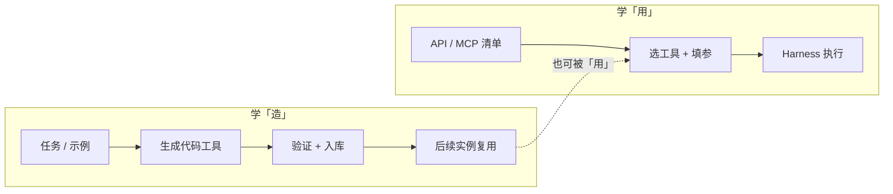
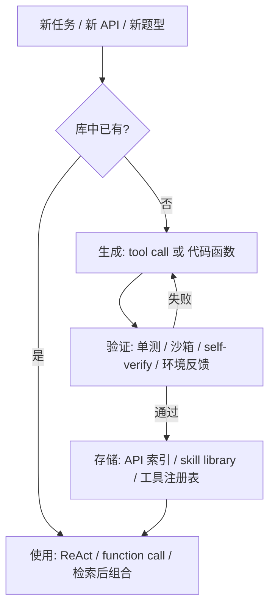

# Tool Self-Learning（模型自学用 / 造工具）

> [!tip] 核心本质
> Tool Self-Learning 研究的是：Agent 如何**不依赖人类预先写满工具库**，就能学会调用已有 API，或在运行时**自己写出可复用的工具/代码**并沉淀下来。若没有这条路线，每个新 API、每类新任务都要人手工接工具、写 SOP——Agent 的上限被「人类维护工具清单的速度」锁死，无法随任务自动扩展能力边界。

## 生命周期与演进

**当前定位**：研究成熟期、产品早期。2023 年前后 Toolformer、CREATOR、LATM、Voyager 等论文已把「自学用 / 自制」的主线跑通；工业界仍以**人类提供的 Function Calling / MCP 工具集**为主，但 Hermes、Voyager 式 skill library、LATM 式「强模型造 + 弱模型用」已在 POC 和产品化探索中出现。

**预期寿命**：中长期。只要 Agent 要面对开放域任务、私有 API 和长尾流程，「能力可扩展」就比「能力固定」更有吸引力；形态会从论文里的离线微调，演化为 Harness 内的**生成 → 验证 → 缓存 → 检索复用**闭环。

**近期演进**：三条线收敛——(1) 检索增强的工具选择（RAG over API docs）；(2) 代码即工具（Python/JS 函数入库）；(3) 与 Skill 生态对接：executable scripts 可自动沉淀，SOP 层仍多靠人类或轨迹蒸馏。强模型负责「造」，弱模型/小上下文负责「用」，成为常见的成本优化分工。

**终极威胁**：基础模型内化常见 API 模式与代码生成能力后，「学用工具」退化为默认能力；统一 Agent OS 提供标准工具市场时，「造工具」只在长尾场景有价值。更根本的是：若编译式优化（如 DSPy）或自学习 Agent 能从轨迹**直接蒸馏 Skill/SOP**，纯代码工具库会被更高层的程序性知识资产部分取代。

## 两条轴：学「用」还是学「造」

Tool learning 文献可按两个正交维度理解：

| 维度 | 学「用」已有工具 | 学「造」新工具 |
| --- | --- | --- |
| **输入** | 人类提供的 API 描述、MCP 工具列表 | 任务示例、环境反馈、少量 demonstration |
| **输出** | 正确的 tool call（名称 + 参数） | 可执行代码 / 函数 + 调用方式 |
| **核心难点** | 选对工具、填对参数、多步编排 | 通用性、正确性、可复用、如何验证 |
| **代表工作** | Toolformer, Gorilla, ToolLLM, ReAct | LATM, CREATOR, Voyager |
| **与 Skill 关系** | 接近 [[tool-use]] + Discovery | 接近 [[skill-scripts]] 自动沉淀；不等同于 [[skill]] 的 SOP 层 |

## 学「用」：三类典型路线

### 1. 自监督微调（Toolformer）

[Toolformer](https://arxiv.org/abs/2302.04761)（Meta, NeurIPS 2023）的核心不是 prompt，而是**数据构造 + 微调**：

1. 给每个 API 少量人工示例；
2. 让 LM 在大语料上**提议**插入哪些 API call；
3. 用**自监督损失**筛选「删掉这次 call 会损害未来 token 预测」的样本；
4. 只在这些有用 call 上微调 LM。

结果：模型学会**何时调、调哪个、参数是什么、如何把结果写回上下文**——且不需要任务级标注。局限：新 API 仍需走一遍数据管线；工具集变化时要重新适配。

### 2. 指令微调 + 大规模 API 数据（Gorilla / ToolLLM）

- **[Gorilla](https://arxiv.org/abs/2305.15334)**：在 APIBench 上微调，强调对海量 API 文档的**准确调用**与 hallucination 控制。
- **[ToolLLM / ToolBench](https://arxiv.org/abs/2307.16789)**：16000+ 真实 API、多步推理、ToolEval 评测——把「会用工具」推成可 benchmark 的能力维度。

共同点：**工具描述质量决定上限**（与 [[tool-use]] 中「工具描述即 Prompt」一致）；差异在于是靠**权重**记住模式，而非单次 prompt 里的 ReAct 循环。

### 3. 提示 / 推理时学习（ReAct 及变体）

[ReAct](https://arxiv.org/abs/2210.03629) 本身不是「自学」，但是**学用工具**在应用层最常见的 Harness 形态：Think → Act（tool call）→ Observe → 循环。配合 [[reflection]]、错误反馈、tool result 注入上下文，可在**不改权重**的情况下「当场学会」如何用已有工具。

工业界默认路径：**人类注册 MCP / Function Calling + ReAct 式循环**；「自学」体现在失败重试与轨迹积累，而非 Toolformer 式离线训练。

## 学「造」：从 LATM 到 Skill Library

### LATM：强模型造，弱模型用

**[LATM — Large Language Models as Tool Makers](https://arxiv.org/abs/2305.17126)**（ICLR 2024）是「模型自己写 tool」最常被引用的框架之一。

**动机**：ReAct / Toolformer 都假设**工具已存在**；LATM 让 LLM **自己造** Python 工具并缓存，打破对预制 API 的依赖。

**两阶段分工**：

| 阶段 | 模型 | 职责 |
| --- | --- | --- |
| Tool Making | 强模型（如 GPT-4） | 生成、调试、验证通用 Python 函数 |
| Tool Using | 弱模型（如 GPT-3.5） | 按 wrapped 示例把自然语言问题转成 function call |

**Making 三步**：

1. **Tool Proposing**：从 few-shot demonstration 生成 Python 函数；不可执行则根据报错重写（self-debug）。
2. **Tool Verification**：在验证样本上跑单元测试；失败则迭代修复函数或测试用例。
3. **Tool Wrapping**：打包「函数源码 + question→call 的示例」进工具库，供 User 阶段 in-context 调用。

**关键结论**：GPT-4 造 + GPT-3.5 用，效果接近全程 GPT-4，**制造成本摊销到多次调用**后推理更便宜。代码：[LLM-ToolMaker](https://github.com/ctlllll/LLM-ToolMaker)。

### CREATOR：抽象「造」与具体「用」解耦

**[CREATOR](https://arxiv.org/abs/2305.14318)**（EMNLP 2023 Findings）与 LATM 同期，强调**认知分工**而非 maker/user 模型分工：

| 阶段 | 能力类型 | 做什么 |
| --- | --- | --- |
| **Creation** | 抽象推理 | 根据问题写带文档的通用工具（代码实现） |
| **Decision** | 具体推理 | 决定何时、如何调用工具，把 tool output 映射到最终答案 |
| **Execution** | — | Harness 执行代码 |
| **Rectification** | — | 根据 traceback 自动修正工具或决策 |

论文论点：让模型**同时**规划 API 选择与细节推理时，implicit reasoning 不稳定；把「造通用工具」和「做具体决策」拆开，MATH / TabMWP 上显著优于 CoT、PoT 和固定 API 的 tool-use baseline。

与 LATM 对比：LATM 偏**工程闭环**（单元测试、缓存、大小模型分工）；CREATOR 偏**认知架构**（abstract vs concrete reasoning）。

### Voyager：可生长的 Skill Library（代码形态）

**[Voyager](https://arxiv.org/abs/2305.16291)**（Minecraft Agent）把「造工具」推到**终身学习**场景：

1. **Automatic Curriculum**：按当前状态提出 progressively harder 的任务；
2. **Iterative Prompting**：环境反馈 + 执行错误 + self-verification，迭代改进程序；
3. **Skill Library**：成功代码 indexed by **description 的 embedding**；新任务检索 top-k 相关 skill 再组合。

Skill 是**可执行代码**（Minecraft 里用 JS），不是 Markdown SOP。和 LATM 的相似点：验证通过后入库、后续检索复用。差异：Voyager 强调**开放世界持续积累**，LATM 强调**单次 task family 的函数抽象 + 成本分工**。

## 统一闭环：Generate → Verify → Store → Retrieve

无论论文名字如何，「自学用 / 造工具」在工程上常收敛为同一 Harness 模式：

| 环节 | 学「用」 | 学「造」 |
| --- | --- | --- |
| **Generate** | 选 API + 参数 | 写 Python/JS 函数 |
| **Verify** | 执行结果是否回答问题 | 单元测试、traceback、环境状态 |
| **Store** | 更新调用轨迹 / 微调数据 | 工具库、skill library、MCP 动态注册 |
| **Retrieve** | RAG over tool docs | embedding 检索 skill description |

[[reflection]] 与 Self-Debug 多出现在 **Verify 失败 → 回到 Generate** 的边上；LATM、CREATOR、Voyager 都依赖这条边，否则「自造工具」不可信。

## 与 Agent Skill 生态的对照

你 repo 里的 Skill 体系（[[skill]]）和上述研究**重叠但不等价**：

| 层次 | Agent Skill（SKILL.md） | Tool Self-Learning 产物 |
| --- | --- | --- |
| **载体** | Markdown SOP + 可选 scripts | 多为 Python/JS 函数或可执行 API |
| **谁写** | 人为主，Agent 辅助 | 模型为主，人审核可选 |
| **加载** | Discovery → Activation → Execution | 检索库 / 动态注册 / wrapped prompt |
| **验证** | 人工验收、[[skill-engineering]] | 单测、沙箱、环境反馈 |
| **路由** | `description` 触发 | embedding 相似度 / dispatcher |

**可衔接点**（也是 [[skill-engineering]] 里「终极威胁」的现实版）：

- **scripts/**：LATM / Voyager 生成的函数，可升格为 Skill 的可执行附件；
- **Discovery**：skill library 的向量检索 ≈ Skill Loading & Library 的「检索 + 按需加载」演进方向；
- **SOP 层**：Tool Self-Learning **通常不自动生成**「何时必须跑测试、禁止改哪些文件」——那仍需要 Skill / Rules，或从轨迹蒸馏（另一条研究线）。

一句话：**Tool Self-Learning 解决「能力从哪来」；Skill Engineering 解决「能力怎么被可靠地路由、激活、执行」。**

## 自造之后的 Librarian 问题

LATM、Voyager 等闭环到 **Generate → Verify → Store**，通常**缺少 Retire / Merge**——库只增不减会导致 [Library Drift](https://arxiv.org/abs/2605.19576)。自造 scripts 升格为 Skill 前须人审与去重：

- **merge** 重叠能力，勿每次 new 一个 `SKILL.md`
- **bounded active cap** + **outcome-driven retirement**
- 团队流程见 [[skill-governance]]；库演化见 [[skill-loading-library#库演化|skill-loading-library 库演化]]

## 选型直觉（实践向）

| 场景 | 更合适的路线 |
| --- | --- |
| 固定 MCP / 内部 API，要稳定上线 | 人类写 tool schema + ReAct；可选 Gorilla 类微调 |
| API 多、文档杂、常换 | RAG over docs + 小样本示例；Toolformer 式数据管线（有训练资源时） |
| 长尾推理、可代码化（数学、表格、逻辑） | CREATOR / LATM 式「现场写函数 + 单测」 |
| 开放域、长期积累、可执行即技能 | Voyager 式 skill library + curriculum |
| 团队流程、合规、审计 | 人类 [[skill-engineering]]；自动造工具仅作脚本候选 |

**常见坑**：

- **把「造」和「用」塞在同一次 prompt**：CREATOR 论文证明 entangled 模式更不稳定。
- **无 Verify 入库**：Voyager / LATM 都强调测试或环境反馈；没有闭环的「自造工具」等于幻觉缓存。
- **混淆 tool 与 Skill**：函数入库 ≠ SOP 入库；只有代码没有路由元数据时，Agent 仍可能「不知道有这个能力」。
- **工具爆炸**：库越大检索越差，需要 retirement、版本化、合并（工业界 AutoSkill / 类似框架在补这块）。

## 进一步阅读

- [Toolformer: Language Models Can Teach Themselves to Use Tools](https://arxiv.org/abs/2302.04761) — 自监督「学用 API」的奠基工作。
- [Large Language Models as Tool Makers (LATM)](https://arxiv.org/abs/2305.17126) — 强模型造工具、弱模型用工具；单元测试 + wrapping。
- [CREATOR: Tool Creation for Disentangling Abstract and Concrete Reasoning](https://arxiv.org/abs/2305.14318) — Creation / Decision / Execution / Rectification 四阶段。
- [Voyager: An Open-Ended Embodied Agent with Large Language Models](https://arxiv.org/abs/2305.16291) — 自动课程 + 代码 skill library + 迭代验证。
- [Gorilla: Large Language Model Connected with Massive APIs](https://arxiv.org/abs/2305.15334) — 大规模 API 调用微调。
- [ToolLLM: Facilitating LLMs to Master 16000+ Real-world APIs](https://arxiv.org/abs/2307.16789) — ToolBench 与多步 tool use 评测。
- [LLM-Tool-Survey (GitHub)](https://github.com/quchangle1/LLM-Tool-Survey) — 工具学习论文索引。
- [[tool-use]] — Harness 内工具调用的基础机制。
- [[skill-scripts]] — Skill 中可执行脚本层，与「造工具」产物最近。
- [[skill-engineering]] — 人类维护 SOP 的方法论；与自动造工具互补。
- [[skill-loading-library]] — 自造 skill 库的 merge/retire。
- [[skill-governance]] — 人审 promote 与 creation gate。
- [[skill]] — 「终极威胁」中自学习 Agent 蒸馏 Skill 的衔接点。
