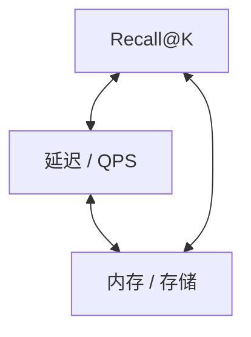
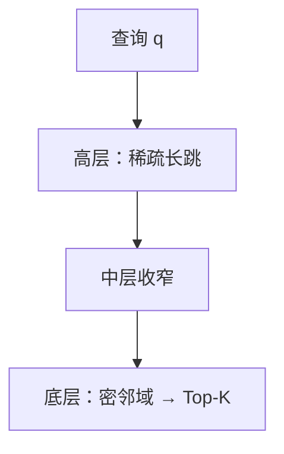
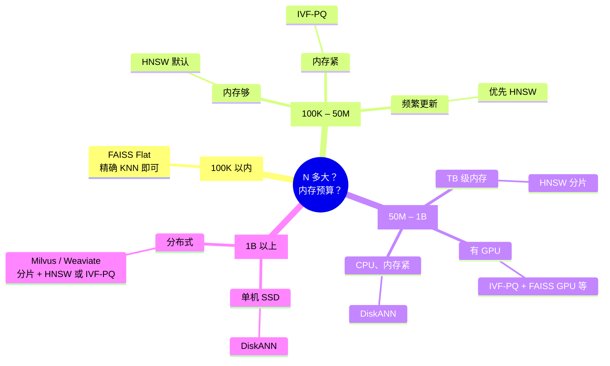

# ANN（近似最近邻搜索）

> [!tip] 核心本质
> 稠密检索把「找相关文档」变成在向量空间里找离查询最近的若干条。库里有 N 条向量时，若每条都算一次相似度，就是 N 次距离计算——千万级尚可，十亿级在延迟和内存上都不成立。近似最近邻（Approximate Nearest Neighbor，ANN）在索引里预先组织数据，查询只访问一小部分候选，用可控的漏召回换毫秒级响应；没有它，大规模向量库无法上线。

适合已理解 [[embedding]] 与 [[cosine-similarity]]、要在检索增强生成（RAG）或推荐里**选索引或调参**的读者。读完 [[#4 两条路线：少扫还是会走|§4]] 即可建立整体图景；具体参数与工具见 [[#9 选型与调参|§9]]。指标定义见 [[recall-at-k]]。

## 生命周期与演进

**当前定位**：分层可导航小世界（HNSW）是百万～亿级、内存够时的默认；倒排文件加乘积量化（IVF-PQ）在内存紧、规模极大时仍主力；DiskANN 把图索引落到固态硬盘，补「十亿级但内存只有几十 GB」的空档。

**预期寿命**：长期稳定。图索引与倒排加量化分别来自 2011–2019 年论文，工业验证充分；变的是实现与图形处理器（GPU）、带条件过滤等工程层，不是「要不要索引」。

**近期演进**：图形处理器批量 ANN、带元数据过滤的 ANN、稠密加稀疏混合索引随多向量模型普及。

**终极威胁**：工程上十数年内仍无精确 K 近邻（KNN）替代；量子等理论路径与线上 RAG 选型无关。

## 1 问题从哪来

用户问一个问题，系统先把问题变成查询向量，再在文档向量库里找最像的 K 条——这是 [[retrieval-pipeline]] 粗排的常见形态。瓶颈不在「会不会算相似度」，而在**要对多少条向量各算一次**。

### 1.1 五个点就能看懂暴力法

假设库里只有 5 篇文档，各有二维向量（真实场景是百万维，但逻辑相同）。来一条查询向量 **q**，暴力做法是：对 5 条各算一次 [[cosine-similarity]]，排序取前 K 条。

**图 1 — 五个文档向量与查询 q（二维示意）**

```echarts
// @height 340
{
  "grid": { "left": 56, "right": 28, "top": 36, "bottom": 48 },
  "xAxis": { "name": "dim₁", "min": -1, "max": 1, "splitLine": { "show": true } },
  "yAxis": { "name": "dim₂", "min": -1, "max": 1, "splitLine": { "show": true } },
  "tooltip": { "trigger": "item", "formatter": "{b}: ({c})" },
  "series": [
    {
      "name": "文档",
      "type": "scatter",
      "symbolSize": 14,
      "data": [
        { "value": [-0.8, 0.6], "name": "A", "label": { "show": true, "formatter": "A", "position": "right" } },
        { "value": [-0.7, -0.5], "name": "B", "label": { "show": true, "formatter": "B", "position": "right" } },
        { "value": [0.9, 0.7], "name": "C", "label": { "show": true, "formatter": "C", "position": "right" } },
        { "value": [0.5, -0.5], "name": "D", "label": { "show": true, "formatter": "D", "position": "right" } },
        { "value": [0.6, -0.3], "name": "E", "label": { "show": true, "formatter": "E", "position": "right" } }
      ],
      "itemStyle": { "color": "#5470c6" }
    },
    {
      "name": "查询 q",
      "type": "scatter",
      "symbol": "star",
      "symbolSize": 18,
      "data": [
        { "value": [0, 0], "name": "q", "label": { "show": true, "formatter": "q", "position": "top" } }
      ],
      "itemStyle": { "color": "#ee6666" }
    }
  ]
}
```

（需在 Obsidian 启用 **AI ECharts** 插件：`bash tools/obsidian-echarts/install.sh`。Git/Cursor 预览仍为 JSON 块；坐标见下表。）

| 点 | dim₁ | dim₂ | 与 q 的远近（示意） |
| --- | ---: | ---: | --- |
| **q** | 0.0 | 0.0 | — |
| E | 0.6 | −0.3 | **最近** |
| D | 0.5 | −0.5 | 较近 |
| C | 0.9 | 0.7 | 较远 |
| A | −0.8 | 0.6 | 较远 |
| B | −0.7 | −0.5 | 较远 |

示意中 **E 离 q 最近**；若 K=1，精确 KNN 应返回 E。

暴力法即：q 与 A、B、C、D、E **各算一次**相似度，再排序取 Top-K → 共 **5 次**距离计算，100% 找到真正的最近邻。这就是**精确 K 近邻（Exact KNN）**：定义上不会漏。

### 1.2 规模放大后哪里先崩

把 5 换成一千万或十亿，同一套「全扫」立刻不可行：

| 瓶颈 | 千万级（10M×768 维） | 十亿级（1B×1024 维） |
| --- | --- | --- |
| 每次查询计算量 | N 次距离，单 CPU 约数十毫秒，尚可 | 10⁹ 次距离，不可用 |
| 存向量本体 | 约 30 GB | 约 4 TB（32 位浮点），内存难承受 |
| 召回 | 100%（定义上精确） | 同上 |

精确 KNN 的复杂度是 O(N·d)（N 条向量、d 维）。业务同时要 **p99 延迟**（如 RAG 粗排小于 100 毫秒）与 **Recall@K**（见 [[recall-at-k]]）——在 N 很大时，精确解满足不了延迟，近似路径于是成为默认。

## 2 精确最近邻要达成什么

检索增强生成、推荐召回、去重查重，底层任务相同：

> 给定查询 q 与集合 D（|D| = N），返回与 q 相似度最高的 K 个向量（及对应文档 ID）。

相似度通常是 [[cosine-similarity]]，或与 L2 归一化等价的点积。ANN **不改变**用什么度量，只改变**如何少算几次**仍拿到足够好的 Top-K。

## 3 近似检索在交换什么

ANN 不保证 Top-K 与暴力完全一致。在**业务可接受的 Recall@K**（常见 95%–99%）下，它只触达远小于 N 的候选，把延迟压到毫秒～几十毫秒。漏掉的真邻居叫**漏召（false miss）**；调参、换算法、加 [[cross-encoder]] 精排，都是在控制这类错误。

选型没有「召回、延迟、内存三边全优」，只能在三者之间取工作点：

**图 2 — ANN 三角权衡**



因此：提高 `ef_search` 通常召回上升、延迟也上升；倒排加量化省内存，同规模召回常低于 HNSW；DiskANN 用固态硬盘换内存，延迟高于全内存图。具体数字随数据分布与实现浮动，须在自己数据上扫参（见 [[#9.2 业务上的 Recall–延迟目标|§9.2]]）。

## 4 两条路线：少扫还是会走

所有 ANN 索引都在做同一件事：**避免对 N 条向量各算一次距**。实现上分两条典型思路——先建立这个分法，再读各算法细节就不会混成「一堆名字」。

**表 1 — 两条 ANN 路线**

| 路线 | 核心想法 | 查询时在干什么 | 代表 |
| --- | --- | --- | --- |
| 分区 / 压缩 | 把空间划块或压短向量，只搜少数块 | q 落在哪几个区？只翻这些抽屉 | 倒排文件（IVF）、IVF-PQ、局部敏感哈希（LSH） |
| 导航 / 图 | 预建「相似向量相连」的图，沿边走向 q | 从入口沿越来越像 q 的邻居走，几十步到目标区 | HNSW、DiskANN |

两条路线可叠加（DiskANN = 图 + 磁盘上的量化摘要）。下面按「默认首选 → 省内存 → 磁盘图」展开。

## 5 HNSW：沿图走近查询点

分层可导航小世界（Hierarchical Navigable Small World，HNSW，Malkov & Yashunin，2016）是当前 Recall–延迟综合最好的默认方案，Milvus、Qdrant、Weaviate、pgvector 等均以之为首选。

### 5.1 查询时在干什么（先想成找最近的店）

把向量想成地图上的点，查询 q 是「你站的位置」。HNSW 预先在相似点之间连边，查询时：

1. 从**最高层**图的入口出发（边少、一步跳得远）。
2. 在当前层**贪心**：反复移到「离 q 更近」的邻居，直到走不动。
3. **下降**到下一层，重复 2；层越低边越密、步子越小。
4. 在**最底层**扩大局部搜索，维护大小为 `ef_search` 的候选堆，输出 Top-K。

全程只访问图上少量节点——跳数约 O(log N) 量级，而不是 N。高层像「先坐高铁到城市」，底层像「步行找门牌号」。



> [!note] 跳步与距离
> **跳步（hop）**：沿图边走一步。**距离**：向量空间里的余弦或 L2。路径短不保证空间最近——算法靠多层贪心把两者对齐到足够好。

### 5.2 索引长什么样

多层近邻图，层号越高越稀疏：

**图 3 — HNSW 多层近邻图（示意）**

```echarts
// @height 300
{
  "grid": { "left": 56, "right": 20, "top": 20, "bottom": 36 },
  "xAxis": {
    "type": "value",
    "min": 0.4,
    "max": 9.6,
    "interval": 1,
    "axisLine": { "show": false },
    "axisTick": { "show": false },
    "axisLabel": { "show": false },
    "splitLine": { "show": true, "lineStyle": { "type": "dashed", "opacity": 0.25 } }
  },
  "yAxis": {
    "type": "category",
    "data": ["Layer 0", "Layer 1", "Layer 2"],
    "axisLine": { "show": false },
    "axisTick": { "show": false },
    "axisLabel": { "fontSize": 11, "margin": 12 }
  },
  "tooltip": { "trigger": "item", "formatter": "节点 {@[0]}" },
  "series": [
    {
      "type": "lines",
      "coordinateSystem": "cartesian2d",
      "z": 1,
      "silent": true,
      "lineStyle": { "color": "#b0b8c4", "width": 2 },
      "data": [
        { "coords": [[1, "Layer 2"], [5, "Layer 2"]] },
        { "coords": [[1, "Layer 1"], [3, "Layer 1"]] },
        { "coords": [[3, "Layer 1"], [5, "Layer 1"]] },
        { "coords": [[5, "Layer 1"], [8, "Layer 1"]] },
        { "coords": [[1, "Layer 0"], [2, "Layer 0"]] },
        { "coords": [[2, "Layer 0"], [3, "Layer 0"]] },
        { "coords": [[3, "Layer 0"], [4, "Layer 0"]] },
        { "coords": [[4, "Layer 0"], [5, "Layer 0"]] },
        { "coords": [[5, "Layer 0"], [6, "Layer 0"]] },
        { "coords": [[6, "Layer 0"], [7, "Layer 0"]] },
        { "coords": [[7, "Layer 0"], [8, "Layer 0"]] },
        { "coords": [[8, "Layer 0"], [9, "Layer 0"]] }
      ]
    },
    {
      "type": "scatter",
      "z": 2,
      "symbolSize": 26,
      "itemStyle": { "color": "#5470c6", "borderColor": "#fff", "borderWidth": 2 },
      "label": { "show": true, "formatter": "{@[0]}", "color": "#fff", "fontSize": 11, "fontWeight": "bold" },
      "data": [
        [1, "Layer 2"], [5, "Layer 2"],
        [1, "Layer 1"], [3, "Layer 1"], [5, "Layer 1"], [8, "Layer 1"],
        [1, "Layer 0"], [2, "Layer 0"], [3, "Layer 0"], [4, "Layer 0"], [5, "Layer 0"],
        [6, "Layer 0"], [7, "Layer 0"], [8, "Layer 0"], [9, "Layer 0"]
      ]
    }
  ],
  "graphic": [
    {
      "type": "text",
      "left": "center",
      "bottom": 4,
      "style": { "text": "Layer 0：近邻边密集", "fill": "#999", "fontSize": 10 }
    }
  ]
}
```

插入新向量：随机分配最高层；自顶向下每层找近邻，连最多 M 条边。相似向量在空间里成团；底层连近邻（团内细找），高层加少量长边（换区不必穿过全库）。

### 5.3 参数与典型表现

| 参数 | 作用 | 典型值 | 调大 |
| --- | --- | --- | --- |
| `M` | 每节点最大出边数 | 16–32 | 召回↑、内存↑、构建慢 |
| `ef_construction` | 建索引时的候选宽度 | 200–400 | 图质量↑、构建慢 |
| `ef_search` | 查询时的候选宽度 | 50–200 | 召回↑、延迟↑（**运行时调，无需重建**） |

10M 向量、1024 维参考（随实现浮动）：

| M, ef_search | Recall@10 | p99 延迟 | 内存 |
| --- | --- | --- | --- |
| 16, 50 | ~95% | ~5ms | ~8 GB |
| 32, 100 | ~98% | ~10ms | ~12 GB |
| 32, 200 | 99%+ | ~20ms | ~12 GB |

**适合**：百万～亿级、要低延迟高召回、内存能放下向量加图。**不适合**：十亿级全内存（边加向量可达数十 TB 内存）、对构建时间极敏感且库静态（可考虑 Annoy 等，见 [[#8 其他算法|§8]]）。

## 6 IVF-PQ：分桶少扫 + 量化省内存

倒排文件（Inverted File，IVF）加乘积量化（Product Quantization，PQ）= 先少候选，再压存储。十亿级、内存紧时的主力；Recall 通常低于同规模 HNSW，但内存可差两个数量级。

### 6.1 IVF：只搜 q 附近的几个桶

离线用 K-Means 把 D 聚成 `nlist` 个簇，记下质心；每条向量写入「离它最近质心」的倒排列表。查询时找离 q 最近的 `nprobe` 个质心，**只在这些簇里**算距、取 Top-K。

```
nlist=1024, nprobe=32  →  约扫 3% 向量
```

像档案按「城区」分柜：只开 q 附近的几个柜。风险在高维：**真邻居不一定和 q 落在同一簇**，`nprobe` 太小会整片漏召回。`nprobe` 是 IVF 的主旋钮——越大越慢、越接近暴力。`nlist` 经验：约 sqrt(N)（如 1B → nlist≈32768）。

### 6.2 PQ：把向量压短再算近似距

IVF 解决「扫谁」；PQ 解决「每条占多少字节」：把 d 维切成 M 段，每段用码本量化为 256 个码字之一 → 每段 1 字节。例：3072 字节 32 位浮点 → 96 字节（约 32× 压缩）；距离用预计算表近似，有损。优化乘积量化（OPQ）先旋转再量化，召回常可提升数个百分点。IVF 与 PQ 正交：可先 IVF 减候选，簇内向量已是 PQ 码。

### 6.3 与 HNSW 何时二选一（1B×1024 维量级）

| | HNSW（全内存） | IVF-PQ |
| --- | --- | --- |
| 内存 | TB 级 | 数十 GB |
| Recall@10 | 98–99% | 90–95% |
| 动态增删 | 较友好 | 改簇成本较高 |

内存是硬约束时选 IVF-PQ；内存够、要延迟和召回时选 HNSW。

## 7 DiskANN：图导航 + 向量落盘

DiskANN（Vamana，Microsoft，2019）在「想要图的召回形状、但内存放不下全库」时用：**全精度向量在固态硬盘，内存里放图边加 PQ 摘要**。查询与 HNSW 类似沿图走，但精排阶段从盘拉全精度向量（可 beam 并行 IO）。

1B 向量参考：

| 方案 | 内存 | Recall@10 | QPS |
| --- | --- | --- | --- |
| HNSW 全内存 | ~4 TB | ~98% | 5000+ |
| IVF-PQ | ~32 GB | ~92% | ~2000 |
| DiskANN | ~32 GB + SSD | ~95–97% | ~500–1500 |

同内存下 DiskANN 召回常比 IVF-PQ 高数点，代价是固态硬盘随机读（约 5–15ms 级）。参数：`R`（度数）、`L`（构建候选）、`B`（内存预算 GB）、`beam_width`（并行 IO）。

## 8 其他算法

| 算法 | 思路 | 典型场景 |
| --- | --- | --- |
| FAISS Flat | 暴力精确 | 小于 100K、基准 ground truth |
| Annoy | 随机超平面树 | 静态小库、只读 |
| LSH | 哈希相似点到同桶 | 流式草图；精度低，渐少用于主路径 |
| ScaNN | 各向异性量化 + 树 | Google 内部大规模 |

## 9 选型与调参

### 9.1 决策树



### 9.2 业务上的 Recall–延迟目标

| 场景 | Recall@K 目标 | 延迟 |
| --- | --- | --- |
| 实时推荐 | 90–95% @10 | 小于 20ms |
| RAG 粗排 | 95–98% @5 | 小于 100ms（常有精排兜底） |
| 离线批处理 | 可追 99% | 不敏感 |

HNSW 上应用 **扫 `ef_search`** 找拐点（10M×768 维常见：ef 50→200，Recall@10 约 95%→99%+，p99 约 5ms→约 20ms）：

```python
for ef in [10, 20, 50, 100, 200, 400]:
    index.hnsw.ef = ef
    recall, latency_p99 = benchmark(index, queries, ground_truth)
```

### 9.3 参数速查

**HNSW**

| 规模 | M | ef_construction | ef_search | Recall@10 |
| --- | --- | --- | --- | --- |
| 小于 100K | 16 | 200 | 50 | 97–99% |
| 100K–10M | 32 | 400 | 100 | 95–98% |
| 10M–50M | 32–64 | 400–800 | 100–200 | 93–97% |

**IVF-PQ**

| 向量数 | nlist | nprobe | PQ 段数 m | Recall@10 |
| --- | --- | --- | --- | --- |
| 1M | 1024 | 32 | dim/8 | 88–93% |
| 100M | 16384 | 128 | dim/8 | 88–92% |
| 1B | 65536 | 256 | dim/4 | 85–92% |

## 10 工程延伸

### 10.1 量化（可叠在多种索引上）

- 标量量化（SQ）：32 位浮点→8 位/4 位整数，约 4×/8×；8 位整数召回约损 1–2%。
- 二进制量化（BQ）：每维取符号，32× 压缩；常用 BQ 粗选 + 原向量 **rescore**。

### 10.2 带过滤的 ANN

业务常要：`Top-K WHERE dept='legal' AND date > '2024-01-01'`。

| 做法 | 问题 |
| --- | --- |
| 先 ANN 再过滤 | Top-K 滤完后可能不足 K 条 |
| 先过滤再 ANN | 子集太小则图/桶退化，召回暴跌 |
| **In-filter**（产品方向） | 遍历候选时判 payload；Qdrant、Milvus bitmap、ACORN 等 |

选择性小于 5% 时 pre-filter 有时更优；大于 30% 时 in-filter 更常见。

## 要点收束

- 精确 KNN 要对全库算距，复杂度 O(N·d)；十亿级在延迟和内存上不可行，ANN 用可控漏召回换只摸一小部分候选。
- 所有 ANN 只有两条思路：**少扫**（分区/压缩）与**会走**（导航/图）；HNSW 与 IVF-PQ 是两条路线的代表，DiskANN 是图加盘。
- HNSW 默认首选：多层图从粗到细贪心走向 q，运行时调 `ef_search` 即可权衡 Recall 与延迟。
- IVF-PQ 在内存紧、十亿级仍常用：`nprobe` 控制扫多少桶，PQ 控制每条占多少字节。
- 没有三边全优：须在 Recall@K、延迟、内存之间在自己数据上扫参；粗排 Recall 不够时，后面精排无法补救（见 [[recall-at-k]]）。

## 进一步阅读

### 库内关联

- [[embedding]] — 向量从哪来
- [[cosine-similarity]] — 相似度定义与归一化
- [[recall-at-k]] — ANN 质量指标如何算
- [[retrieval-pipeline]] — ANN 在粗排链路中的位置
- [[rag]] — 端到端检索架构

### 论文

- Malkov & Yashunin, [HNSW](https://arxiv.org/abs/1603.09320)（2016）
- Johnson et al., [FAISS](https://arxiv.org/abs/1702.08734)（2017）
- Jégou et al., [Product Quantization](https://lear.inrialpes.fr/pubs/2011/JDS11/jegou_searching_with_codes.pdf)（2011）
- Subramanya et al., [DiskANN](https://proceedings.neurips.cc/paper/2019/file/09853c7fb1d3f8ee67a61b6bf4a7f8e6-Paper.pdf)（NeurIPS 2019）
- Guo et al., [ScaNN](https://arxiv.org/abs/1908.10396)（2020）

### 工具与评测

- [FAISS](https://github.com/facebookresearch/faiss) — Flat, IVF, IVF-PQ, HNSW
- [hnswlib](https://github.com/nmslib/hnswlib) — HNSW 轻量实现
- [DiskANN](https://github.com/microsoft/DiskANN) — Vamana
- [ann-benchmarks.com](https://ann-benchmarks.com) — Recall–QPS 标准曲线
