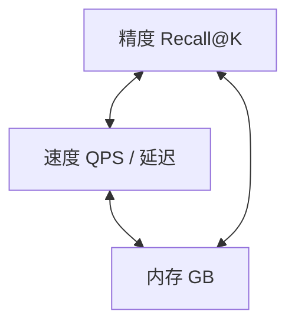
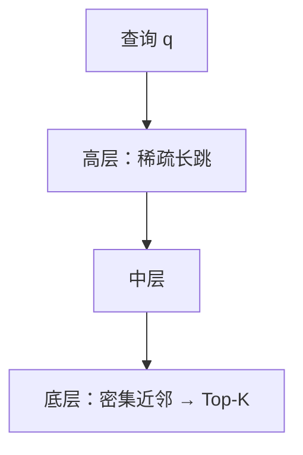

# ANN（近似最近邻搜索）

> [!tip] 核心本质
> 向量检索要在集合 **D** 里为查询 **q** 找 Top-K 最相似向量。暴力枚举是 O(N·d)，十亿级规模下仅向量本体就约 **4TB**（10⁹×1024×4 字节），且每次查询需与全库逐一算距。ANN 用**可控召回损失**换速度：建索引后查询约 O(log N) 量级，毫秒级返回 90–99% 的正确邻居——没有 ANN，大规模向量库无法上线。

## 生命周期与演进

**当前定位**：HNSW 是 2026 年默认选择，主流向量库（Milvus、Qdrant、Weaviate、pgvector）全部以 HNSW 为首选索引；IVF-PQ 在亿级以上大规模场景仍是核心；DiskANN 在内存受限的十亿级场景快速普及。

**预期寿命**：长期稳定。核心算法族（图索引、倒排索引+量化）来自 2011–2019 年的论文，已经过大量工业验证；具体实现持续优化但算法原理不会剧变。

**近期演进**：GPU 加速 ANN（FAISS GPU、RAPIDS cuVS）在大规模批量场景达到 10 倍吞吐提升；带过滤条件的 Filtered ANN（ACORN、Qdrant payload index）从研究走向产品；bge-m3 等模型同时输出 dense + sparse 向量，触发向量库对混合索引的原生支持。

**终极威胁**：量子计算理论上可做精确近邻搜索；但在工程实用层面，ANN 在未来 10 年内无可替代。

---

## 问题背景

给定查询向量 **q**，在 **D** 中找到与 q 距离最近的 **K** 个向量。

**暴力搜索**：q 与每条向量算距离后排序。

| | 说明 |
| --- | --- |
| 召回 | 100% |
| 复杂度 | O(N × d) |
| 千万级 10M×768 维 | 单 CPU 每次查询约 80ms，尚可 |
| 十亿级 1B×1024 维 | 向量本体约 **4TB** RAM；且每次查询需 10 亿次距离计算，不可用 |

**ANN**：允许少量漏召回（通常 95–99%），换取毫秒级查询。选型是在下面三角上取工作点，没有算法三边同时最优：



*沿边取舍：`ef_search`↑ 召回↑ 延迟↑；全内存 HNSW 快、DiskANN 落盘慢但省 RAM；IVF-PQ 压缩省内存、同规模召回常低于 HNSW。*

---

## 算法族一览

| 算法族 | 核心做法 | 典型场景 | 主要代价 |
| --- | --- | --- | --- |
| **HNSW** | 分层近邻图，查询时沿图走近 q | 百万～亿级、要低延迟高召回、内存够 | RAM（存图） |
| **IVF-PQ** | 分桶 + 向量量化压缩 | 百亿级、内存紧、可接受调参 | 桶边界漏召回、量化损精度 |
| **DiskANN** | 图索引 + 向量落 SSD | 单机十亿级、RAM 只有几十 GB | SSD 随机读延迟 |

---

## HNSW（默认方案）

**HNSW**（Hierarchical Navigable Small World，Malkov & Yashunin，2016）：当前 **Recall–Latency** 综合最佳，多数向量库的默认索引。

### 直觉：为什么不扫全库

**和分桶（IVF）的差别**：IVF 先聚类成桶，查询只搜 `nprobe` 个桶——像只翻「朝阳区」档案；高维下真邻居未必落在 q 所属桶里，**桶划歪会整片漏掉**。HNSW 不赌桶，而是**沿「越来越像 q」的邻居一步步走**，几十 hop 就能从远处逼近目标区，再在底层精搜 Top-K。

**和导航的对应**（这也是「分层」的原因）：

| 阶段 | 导航 | HNSW |
| --- | --- | --- |
| 粗定位 | 高速/高铁，大步离开起点 | 高层：边少、一步跳远，快速离开「离 q 还远」的区域 |
| 收窄 | 国道/环线 | 中层继续缩小范围 |
| 精搜 | 小区里找门牌 | Layer 0：近邻边密，局部挑出 Top-K |



**小世界结构**（名字里 Small World 的含义）：相似向量在空间里**成团**；图里**底层只连近邻**（团内细找），**高层再加少量远跳**（换区不必穿过全库）。社会网络里的「六度分隔」是同一类直觉——远距也能少步相连；HNSW **不是**模拟社交网，只借用「局部密 + 长程边」。

> [!note] hop（跳）与距离
> **hop**：沿图边走一步；路径 k 条边 = k hops。HNSW 查询每挪到一邻居 = 1 hop。
> **距离**：向量空间里的欧氏/余弦等连续度量。hop 数**图上的步数**，距离数**空间里的远近**——二者不同。

### 机制：建图与查询

多层近邻图，层越高越稀疏：

```
Layer 2 (稀疏长跳):    1 ──── 5
Layer 1 (中等):    1 ── 3 ── 5 ── 8
Layer 0 (密集短跳): 1-2-3-4-5-6-7-8-9...
```

- **插入**：向量随机分配最高层，自顶向下每层找近邻，连最多 **M** 条边。
- **查询**：从顶层入口贪心走向更近的节点，逐层下降，底层取 Top-K；总 hop 约 **O(log N)**，不扫全库。

### 参数、性能与局限

| 参数 | 含义 | 典型值 | 调大效果 |
| --- | --- | --- | --- |
| `M` | 每节点最大边数 | 16–32 | 召回↑ 内存↑ 构建慢 |
| `ef_construction` | 构建时候选列表 | 200–400 | 索引质量↑ 构建慢 |
| `ef_search` | 查询时候选列表 | 50–200 | 召回↑ 延迟↑（**运行时可调**，无需重建） |

10M 向量、1024 维参考：

| M, ef | Recall@10 | p99 延迟 | 内存 |
| --- | --- | --- | --- |
| 16, 50 | 95% | 5ms | ~8 GB |
| 32, 100 | 98% | 10ms | ~12 GB |
| 32, 200 | 99%+ | 20ms | ~12 GB |

**优**：召回高（可达 99%+）、延迟低、支持动态增删、工具链成熟。

**劣**：内存大（边指针 + 向量）；1B×768 维 FP32 全内存 HNSW 需**几十 TB RAM**；构建慢 O(N·M·log N)。

---

## IVF-PQ（大规模 / 省内存）

IVF-PQ = **倒排分桶（IVF）** + **乘积量化（PQ）**，百亿级场景主力。

### IVF：分桶检索

1. K-Means 聚为 `nlist` 簇，记录质心。
2. 索引：向量写入最近簇的倒排列表。
3. 查询：找距 q 最近的 `nprobe` 个质心，只搜这些簇。

```
nlist=1024, nprobe=32  →  只扫约 3% 向量
```

- **nprobe**：召回/延迟主旋钮；nprobe=1 极快低召回，nprobe=nlist 退化为暴力。
- **nlist 经验**：约 `sqrt(N)`，如 1B 向量 → nlist≈32768。

### PQ：压缩向量

将 d 维切为 M 段，每段量化为 256 个码字之一（通常 1 字节/段）：

```
768 维 → M=96 段 × 8 维/段 → 3072 字节 → 96 字节（约 32× 压缩）
```

查询用预计算距离表做近似内积，快但有损。**OPQ**：先旋转再量化，召回约 +5–10%。

| 参数 | 含义 | 经验值 |
| --- | --- | --- |
| `nlist` | 簇数 | `sqrt(N)` 或 1024/4096/16384 |
| `nprobe` | 查询搜的簇数 | `nlist/32` 起步 |
| `M` (PQ) | 子向量段数 | dim/8；M 越大精度越高 |

### 与 HNSW 对比（1B 向量，1024 维）

| | HNSW | IVF-PQ |
| --- | --- | --- |
| RAM | ~4 TB（全内存难承受） | ~32 GB（量化后） |
| Recall@10 | 98–99% | 90–95% |
| QPS（单 CPU） | 2k–5k | 1k–3k |
| 动态增删 | 支持 | 重建簇较慢 |

---

## DiskANN（内存不够、还要图）

DiskANN（Vamana，Microsoft，2019）：**向量在 SSD，图边与 PQ 摘要放 RAM**，单机十亿级可行。

- 图遍历类似 HNSW；RAM 用 PQ 粗筛，SSD 读全精度做精排（两阶段 IO）。
- 参数：`R`（度数 64–128）、`L`（构建候选 100–200）、`B`（内存预算 GB）、`beam_width`（并行 IO 4–8）。

1B 向量参考：

| 方案 | RAM | Recall@10 | QPS |
| --- | --- | --- | --- |
| HNSW | ~4 TB | 98% | 5000+ |
| IVF-PQ | ~32 GB | 92% | 2000 |
| DiskANN | ~32 GB + SSD | 95–97% | 500–1500 |

DiskANN 同内存下召回常比 IVF-PQ 高 3–5 点，代价是 SSD 随机读（约 5–15ms 级）。

---

## 其他算法

| 算法 | 原理 | 场景 |
| --- | --- | --- |
| **LSH** | 相似点哈希到同桶 | 流式/草图；精度低，渐退主流 |
| **Annoy** | 随机超平面森林 | 静态小库 <5M，只读 |
| **ScaNN** | 各向异性量化 + 树 | Google 内部大规模 |
| **FAISS Flat** | BLAS 暴力精确 | 基准、<100K |

---

## 工程专题

### 量化（压缩向量）

可叠加在多种索引上。PQ 细节见上文 IVF-PQ。

**Scalar Quantization（SQ）**：FP32→INT8/INT4，约 4×/8× 压缩；INT8 召回约损 1–2%。

**Binary Quantization（BQ）**：每维取符号，32× 压缩；宜 BQ 粗选 + 原向量 **rescore**，可达约 96% 召回。Milvus、FAISS 均支持。

### Filtered ANN（带条件检索）

```sql
SELECT top_k(embedding, query_vec) WHERE dept = 'legal' AND date > '2024-01-01'
```

| 做法 | 问题 |
| --- | --- |
| 先 ANN 再过滤 | 过滤后可能远少于 K 条 |
| Pre-filter 子集建索引 | 子集太小图退化，召回暴跌 |
| **In-filter**（推荐方向） | 遍历时判 payload：Qdrant、Milvus bitmap、ACORN 等 |

选择性 <5% 时 Pre-filter 可能更优；>30% 时 In-filter 更优。

### 召回–延迟工作点

```python
for ef in [10, 20, 50, 100, 200, 400]:
    index.hnsw.ef = ef
    recall, latency_p99 = benchmark(index, queries, ground_truth)
```

HNSW 10M×768 维典型形态：ef 从 50→200，Recall@10 从 ~95%→99%+，p99 从 ~5ms→~20ms。

**业务目标**：

- 实时推荐：90–95% Recall@10，<20ms
- RAG：95–98% Recall@5，<100ms（常有 Rerank 兜底）
- 离线批处理：可追 99% 召回，延迟不敏感

### 选型决策树

```
规模多大？
│
├── < 100K  →  FAISS Flat（暴力）
├── 100K – 50M
│     ├── 内存够 → HNSW（默认）
│     ├── 内存紧 → IVF-PQ
│     └── 频繁更新 → 优先 HNSW
├── 50M – 1B
│     ├── TB 级内存 → HNSW 分片
│     ├── 有 GPU → IVF-PQ + FAISS GPU
│     └── 仅 CPU、内存紧 → DiskANN
└── > 1B
      ├── 单机 SSD → DiskANN
      └── 分布式 → Milvus / Weaviate 分片 + HNSW/IVF-PQ
```

### 参数速查

**HNSW**

| 规模 | M | ef_construction | ef_search | Recall@10 |
| --- | --- | --- | --- | --- |
| <100K | 16 | 200 | 50 | 97–99% |
| 100K–10M | 32 | 400 | 100 | 95–98% |
| 10M–50M | 32–64 | 400–800 | 100–200 | 93–97% |

**IVF-PQ**

| 向量数 | nlist | nprobe | PQ m | Recall@10 |
| --- | --- | --- | --- | --- |
| 1M | 1024 | 32 | dim/8 | 88–93% |
| 100M | 16384 | 128 | dim/8 | 88–92% |
| 1B | 65536 | 256 | dim/4 | 85–92% |

---

## 工具与评测

| 库 | 算法 | 链接 |
| --- | --- | --- |
| **FAISS** | Flat, IVF, IVF-PQ, HNSW | [facebookresearch/faiss](https://github.com/facebookresearch/faiss) |
| **hnswlib** | HNSW 轻量实现 | [nmslib/hnswlib](https://github.com/nmslib/hnswlib) |
| **DiskANN** | Vamana | [microsoft/DiskANN](https://github.com/microsoft/DiskANN) |
| **ScaNN** | ScaNN | [google-research/scann](https://github.com/google-research/scann) |
| **Annoy** | 随机投影树 | [spotify/annoy](https://github.com/spotify/annoy) |
| **Milvus Knowhere** | HNSW, IVF-PQ, DiskANN, BQ 等 | [zilliztech/knowhere](https://github.com/zilliztech/knowhere) |

| 资源 | 内容 |
| --- | --- |
| [ann-benchmarks.com](https://ann-benchmarks.com) | Recall vs QPS 标准曲线 |
| [BEIR](https://github.com/beir-cellar/beir) | 检索评测集 |
| [MTEB](https://github.com/embeddings-benchmark/mteb) | Embedding 排行榜 |

---

## 进一步阅读

- [[embedding]] — 向量从哪来、相似度度量
- [[retrieval-pipeline]] — ANN 在检索链路中的位置
- [[rag]] — RAG 整体框架
- Malkov & Yashunin, [HNSW](https://arxiv.org/abs/1603.09320)（2016）
- Johnson et al., [FAISS](https://arxiv.org/abs/1702.08734)（2017）
- Jégou et al., [Product Quantization](https://lear.inrialpes.fr/pubs/2011/JDS11/jegou_searching_with_codes.pdf)（2011）
- Subramanya et al., [DiskANN](https://proceedings.neurips.cc/paper/2019/file/09853c7fb1d3f8ee67a61b6bf4a7f8e6-Paper.pdf)（NeurIPS 2019）
- Guo et al., [ScaNN](https://arxiv.org/abs/1908.10396)（2020）
