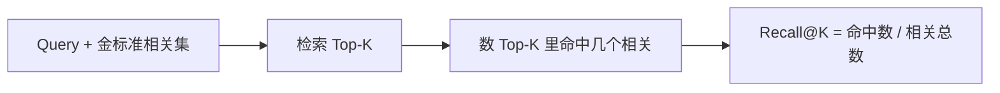

---
tags:
  - algorithm
  - metric
  - evaluation
aliases:
  - Recall@K
  - Recall@5
  - Recall@10
  - 召回率@K
  - 检索召回率
related:
  - "[[retrieval-pipeline]]"
  - "[[rag]]"
  - "[[bm25]]"
  - "[[ann]]"
  - "[[rrf]]"
  - "[[cross-encoder]]"
prerequisites:
  - "[[retrieval-pipeline]]"
stability: long
layer: algorithm
updated: 2026-06-08
---

# Recall@K（召回率 @K）

> [!tip] 核心本质
> **Recall@K** 衡量检索系统在前 **K** 条结果里**找全了多少该找的相关文档**：分子是 Top-K 里命中的相关文档数，分母是该 query 在标注集里的**全部**相关文档数。它回答「漏没漏」——不是「前 K 条干不干净」。RAG 粗排若 Recall@50 很低，正确答案根本进不了候选池，后面 [[cross-encoder|精排]] 再强也无法补救；[[ann]] 调参、[[rrf]] 融合、多路召回，首要优化目标往往是先把 Recall@K 抬上去。

## 生命周期与演进

**当前定位**：信息检索（IR）与 RAG 评测的**基础召回指标**；BEIR、MTEB、RAGAS 等 benchmark 与消融实验普遍报告 Recall@K 或与其等价的 Hit Rate@K。与 Precision@K、NDCG@K、MRR 常同表出现，分工不同（见 [[#与 Precision@K、NDCG@K、MRR 的分工|§与相关指标的分工]]）。

**预期寿命**：长期稳定。K 的取值随产品变化（RAG 常见 5/10/50），但「相关文档被 Top-K 覆盖的比例」这一定义在 IR 领域数十年未变。

**近期演进**：RAG 评测从「单路向量 Recall」扩展到 **Dense + BM25 混合** 的分路 Recall；Agent 记忆产品（如 LongMemEval）报 **R@3** 等变体，本质仍是 Recall@K。LLM-as-judge 用于端到端 Groundedness，但不替代离线 Recall@K 对检索模块的归因。

**终极威胁**：端到端「答对就行」的黑盒评测若完全取代检索层指标，Recall@K 在产品对话里变少出现；但工程上调试 [[retrieval-pipeline|检索全链路]] 时，它仍是**最便宜的漏召诊断器**。

---

## 定义与计算

对**单个 query**：

\[
\text{Recall@K} = \frac{|\{\text{相关文档}\} \cap \{\text{Top-K 返回}\}|}{|\{\text{相关文档}\}|}
\]

- **相关文档**：由人工标注或 benchmark 金标准定义——「回答这个问题应该参考哪些 chunk / 文档」。
- **Top-K**：检索系统按分数排序后的前 K 条（K=5 即 **Recall@5**）。
- 取值 **0～1**（或 0%～100%）；若某 query 没有相关文档，该 query 通常**跳过**或按数据集约定处理。

**表 1：** 单个 query 的 Recall@5 手算示例

| 项目 | 内容 |
| --- | --- |
| 全部相关文档 | A、B、C（共 3 篇） |
| 系统返回 Top-5 | X、A、Y、B、Z |
| Top-5 中命中 | A、B（2 篇） |
| **Recall@5** | 2 ÷ 3 ≈ **0.67** |

C 排在第 6 名及以后，**不计入** Recall@5——所以 Recall@K 对 **K 很敏感**：K 从 5 提到 50，Recall 通常单调上升。

**全库 / 全 benchmark** 上常对多个 query **取平均**（macro average），有时也按 query 加权（micro）。读论文或厂商表格时先看是 **Mean Recall@K** 还是 **Hit Rate@K**（见 [[#Hit Rate@K 与 Recall@K 的细微差别|§Hit Rate]]）。



---

## 在 RAG 全链路里看哪一段

Recall@K 主要评价 **粗排 / 多路召回**——「有没有把对的捞进候选池」，而不是最终注入 prompt 的那 3～5 条有多准。

| 链路阶段 | 典型 K | Recall@K 在问什么 |
| --- | --- | --- |
| 向量 ANN / BM25 单路 | 50～1000 | 单路漏召是否严重 |
| [[rrf]] 融合后 | 50～100 | 多路互补是否抬升 Recall |
| [[cross-encoder]] 精排后 | 3～10 | 仍可用 Recall@5，但更常看 Precision@K / NDCG |
| 最终注入 LLM | 3～5 | 业务上常等价于 Recall@5 是否够用 |

**工程直觉**（方向性，非固定阈值）：

- **Recall@50 低**：问题在召回或索引——换 embedding、加 BM25、调 ANN `ef_search`、加 [[query-transformation|查询改写]]。
- **Recall@50 高、Recall@5 低**：捞到了但排太靠后——调融合权重或加强 Rerank。
- **Recall@5 已够、答案仍错**：瓶颈可能在生成、chunk 切分或精排 Precision，不全是 Recall 问题。

[[ann]] 文档中 RAG 场景常提 **Recall@5 95–98%** 作为 HNSW 工作点参考——指 ANN 层在 K=5 时尽量不漏真邻居，精排另有兜底。

---

## 与 Precision@K、NDCG@K、MRR 的分工

Recall 只看「找全没有」；用户还关心「前 K 条有多干净」「排名是否合理」——需其他指标。

| 指标 | 公式（直觉） | 主要问什么 | 典型阶段 |
| --- | --- | --- | --- |
| **Recall@K** | 命中相关数 / **全部**相关数 | 漏召多不多 | 粗排 |
| **Precision@K** | 命中相关数 / **K** | Top-K 噪声多不多 | 精排 |
| **NDCG@K** | 考虑排名位置的折扣增益 | 相关的有没有排在前面 | 融合后 / 精排后 |
| **MRR** | 第一个相关结果排名的倒数 | 能不能一次命中 | 问答型单文档 |

**Recall vs Precision 张力**：K 固定时，把 K 加大通常 Recall↑、Precision↓——RAG 用「**大 K 召回 + 小 K 精排**」的两段漏斗化解这对矛盾（见 [[retrieval-pipeline]]）。

**例子**（仍用 A、B、C 三篇相关，Top-5 = X、A、Y、B、Z）：

- Recall@5 = 2/3
- Precision@5 = 2/5 = 0.4（5 条里只有 2 条真相关）

---

## Hit Rate@K 与 Recall@K 的细微差别

部分 RAG 评测（含 RAGAS 部分字段）报 **Hit Rate@K** 或 **Context Recall**：

- **多相关文档场景**：Hit Rate@K 有时指「Top-K 里**是否至少命中 1 个**相关」（0/1），与 Recall@K 不等价。
- **单相关文档 QA**：Hit Rate@5 = 1 当且仅当正确答案在 Top-5，此时与 Recall@5 **数值相同**。

读表格时确认：分母是「全部相关文档数」还是「query 个数上的命中率」。

---

## 怎么在自己的库上测

1. **准备标注**：对每个 eval query 列出应召回的 chunk_id / doc_id（哪怕先抽 50～100 条）。
2. **固定 K 网格**：至少报 Recall@5、Recall@10、Recall@50，便于与 [[retrieval-pipeline]] 消融实验使用同一 K 档位。
3. **分路报数**：Dense 一路、BM25 一路、RRF 融合后各报一遍——才能证明多路召回的价值。
4. **与延迟同表**：Recall@50 从 0.7→0.9 若靠 K×10 暴力扩召回，要一起看 p99 延迟。

最小 Python 示意（单 query、已知相关 id 集合）：

```python
def recall_at_k(retrieved_ids: list[str], relevant_ids: set[str], k: int) -> float:
    if not relevant_ids:
        return float("nan")  # 或按数据集约定跳过
    hits = len(set(retrieved_ids[:k]) & relevant_ids)
    return hits / len(relevant_ids)

# 示例：相关 {A,B,C}，Top-5 [X,A,Y,B,Z] → recall_at_k(..., 5) == 2/3
```

权威横向对比见 [BEIR benchmark](https://github.com/beir-cellar/beir)；端到端 RAG 见 [RAGAS](https://github.com/explodinggradients/ragas)。

---

## 进一步阅读

### 库内关联

- [[retrieval-pipeline]] — Recall@K 在粗排→精排全链路中的位置与消融示意
- [[ann]] — ANN 索引的 Recall@10 / Recall@5 工作点与 `ef_search` 权衡
- [[rrf]] — 多路召回合并后如何看 Recall 提升
- [[bm25]]、[[cosine-similarity]] — 两路召回各自影响的 Recall 失败模式
- [[rag]] — RAG 整体评测与检索模块边界

### 外部参考

- [BEIR Benchmark](https://github.com/beir-cellar/beir) — 跨域检索评测与 Mean Recall@K 报告习惯
- [RAGAS Documentation](https://docs.ragas.io/) — 端到端 Context Recall / 检索相关字段
- Manning et al., [*Introduction to Information Retrieval*](https://nlp.stanford.edu/IR-book/) — Recall、Precision、NDCG 经典定义
