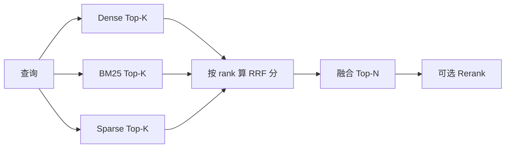

# RRF（Reciprocal Rank Fusion，倒数排名融合）

> [!tip] 核心本质
> 混合检索里，Dense 向量、BM25、Sparse 各自打出的 **score 量纲不同**，不能直接加权求和。RRF 放弃原始分数，只把各路结果的 **排名** 映射成可加的融合分：`1/(k+rank)`。若不做融合而只信单路，会系统性漏掉「另一路排得高、这一路排得低」的文档——例如错误码在 BM25 里第一、在向量里第一百，单用向量就永远捞不到。

## 生命周期与演进

**当前定位**：混合 RAG 与多路召回的**默认融合层**；Elasticsearch、Qdrant、Weaviate、Supabase pgvector 等文档与示例普遍以 RRF（常配 k=60）作为 Dense + Sparse 合并方式。LangChain `EnsembleRetriever`、LlamaIndex 混合检索也内置同类逻辑。

**预期寿命**：长期。算法来自 2009 年 SIGIR 经典论文，无训练数据、实现简单；在「多路异构检索器」场景下仍是性价比最高的基线，不易被单一新模型整体替代。

**近期演进**：加权 RRF、按通道独立调 k；与 ColBERT / 多向量（bge-m3）三路输出融合；多查询扩展（Multi-Query）把「多个改写 query 的检索列表」也当作多路输入做 RRF。强 Reranker 上线后，融合层权重敏感度下降，但粗排阶段仍依赖 RRF 把候选池做宽。

**终极威胁**：端到端检索模型或单模型多表示（一路输出多种相似度）减少「异构分数合并」需求；超长上下文下「少检索、多塞全文」削弱多路召回。大型私有库里的权限过滤、可解释分路召回仍使显式 RRF 长期存在。

---

## 问题：为什么不能直接合并分数

| 路 | 典型分数 | 特点 |
| --- | --- | --- |
| Dense（余弦） | 0–1 或 -1–1 | 受 embedding 模型与归一化影响 |
| BM25 | 无界正实数 | 与词频、文档长度强相关 |
| SPLADE / 稀疏向量 | 内积或专用尺度 | 与 dense 不可比 |

常见错误做法：

- **Min-Max 归一化后相加**：各路分数分布形状不同，归一化仍可能让某一路 dominate。
- **固定权重线性组合**：需要标注数据或大量 A/B 才能稳；域迁移时权重易失效。
- **只取交集**：召回变窄，互补性丧失。

RRF 的切入点：**排名是各路检索器共有的、可比较的中间表示**——第 1 名就是第 1 名，与底层分数量纲无关。

---

## 核心公式与直觉

Cormack、Clarke、Buettcher 在 SIGIR 2009 提出：对文档 \(d\)，在参与融合的每个排名列表 \(i\) 上，若 \(d\) 的排名为 \(\mathrm{rank}_i(d)\)（从 1 开始），则

```
RRF_score(d) = Σ_i  1 / (k + rank_i(d))
```

- 若 \(d\) **未出现在**列表 \(i\) 中，该项贡献为 **0**（不参与该路）。
- **k**：平滑常数，削弱「只有一路排第 1」的极端优势，同时避免 rank 很大时分母过大导致长尾完全失声。论文在 pilot 中固定 **k=60**，后续验证未改；实践中 **40–100** 内通常不敏感，**k 越小越强调各路榜首**。

**直觉**：排名越靠前，贡献越大，且呈**倒数衰减**——第 1 名与第 10 名的差距，大于第 100 名与第 109 名的差距。多路都靠前的文档，分数累加最高，体现「共识」。



---

## 加权 RRF

当某一路对业务更关键（如法律文档偏 BM25、口语 FAQ 偏 Dense）时：

```
RRF_score(d) = Σ_i  weight_i / (k + rank_i(d))
```

`weight_i` 为通道权重，默认均为 1.0。调参顺序建议（与 [[retrieval-pipeline]] 一致）：

1. 先保证 **embedding / 分词 / 索引** 质量；
2. 再调 **per-source 权重**；
3. 最后才动 **k**；
4. 上线强 **Reranker** 后，融合权重边际收益往往变小。

### 按文档类型的权重起点

以下为工程实践中的**起点表**（非普适最优），需用自有评测集验证：

| 文档类型 | Dense | BM25 | Sparse/SPLADE |
| --- | --- | --- | --- |
| 通用文本 | 1.0 | 1.0 | 0.6 |
| 技术文档（API/错误码） | 0.7 | 1.0 | 0.8 |
| 法律/合同 | 0.6 | 1.0 | 0.5 |
| 对话/FAQ | 1.0 | 0.5 | 0.3 |
| 代码 | 0.5 | 1.0 | 0.3 |
| 多语言 | 1.0 | 0.3 | 0.8 |

---

## 典型使用场景

### 1. 混合检索（最常见）

Dense + BM25（+ 可选 SPLADE）各取 Top-K（如 K=50–100），RRF 合并为 Top-N（如 N=50）再送 [[cross-encoder]] 精排。这是 [[retrieval-pipeline]] 第三阶段的标准形态。

### 2. 多查询扩展

[[query-transformation]] 中 Multi-Query：同一意图生成 N 个改写 query，**每路检索结果视为一个排名列表**，再做 RRF。单条改写跑偏时，其他路仍可把正确文档顶上来。

### 3. 多索引 / 多知识库

不同库或不同 chunk 策略各出一榜，RRF 合并后再统一 Rerank；避免手工规定「先搜 A 再搜 B」的硬顺序。

### 4. 图谱 + 向量 + 关键词

产品侧（如 [[agentmemory]]）常见 BM25 + 向量 + 知识图谱各一路，RRF（k=60）合并后再截断注入 context——与「知识融合」中推理层多源检索同一层级，算法细节见本篇，框架见 [[knowledge-fusion]]。

---

## 与其他融合方式对比

| 方法 | 是否需要训练 | 是否用原始分数 | 特点 |
| --- | --- | --- | --- |
| **RRF** | 否 | 否（仅 rank） | 实现简单、跨路可比；k=60 零样本常用 |
| **CombSUM / CombMNZ** | 否 | 是（需可比或归一化） | 对分数分布敏感；MNZ 惩罚只在一路出现的文档 |
| **Condorcet Fuse** | 否 | 基于成对胜负 | 经典元检索；RRF 论文中 MAP 常优于 Condorcet |
| **学习排序（LTR）** | 是 | 是 | 上限高，需标注与维护；冷启动差 |
| **Convex 组合（分数级）** | 视设定 | 是 | 可调且可利用分数幅度；域迁移需重调 |

RRF 的定位：**不替代 Reranker**，而是粗排阶段在「无标注、多异构路」下的稳健默认；精排仍交给 [[cross-encoder]]（见 [[retrieval-pipeline]] 第四阶段）。

---

## 实践：最小实现

```python
from collections import defaultdict

def rrf_fuse(rank_lists: list[list[str]], k: int = 60, weights: list[float] | None = None) -> list[tuple[str, float]]:
    """rank_lists: 每路为 doc_id 按相关性从高到低的列表。"""
    weights = weights or [1.0] * len(rank_lists)
    scores: dict[str, float] = defaultdict(float)
    for w, ranked in zip(weights, rank_lists):
        for rank, doc_id in enumerate(ranked, start=1):
            scores[doc_id] += w / (k + rank)
    return sorted(scores.items(), key=lambda x: x[1], reverse=True)


# 示例：两路各 Top-3
dense = ["doc_a", "doc_b", "doc_c"]
bm25  = ["doc_b", "doc_d", "doc_a"]
for doc_id, score in rrf_fuse([dense, bm25], k=60):
    print(doc_id, round(score, 4))
# doc_b 在两路都靠前 → 融合分通常最高
```

**工程注意**：

- 各路 **Top-K 宜对齐或略大**（如都取 100），避免某路只返回极短列表导致互补不足。
- **doc_id 必须稳定**（同一 chunk 同 id），否则同文不同 id 会被当成两篇累加。
- 融合后 **去重**（同一文档多 chunk 时按 doc 或按 chunk 策略二选一，与 [[rag]] 切块策略一致）。
- 全链路 **打日志**：每路 Top-10 id + 融合后 Top-10，便于回放「为何选中/漏选」。

---

## 常见误区

- **误区：RRF 能代替 Reranker** — RRF 不读 query–doc 细粒度交互，只做排名共识；高精准场景仍需 [[cross-encoder]] 精排。
- **误区：k 越小越好** — k 过小会放大单路噪声榜首；k 过大则削弱头部区分度。默认 60 再小范围网格即可。
- **误区：权重越大越好** — 某路 weight 过大等价于几乎单路检索，失去混合检索意义。
- **误区：未出现的文档应罚分** — 标准 RRF 对「未上榜」贡献 0，不要人为负分，除非你有明确的自定义融合协议。
- **误区：融合层能解决坏 embedding** — 一路召回极差时，RRF 只能「救一部分」；根本仍在各路召回质量。

---

## 进一步阅读

- Cormack, Clarke, Büttcher, [Reciprocal rank fusion outperforms condorcet and individual rank learning methods](https://cormack.uwaterloo.ca/cormacksigir09-rrf.pdf) — RRF 原始论文（SIGIR 2009），k=60 出处。
- [[retrieval-pipeline]] — RRF 在粗排→精排全链路中的位置、Reranker 选型与生产架构。
- [[rag]] — 检索增强生成总览；RRF 是混合 RAG 的融合子问题。
- [[query-transformation]] — Multi-Query 与 RRF 的组合用法。
- [[knowledge-fusion]] — 多源知识在推理层的整合框架；RRF 解决「多路检索列表如何并榜」。
- [[agentmemory]] — 三路检索 + RRF 的产品实例。
- [LangChain EnsembleRetriever](https://python.langchain.com/docs/how_to/ensemble_retriever/) — 多检索器加权与 RRF 风格合并的 API 参考。
