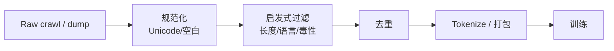

---
tags:
  - data
  - training
aliases:
  - Corpus Cleaning
  - 语料清洗
  - 数据去重
  - Deduplication
prerequisites:
  - "[[training-data]]"
  - "[[tokenization]]"
related:
  - "[[scaling-laws]]"
  - "[[sft]]"
  - "[[lora-peft]]"
  - "[[chunking]]"
stability: long
layer: data
updated: 2026-06-15
---

# 语料清洗与去重（Corpus Cleaning）

> [!tip] 核心本质
> **语料清洗与去重**在 [[training-data]] 进入预训练/微调前，去掉低质、有毒、模板垃圾与**近重复**文本——重复样本会放大频率、浪费算力并恶化 memorization；CCNet、The Pile、RedPajama 等管线均把 dedup 当作标配。Exact hash 抓不动 paraphrase 近重复；**MinHash + LSH** 用 Jaccard 近似在十亿文档规模可行。数据工程的地基：模型上限先被「喂了什么、喂了几次」决定。

适合自建 SFT/继续预训练、或理解公开模型数据卡里的 dedup 声明。与 [[chunking]]（入库后分块）分工：本篇是**训练语料级** ETL。

*检索说明：MinHash/LSH 与 CCNet 段落 hash 对照 [AWS ML Blog — preparing dataset](https://aws.amazon.com/blogs/machine-learning/an-introduction-to-preparing-your-own-dataset-for-llm-training/)、[Daft Common Crawl dedupe](https://docs.daft.ai/en/stable/examples/minhash-dedupe/)、[LSHBloom arXiv:2411.04257](https://arxiv.org/html/2411.04257v3)（观测 2026-06-15）。*

## 生命周期与演进

**当前定位**：`data/` 层 P1 节点；[[training-data]] 讲「为什么数据重要」，本篇讲「怎么洗」。

**预期寿命**：长期。规模从 GB → TB → 万亿 token，算法从 exact → MinHash → LSHBloom。

**近期演进**：LSHBloom 用 Bloom filter 降 MinHashLSH 索引体积；Daft/Ray 分布式 dedupe；污染检测（benchmark 泄漏）并入清洗。

**终极威胁**：合成数据主导时，清洗对象变为「生成质量 + 过滤」；Web crawl 仍要 dedup。

## 1 清洗流水线（典型）

| 阶段 | 做什么 |
| --- | --- |
| **规范化** | NFKC、小写（视语言）、去 HTML boilerplate |
| **过滤** | 过短/过长、乱码、语言 ID、porn/spam 启发式 |
| **Exact dedup** | 段落/文档 SHA-1 前 64 bit（CCNet 法） |
| **Near dedup** | MinHash shingles + LSH → Union-Find 聚类留代表 |
| **污染检测** | 与 MMLU/HumanEval 等 benchmark 重叠扫描 |

## 2 Exact vs Near 去重

| 方法 | 机制 | 抓什么 | 规模 |
| --- | --- | --- | --- |
| **Exact hash** | 规范化段落后 hash | 完全相同副本 | _shard 内快；跨 shard 贵 |
| **MinHash + LSH** | n-gram shingles → 签名 → band 碰撞 | **近重复**、洗稿 | 十亿级标准解 |
| **Semantic** | Embedding 聚类 | 语义近重复 | 贵；小规模或后处理 |

LLM 预训练主流：**Exact 粗筛 + MinHash 精近重复**（[Daft 示例](https://docs.daft.ai/en/stable/examples/minhash-dedupe/)）。

## 3 MinHash + LSH 要点

1. **Shingle** — 字符/词 n-gram（如 5-gram）
2. **MinHash 签名** — K 个 hash 函数取 shingle 最小值 → 固定长向量
3. **LSH banding** — 分 B 个 band × R 行；相似文档至少一 band 全匹配 → 候选对
4. **验证** — 候选对算精确 Jaccard 或再 hash 确认
5. **Union-Find** — 连通分量内**留一篇**（如最小 doc id）

**调参**：K、ngram_size、B/R 权衡 recall/precision；需按语料迭代（[Milvus MinHash 文](https://milvus.io/blog/minhash-lsh-in-milvus-the-secret-weapon-for-fighting-duplicates-in-llm-training-data.md)）。

**规模瓶颈**：经典 MinHashLSH 索引可占数百 GB；[LSHBloom](https://arxiv.org/html/2411.04257v3) 用 Bloom filter 降存储与耗时。

工具：`datasketch`（Python）、Daft 分布式、`text-dedup` 等。

## 4 与微调 / RAG

| 场景 | 清洗重点 |
| --- | --- |
| **继续预训练** | 全流水线；dedup 影响 [[scaling-laws]] 有效 token |
| **SFT / [[lora-peft\|LoRA]]** | 去 instruction 模板重复、PII、泄漏 benchmark |
| **RAG 入库** | 文档级 dedup 防 [[chunking]] 重复块；见 [[knowledge-extraction]] |

微调数据量小但**重复 instruction 对过拟合格式**极敏感。

## 5 质量与合规

- **语言/领域过滤** — 避免错误语言占比
- **PII / 版权** — 正则 + 分类器；合规独立于 dedup
- **毒性** — Perspective、自定义 classifier；与 [[training-data]] 偏见讨论联动
- **可复现** — 固定 seed、版本化过滤规则与 dedup 参数

## 6 常见坑

| 坑 | 后果 |
| --- | --- |
| 只 exact 不 near | 近重复 memorization |
| 规范化不一致 | 该 dedup 的没 dedup |
| LSH 参数未调 | 漏删或误删过多 |
| 不去 benchmark 污染 | 评测虚高 |
| 清洗后无统计 | 无法对比实验 |

## 要点收束

- 清洗 = 规范化 + 过滤 + exact/near dedup + 污染扫描。
- 十亿级近重复：**MinHash + LSH + Union-Find**；LSHBloom 降索引成本。
- 与 [[training-data]] 因果链：洗不好，算力与上限双浪费。
- 微调/RAG 各有侧重，但 dedup 逻辑相通。

## 进一步阅读

### 库内

- [[training-data]] — 数据为何是第一因
- [[tokenization]] — 洗后与分词边界
- [[scaling-laws]] — 有效 token 与算力
- [[chunking]] — RAG 入库分块

### 外部

- [AWS — preparing dataset for LLM training](https://aws.amazon.com/blogs/machine-learning/an-introduction-to-preparing-your-own-dataset-for-llm-training/)
- [Daft — MinHash dedupe on Common Crawl](https://docs.daft.ai/en/stable/examples/minhash-dedupe/)
- [LSHBloom paper](https://arxiv.org/html/2411.04257v3)
