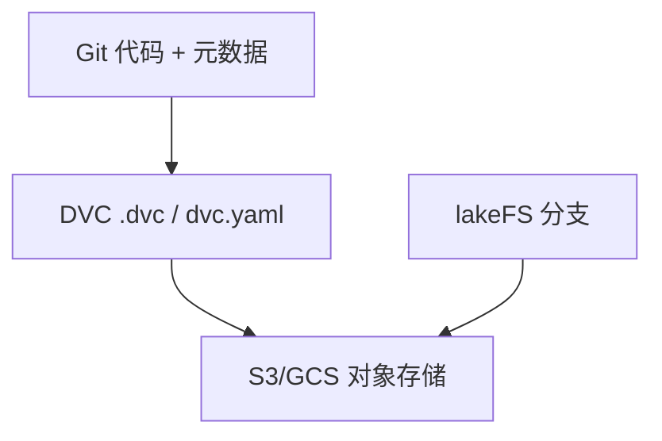

---
tags:
  - data
  - mlops
  - reproducibility
aliases:
  - Data Lineage
  - 数据血缘
  - 数据版本
prerequisites:
  - "[[training-data]]"
  - "[[corpus-cleaning]]"
related:
  - "[[sft]]"
  - "[[lora-peft]]"
  - "[[llm-benchmarks]]"
  - "[[agent-evaluation]]"
  - "[[synthetic-data]]"
stability: mid
layer: data
updated: 2026-06-15
---

# 数据版本与血缘（Data Lineage）

> [!tip] 核心本质
> **数据血缘**回答：这条训练/评测结果**用的是哪版数据、经哪条变换、对应哪次代码提交**——没有版本化，「复现 SFT」「对比两次 RM」都是空话：[[corpus-cleaning]] 改一版 dedup 规则、[[synthetic-data]] 多合成 10% 样本，都可能在数周后才表现为 benchmark 漂移。血缘把数据集、流水线与实验 ID **绑成可遍历链**。

适合负责 ML 平台、微调流水线或合规审计的团队。读完应能区分 DVC 式 Git 元数据与 lakeFS 式数据湖分支，并设计「数据 commit → 训练 run → 模型注册」最小闭环。

*检索说明：工具分工对照 [DVC User Guide](https://doc.dvc.org/user-guide)、[DVC joins lakeFS 说明](https://dvc.org/blog/dvc-joins-lakefs-your-questions-answered/)、[AWS SageMaker + DVC lineage 博文](https://aws.amazon.com/blogs/machine-learning/end-to-end-lineage-with-dvc-and-amazon-sagemaker-ai-mlflow-apps/)（观测 2026-06-15）。*

## 生命周期与演进

**当前定位**：`data/` 层 P3 节点；LLM 时代数据量从 GB 到 PB，工具谱系分化。

**预期寿命**：mid–long。法规（模型卡、训练数据声明）推高可追溯要求。

**近期演进**：DVC 由 lakeFS 社区维护；MLflow/W&B 实验与数据 commit hash 联动；Hub 数据集 revision + card。

**终极威胁**：全托管训练平台内建血缘，团队不再自建——但「链上有什么字段」仍需人定义。

## 1 要追踪什么

| 对象 | 典型标识 |
| --- | --- |
| **原始快照** | crawl 日期、来源 URI |
| **变换流水线** | dedup 参数、filter 版本、`dvc.yaml` stage |
| **派生集** | SFT v3、preference-2026-Q2 |
| **代码** | Git commit |
| **实验** | MLflow run id、超参 |
| **模型** | checkpoint、[[llm-benchmarks]] 分数 |

**目标**：`git checkout <tag> && dvc pull`（或 lakeFS checkout）能还原**当时**训练所见数据。

## 2 工具谱系

| 工具 | 定位 | 强项 |
| --- | --- | --- |
| **DVC** | Git 旁路大文件与 pipeline | 本地/小团队、实验可复现、`dvc repro` |
| **lakeFS** | 数据湖 Git 式分支 | PB 级、零拷贝分支、多 pipeline 协调 |
| **HF Datasets** | Hub revision + card | 共享与社区复现 |
| **MLflow 等** | 实验与模型注册 | 记录 `data_git_commit` 等参数 |

二者常**组合**：工程师用 DVC 迭代，平台用 lakeFS 治理生产湖（2025 起 DVC 与 lakeFS 同一维护方）。

## 3 最小实践

1. **数据入版** — `dvc add data/` 或 lakeFS commit；禁止「只有 S3 路径口头约定」
2. **流水线即代码** — `dvc.yaml` stage：raw → clean → tokenize；参数进 Git
3. **训练绑定** — 日志写入 `data_revision` / DVC commit hash（见 SageMaker+MLflow 范例）
4. **评测绑定** — [[agent-evaluation]] / [[llm-benchmarks]] 结果引用同一 data tag
5. **PR 审数据** — 数据变更走 review，像审代码

## 4 LLM 特有注意

| 场景 | 血缘要点 |
| --- | --- |
| **预训练** | crawl 批次、dedup 规则版本（[[corpus-cleaning]]） |
| **SFT** | 指令模板版本、与 benchmark 污染扫描 |
| **偏好** | [[data-annotation]] 指南版本、标注批次 |
| **合成** | 生成模型与 seed（[[synthetic-data]]） |
| **RAG** | 索引 build id 与源文档 snapshot（偏 [[retrieval-pipeline]]） |

## 5 合规与协作

- **模型卡**：声明数据组成与过滤；血缘是底层证据
- **回滚**：坏数据 commit 发现后，用 tag 锁定已知好版本重训
- **跨团队**：统一命名 `dataset/name@v3`，避免「final_final_v2」

## 要点收束

- 血缘 = 数据版本 + 变换 + 代码 + 实验的可遍历链。
- DVC 适合 Git 中心 ML 项目；lakeFS 适合对象存储规模与分支治理。
- 训练/评测日志必须存 data revision，否则无法解释 benchmark 变化。
- LLM 流水线要额外记清洗、合成、标注规范版本。

## 进一步阅读

### 库内关联

- [[training-data]] — 数据为何决定上限
- [[corpus-cleaning]] — 变换阶段版本化
- [[data-annotation]] — 偏好批次
- [[synthetic-data]] — 合成溯源

### 官方

- [DVC User Guide](https://doc.dvc.org/user-guide) — 与 Git、lakeFS 关系
- [Versioning Data and Models (DVC)](https://doc.dvc.org/example-scenarios/versioning-data-and-models)
- [DVC + lakeFS](https://dvc.org/blog/dvc-joins-lakefs-your-questions-answered/) — 2025 维护关系
- [SageMaker + DVC + MLflow lineage](https://aws.amazon.com/blogs/machine-learning/end-to-end-lineage-with-dvc-and-amazon-sagemaker-ai-mlflow-apps/)
